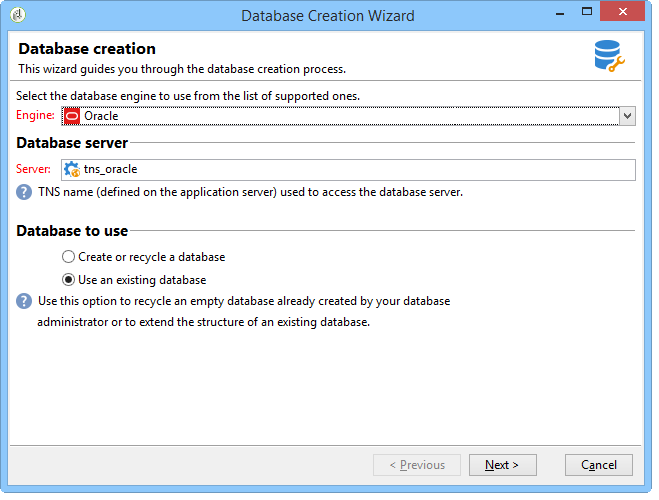

# データベースの作成と設定{#creating-and-configuring-the-database}

データベースを作成する場合、Adobe Campaignには次の 2 つの異なるオプションが用意されています。

1. データベースの作成または再利用：新しいデータベースを作成する場合や、既存のデータベースを再利用する場合は、このオプションを選択します。 [ ケース 1：データベースの作成/リサイクル ](#case-1--creating-recycling-a-database) を参照してください。
1. 既存のデータベースの使用：管理者によって空のデータベースが既に作成されていて、それを使用する場合は、このオプションを選択します。または、既存のデータベースの構造を拡張します。 [ ケース 2：既存データベースの使用 ](#case-2--using-an-existing-database) を参照してください。

設定手順について詳しくは、以下を参照してください。

>[!CAUTION]
>
>データベース、ユーザーおよびスキーマの名前は、数字で始めたり、特殊文字を含めたりしないでください。
>
>これらの操作を実行できるのは **内部** 識別子のみです。 詳しくは、[この節](../../installation/using/configuring-campaign-server.md#internal-identifier)を参照してください。

## ケース 1：データベースの作成とリサイクル {#case-1--creating-recycling-a-database}

データベースを作成したり、既存のベースを再利用したりする手順を以下に示します。 一部の設定は、使用するデータベースエンジンによって異なります。

関係する手順は次のとおりです。

* [ 手順 1 - データベースエンジンの選択 ](#step-1---selecting-the-database-engine)、
* [ 手順 2 - サーバーへの接続 ](#step-2---connecting-to-the-server)、
* [ 手順 3 - データベースの接続と特性 ](#step-3---connection-and-characteristics-of-the-database)、
* [ 手順 4 - インストールするパッケージ ](#step-4---packages-to-install)、
* [ 手順 5 – 作成手順 ](#step-5---creation-steps)、
* [ 手順 6 - データベースの作成 ](#step-6---creating-the-database)。

### 手順 1 - データベースエンジンの選択 {#step-1---selecting-the-database-engine}

ドロップダウンリストに表示されるデータベースエンジンの中から選択します。


サポートされるデータベースは、Campaign[ 互換性マトリックス ](../../rn/using/compatibility-matrix.md) に一覧表示されます。

サーバーを特定し、実行する操作のタイプを選択します。 この場合、**[!UICONTROL データベースを作成またはリサイクル]** します。



選択したデータベースエンジンによって、サーバー識別情報が異なる場合があります。

* **Oracle** エンジンの場合、アプリケーション サーバー用に定義された **TNS 名** を入力します。
* **PostgreSQL** エンジンの場合、データベースサーバーにアクセスするには、アプリケーションサーバーで定義されている DNS 名（または IP アドレス）を指定する必要があります。
* **Microsoft SQL Server** エンジンの場合は、次を定義する必要があります。データベース サーバーにアクセスするためにアプリケーション サーバーで定義されている DNS 名（または IP アドレス）: **DNS** または **DNS`\<instance>`** （インスタンス モード）

  >[!CAUTION]
  >
  > 20.3 以降、Windows NT 認証は廃止されます。 **[!UICONTROL SQL Server 認証]** は、Microsoft SQL Server で使用できる唯一の認証モードになりました。 [詳細情報](../../rn/using/deprecated-features.md)

  

### 手順 2 - サーバーへの接続 {#step-2---connecting-to-the-server}

**[!UICONTROL サーバーアクセス]** ウィンドウで、データベースサーバーのアクセスを定義します。


これを行うには、データベースへのアクセス権を持つ **管理システムアカウント** の名前とパスワードを入力します。以下に例を示します。

* **system**:Oracleデータベースの場合、
* **sa**:Microsoft SQL Server データベースの場合、
* **postgres**:PostgreSQL データベースの場合、

### 手順 3 - データベースの接続と特性 {#step-3---connection-and-characteristics-of-the-database}

次の手順では、データベースにログオンするための設定を構成します。


次の設定を定義する必要があります。

* 作成するデータベースの名前を指定します。
* このデータベースにリンクされているアカウントのパスワードを入力します。
* データベースが Unicode である必要があるかどうかを示します。

  「**[!UICONTROL Unicode データベース]**」オプションを使用すると、言語に関係なく、すべての文字タイプを Unicode で保存できます。

  >[!NOTE]
  >
  >oracleデータベースでは、「**[!UICONTROL Unicode ストレージ]**」オプションを使用して **NCLOB** および **NVARCHAR** 型のフィールドを使用できます。
  > 
  >このオプションを選択しない場合、Oracleデータベースのキャラクタ・セット（文字セット）ですべての言語でのデータ・ストレージを有効にする必要があります（AL32UTF8 をお勧めします）。

* データベースのタイムゾーンを選択し、UTC （使用可能な場合）にするかどうかを指定します。

  詳しくは、[ タイムゾーン管理 ](../../installation/using/time-zone-management.md) を参照してください。

### 手順 4 - インストールするパッケージ {#step-4---packages-to-install}

インストールするパッケージを選択します。

ライセンス契約を参照して、「インタラクション」や「ソーシャルマーケティング」など、インストールする権利のあるソリューションとオプションを確認します。


### 手順 5 – 作成手順 {#step-5---creation-steps}

**[!UICONTROL 作成ステップ]** ウィンドウでは、表の作成に使用する SQL スクリプトを表示および編集できます。


* oracle、Microsoft SQL Server または PostgreSQL データベースの場合、データベースオブジェクトの作成時に使用される **ストレージパラメーター** を定義することもできます。

  これらのパラメータは、正確な表領域名を受け取ります（警告：大文字と小文字が区別されます）。 これらはそれぞれ、次のオプションの **[!UICONTROL 管理/プラットフォーム/オプション]** ノードに格納されます（[ この節 ](../../installation/using/configuring-campaign-options.md#database) を参照）。

   * **WdbcOptions_TableSpaceUser**：スキーマに基づいたユーザーテーブル
   * **WdbcOptions_TableSpaceIndex**：スキーマに基づいたユーザーテーブルのインデックス
   * **WdbcOptions_TableSpaceWork**：スキーマのないワークテーブル
   * **WdbcOptions_TableSpaceWorkIndex**: スキーマのない作業用テーブルのインデックス

* oracleデータベースの場合、Adobe Campaign ユーザーは、通常、**oinstall** グループのメンバーとして、Oracleライブラリにアクセスできる必要があります。
* 「**[!UICONTROL Set or change the administrator password]**」オプションを使用すると、管理者権限を持つAdobe Campaign オペレーターにリンクされたパスワードを入力できます。

  セキュリティ保護のため、Adobe Campaign アカウント管理者のパスワードを定義することをお勧めします。

### 手順 6 - データベースの作成 {#step-6---creating-the-database}

ウィザードの最後の段階では、データベースを作成できます。 「**[!UICONTROL 開始]**」をクリックして確定します。


データベースが作成されたら、再接続してインスタンス設定を完了できます。

インスタンスの設定を完了するには、デプロイメントウィザードを開始する必要があります。 [ デプロイメントウィザード ](../../installation/using/deploying-an-instance.md#deployment-wizard) を参照してください。

インスタンスにリンクされているデータベースの接続設定は、ファイルに保存されています。**`/conf/config-<instance>.xml`** のファイルはAdobe Campaign インストールディレクトリにあります。

暗号化されたパスワードを使用して「campaign」アカウントにリンクされた base61 データベース上のMicrosoft SQL Server 設定の例：

```
<dbcnx encrypted="1" login="campaign:myBase" password="myPassword" provider="DB" server="dbServer"/>
```

## ケース 2：既存のデータベースの使用 {#case-2--using-an-existing-database}

データベース管理者がデータベースおよびユーザーを作成し、アクセス権が正しく設定されている必要があります。

たとえば、Oracle・データベースの場合、必要な最小権限は、GRANTCONNECT、RESOURCE および UNLIMITED TABLESPACE です。

既存のデータベースを使用するには、次の設定手順に従います。

* [ 手順 1 - データベースエンジンの選択 ](#step-1---choosing-the-database-engine)、
* [ 手順 2 - データベース接続設定 ](#step-2---database-connection-settings)、
* [ 手順 3 - インストールするパッケージ ](#step-3---packages-to-install)、
* [ 手順 4 – 作成手順 ](#step-4---creation-steps)、
* [ 手順 5 - データベースの作成 ](#step-5---creating-the-database)。

### 手順 1 - データベースエンジンの選択 {#step-1---choosing-the-database-engine}

ドロップダウンリストからデータベースエンジンを選択します。


サーバーを特定し、実行する操作のタイプを選択します。 この場合、**[!UICONTROL 既存のデータベースを使用]** します。


選択したデータベースエンジンによって、サーバー識別情報が異なる場合があります。

* **Oracle** エンジンの場合、アプリケーション サーバー用に定義された **TNS 名** を入力します。
* **PostgreSQL** エンジンの場合、データベースサーバーにアクセスするには、アプリケーションサーバーで定義されている DNS 名（または IP アドレス）を指定する必要があります。
* **Microsoft SQL Server** エンジンの場合は、次を定義する必要があります。

   1. データベースサーバーにアクセスするためにアプリケーションサーバーで定義されている DNS 名（または IP アドレス）
   1. Microsoft SQL Server へのアクセスに使用するセキュリティ方式：**[!UICONTROL SQL Server 認証]** または **[!UICONTROL Windows NT 認証]**。

      

### 手順 2 - データベース接続設定 {#step-2---database-connection-settings}

**[!UICONTROL データベース]** ウィンドウで、データベース接続設定を定義します。


次の設定を定義する必要があります。

* 使用するデータベースの名前を入力します。
* このデータベースに関連付けられているアカウントの名前とパスワードを入力します。

  >[!NOTE]
  >
  >スキーマ名とユーザー名の両方が一致することを確認してください。 データベースを作成するには、Campaign コンソールクライアントを使用することをお勧めします。
  >oracle・データベースの場合は、アカウント名を入力する必要はありません。

* データベースを Unicode にするかどうかを指定します。

### 手順 3 - インストールするパッケージ {#step-3---packages-to-install}

インストールするパッケージを選択します。

ライセンス契約を参照して、「インタラクション」や「リード」など、インストールする権利のあるソリューションやオプションを確認します。


### 手順 4 – 作成手順 {#step-4---creation-steps}

**[!UICONTROL 作成ステップ]** ウィンドウでは、表の作成に使用する SQL スクリプトを表示および編集できます。


* oracle、Microsoft SQL Server または PostgreSQL データベースの場合、データベースオブジェクトの作成時に使用する **ストレージパラメーター** を定義できます。
* oracleデータベースの場合、Adobe Campaign ユーザーは、通常、**oinstall** グループのメンバーとして、Oracleライブラリにアクセスできる必要があります。
* 「**[!UICONTROL Set or change the administrator password]**」オプションを使用すると、管理者権限を持つAdobe Campaign オペレーターにリンクされたパスワードを入力できます。

  セキュリティ保護のため、Adobe Campaign アカウント管理者のパスワードを定義することをお勧めします。

### 手順 5 - データベースの作成 {#step-5---creating-the-database}

ウィザードの最後の段階では、データベースを作成できます。 「**[!UICONTROL 開始]**」をクリックして確定します。


データベースの作成が完了したら、再接続してインスタンス設定を完了できます。

インスタンスの設定を完了するには、デプロイメントウィザードを開始する必要があります。 [ デプロイメントウィザード ](../../installation/using/deploying-an-instance.md#deployment-wizard) を参照してください。

インスタンスにリンクされているデータベースの接続設定は、ファイルに保存されています。**`/conf/config-<instance>.xml`** のファイルはAdobe Campaign インストールディレクトリにあります。

暗号化されたパスワードを使用して「campaign」アカウントにリンクされた base61 データベース上のMicrosoft SQL Server 設定の例：

```
<dbcnx encrypted="1" login="campaign:myBase" password="myPassword" provider="DB" server="dbServer"/>
```
