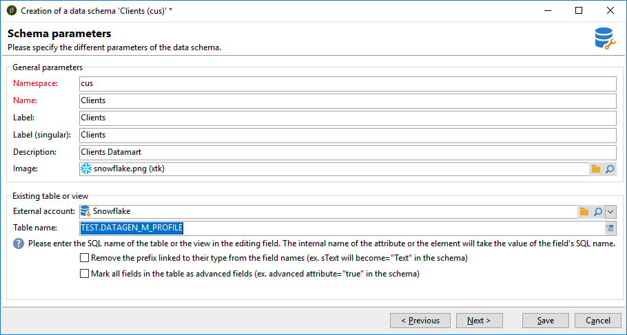

# データスキーマの作成 {#creating-the-data-schema}

外部データベースにスキーマを作成する手順は、次のとおりです。

1. データスキーマのリストの上にある「**[!UICONTROL 新規]**」ボタンをクリックし、「**[!UICONTROL 外部データにアクセス]**」を選択します。

   

1. スキーマの&#x200B;**[!UICONTROL 名前空間]**&#x200B;と&#x200B;**[!UICONTROL 名前]**&#x200B;を入力し、データベースへの接続を有効にする&#x200B;**[!UICONTROL 外部アカウント]**&#x200B;を選択します。 これにより、外部データベースで使用できるテーブルのリストにアクセスできます。

   

1. **[!UICONTROL テーブル名]** フィールドから、収集するデータを含むテーブルを選択します。

   Snowflakeでは、データベースユーザーに正しい権限が付与されている場合は、ここでビューを選択できます。 ビューを使用する場合、Adobe CampaignはXML スキーマを自動生成できませんが、自分で作成する必要があります。 ビューについて詳しくは、[Snowflake ドキュメント &#x200B;](https://docs.snowflake.com/en/user-guide/views-introduction.html)を参照してください。

   

1. 「**[!UICONTROL OK]**」をクリックして確定します。 Adobe Campaign では選択したテーブルの構造が自動的に検出され、論理スキーマが生成されます。 Adobe Campaign はリンクを生成しません。

1. 「**[!UICONTROL 保存]**」をクリックして作成を確定します。

   >[!CAUTION]
   >
   >Snowflake を使用する場合、プライマリキーは必須です。

   

テーブルをマッピングすると（標準または FDA マッピング）、インデックスが自動的に作成されます。
