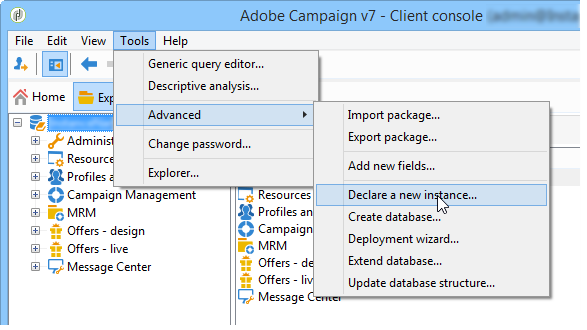

# 新しいインスタンスの作成{#creating-new-instances}

Adobe Campaignをインストールしてインスタンスを作成したら、コンソールから新しいインスタンスを追加できます。 この作成モードでは、コンソールにアクセスせずにトラッキングインスタンスを作成できます。

これを行うには、既存のデータベースにログオンし、次の手順を適用します。

1. 新しいインスタンスを宣言

   **[!UICONTROL ツール/詳細/新しいインスタンスを宣言…]**&#x200B;に移動して、アシスタントを開始します。

   

   新しいインスタンスのパラメーターを指定します。 詳しくは、[ インスタンスの作成と](../../installation/using/creating-an-instance-and-logging-on.md)へのログオンを参照してください。
