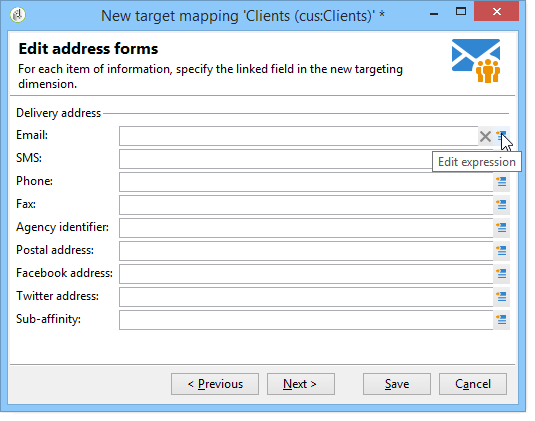

# 外部データマッピングの定義 {#defining-data-mapping}

Adobe Campaign では、外部テーブルのデータでマッピングを定義できます。

そのためには、外部テーブルのスキーマを作成した後に、新しい配信マッピングを作成してこのテーブルのデータを配信ターゲットとして使用する必要があります。

それには、次の手順に従います。

1. 新しい配信マッピングを作成し、ターゲティングディメンション（先ほど作成したスキーマなど）を選択します。

   

1. 配信情報が格納されるフィールド（姓、名前、メール、住所など）を指定します。

   

1. 拡張スキーマを識別しやすくするためのサフィックスなど、情報ストレージのパラメーターを指定します。

   

   除外（**excludelog**）をメッセージ付き（**broadlog**）で格納するか、個々のテーブルに格納するかを選択できます。

   この配信マッピングのトラッキングを管理するかどうかを選択することもできます（**trackinglog**）。

1. 次に、考慮する拡張を選択します。 拡張タイプは、プラットフォームのパラメーターとオプション（ライセンス契約の表示）によって異なります。

   

   「**[!UICONTROL 保存]**」ボタンをクリックし、配信マッピングの作成を開始します。リンクされているすべてのテーブルは、選択したパラメーターに基づいて自動的に作成されます。
