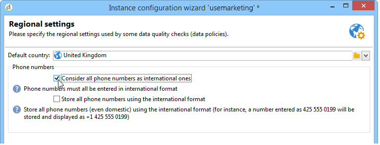
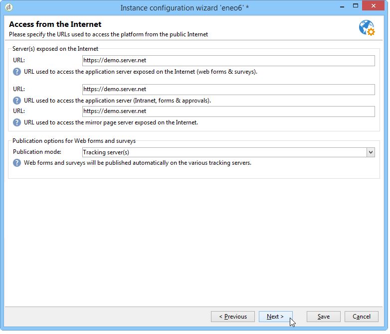

# インスタンスのデプロイ{#deploying-an-instance}

>[!NOTE]
>
>サーバー側の設定は、アドビがホストするデプロイメントに対してのみ実行できます。 各デプロイメントの詳細については、「ホスティングモデル」の節 [または](../../installation/using/hosting-models.md) 、この記事を参照 [してください](https://helpx.adobe.com/campaign/kb/acc-on-prem-vs-hosted.html)。

## デプロイウィザード {#deployment-wizard}

Adobe Campaignクライアントコンソールで使用できるグラフィカルウィザードを使用すると、接続先のインスタンスのパラメーターを定義できます。

デプロイメントウィザードを起動するには、ツ **ール/アドバンスト/デプロイメントウィザードを選択しま**&#x200B;す。


設定手順は、以下のとおりです。

1. [一般パラメーター](#general-parameters)
1. [電子メールチャネルパラメーター](#email-channel-parameters)
1. [バウンスされた電子メールの管理](#managing-bounced-emails)
1. [トラッキング設定](#tracking-configuration)
1. [モバイルチャネルパラメーター](#mobile-channel-parameters)
1. [地域設定](#regional-settings)
1. [インターネットからのアクセス](#access-from-the-internet)
1. [パブリックリソースの管理](#managing-public-resources)
1. [データの削除](#purging-data)

## 一般パラメーター {#general-parameters}

デプロイメントウィザードの最初の手順では、インスタンスに関する一般情報を入力できます。


### 一般情報 {#general-information}

ウィンドウの下部では、アクティブにするオプションを選択できます。

* **[!UICONTROL Customer identifier used in billing]** :インスタンスの名前とバージョン番号を指定できます。
* **[!UICONTROL Common name of the customer]** :会社名を含む文字列を入力します。 この情報は、購読解除リンクで使用できます。
* **[!UICONTROL Namespace]** :小文字で短い識別子を入力します。 目的は、アップグレードの場合に、特定の設定と工場出荷時の設定を区別することです。 デフォルトの名前空間は **cus** — （顧客用）です。

### 技術的なオプション {#technical-options}

ウィンドウの下部では、アクティブにするオプションを選択できます。

次のオプションを使用できます。

* **[!UICONTROL Email channel]** :をクリックします。 「電子メールチャネ [ルのパラメーター」を参照](#email-channel-parameters)。
* **[!UICONTROL Tracking]** :ターゲット母集団（開数およびクリック数）の追跡を有効にする場合。 トラッキング [の設定を参照](#tracking-configuration)。
* **[!UICONTROL Managing bounced emails]** :受信メールの受信に使用するPOPアカウントを定義する場合。 「バウンスされた電 [子メールの管理」を参照してくださ](#managing-bounced-emails)い。
* **[!UICONTROL LDAP integration]** :LDAPディレクトリを介したユーザ認証を設定する。 「LDAP経由 [の接続」を参照](../../installation/using/connecting-through-ldap.md)。

## 電子メールチャネルパラメーター {#email-channel-parameters}

次の手順では、メッセージヘッダーに表示する情報を定義します。

これらのパラメーターは、配信テンプレート内で、および各配信ごとに個別に（必要な権限を持つユーザーの場合）過剰に設定できます。

### 配信 E メールのパラメーター {#parameters-for-delivered-emails}


次のパラメーターを指定します。

* **[!UICONTROL Sender name]** :送信者の名前、
* **[!UICONTROL Sender address]** :送信者のアドレス
* **[!UICONTROL Reply address text]** :受信者が電子メールクライアントソフトウェアでボタンをクリックしたときに使 **[!UICONTROL Reply]** 用される、カスタマイズ可能な名前。
* **[!UICONTROL Reply address]** :受信者が電子メールクライアントソフトウェアでボタンを **[!UICONTROL Reply]** クリックしたときに使用する電子メールアドレス。
* **[!UICONTROL Error address]** :エラーのあるメッセージの電子メールアドレス。 これは、存在しないターゲットアドレスが原因でAdobe Campaignサーバーが受信した電子メールなど、バウンスメールの処理に使用する技術アドレスです。

さらに、送信者アドレスとエラーアドレスに対し **て許可され** 、マスクを指定することもできます。 必要に応じて、これらのマスクをコンマで区切ることができます。 この設定はオプションです。 フィールドを入力すると、Adobe Campaignは配信時に（分析中に、アドレスに変数が含まれない場合は）そのアドレスが有効であるかどうかを確認します。 この操作モードでは、配信の問題を引き起こす可能性のあるアドレスが使用されないようにします。 配信アドレスは、配信サーバーで設定する必要があります。

### アドレスに使用できる文字 {#characters-authorized-in-addresses}

<!--This window enables you to define, for all email campaigns, the delivery and address-quality management options.-->

Adobe Campaignデータベースで、すべての電子メールアドレスを次のように作成する必要があります。 `x@y.z`. **x**、 **y** 、 **z** の各文字は空にできません。また、許可されていない文字は含めないでください。

ここで、データベースの電子メールフィールドに、許可された文字（「データポリシー」）を定義できます。 リストに含まれていない文字は禁止されるので、インターフェイス、Webフォーム、データのインポートを介してデータベースに情報を入力する場合は拒否されます。

次の2つのリストを使用できます。欧 **州のみ** 、 **米国のみ**。 必要に応じて、他の文字を追加できます。

### 配信パラメーター {#delivery-parameters}

**アドバンス**&#x200B;パラメーター…[リンク]を使用すると、配信オプション、再試行および検疫にリンクされたパラメータにアクセスできます。


このウィンドウでは、すべての電子メールキャンペーンに対して、配信と住所の質の管理オプションを定義できます。

次のオプションを使用できます。

* **[!UICONTROL Delivery duration of messages]** :これ以降、配信は停止されます（デフォルトでは5日間）。
* **[!UICONTROL Online resources validity duration]** :ミラーページを生成するために受信者プロファイルの情報が保持される時間、
* **[!UICONTROL Exclude recipients who no longer wish to be contacted]** :このオプションを選択すると、ブラックリストに記載された受信者には連絡が取れません。
* **[!UICONTROL Automatically ignore doubles]** :このオプションを選択すると、重複したアドレスに配信されません。

### Retryパラメーター {#retry-parameters}

リカバリに関する情報は、「 **Recovery periods** 」と「 **Number of recoveries** 」フィールドに表示されます。受信者に到達できない場合（受信トレイがいっぱいの場合など）は、デフォルトで、各受信の間隔（最大配信時間）が1時間で5回の通信が試行されます。 これらの値は、ニーズに合わせて変更できます。

### 検疫パラメーター {#quarantine-parameters}

検疫の設定オプションは次のとおりです。

* **[!UICONTROL Duration between two significant errors]** :値を入力（デフォルトでは「1d」）:1日)を指定して、エラーが発生した場合にエラーカウンターを増やすまでのアプリケーションの待機時間を定義します。
* **[!UICONTROL Maximum number of errors before quarantine]** :この値に達すると、電子メールアドレスが隔離されます（デフォルトは「5」です）。アドレスは6番目のエラー時に隔離されます)。 つまり、連絡先は以降の配信から自動的に除外されます。

## バウンスされた電子メールの管理 {#managing-bounced-emails}

バウンスメールは、配信エラーを絞り込むために非常に重要です。 これらのエラーは、ルールが原因を特定した後、NP@Iに分類されます。

この手順は、導入ウィザードの最初の段階で **「電子メール** 」チャネルと「バウ **ンス** 」メール管理オプションが選択されている場合にのみ使用できます。 一般パラメータ [ーを参照](#general-parameters)。

この段階では、バウンスメールを管理するための設定を定義できます。


### 受信メールの取得に使用するPOPアカウント {#pop-account-used-to-retrieve-incoming-mails}

着信電子メールを取得するためにアカウントに接続するパラメーターを指定します。

* **[!UICONTROL Label]** :以下に示すすべてのパラメータを含む名前
* **[!UICONTROL Server]** :バウンスメール（着信メール）の取得に使用するサーバ、
* **[!UICONTROL Security]** :必要に応じて、ドロ **[!UICONTROL SSL]** ップダウンリストから選択します。
* **[!UICONTROL Port]** :サーバポート（通常は110）、
* **[!UICONTROL Account]** :直帰メールに使用するアカウントの名前、
* **[!UICONTROL Password]** :アカウントに関連付けられたパスワード。

POP設定を指定したら、「 **Test** 」をクリックして、設定が正しいことを確認します。

### 未処理のバウンスメール {#unprocessed-bounce-mails}

バウンスはAdobe Campaignによって自動的に処理され、管理/キャンペーン管理/配信不能な管理/配信ログ **のクオリフィケーションノードにリストされたルールが適用され** ます。 詳細については、「バウンスメール管理」 [を参照してください](../../delivery/using/understanding-delivery-failures.md#bounce-mail-management)。

未処理のバウンスは、Adobe Campaignインターフェイスに表示されません。 次のフィールドを使用してサードパーティのメールボックスに転送されない限り、これらは自動的に削除されます。

* **[!UICONTROL Forwarding address]** :Adobe Campaignプラットフォームで収集されたすべてのエラーメッセージ（処理済みまたは未処理）をサードパーティのアドレスに転送するには、このフィールドに入力します。
* **[!UICONTROL Address for errors]** :inMailプロセスで修飾できなかったエラーメッセージのみをサードパーティのアドレスに転送するには、このフィールドに入力します。
* **[!UICONTROL SMTP server]** :未処理のバウンス電子メールの送信に使用するサーバー。

>[!CAUTION]
>
>未処理のバウンス電子メールを転送する場合は、フィールドへの入力のみをお勧め **[!UICONTROL Address for errors]** します。 ただし、メールサーバに大きな負荷がかかる可能性があるので、使用するアドレスを定期的にチェックしてください。 詳しくは、アカウント担当者にお問い合わせください。

## トラッキング設定 {#tracking-configuration}

次の手順では、インスタンスの追跡を設定します。 インスタンスを宣言し、トラッキングサーバーに登録する必要があります。

この手順は、デプロイメントウィザードの最初のペ **ージで** 「電子メールチャネル」と「追跡 **** 」のオプションが選択されている場合にのみ表示されます。 一般パラメータ [ーを参照](#general-parameters)。

Webトラッキング（トラッキングモード、タグの作成と挿入など）の詳細については、このドキュメントを参照し [てください](../../configuration/using/about-web-tracking.md)。

### 動作の仕組み {#operating-principle}

インスタンスの追跡をアクティブ化すると、送信中に配信内のURLが変更され、追跡が有効になります。

* 新しいURLの作成には、デプロイウィザードのこのページに入力された外部URL（セキュリティで保護されているかどうかに関係なく）に関する情報が使用されます。 この情報に加え、変更されたリンクには次の情報が含まれます。配信の識別子、受信者、URL。

   トラッキング情報は、トラッキングサーバー上でAdobe Campaignによって収集され、受信者のプロファイルと配信にリンクされたデータ(タ **[!UICONTROL Tracking]** ブ)を強化します。

   内部URLに関する情報は、Adobe Campaignアプリケーションサーバーがトラッキングサーバーに接続する場合にのみ使用されます。

   For more on this, refer to [Tracking server](#tracking-server).

* URLを設定したら、追跡を有効にする必要があります。 これを行うには、そのインスタンスをトラッキングサーバーに登録する必要があります。

   For more on this, refer to [Saving tracking](#saving-tracking).

### トラッキングサーバー {#tracking-server}


このインスタンスでの追跡を効率化するには、次の情報を表示する必要があります。
<!--With Mid-sourcing architecture, you can externalize tracking management. To do this:-->

* **[!UICONTROL External URL]** および/または **[!UICONTROL Secure external URL]** :送信する電子メールに使用するリダイレクトURLを入力します。
* **[!UICONTROL Internal URL(s)]** :ログを収集し、URLをアップロードするために、Adobe Campaignサーバーがトラッキングサーバーに接続する場合にのみ使用するURL。 インスタンスに関連付ける必要はありません。

   URLを指定しない場合、デフォルトで追跡URLが使用されます。

ミッドソーシングアーキテクチャを使用して、トラッキング管理を外部化できます。 手順は次のとおりです。

1. オプションを選択しま **[!UICONTROL Externalize tracking management]** す。これにより、中間ソーシングサーバーをトラッキングサーバーとして使用できます。
1. ミッドソーシ **[!UICONTROL External account]** ングサー **[!UICONTROL Instance name]** バーに接続できるように、フィールドとフィールドを設定します。

   詳しくは、「中間ソーシングサー [バー」を参照してください](../../installation/using/mid-sourcing-server.md)。

1. サーバーへの接 **[!UICONTROL Enable the tracking instance]** 続を承認するには、このボタンをクリックします。

   

### トラッキングの保存 {#saving-tracking}

URLを入力したら、トラッキングサーバーを登録する必要があります。

トラッキングサ **ーバーの「登録」リンクをクリックし** 、使用可能なオプションの1つを選択します。


トラッキングを実装する場合、次の3つのタイプのアーキテクチャが考えられます。

1. **既存のインスタンスのトラッキングのサポートを追加**

   この選択は、インスタンスが他のニーズ（MTAサーバーなど）用に既に作成されている場合に適用されます。トラッキングサーバーとして使用されるサーバー上に置き換えます。

   

   トラッキングインスタンスを **設定するには** 、リダイレクトサーバーの内部アカウントのパスワードを入力します。

   >[!NOTE]
   >
   >複数のトラッキングサーバーを使用する場合は、すべて同じ名前とパスワードを使用する必要があります。

   インスタンスの名前とパスワードを指定します。

1. **トラッキング専用の新しいインスタンスを作成**

   このオプションは、トラッキングインスタンスがトラッキング用に予約され、他のアプリケーションモジュールを持たない場合に役立ちます。

   

   トラッキングインスタンスを **設定するには** 、リダイレクトサーバーの内部アカウントのパスワードを入力します。

   >[!NOTE]
   >
   >複数のトラッキングサーバーを設定する場合は、すべて同じパスワードを使用する必要があります。

   インスタンスの名前、パスワード、およびなどの関連するDNSマスクを指定しま **[!UICONTROL Campaign*]**&#x200B;す。

1. **事前設定済みのトラッキングインスタンスの検証**

   このオプションは、内部アカウントのパスワードを持っていない場合に **使用され** 、この場合、トラッキングアカウントはトラッキングサーバー上で事前に設定されています。 トラッキングインスタンスを検証するリダイレクトサーバーのトラッキングアカウントのパスワードを入力します。

   

   検証するインスタンスの名前を指定します。

「承認 **** 」をクリックして、トラッキングサーバーで記録プロセスを開始します。

前のウィンドウに戻ると、トラッキングサーバーレベルでの登録を確認するメッセージが表示されます。


URL検索にリンクされたパラメーターは、標 **準インストールの場合は** 、変更しないでください。 その他のパラメーターについては、アドビにお問い合わせください。

## モバイルチャネルパラメーター {#mobile-channel-parameters}

次の手順では、モバイルへの配信（SMSおよびWAPプッシュ）のデフォルト設定を定義します。

>[!NOTE]
>
>モバイルチャネルはオプションです。このステージは、購入済みの場合にのみ表示されます。 使用許諾契約書を確認してください。


### SMS 配信用のデフォルトアカウント {#default-account-for-sms-delivery}

次の情報を入力します。

* **[!UICONTROL Label]** :このSMS/Wapプッシュアカウントの名前を入力してください。 例えば、ルータの名前を使用するとします。
* この場合，,,, **[!UICONTROL Server]**,,,, **[!UICONTROL Port]**, **[!UICONTROL Account]**, **[!UICONTROL Password]**, **[!UICONTROL Connector]****[!UICONTROL Send Endpoint]****[!UICONTROL Reception Endpoint]****[!UICONTROL Notification Endpoint]** ,必要な設定については、サービスプロバイダーにお問い合わせください。

### 送信された SMS のパラメーター {#parameters-of-sms-sent}

「優先度」ド **ロップダウン** ・リストで、次の操作を行います。「通常」、「高」または「緊急」を選択して、送信するメッセージに適用します。

### 詳細設定パラメーター {#advanced-parameters}

**アドバンス**&#x200B;パラメーター…[リンク]を使用すると、[再試行]と[検疫]のオプションにアクセスできます。


再試行に関する情報は、「再試行期間」と「再 **試行回数** 」フ **ィールドで確認できます** 。モバイルに到達できない場合、デフォルトでは、プログラムは少なくとも15分間隔（最大配信期間）で5回再試行します。 これらの値は、ニーズに合わせて調整できます。

検疫の設定オプションは次のとおりです。

* **[!UICONTROL Time between two significant errors]** :デフォルト値を入力します（デフォルトは「1d」）。day)を使用して、アプリケーションがエラーカウンターを増やしてエラーが発生するまでの待機時間を定義します。
* **[!UICONTROL Maximum number of errors before quarantine]** :この値に達すると、モバイル番号は隔離されます(デフォルトでは「5」:番号は6番目のエラー時に隔離されます)。 つまり、連絡先は自動的に将来の配信から除外されます。

## 地域設定 {#regional-settings}

この段階では、データポリシーの環境設定を含めることができます。



* **[!UICONTROL Consider all phone numbers as international ones]** :このオプションを選択すると、国際書式が電話番号に適用されます（書式を適用する前に桁数がチェックされないので、国名プレフィックスは必須です）。 このオプションを選択しない場合は、国際電話番号の先頭に「+」または「00」を付ける必要があります。
* **[!UICONTROL Store all phone numbers using the international format]** :このオプションは、読み込ま **れた** 、または編集された国内の電話番号にのみ関係します。 国内形式（425 555 0150など）と国際形式(例：+1 425 555 0150)

## インターネットからのアクセス {#access-from-the-internet}

>[!CAUTION]
>
>プライバシー保護のために、すべての外部リソースに対して HTTPS を使用することをお勧めします。

この手順では、インターネットで公開されるAdobe CampaignページのアクセスURLを定義できます。

また、Webフォームにリンクするパブリケーションのオプションをここに指定する必要があります。



### Web上で公開されたサーバ {#servers-exposed-on-the-web}

このページを使用して、サーバーURLを次の目的で入力します。

1. インターネット上で公開されているアプリケーションサーバーにアクセスします。購読/購読解除フォーム、エクストラネットなど
1. Web上に公開されていないリソースのアプリケーションサーバーへのアクセス：フォーム、イントラネット、確認ページ。
1. 配信のミラーページにアクセスします。

   ミラーページは、電子メールの内容を表示する動的ページです。 受信者に送信されるメッセージに挿入されたリンクを介してアクセスし、パーソナライズされた要素を含めることができます。 ミラーページは、受信者に対して、配信形式（テキストまたはHTML）に関係なく、電子メールソフトウェアではなく、インターネットブラウザでメッセージを読む可能性を与える。 ただし、必要なHTMLコンテンツが定義されている場合は、特定の配信に対してミラーページが生成されます。

Adobe Campaignでは、これらの3つのURLを区別して、複数のプラットフォームに負荷を分散させることができます。

## パブリックリソースの管理 {#managing-public-resources}

>[!CAUTION]
>
>プライバシー保護のために、すべての外部リソースに対して HTTPS を使用することをお勧めします。

キャンペーンに関連する E メールやパブリックリソースで使用される画像を外部から表示するには、その画像を外部からアクセスできるサーバー上に置く必要があります。その後、外部の受信者や演算子が使用できるようになります。


この手順では、次のように入力する必要があります。

1. 新しいパブリックリソースURL。 詳しくは、「パブリックリソースURL [」の節を参照してください](#public-resources-url) 。
1. 配信時の画像検出モード。 詳しくは、「配信画像検出」の節 [を参照してください](#delivery-image-detection) 。
1. 公開オプション For more information, refer to the [Publication modes](#publication-modes) section.

Public resources are accessible via the **Administration > Resources > Online > Public resources** node of the Adobe Campaign tree. ライブラリに収集され、電子メールに含めることができますが、キャンペーンやタスク、コンテンツ管理にも使用できます。


### パブリックリソースURL {#public-resources-url}

最初のフィールドでは、リソースのアップロード後に使用するURLの開始を指定できます。 アップロードすると、この新しいURLを介してリソースにアクセスできます。

配信では、パブリックリソースライブラリに保存された画像、またはサーバーに保存された他のローカル画像や画像を使用できます。

* 電子メールイメージの場合は、 **https://** server **/res/img** URL。

   この値は、各配信で上書きできます。

* パブリックリソースの場合、URL **https://** server **/res/** instance ****(**instanceはトラッキングインスタンスの名前**)です。

### 配信画像の検出 {#delivery-image-detection}

配信では、パブリックリソースライブラリに保存された画像、またはサーバーに保存された他のローカル画像や画像を使用できます。

フィールド **URLマスクを使用すると** 、画像を自動的にアップロードする際にスキップするURLマスクのリストを指定できます。 例えば、外部からアクセス可能なサイト（特にインターネットサイト）に保存されている画像を使用する場合、このフィールドにサイトのURLを入力できます。


複数のURLマスクを指定する場合は、コンマを使用して各URLマスクを区切ります。

* 電子メールの画像の使用と管理については、この節を参照し [てください](../../delivery/using/defining-the-email-content.md#adding-images)。
* 配信ウィザードでは、これらのURLから呼び出された画像のステータスは「無視」になります。

### パブリケーションモード {#publication-modes}

ウィザードの下部では、パブリックリソースとイメージのパブリケーションオプションを選択できます。 これらのオプションは、Webフォームや調査でも使用できます。

次のパブリケーションモードを使用できます。

* トラッキングサーバー

   リソースは、別のトラッキングサーバーに自動的にコピーされます。 これらは、手順の追跡設定で設 [定します](#tracking-configuration)。

* その他のAdobe Campaignサーバー

   リソースをコピーする他のAdobe Campaignサーバーを1つ使用することもできます。

   サーバー側で専用のAdobe Campaignサーバーを使用するには、次のコマンドを使用して新しいインスタンスを作成する必要があります。

   ```
   nlserver config -addtrackinginstance:<trackingA>/<trackingA*>
   ```

   次に、パスワードを入力します。

   専用サーバのパラメータは、との各フィールドに **[!UICONTROL Media URL(s)]**&#x200B;示さ **[!UICONTROL Password]** れ **[!UICONTROL Instance name]** ます。

   

* 手動のパブリケーションスクリプト（パブリックリソースのみ）

   

   スクリプトを使用して画像を公開できます。

   * 次のスクリプトを作成する必要があります。その内容は設定によって異なります。
   * スクリプトは次のコマンドで呼び出されます。

      ```
      [INSTALL]/copyToFrontal.vbs "$(XTK_INSTALL_DIR)\var\<instance>\upload\" "img1,img2,img3"
      ```

      ここで `[INSTALL]` は、Adobe Campaignのインストールフォルダーへのアクセスパスです。

   * Unixでは、スクリプトが実行可能であることを確認します。

イメージの場合は、NmsDelivery_ImageSubDirectoryオプションを使用して指定した「images」フォルダーから1つ以上のフロント **サーバーに** 、イメージをコピーする必要があります。 これらのサーバーには、新しく設定されたURLを介して画像にアクセスできるように画像が保存されます。

手動のパブリケーションスクリプトを使用しないAdobe Campaignサーバーでパブリケーションした場合、デフォルトでは、配信の画像はに保存されま `$(XTK_INSTALL_DIR)/var/res/img/ directory`す。 対応するURLは次のとおりです。 **`https://server/res/img`**.

`XTK_INSTALL_DIR)/var/res/$(INSTANCE_NAME)`. 対応するURLは次のとおりです。ここ **`https://server/res/instance`** で、instanceはトラッキングインスタンスの名前です。

>[!NOTE]
>
>パブリック・リソース・ストレージ・ディレクトリを変更できます。 詳しくは、「パブリックリソースの管 [理」を参照してください](#managing-public-resources)。

### パブリックリソースの同期 {#synchronizing-public-resources}

この機能を使用すると、複数の **スペア・サーバ上の** 、パブリック・リソースを同期できます。

パブリックリソースがトラッキングサーバに存在しない場合、またはリソースが404エラーを返した場合、トラッキングサーバは、いずれかのスペアサーバ上のリソースを探します。

スペアサーバーの宣言と設定は、マーケティングサーバーの **serverConf.xmlファイルで行う必要があります** 。 serverConf.xmlで使用可能なすべてのパ **ラメーターを** 、この節に示 [します](../../installation/using/the-server-configuration-file.md)。

**申告**

```
<redirection>
<spareServer enabledIf="" id="" url=""/>
</redirection>
```

**設定**

同期する必要があるパブリック・リソースごとに、部分内の要素にstatus属性を追加する `<url>` 必要があり `<relay>` ます。

status属性には、次の3つの値のいずれかを指定できます。

* スペア：パブリックリソースは同期されています

* normal:既存の動作（同期なし）

* blacklist:URLが404エラーを返す場合、URLはブラックリストに記載されています。 ブラックリストの時間（秒）は、デフォルト値が60秒の **timeout** 属性によって定義されます。

既製の同期設定は次のとおりです。

```
(extracted from the serverConf.xml file)

<redirection P3PCompactPolicy="CAO DSP COR CURa DEVa TAIa OUR BUS IND UNI COM NAV"
databaseId="" defLogCount="30" expirationURL="" maxJobsInCache="100"
startRedirection="true" startRedirectionInModule="true" trackWebVisitors="false" trackingPassword="">
<spareServer enabledIf="" id="1" url=""/>
</redirection>

....


<relay debugRelay="false" forbiddenCharsInAuthority="?#.@/:" forbiddenCharsInPath="?#/"
           modDir="index.html" startRelay="false" startRelayInModule="true" timeout="60">
   <url IPMask="" deny="" hostMask="" relayHost="true" relayPath="true" status="normal" targetUrl="https://localhost:8080" timeout="" urlPath="/view/*"/>
      <url IPMask="" deny="" hostMask="" relayHost="true" relayPath="true" status="blacklist" targetUrl="https://localhost:8080" timeout="" urlPath="*.jsp"/>
      <url IPMask="" deny="" hostMask="" relayHost="true" relayPath="true" status="blacklist" targetUrl="https://localhost:8080" timeout="" urlPath="*.jssp"/>
      <url IPMask="" deny="" hostMask="" relayHost="true" relayPath="true" status="blacklist" targetUrl="https://localhost:8080" timeout="" urlPath="/webApp/*"/>
      <url IPMask="" deny="" hostMask="" relayHost="true" relayPath="true" status="blacklist" targetUrl="https://localhost:8080" timeout="" urlPath="/report/*"/>
      <url IPMask="" deny="" hostMask="" relayHost="true" relayPath="true" status="blacklist" targetUrl="https://localhost:8080" timeout="" urlPath="/jssp/*"/>
      <url IPMask="" deny="" hostMask="" relayHost="true" relayPath="true" status="normal" targetUrl="https://localhost:8080" timeout="" urlPath="/strings/*"/>
      <url IPMask="" deny="" hostMask="" relayHost="true" relayPath="true" status="normal" targetUrl="https://localhost:8080" timeout="" urlPath="/interaction/*"/>
      <url IPMask="" deny="" hostMask="" relayHost="true" relayPath="true" status="normal" targetUrl="https://localhost:8080" timeout="" urlPath="/barcode/*"/>

      <url IPMask="" deny="" hostMask="" relayHost="false" relayPath="false" status="spare" targetUrl="" timeout="" urlPath="/favicon.*"/>
      <url IPMask="" deny="" hostMask="" relayHost="false" relayPath="false" status="spare" targetUrl="" timeout="" urlPath="/*.html"/>
      <url IPMask="" deny="" hostMask="" relayHost="false" relayPath="false" status="spare" targetUrl="" timeout="" urlPath="/*.png"/>
      <url IPMask="" deny="" hostMask="" relayHost="false" relayPath="false" status="spare" targetUrl="" timeout="" urlPath="/*.jpg"/>

 </relay>
```

## データの削除 {#purging-data}

デプロイメントウィザードの最後のステージでは、古いデータの自動削除を設定できます。 値は日単位で表されます。


データは、データベースクリーンアップワークフローを介して自動的に削除されます。 このワークフローの設定方法と操作方法、および削除された項目の詳細については、このドキュメントを参照して [ください](../../production/using/database-cleanup-workflow.md)。
