# インスタンスのデプロイ{#deploying-an-instance}

>[!NOTE]
>
>サーバーサイドの設定は、Adobeでホストされているデプロイメントに対してのみ、Adobeで実行できます。 様々なデプロイメントについて詳しくは、[ ホスティングモデル ](../../installation/using/hosting-models.md) セクションまたは[このページ ](../../installation/using/capability-matrix.md)を参照してください。

## デプロイメントウィザード {#deployment-assistant}

Adobe Campaignには、Adobe Campaign クライアントコンソールで使用できるグラフィカルアシスタントが用意されており、接続先のインスタンスのパラメーターを定義できます。

デプロイメントウィザードを開始するには、**ツール/詳細/デプロイメントウィザード**&#x200B;を選択します。

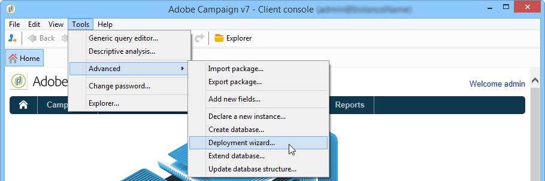

設定手順は、以下のとおりです。

1. [一般パラメーター](#general-parameters)
1. [メールチャネルのパラメーター](#email-channel-parameters)
1. [バウンスメールの管理](#managing-bounced-emails)
1. [トラッキング設定](#tracking-configuration)
1. [モバイルチャネルのパラメーター](#mobile-channel-parameters)
1. [地域設定](#regional-settings)
1. [インターネットからのアクセス](#access-from-the-internet)
1. [公開リソースの管理](#managing-public-resources)
1. [データのパージ](#purging-data)

## 一般パラメーター {#general-parameters}

デプロイメントウィザードの最初の手順では、インスタンスに関する一般的な情報を入力できます。

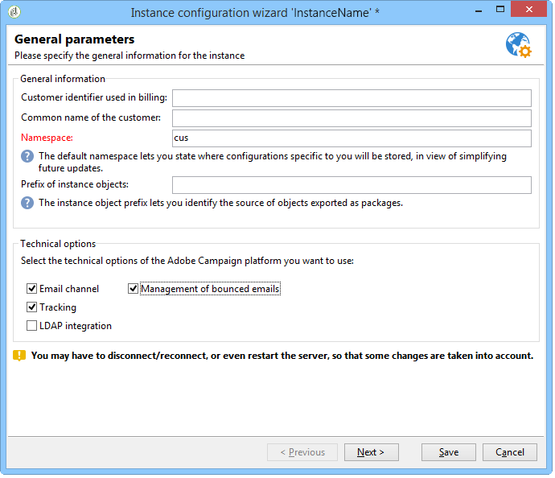

### 一般情報 {#general-information}

ウィンドウの下部のセクションでは、アクティブ化するオプションを選択できます。

* **[!UICONTROL 請求時に使用される顧客識別子]**：これは、インスタンスの名前とバージョン番号にすることができます。
* **[!UICONTROL 顧客の共通の名前]**：会社名を含む文字列を入力します。 この情報は、購読解除リンクで使用できます。
* **[!UICONTROL 名前空間]**：小文字で短い識別子を入力します。 アップグレードの場合、特定の設定とファクトリ設定を区別することが目的です。 デフォルトの名前空間は、顧客の&#x200B;**cus**&#x200B;です。

### 技術的なオプション {#technical-options}

ウィンドウの下部のセクションでは、アクティブ化するオプションを選択できます。

次のオプションを使用できます。

* **[!UICONTROL 電子メールチャネル]**：電子メール配信をアクティブ化します。 [電子メールチャネルパラメーター](#email-channel-parameters)を参照してください。
* **[!UICONTROL トラッキング]**：ターゲット母集団のトラッキングを有効にするには（開封数とクリック数）。 [ トラッキング設定](#tracking-configuration)を参照してください。
* **[!UICONTROL バウンス電子メールの管理]**：受信メールの受信に使用するPOP アカウントを定義します。 [ バウンス電子メールの管理](#managing-bounced-emails)を参照してください。
* **[!UICONTROL LDAP統合]** :LDAP ディレクトリを使用してユーザー認証を設定します。 「[LDAPを介した接続](../../installation/using/connecting-through-ldap.md)」を参照してください。

## メールチャネルのパラメーター {#email-channel-parameters}

次の手順では、メッセージヘッダーに表示する情報を定義します。

これらのパラメーターは、配信テンプレートで、各配信に対して個別にオーバーロードできます（ユーザーが必要な権限を持っている場合）。

### 配信メールのパラメーター {#parameters-for-delivered-emails}

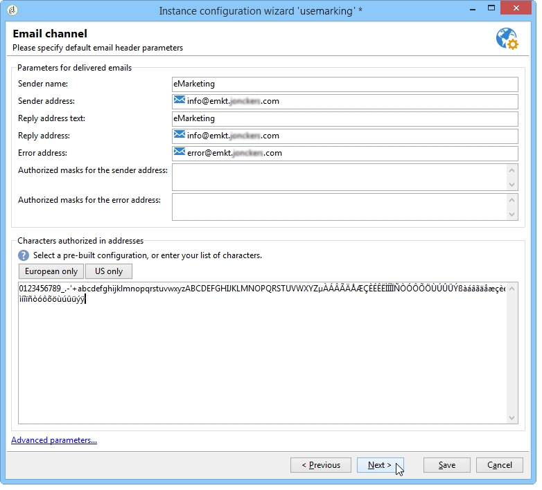

次のパラメーターを指定します。

* **[!UICONTROL 送信者名]**：送信者の名前を入力します。
* **[!UICONTROL 送信者アドレス]**：送信者の電子メールアドレスを入力します。 Adobe Campaignから電子メールを送信する場合、**送信者アドレス** メールボックスは監視されず、マーケティングユーザーはこのメールボックスにアクセスできません。 Adobe Campaignでは、このメールボックスで受信した電子メールを自動返信または自動転送する機能も提供されていません。 配信品質のベストプラクティス [について詳しくは、このドキュメント ](https://experienceleague.adobe.com/docs/deliverability-learn/deliverability-best-practice-guide/additional-resources/campaign/ac-starting-new-platform.html){_blank}を参照してください。

* **[!UICONTROL 返信アドレスのテキスト]**：受信者が&#x200B;**[!UICONTROL 返信]** ボタンをクリックしたときに使用される名前を入力します。
* **[!UICONTROL 返信アドレス]**：受信者がメールクライアントソフトウェアの「**[!UICONTROL 返信]**」ボタンをクリックしたときに使用するメールアドレスを入力します。 「**返信先アドレス**」フィールドの目的は、受信者に&#x200B;**送信者アドレス**&#x200B;とは異なるアドレスに返信する場合です。  このアドレスは、監視対象メールボックスにリンクされ、顧客がホストする有効な電子メールアドレスである必要があります。  電子メールの読み取りと返信を行うサポート メールボックス （例：`customer-care@customer.com`）を指定できます。

* **[!UICONTROL エラーアドレス]**：エラーのあるメッセージの電子メールアドレスを入力します。 これは、存在しないターゲットアドレスが原因でAdobe Campaign サーバーが受信した電子メールを含む、バウンスメールを処理するために使用される技術的なアドレスです。 このアドレスは、監視対象メールボックスにリンクされ、顧客がホストする有効な電子メールアドレスである必要があります。 バウンスメールボックス （例：`errors@customer.com`）である可能性があります。 このアドレスは、配信/配信テンプレートのプロパティの「**SMTP**」タブから、配信または配信テンプレートに対して変更できます。 詳しくは、[Campaign v8 ドキュメント](https://experienceleague.adobe.com/docs/campaign/campaign-v8/send/emails/email-parameters.html#managing-bounce-emails){target="_blank"}を参照してください。

これに加えて、送信者アドレスとエラーアドレスに対して許可された&#x200B;**マスク**&#x200B;を指定できます。 必要に応じて、これらのマスクをコンマで区切ることができます。 この設定はオプションです。 フィールドが入力されると、Adobe Campaignは配信時（分析中、アドレスに変数が含まれていない場合）にアドレスが有効であることを確認します。 この動作モードは、トリガー配信の問題を引き起こす可能性のあるアドレスが使用されていないことを確認します。 配信アドレスは、配信サーバーで設定する必要があります。

>[!NOTE]
>
>* これらの設定は、Campaign プラットフォームのオプションに保存されます。 [詳細情報](../../installation/using/configuring-campaign-options.md)。
> 
>* マルチブランディング設定の場合は、エラーアドレスを調整し、この設定をメールルーティング外部アカウントから上書きできます。 [詳細情報](../../installation/using/external-accounts.md#email-routing-external-account)。
>


### アドレスに使用できる文字 {#characters-authorized-in-addresses}

<!--This window enables you to define, for all email campaigns, the delivery and address-quality management options.-->

Adobe Campaign データベースでは、すべての電子メールアドレスを次のように作成する必要があります：`x@y.z`。 **x**、**y**、**z**&#x200B;の文字は空にしないでください。許可されていない文字を含めることはできません。

ここでは、データベースの電子メールフィールドで許可された文字（「データポリシー」）を定義できます。 リストに含まれていない文字は禁止されるので、Web フォームを使用してデータベースに情報を入力したり、データを読み込んだりする際には拒否されます。

使用できるリストは、**ヨーロッパのみ**&#x200B;または&#x200B;**米国のみ**&#x200B;の2つです。 必要に応じて他の文字を追加できます。

### 配信パラメーター {#delivery-parameters}

**詳細パラメーター…** リンクを使用すると、配信オプション、再試行と強制隔離にリンクされたパラメーターにアクセスできます。

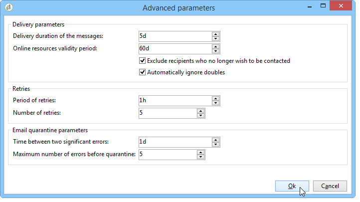

このウィンドウでは、すべてのメールキャンペーンに対して、配信とアドレス品質の管理オプションを定義できます。

次のオプションを使用できます。

* **[!UICONTROL メッセージの配信時間]**：この時間を超えると、配信は停止されます（デフォルトでは5日）。
* **[!UICONTROL オンラインリソースの有効期間]**：ミラーページを生成するために、受信者プロファイルの情報が保持される時間。
* **[!UICONTROL 連絡を希望しない受信者を除外]**：このオプションが選択されている場合、メールの受信者に対する連絡は行われません。
* **[!UICONTROL 倍数を自動的に無視]**：このオプションを選択すると、重複するアドレスに配信が行われません。

>[!NOTE]
>
>ホスト型またはハイブリッド型のインストールでは、[拡張MTA](../../delivery/using/sending-with-enhanced-mta.md)にアップグレードした場合、メッセージ ]**の**[!UICONTROL &#x200B;配信期間は&#x200B;**3.5日以内に設定された場合にのみ使用されます**。 3.5 日を超える値を定義した場合、その値は考慮されません。

### パラメーターの再試行 {#retry-parameters}

回復に関する情報は、**回復期間**&#x200B;および&#x200B;**回復回数**&#x200B;のフィールドで提供されます。受信者に到達できない場合（受信トレイがいっぱいになっている場合など）は、デフォルトで、プログラムは各試行の間隔（最大配信時間）を1時間にして5回連絡を試みます。 これらの値は、ニーズに合わせて変更できます。

>[!NOTE]
>
>ホスト型またはハイブリッド型のインストールでは、[拡張MTA](../../delivery/using/sending-with-enhanced-mta.md)にアップグレードした場合、Campaign再試行パラメーターは使用されなくなります。 ソフトバウンスの再試行とその間隔は、メッセージの電子メールドメインから返されるバウンス応答のタイプと重大度に基づいて、Enhanced MTA が決定します。

### 強制隔離パラメーター {#quarantine-parameters}

強制隔離の設定オプションは次のとおりです。

* **[!UICONTROL 2つの重大なエラーの間の期間]**：失敗した場合にエラーカウンターを増分する前にアプリケーションが待機する時間を定義する値（「1d」デフォルトでは1日）を入力します。
* **[!UICONTROL 強制隔離までの最大エラー数]**：この値に達すると、メールアドレスが強制隔離されます（デフォルトでは「5」:6番目のエラーでアドレスが強制隔離されます）。 これは、連絡先が後続の配信から自動的に除外されることを意味します。

## バウンスメールの管理 {#managing-bounced-emails}

バウンスメールは、配信エラーを検証するうえで特に重要です。 これらのエラーは、ルールが原因を決定すると、NP@Iに分類されます。

この手順は、デプロイメントウィザードの最初の段階で&#x200B;**電子メールチャネル**&#x200B;および&#x200B;**バウンスメール**&#x200B;管理オプションが選択されている場合にのみ使用できます。 [一般パラメーター](#general-parameters)を参照してください。

この段階では、バウンスメールを管理するための設定を定義します。

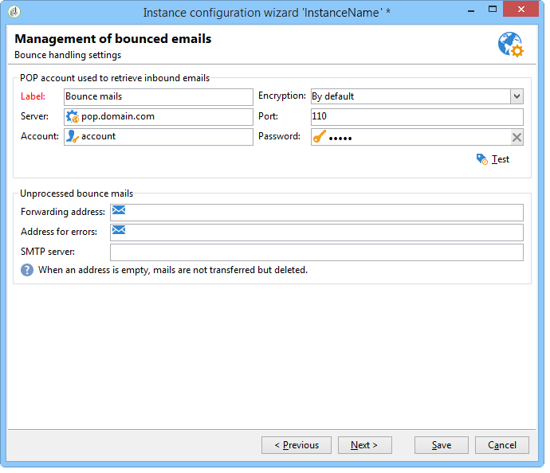

### 受信メールの取得に使用されるPOP アカウント {#pop-account-used-to-retrieve-incoming-mails}

受信メールを取得するためのアカウントに接続するパラメーターを指定します。

* **[!UICONTROL Label]**：以下のすべてのパラメーターを含む名前。
* **[!UICONTROL サーバー]**：バウンスメール（受信メール）の取得に使用されるサーバー。
* **[!UICONTROL セキュリティ]**：必要に応じて、ドロップダウンリストから「**[!UICONTROL SSL]**」を選択します。
* **[!UICONTROL ポート]**：サーバーポート（通常は110）、
* **[!UICONTROL アカウント]**：バウンスメールに使用されるアカウントの名前。
* **[!UICONTROL パスワード]**：アカウントに関連付けられたパスワード。

POP設定を指定したら、**テスト**&#x200B;をクリックして、正しいことを確認します。

### 未処理のバウンスメール {#unprocessed-bounce-mails}

バウンスはAdobe Campaignによって自動的に処理され、**管理 / Campaign Management / 配信不能管理/配信ログの選定** ノードに記載されているルールが適用されます。 詳しくは、[ バウンスメール管理](../../delivery/using/delivery-failures-quarantine.md#bounce-mail-management)を参照してください。

未処理のバウンスは、Adobe Campaign インターフェイスに表示されません。 これらは、次のフィールドを使用してサードパーティのメールボックスに転送されない限り、自動的に削除されます。

* **[!UICONTROL 転送アドレス]**：このフィールドに入力して、Adobe Campaign プラットフォームで収集されたすべてのエラーメッセージ（処理済みまたは未処理）をサードパーティのアドレスに転送します。
* **[!UICONTROL エラーのアドレス]**：このフィールドに入力して、inMail プロセスで修飾できなかったエラーメッセージのみをサードパーティのアドレスに転送します。
* **[!UICONTROL SMTP サーバー]**：未処理のバウンス電子メールの送信に使用されるサーバー。

>[!IMPORTANT]
>
>未処理のバウンス電子メールを転送するには、**[!UICONTROL エラーのアドレス]** フィールドのみを入力することをお勧めします。 ただし、使用するアドレスが定期的にチェックされていることを確認してください。これにより、メールサーバーに大きな負荷がかかる可能性があります。 詳細については、アドビの担当者にお問い合わせください。

## トラッキング設定 {#tracking-configuration}

次の手順では、インスタンスのトラッキングを設定します。 インスタンスを宣言し、トラッキングサーバーに登録する必要があります。

この手順は、デプロイメントウィザードの最初のページで&#x200B;**電子メールチャネル**&#x200B;および&#x200B;**トラッキング** オプションが選択されている場合にのみ提供されます。 [一般パラメーター](#general-parameters)を参照してください。

Web トラッキング（トラッキングモード、タグの作成と挿入など）について詳しくは、[このドキュメント ](../../configuration/using/about-web-tracking.md)を参照してください。

### 動作の原則 {#operating-principle}

インスタンスでトラッキングを有効にすると、送信中に配信のURLが変更され、トラッキングが有効になります。

* デプロイメントウィザードのこのページで入力された外部URLに関する情報（セキュアかどうかに関係なく）は、新しいURLの構築に使用されます。 この情報と同様に、変更されたリンクには、配信の識別子、受信者、およびURLが含まれています。

  トラッキング情報は、Adobe Campaignによってトラッキングサーバー上で収集され、受信者プロファイルと配信にリンクされたデータを強化します（**[!UICONTROL トラッキング]** タブ）。

  内部URLに関する情報は、Adobe Campaign アプリケーションサーバーがトラッキングサーバーに連絡するためにのみ使用されます。

  詳しくは、[ トラッキングサーバー](#tracking-server)を参照してください。

* URLを設定したら、トラッキングを有効にする必要があります。 これを行うには、インスタンスをトラッキングサーバーに登録する必要があります。

  詳しくは、「[ トラッキングの保存](#saving-tracking)」を参照してください。

### トラッキングサーバー {#tracking-server}

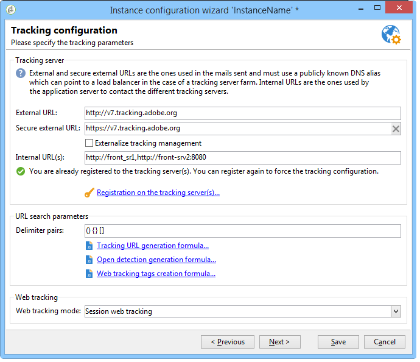

このインスタンスでのトラッキングの効率性を保証するには、次の情報を表示する必要があります。
<!--With Mid-sourcing architecture, you can externalize tracking management. To do this:-->

* **[!UICONTROL 外部URL]**&#x200B;または&#x200B;**[!UICONTROL セキュア外部URL]**：送信する電子メールで使用するリダイレクト URLを入力します。
* **[!UICONTROL 内部URL]**：ログの収集とURLのアップロードのために、Adobe Campaign サーバーがトラッキングサーバーに連絡するためにのみ使用するURL。 インスタンスに関連付ける必要はありません。

  URLを指定しない場合、トラッキング URLはデフォルトで使用されます。

ミッドソーシングアーキテクチャでは、トラッキング管理を外部化できます。 手順は次のとおりです。

1. 「**[!UICONTROL トラッキング管理を外部化]**」オプションを選択します。これにより、ミッドソーシングサーバーをトラッキングサーバーとして使用できます。
1. ミッドソーシングサーバーに接続できるように、**[!UICONTROL 外部アカウント]**&#x200B;および&#x200B;**[!UICONTROL インスタンス名]** フィールドに入力します。

   詳しくは、[ ミッドソーシングサーバー](../../installation/using/mid-sourcing-server.md)を参照してください。

1. 「**[!UICONTROL トラッキングインスタンスを有効にする]**」ボタンをクリックして、サーバーへの接続を承認します。

   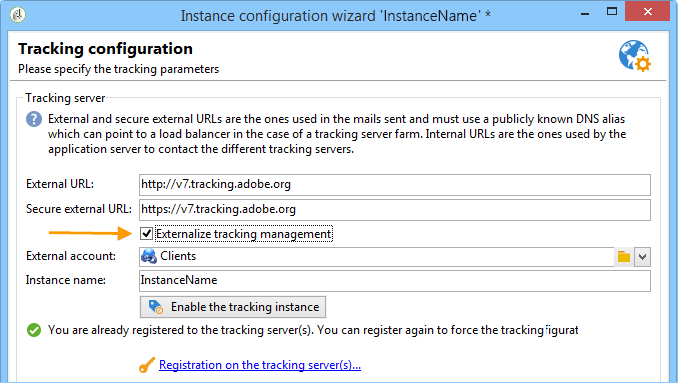

### トラッキングを保存中 {#saving-tracking}

URLが入力されたら、トラッキングサーバーを登録する必要があります。

トラッキングサーバー&#x200B;**のリンク**&#x200B;登録をクリックし、使用可能なオプションのいずれかを選択します。

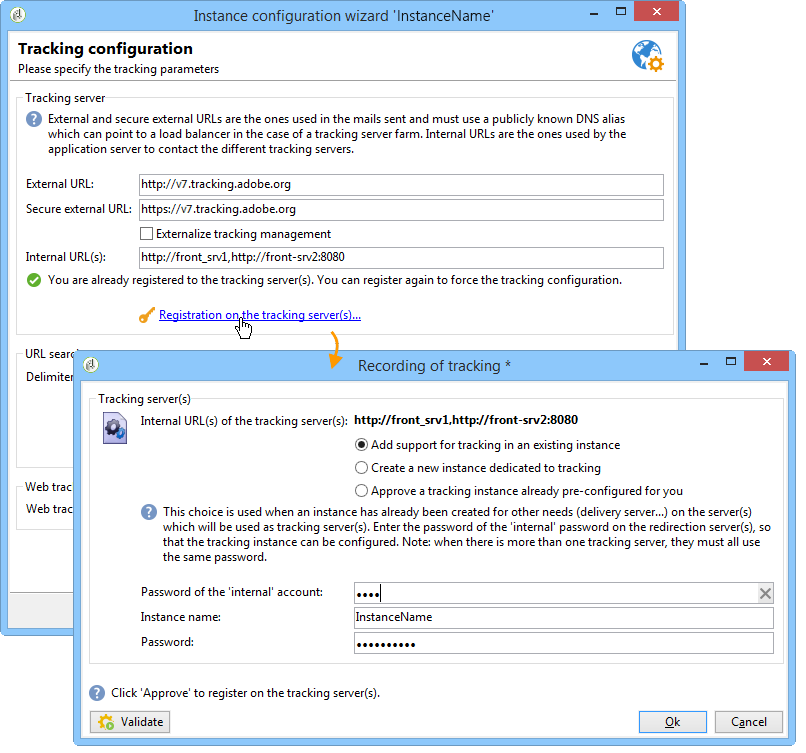

トラッキングを実装するためのアーキテクチャには、次の3つの種類があります。

1. **既存のインスタンスでのトラッキングのサポートを追加**

   この選択は、インスタンスが他のニーズ（MTA サーバーなど）用に作成済みの場合に適用されます。 トラッキングサーバーとして使用されるサーバー上。

   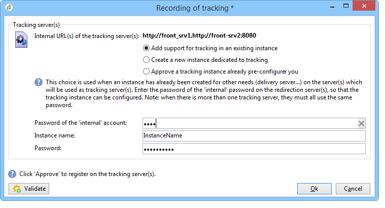

   トラッキングインスタンスを設定するには、リダイレクトサーバーの&#x200B;**internal** アカウントのパスワードを入力します。

   >[!NOTE]
   >
   >複数のトラッキングサーバーを使用する場合は、すべて同じ名前とパスワードを使用する必要があります。

   インスタンスの名前とパスワードを指定します。

1. **トラッキング専用の新しいインスタンスを作成**

   このオプションは、トラッキングインスタンスがトラッキング用に予約されており、他のアプリケーションモジュールがない場合に便利です。

   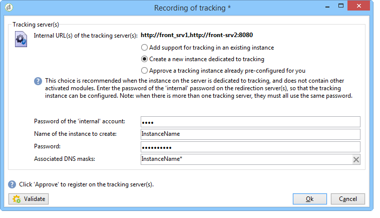

   トラッキングインスタンスを設定するには、リダイレクトサーバーの&#x200B;**internal** アカウントのパスワードを入力します。

   >[!NOTE]
   >
   >複数のトラッキングサーバーが設定されている場合は、すべて同じパスワードを使用する必要があります。

   インスタンスの名前、パスワード、関連するDNS マスク（**[!UICONTROL Campaign*]**&#x200B;など）を指定します。

1. **既に事前設定されているトラッキングインスタンスを検証する**

   このオプションは、**internal** アカウントのパスワードがない場合に使用されます。この場合、トラッキングアカウントはトラッキングサーバー上で事前に設定されています。 トラッキングインスタンスを検証するには、リダイレクトサーバーのトラッキングアカウントのパスワードを入力します。

   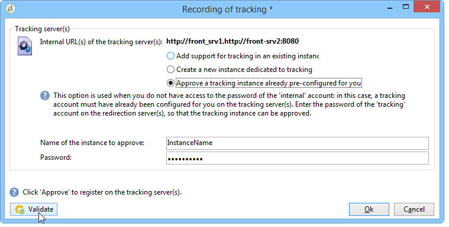

   検証するインスタンスの名前を指定します。

「**承認**」をクリックして、トラッキングサーバーでの録画プロセスを開始します。

前のウィンドウに戻ると、トラッキングサーバーレベルでの登録が確認されます。

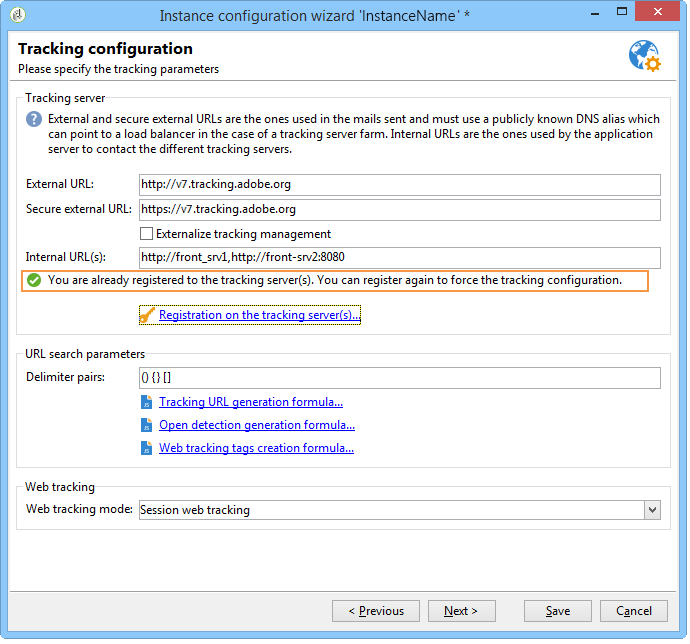

URL検索&#x200B;**にリンクされたパラメーターは、標準インストール用に変更**&#x200B;できません。 その他のパラメーターについては、Adobeにお問い合わせください。

## モバイルチャネルのパラメーター {#mobile-channel-parameters}

次の手順では、モバイルへの配信（SMSおよびWAP プッシュ）のデフォルト設定を定義できます。

>[!NOTE]
>
>モバイルチャネルはオプションです。このステージは、購入済みの場合にのみ表示されます。 使用許諾契約書を確認してください。

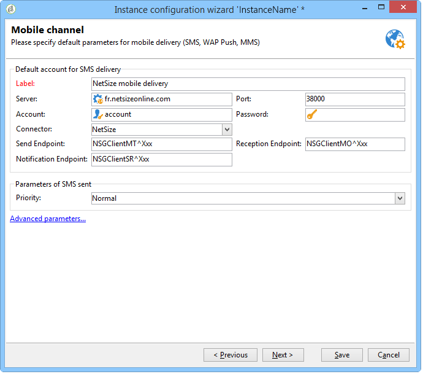

### SMS 配信用のデフォルトアカウント {#default-account-for-sms-delivery}

次の情報を入力します。

* **[!UICONTROL ラベル]**：このSMS/Wap プッシュアカウントの名前を入力します。 例えば、ルーターの名前を使用できます。
* **[!UICONTROL サーバー]**、**[!UICONTROL ポート]**、**[!UICONTROL アカウント]**、**[!UICONTROL パスワード]**、**[!UICONTROL コネクタ]**、**[!UICONTROL 送信エンドポイント]**、**[!UICONTROL 受信エンドポイント]**、**[!UICONTROL 通知エンドポイント]** フィールドの場合：必要な設定については、サービスプロバイダーにお問い合わせください。

### 送信された SMS のパラメーター {#parameters-of-sms-sent}

**優先度** ドロップダウンリストで、「通常」、「高」、「緊急」を選択して、送信するメッセージに適用します。

### 詳細設定パラメーター {#advanced-parameters}

**詳細パラメーター…** リンクを使用すると、再試行および強制隔離オプションにアクセスできます。

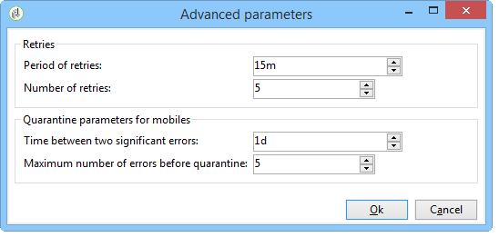

再試行に関する情報は、**再試行期間**&#x200B;および&#x200B;**再試行回数**&#x200B;のフィールドで入手できます。モバイルにアクセスできない場合、デフォルトでは、プログラムは少なくとも15分の間隔で5回再試行します（最大配信期間）。 これらの値は、ニーズに合わせて適応させることができます。

強制隔離の設定オプションは次のとおりです。

* **[!UICONTROL 2つの重大なエラー間の時間]**：エラーのエラーカウンターを増分する前にアプリケーションが待機する時間を定義するデフォルト値（デフォルトでは「1d」：日）を入力します。
* **[!UICONTROL 強制隔離までの最大エラー数]**：この値に達すると、携帯電話番号は強制隔離されます（デフォルトでは「5」:6番目のエラー時に強制隔離されます）。 これは、連絡先が今後の配信から自動的に除外されることを意味します。

## 地域設定 {#regional-settings}

この段階では、データポリシーの設定を含めることができます。

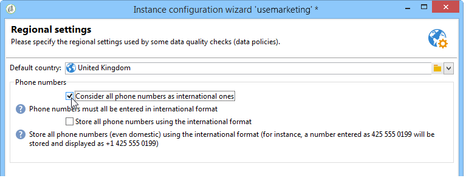

* **[!UICONTROL すべての電話番号を国際電話番号と見なす]**：このオプションを選択すると、国際形式が電話番号に適用されます（書式設定を適用する前に桁数がチェックされないため、国のプレフィックスが必須になります）。 このオプションを選択しない場合は、国際電話番号の先頭に「+」または「00」を付ける必要があります。
* **[!UICONTROL すべての電話番号を国際形式で保存]**：このオプションは、読み込まれるか編集された&#x200B;**国内**&#x200B;の電話番号にのみ適用されます。 国内形式（425 555 0150など）と国際形式（例：+1 425 555 0150）のどちらを使用するかを定義します。

## インターネットからのアクセス {#access-from-the-internet}

>[!IMPORTANT]
>
>プライバシー保護のために、すべての外部リソースに対して HTTPS を使用することをお勧めします。

この手順では、インターネット上で公開されるAdobe Campaign ページのアクセス URLを定義できます。

また、Web フォームにリンクされた公開オプションをここに示す必要があります。

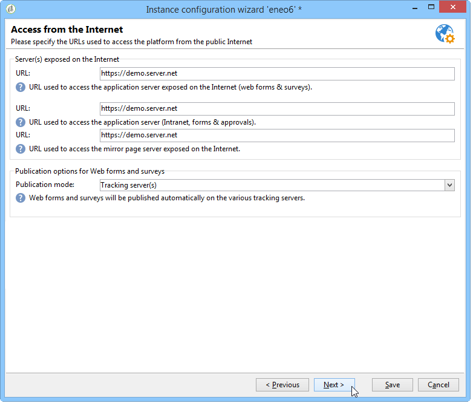

### Web上に公開されたサーバー {#servers-exposed-on-the-web}

このページを使用して、サーバーURLを次のように入力します。

1. インターネット上に公開されているアプリケーションサーバー（サブスクリプション/購読解除フォーム、エクストラネットなど）にアクセスします。
1. Web上に公開されていないリソース（フォーム、イントラネット、確認ページ）のアプリケーションサーバーにアクセスします。
1. 配信のミラーページにアクセスします。

   ミラーページは、メールの内容を表示する動的なページです。 受信者に送信されたメッセージに挿入されたリンクを介してアクセスされ、パーソナライズされた要素を含めることができます。 ミラーページでは、配信形式（テキストまたはHTML）に関係なく、電子メールソフトウェアではなくインターネットブラウザーでメッセージを読むことができます。 ただし、ミラーページは、必要なHTML コンテンツが定義されている場合にのみ、特定の配信に対して生成されます。

Adobe Campaignでは、これら3つのURLを区別して、複数のプラットフォームに負荷を分散させることができます。


>[!NOTE]
>
>* これらの設定は、Campaign プラットフォームのオプションに保存されます。 [詳細情報](../../installation/using/configuring-campaign-options.md)。
>* マルチブランディング設定の場合は、ミラーページのURLを調整し、この設定をメールルーティング外部アカウントから上書きできます。 [詳細情報](../../installation/using/configuring-campaign-options.md)。


## 公開リソースの管理 {#managing-public-resources}

>[!IMPORTANT]
>
>プライバシー保護のために、すべての外部リソースに対して HTTPS を使用することをお勧めします。

外部から見るには、キャンペーンにリンクされた電子メールや公開リソースで使用される画像が、外部からアクセスできるサーバーに存在している必要があります。 その後、外部の受信者またはオペレーターが使用できます。

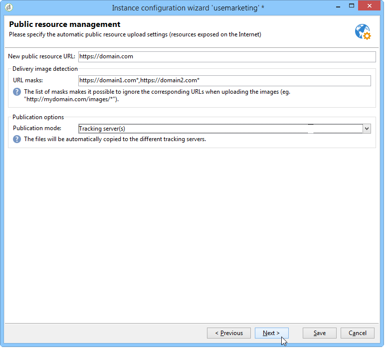

この手順では、次を入力する必要があります。

1. 新しいパブリックリソース URL。 詳しくは、[公開リソース URL](#public-resources-url) セクションを参照してください。
1. 配信における画像検出モード。 詳しくは、[配信画像検出](#delivery-image-detection) セクションを参照してください。
1. 公開オプション： 詳しくは、[公開モード ](#publication-modes)の節を参照してください。

パブリックリソースには、Adobe Campaign ツリーの&#x200B;**管理/ リソース / オンライン / パブリックリソース** ノードからアクセスできます。 それらはライブラリに収集され、電子メールに含めることができますが、キャンペーンやタスク、コンテンツ管理でも使用できます。

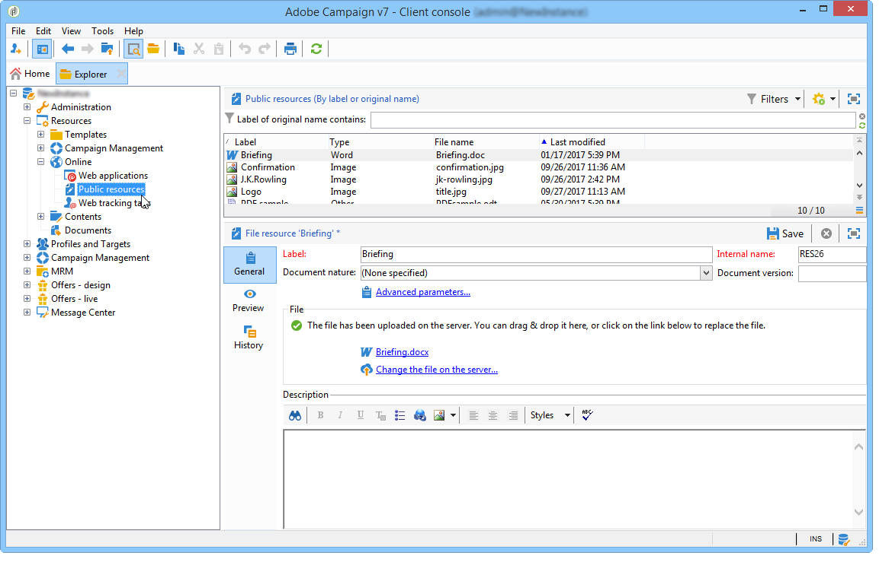

### パブリックリソース URL {#public-resources-url}

最初のフィールドでは、アップロード後のリソースに使用するURLの開始を指定できます。 アップロードすると、この新しいURLを介してリソースにアクセスできます。

配信では、パブリックリソースライブラリに保存されている画像や、サーバーに保存されているその他のローカル画像や画像を使用できます。

* メール画像の場合、**https://** server **/res/img** URL。

  この値は、配信ごとに上書きできます。

* 公開リソースの場合、URL **https://** server **/res/** instance ****（**instance**）はトラッキングインスタンスの名前です。

### 配信画像の検出 {#delivery-image-detection}

配信では、パブリックリソースライブラリに保存されている画像や、サーバーに保存されているその他のローカル画像や画像を使用できます。

フィールド **URL マスク**&#x200B;を使用すると、画像を自動的にアップロードする際にスキップするURL マスクのリストを指定できます。 例えば、外部からアクセス可能なサイト、特にインターネットサイトに保存されている画像を使用する場合は、このフィールドにサイト URLを入力できます。

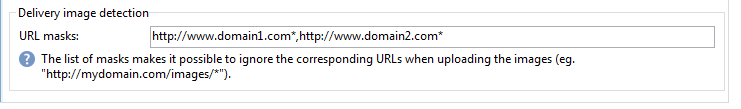

コンマを使用して複数のURL マスクを指定できます。

* メールでの画像の使用と管理について詳しくは、[Campaign v8 ドキュメント ](https://experienceleague.adobe.com/docs/campaign/campaign-v8/send/emails/defining-the-email-content.html?lang=ja#adding-images){target="_blank"}を参照してください。
* 配信アシスタントでは、これらのURLから呼び出された画像のステータスは「無視」になります。

### 公開モード {#publication-modes}

アシスタントの下部のセクションでは、パブリックリソースと画像の公開オプションを選択できます。

次の公開モードを使用できます。

* トラッキングサーバー

  リソースは、異なるトラッキングサーバーに自動的にコピーされます。 これらの設定は、手順[設定のトラッキング ](#tracking-configuration)で行います。

* その他のAdobe Campaign サーバー

  リソースがコピーされる別の1つのAdobe Campaign サーバーを使用できます。

  サーバーサイドでは、専用のAdobe Campaign サーバーを使用するには、次のコマンドを使用して新しいインスタンスを作成する必要があります。

  ```
  nlserver config -addtrackinginstance:<trackingA>/<trackingA*>
  ```

  次に、パスワードを入力します。

  専用サーバーのパラメーターは、**[!UICONTROL メディア URL]**、**[!UICONTROL パスワード]**、**[!UICONTROL インスタンス名]** フィールドで指定されます。

  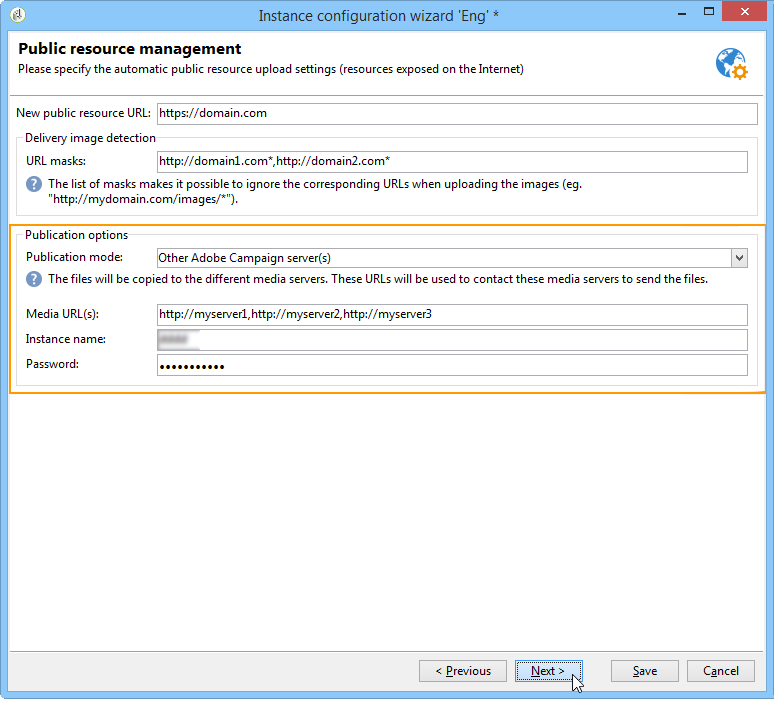

* 手動公開スクリプト（パブリックリソースのみ）

  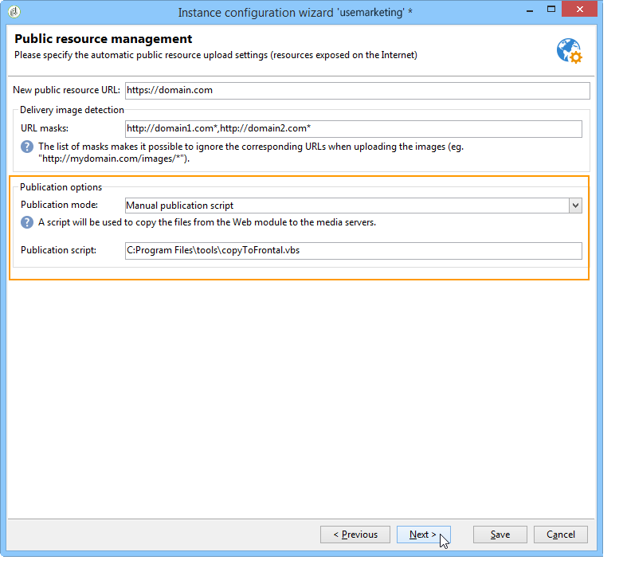

  スクリプトを使用して画像を公開できます。

   * このスクリプトを作成する必要があります。その内容は、設定によって異なります。
   * スクリプトは次のコマンドで呼び出されます。

     ```
     [INSTALL]/copyToFrontal.vbs "$(XTK_INSTALL_DIR)\var\<instance>\upload\" "img1,img2,img3"
     ```

     ここで、`[INSTALL]`はAdobe Campaign インストールフォルダーへのアクセスパスです。

   * Unixでは、スクリプトが実行可能であることを確認します。

画像の場合は、**NmsDelivery_ImageSubDirectory** オプションで指定した「images」フォルダーから1つ以上のフロントタルサーバーにコピーする必要があります。 これらのサーバーは、新しく設定されたURLを介してアクセスできるように画像を保存します。

手動の公開スクリプトを使用せずにAdobe Campaign サーバーで公開する場合、デフォルトでは、配信の画像は`$(XTK_INSTALL_DIR)/var/res/img/ directory`に保存されます。 対応するURLは次のとおりです：**`https://server/res/img`**。

`XTK_INSTALL_DIR)/var/res/$(INSTANCE_NAME)`. 対応するURLは次のとおりです：**`https://server/res/instance`** インスタンスはトラッキングインスタンスの名前です。

>[!NOTE]
>
>パブリックリソースストレージディレクトリを変更できます。 詳しくは、[公開リソースの管理](#managing-public-resources)を参照してください。

### パブリックリソースの同期 {#synchronizing-public-resources}

この機能を使用すると、複数のスペアサーバーで&#x200B;**パブリックリソース**&#x200B;を同期できます。

トラッキングサーバーにパブリックリソースが存在しない場合、またはリソースが404 エラーを返す場合、トラッキングサーバーはスペアサーバーの1つでリソースを検索しようとします。

スペアサーバーの宣言と設定は、マーケティングサーバーの&#x200B;**serverConf.xml** ファイルで行う必要があります。 **serverConf.xml**&#x200B;で使用可能なすべてのパラメーターは、この[ セクション ](../../installation/using/the-server-configuration-file.md)に一覧表示されます。

**宣言**

```
<redirection>
<spareServer enabledIf="" id="" url=""/>
</redirection>
```

**設定**

同期する必要があるパブリックリソースごとに、`<relay>`部分の`<url>`要素にstatus属性を追加する必要があります。

status属性には、次の3つの値のいずれかを指定できます。

* スペア：公開リソースが同期されます

* 標準：既存の動作（同期なし）

* blacklist: 404 エラーが返された場合、URLはブロックリストに追加されます。 デフォルト値が60秒の&#x200B;**timeout**&#x200B;属性によって定義されるURLの長さ（秒単位）です。

同期のすぐに使用できる設定は次のとおりです。

```
(extracted from the serverConf.xml file)

<redirection P3PCompactPolicy="CAO DSP COR CURa DEVa TAIa OUR BUS IND UNI COM NAV"
databaseId="" defLogCount="30" expirationURL="" maxJobsInCache="100"
startRedirection="true" startRedirectionInModule="true" trackWebVisitors="false" trackingPassword="">
<spareServer enabledIf="" id="1" url=""/>
</redirection>

....


<relay debugRelay="false" forbiddenCharsInAuthority="?#.@/:" forbiddenCharsInPath="?#/"
           modDir="index.html" startRelay="false" startRelayInModule="true" timeout="60">
   <url IPMask="" deny="" hostMask="" relayHost="true" relayPath="true" status="normal" targetUrl="https://localhost:8080" timeout="" urlPath="/view/*"/>
      <url IPMask="" deny="" hostMask="" relayHost="true" relayPath="true" status="blacklist" targetUrl="https://localhost:8080" timeout="" urlPath="*.jsp"/>
      <url IPMask="" deny="" hostMask="" relayHost="true" relayPath="true" status="blacklist" targetUrl="https://localhost:8080" timeout="" urlPath="*.jssp"/>
      <url IPMask="" deny="" hostMask="" relayHost="true" relayPath="true" status="blacklist" targetUrl="https://localhost:8080" timeout="" urlPath="/webApp/*"/>
      <url IPMask="" deny="" hostMask="" relayHost="true" relayPath="true" status="blacklist" targetUrl="https://localhost:8080" timeout="" urlPath="/report/*"/>
      <url IPMask="" deny="" hostMask="" relayHost="true" relayPath="true" status="blacklist" targetUrl="https://localhost:8080" timeout="" urlPath="/jssp/*"/>
      <url IPMask="" deny="" hostMask="" relayHost="true" relayPath="true" status="normal" targetUrl="https://localhost:8080" timeout="" urlPath="/strings/*"/>
      <url IPMask="" deny="" hostMask="" relayHost="true" relayPath="true" status="normal" targetUrl="https://localhost:8080" timeout="" urlPath="/interaction/*"/>
      <url IPMask="" deny="" hostMask="" relayHost="true" relayPath="true" status="normal" targetUrl="https://localhost:8080" timeout="" urlPath="/barcode/*"/>

      <url IPMask="" deny="" hostMask="" relayHost="false" relayPath="false" status="spare" targetUrl="" timeout="" urlPath="/favicon.*"/>
      <url IPMask="" deny="" hostMask="" relayHost="false" relayPath="false" status="spare" targetUrl="" timeout="" urlPath="/*.html"/>
      <url IPMask="" deny="" hostMask="" relayHost="false" relayPath="false" status="spare" targetUrl="" timeout="" urlPath="/*.png"/>
      <url IPMask="" deny="" hostMask="" relayHost="false" relayPath="false" status="spare" targetUrl="" timeout="" urlPath="/*.jpg"/>

 </relay>
```

## データのパージ {#purging-data}

デプロイメントウィザードの最後のステージでは、古いデータの自動パージを設定できます。 値は日数で表されます。

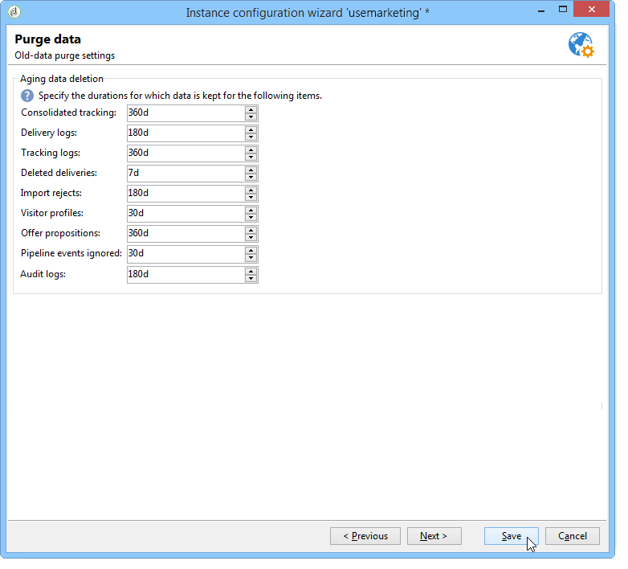

データは、データベースクリーンアップワークフローを介して自動的に削除されます。 このワークフローを設定および操作する方法と、削除されたアイテムの詳細については、この[ ドキュメント ](../../production/using/database-cleanup-workflow.md)を参照してください。
