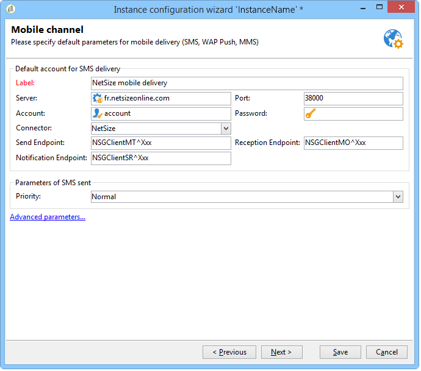
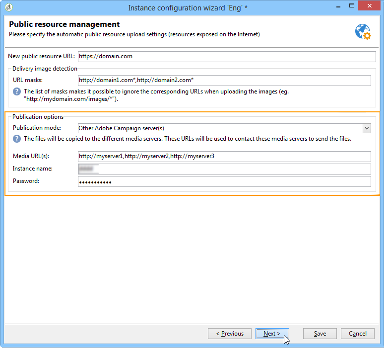

# インスタンスのデプロイ{#deploying-an-instance}

>[!NOTE]
>
>サーバーサイドの構成は、Adobeがホストする展開に対してのみAdobeが実行できます。 様々なデプロイメントの詳細については、 [ホスティングモデル](../../installation/using/hosting-models.md) セクションまたは宛先 [このページ](../../installation/using/capability-matrix.md).

## 配置ウィザード {#deployment-wizard}

Adobe Campaignには、Adobe Campaign クライアントコンソールで使用できるグラフィカルなアシスタントが用意されており、接続先のインスタンスのパラメーターを定義できます。

配置ウィザードを開始するには、 **ツール /詳細/ デプロイメント ウィザード**.


設定手順は、以下のとおりです。

1. [一般パラメーター](#general-parameters)
1. [メールチャネルのパラメーター](#email-channel-parameters)
1. [バウンスメールの管理](#managing-bounced-emails)
1. [トラッキング設定](#tracking-configuration)
1. [モバイルチャネルのパラメーター](#mobile-channel-parameters)
1. [地域設定](#regional-settings)
1. [インターネットからのアクセス](#access-from-the-internet)
1. [パブリックリソースの管理](#managing-public-resources)
1. [データのパージ](#purging-data)

## 一般パラメーター {#general-parameters}

デプロイメントウィザードの最初の手順では、インスタンスに関する一般情報を入力できます。


### 一般情報 {#general-information}

ウィンドウの下部のセクションでは、アクティブにするオプションを選択できます。

* **[!UICONTROL 請求に使用する顧客識別子]** ：インスタンスの名前とバージョン番号を指定できます。
* **[!UICONTROL 顧客の共通名]** ：会社名を含む文字列を入力します。 この情報は、購読解除リンクで使用できます。
* **[!UICONTROL 名前空間]** ：短い識別子を小文字で入力します。 アップグレードを行う場合、お客様固有の設定と工場出荷時の設定を区別することが目的です。 デフォルトの名前空間は **cus**  – 顧客の場合。

### 技術的なオプション {#technical-options}

ウィンドウの下部のセクションでは、アクティブにするオプションを選択できます。

次のオプションを使用できます。

* **[!UICONTROL メールチャネル]** ：メール配信を有効化します。 こちらを参照してください [メールチャネルのパラメーター](#email-channel-parameters).
* **[!UICONTROL トラッキング]** ：ターゲット母集団（開封数およびクリック数）のトラッキングを有効にします。 こちらを参照してください [トラッキング設定](#tracking-configuration).
* **[!UICONTROL バウンスメールの管理]** ：受信メールの取得に使用する POP アカウントを定義します。 こちらを参照してください [バウンスメールの管理](#managing-bounced-emails).
* **[!UICONTROL LDAP 統合]** :LDAP ディレクトリを使用したユーザー認証を設定します。 こちらを参照してください [LDAP を介した接続](../../installation/using/connecting-through-ldap.md).

## メールチャネルのパラメーター {#email-channel-parameters}

次の手順では、メッセージヘッダーに表示する情報を定義できます。

これらのパラメーターは、配信テンプレートでオーバーロードすることも、配信ごとに個別にオーバーロードすることもできます（ユーザーに必要な権限がある場合）。

### 配信メールのパラメーター {#parameters-for-delivered-emails}


次のパラメーターを指定します。

* **[!UICONTROL 送信者名]** ：送信者名を入力します。
* **[!UICONTROL 送信者のアドレス]** ：送信者のメールアドレスを入力します。 Adobe Campaignからメールを送信する場合、 **送信者のアドレス** メールボックスは監視されていないため、マーケティング ユーザーはこのメールボックスにアクセスできません。 Adobe Campaignには、このメールボックスで受信した電子メールを自動返信または自動転送する機能もありません。 詳しくは、配信品質のベストプラクティスを参照してください [このドキュメント](https://experienceleague.adobe.com/docs/deliverability-learn/deliverability-best-practice-guide/additional-resources/campaign/ac-starting-new-platform.html){_blank}.

* **[!UICONTROL 返信アドレスのテキスト]** ：受信者がをクリックしたときに使用される名前を入力します **[!UICONTROL 返信]** ボタン。
* **[!UICONTROL 返信アドレス]** ：受信者が「」をクリックしたときに使用するメールアドレスを入力します **[!UICONTROL 返信]** メールクライアントソフトウェアの「」ボタン。 の目的 **返信アドレス** フィールドは、受信者が自分以外のアドレスに返信する場合に使用します **送信者のアドレス**.  このアドレスは、有効なメールアドレスで、監視対象のメールボックスにリンクされ、顧客によってホストされている必要があります。  例えば、サポート用のメールボックスを指定できます。 `customer-care@customer.com`（メールが読まれて応答される場所）。

* **[!UICONTROL エラーアドレス]** ：エラーのあるメッセージのメールアドレスを入力します。 これは、バウンスメールの処理に使用される技術的なアドレスです。これには、存在しないターゲットアドレスが原因でAdobe Campaign サーバーが受信したメールも含まれます。 このアドレスは、有効なメールアドレスで、監視対象のメールボックスにリンクされ、顧客によってホストされている必要があります。 例えば、バウンスメールボックスの場合があります。 `errors@customer.com`. このアドレスは、配信に対して、または配信テンプレートで、 **SMTP** 配信/配信テンプレートプロパティのタブ。 [詳細情報](../../delivery/using/email-parameters.md#managing-bounce-emails-managing-bounce-emails)。


これに加えて、 **マスク** 送信者アドレスとエラーアドレスに対して認証済み。 必要に応じて、これらのマスクはコンマで区切ることができます。 この設定はオプションです。 フィールドに値を入力すると、Adobe Campaignは配信時に（分析時に、アドレスに変数が含まれていない場合は）、アドレスが有効かどうかを確認します。 このオペレーティングモードでは、配信の問題をトリガーにする可能性のあるアドレスを使用しません。 配信アドレスは、配信サーバーで設定する必要があります。

>[!NOTE]
>
>* これらの設定は、Campaign プラットフォームオプションに保存されます。 [詳細情報](../../installation/using/configuring-campaign-options.md)。
> 
>* マルチブランディング設定の場合は、エラーアドレスを調整し、メールルーティング外部アカウントのこの設定を上書きできます。 [詳細情報](../../installation/using/external-accounts.md#email-routing-external-account)。
>


### アドレスに使用できる文字 {#characters-authorized-in-addresses}

<!--This window enables you to define, for all email campaigns, the delivery and address-quality management options.-->

Adobe Campaign データベースで、すべてのメールアドレスを次のように作成する必要があります。 `x@y.z`. この **x**, **y** および **z** 文字は空にできません。また、許可されていない文字を含めることはできません。

ここで、データベースの「メール」フィールドに許可された文字（「データポリシー」）を定義できます。 リストに含まれない文字は禁止されるため、インターフェイスを使用してデータベースに情報を入力する場合、web フォームを使用する場合、およびデータを読み込む場合に拒否されます。

次の 2 つのリストを使用できます。 **ヨーロッパのみ** または **米国のみ**. 必要に応じて、他の文字を追加できます。

### 配信パラメーター {#delivery-parameters}

この **詳細設定パラメーター…** リンクを使用すると、配信オプション、再試行にリンクされたパラメーター、強制隔離にアクセスできます。


このウィンドウを使用すると、すべてのメールキャンペーンに対して、配信およびアドレス品質管理オプションを定義できます。

次のオプションを使用できます。

* **[!UICONTROL メッセージの配信期間]** ：この期間を過ぎると、配信は停止します（デフォルトでは 5 日間）。
* **[!UICONTROL オンラインリソースの有効期間]** ：ミラーページを生成するために受信者プロファイルの情報を保持する時間。
* **[!UICONTROL 連絡を希望しない受信者を除外]** ：このオプションを選択すると、ブロックリストの受信者には連絡されません。
* **[!UICONTROL 重複を自動的に無視]** ：このオプションを選択すると、重複するアドレスには配信されません。

>[!NOTE]
>
>ホストインストールまたはハイブリッドインストールの場合、をにアップグレードしていれば、 [Enhanced MTA](../../delivery/using/sending-with-enhanced-mta.md), **[!UICONTROL メッセージの配信期間]** が次のように設定されている場合にのみ使用されます **三・五日以内**. 3.5 日を超える値を定義した場合、その値は考慮されません。

### 再試行パラメーター {#retry-parameters}

リカバリに関する情報は、 **リカバリ期間** および **リカバリの数** フィールド：受信者に到達できない場合（例えば、受信ボックスがいっぱいになっている場合）、デフォルトでは、プログラムは再試行の間隔を 1 時間として（最大配信時間に） 5 回試行します。 これらの値は、ニーズに合わせて変更できます。

>[!NOTE]
>
>ホストインストールまたはハイブリッドインストールの場合、をにアップグレードしていれば、 [Enhanced MTA](../../delivery/using/sending-with-enhanced-mta.md)は、Campaign の再試行パラメーターは使用されなくなりました。 ソフトバウンスの再試行とその間隔は、メッセージの電子メールドメインから返されるバウンス応答のタイプと重大度に基づいて、Enhanced MTA が決定します。

### 強制隔離パラメーター {#quarantine-parameters}

強制隔離の設定オプションは次のとおりです。

* **[!UICONTROL 2 つの重要なエラー間の期間]** ：値（デフォルトは「1d」:1 日）を入力して、失敗の場合にエラーカウンターを増分するまでのアプリケーションの待機時間を定義します。
* **[!UICONTROL 強制隔離前のエラーの最大数]** ：この値に達すると、メールアドレスが強制隔離されます（デフォルトでは「5」：アドレスは 6 回目のエラーで強制隔離されます）。 これは、連絡先が後続の配信から自動的に除外されることを意味します。

## バウンスメールの管理 {#managing-bounced-emails}

バウンスメールは、配信エラーを検証するために非常に重要です。 これらのエラーは、ルールで原因が特定されると、NP@Iに分類されます。

このステップは、 **メールチャネル** および **バウンスメール** 管理オプションは、デプロイメントウィザードの最初の段階で選択します。 こちらを参照してください [一般パラメーター](#general-parameters).

このステージでは、バウンスメールを管理するための設定を定義できます。


### 受信メールの取得に使用される POP アカウント {#pop-account-used-to-retrieve-incoming-mails}

受信メールを取得するためにアカウントに接続するパラメーターを指定します。

* **[!UICONTROL ラベル]** ：以下に指定されるすべてのパラメーターを含む名前。
* **[!UICONTROL サーバー]** ：バウンスメール（受信メール）の取得に使用するサーバー
* **[!UICONTROL セキュリティ]** ：必要に応じて、 **[!UICONTROL SSL]** ドロップダウンリストから、
* **[!UICONTROL ポート]** ：サーバーポート（通常は 110）、
* **[!UICONTROL アカウント]** ：バウンスメールに使用するアカウント名
* **[!UICONTROL パスワード]** ：アカウントに関連付けられているパスワード。

POP 設定を指定したら、 **テスト** 正しいことを確認します。

### 未処理のバウンスメール {#unprocessed-bounce-mails}

Adobe Campaign バウンスは、 **管理/Campaign Management/配信不能件数の管理/配信ログの選定** ノード。 詳しくは、次を参照してください [バウンスメール管理](../../delivery/using/understanding-delivery-failures.md#bounce-mail-management).

未処理のバウンスは、Adobe Campaign インターフェイスには表示されません。 次のフィールドを使用してサードパーティのメールボックスに転送されない限り、これらは自動的に削除されます。

* **[!UICONTROL 転送先アドレス]** :Adobe Campaign プラットフォームで収集されたすべてのエラーメッセージ（処理済みまたは未処理）をサードパーティアドレスに転送するには、このフィールドに入力します。
* **[!UICONTROL エラーのアドレス]** :inMail プロセスで選定できなかったエラーメッセージのみをサードパーティアドレスに転送する場合は、このフィールドに入力します。
* **[!UICONTROL SMTP サーバー]** ：未処理のバウンスメールの送信に使用するサーバー。

>[!IMPORTANT]
>
>Adobe未処理のバウンスメールを転送するには、 **[!UICONTROL エラーのアドレス]** フィールド。 ただし、メールサーバーに大きな負荷がかかる可能性があるので、使用するアドレスが定期的にチェックされていることを確認してください。 詳しくは、アカウント担当者にお問い合わせください。

## トラッキング設定 {#tracking-configuration}

次の手順では、インスタンスのトラッキングを設定できます。 インスタンスを宣言し、トラッキングサーバーに登録する必要があります。

このステップは、 **メールチャネル** および **トラッキング** オプションは、デプロイメントウィザードの最初のページで選択します。 こちらを参照してください [一般パラメーター](#general-parameters).

Web トラッキング（トラッキングモード、タグの作成と挿入など）について詳しくは、 [このドキュメント](../../configuration/using/about-web-tracking.md).

### 動作の原則 {#operating-principle}

インスタンスのトラッキングを有効にすると、トラッキングを有効にするように配信内の URL が送信中に変更されます。

* デプロイメントウィザードのこのページに入力された外部 URL に関する情報（セキュアであるかどうかに関わらず）は、新しい URL を作成するために使用されます。 変更されたリンクには、これらの情報と共に、配信の識別子、受信者および URL が含まれます。

  トラッキング情報は、トラッキングサーバー上でAdobe Campaignによって収集され、受信者プロファイルと配信にリンクされたデータ（ **[!UICONTROL トラッキング]** タブ）。

  内部 URL に関する情報は、Adobe Campaign アプリケーションサーバーがトラッキングサーバーに接続する際にのみ使用されます。

  詳しくは、次を参照してください [トラッキングサーバー](#tracking-server).

* URL を設定したら、トラッキングを有効にする必要があります。 それには、トラッキングサーバーにインスタンスを登録する必要があります。

  詳しくは、次を参照してください [トラッキングの保存](#saving-tracking).

### トラッキングサーバー {#tracking-server}


このインスタンスでのトラッキングの効率を保証するには、次の情報を表示する必要があります。
<!--With Mid-sourcing architecture, you can externalize tracking management. To do this:-->

* **[!UICONTROL 外部 URL]** および/または **[!UICONTROL 外部セキュア URL]** ：送信するメールで使用するリダイレクト URL を入力します。
* **[!UICONTROL 内部 URL]** :Adobe Campaign サーバーのみがログを収集して URL をアップロードするためにトラッキングサーバーに接続する際に使用する URL。 インスタンスに関連付ける必要はありません。

  URL を指定しない場合、トラッキング URL がデフォルトで使用されます。

ミッドソーシングアーキテクチャを使用すると、トラッキング管理を外部化できます。 手順は次のとおりです。

1. オプションを選択します **[!UICONTROL トラッキング管理を外部化]** ：これにより、ミッドソーシングサーバーをトラッキングサーバーとして使用できます。
1. を入力 **[!UICONTROL 外部アカウント]** および **[!UICONTROL インスタンス名]** ミッドソーシングサーバーに接続できるフィールド。

   詳しくは、次を参照してください。 [ミッドソーシングサーバー](../../installation/using/mid-sourcing-server.md).

1. 「」をクリックします **[!UICONTROL トラッキングインスタンスを有効にする]** ボタンをクリックして、サーバーへの接続を承認します。

   

### トラッキングの保存 {#saving-tracking}

URL を入力したら、トラッキングサーバーを登録する必要があります。

リンクをクリック **トラッキングサーバーの登録** 次に、使用可能なオプションの 1 つを選択します。


トラッキングを実装するためのアーキテクチャには、次の 3 つのタイプがあります。

1. **既存のインスタンスでのトラッキングのサポートの追加**

   この選択は、インスタンスが他のニーズ（MTA サーバーなど）に対応するために既に作成されている場合に適用されます トラッキングサーバーとして使用されるサーバー上で。

   

   のパスワードを入力 **内部** トラッキングインスタンスを設定するために、リダイレクトサーバー上でアカウントを作成します。

   >[!NOTE]
   >
   >複数のトラッキングサーバーを使用する場合、それらはすべて同じ名前とパスワードを使用する必要があります。

   インスタンスの名前とパスワードを指定します。

1. **トラッキング専用の新しいインスタンスを作成**

   このオプションは、トラッキングインスタンスがトラッキング用に予約されていて、他のアプリケーションモジュールを持たない場合に役立ちます。

   

   のパスワードを入力 **内部** トラッキングインスタンスを設定するために、リダイレクトサーバー上でアカウントを作成します。

   >[!NOTE]
   >
   >複数のトラッキングサーバーが設定されている場合、それらはすべて同じパスワードを使用する必要があります。

   インスタンスの名前、パスワード、関連付けられている DNS マスク（など）を指定します **[!UICONTROL キャンペーン*]**.

1. **既に事前設定されているトラッキングインスタンスを検証します**

   このオプションは、のパスワードを持っていない場合に使用されます **内部** アカウント。この場合、トラッキングアカウントは、トラッキングサーバーで事前設定されています。 トラッキングインスタンスを検証するための、リダイレクトサーバーのトラッキングアカウントのパスワードを入力します。

   

   検証するインスタンス名を指定します。

クリック **承認** をクリックして、トラッキングサーバーで記録プロセスを開始します。

前のウィンドウに戻ると、トラッキングサーバーレベルで登録を確認するメッセージが表示されます。


URL 検索にリンクされたパラメーター **を変更できません** （標準インストールの場合） その他のパラメーターについては、Adobeにお問い合わせください。

## モバイルチャネルのパラメーター {#mobile-channel-parameters}

次の手順では、モバイルに配信する場合のデフォルト設定（SMS および WAP プッシュ）を定義できます。

>[!NOTE]
>
>モバイルチャネルはオプションです。このステージは、購入された場合にのみ表示されます。 使用許諾契約書を確認してください。



### SMS 配信用のデフォルトアカウント {#default-account-for-sms-delivery}

次の情報を入力します。

* **[!UICONTROL ラベル]** ：この SMS/Wap プッシュアカウントの名前を入力します。 例えば、ルーターの名前を使用したい場合があります。
* の場合 **[!UICONTROL サーバー]**, **[!UICONTROL ポート]**, **[!UICONTROL アカウント]**, **[!UICONTROL パスワード]**, **[!UICONTROL コネクタ]**, **[!UICONTROL 送信エンドポイント]**, **[!UICONTROL 受信エンドポイント]**, **[!UICONTROL 通知エンドポイント]** フィールド：必要な設定については、サービスプロバイダーにお問い合わせください。

### 送信された SMS のパラメーター {#parameters-of-sms-sent}

が含まれる **優先度** ドロップダウンリスト：「標準」、「高」または「緊急」を選択して、送信するメッセージに適用します。

### 詳細設定パラメーター {#advanced-parameters}

この **詳細設定パラメーター…** リンクを使用すると、再試行および強制隔離オプションにアクセスできます。


再試行に関する情報は、次で確認できます **再試行の期間** および **再試行回数** フィールド：モバイルに到達できない場合、デフォルトでは、プログラムは 15 分以上の間隔で 5 回再試行されます（最大配信期間）。 これらの値は、ニーズに合わせて調整できます。

強制隔離の設定オプションは次のとおりです。

* **[!UICONTROL 2 つの重要なエラー間の時間]** ：デフォルト値（デフォルトは「1d」：日）を入力して、エラーのエラーカウンターを増分するまでのアプリケーションの待機時間を定義します。
* **[!UICONTROL 強制隔離前のエラーの最大数]** ：この値に達すると、モバイル番号が強制隔離されます（デフォルトでは「5」：この番号は 6 回目のエラーが発生したときに強制隔離されます）。 つまり、連絡先は今後の配信から自動的に除外されます。

## 地域設定 {#regional-settings}

この段階では、データポリシー設定を含めることができます。


* **[!UICONTROL すべての電話番号を国際電話番号と見なす]** ：このオプションを選択すると、アプリケーションは電話番号に国際書式を適用します（書式を適用する前に桁数がチェックされないので、国のプレフィックスは必須です）。 このオプションを選択しない場合、国際電話番号の前に「+」または「00」を付ける必要があります。
* **[!UICONTROL 国際フォーマットを使用してすべての電話番号を保存]** ：このオプションは次の点にのみ関係します **国内** インポートまたは編集された電話番号。 国内書式（425 555 0150 など）と国際書式（+1 425 555 0150 など）のどちらを使用するかを定義します

## インターネットからのアクセス {#access-from-the-internet}

>[!IMPORTANT]
>
>プライバシー保護のために、すべての外部リソースに対して HTTPS を使用することをお勧めします。

この手順では、インターネットに公開されるAdobe Campaign ページのアクセス URL を定義できます。

また、Web フォームにリンクする公開オプションを指定する必要があります。


### Web に公開されているサーバー {#servers-exposed-on-the-web}

このページを使用して、次のサーバー URL を入力します。

1. インターネットに公開されているアプリケーションサーバー（購読/購読解除フォーム、エクストラネットなど）にアクセスします。
1. Web に公開されていないリソース（フォーム、イントラネット、確認ページ）のアプリケーションサーバーにアクセスします。
1. 配信のミラーページにアクセスする。

   ミラーページは、メールのコンテンツを表示する動的ページです。 受信者に送信されるメッセージに挿入されたリンクを介してアクセスされ、パーソナライズされた要素を含めることができます。 ミラーページは、配信フォーマット（テキストまたはHTML）に関係なく、受信者がメールソフトウェアの代わりにインターネットブラウザーでメッセージを読み取ることを可能にします。 ただし、ミラーページは、必要なHTMLコンテンツが定義されている場合に、特定の配信に対してのみ生成されます。

Adobe Campaignでは、これら 3 つの URL を区別して、複数のプラットフォームに負荷を分散させることができます。


>[!NOTE]
>
>* これらの設定は、Campaign プラットフォームオプションに保存されます。 [詳細情報](../../installation/using/configuring-campaign-options.md)。
>* マルチブランディング設定の場合は、ミラーページの URL を適応させ、メールルーティング外部アカウントのこの設定を上書きできます。 [詳細情報](../../installation/using/configuring-campaign-options.md)。


## パブリックリソースの管理 {#managing-public-resources}

>[!IMPORTANT]
>
>プライバシー保護のために、すべての外部リソースに対して HTTPS を使用することをお勧めします。

キャンペーンにリンクされたメールやパブリックリソースで使用される画像を外部から確認できるようにするには、外部からアクセス可能なサーバーに画像が配置されている必要があります。 その後、外部の受信者やオペレーターがコンテンツフラグメントを使用できるようになります。


この手順では、次を入力する必要があります。

1. 新しいパブリックリソース URL。 詳しくは、 [パブリックリソース URL](#public-resources-url) セクション。
1. 配信の画像検出モード。 詳しくは、を参照してください [配信画像の検出](#delivery-image-detection) セクション。
1. 公開オプション。 詳しくは、を参照してください [公開モード](#publication-modes) セクション。

パブリックリソースには、 **管理/ リソース / オンライン /公開リソース** Adobe Campaign ツリーのノード。 ライブラリに収集され、メールに含めることができますが、キャンペーンやタスク、コンテンツ管理でも使用できます。


### パブリックリソース URL {#public-resources-url}

最初のフィールドでは、アップロード後にリソースに使用される URL の開始を指定できます。 アップロードされたリソースには、この新しい URL からアクセスできます。

配信では、パブリックリソースライブラリに保存されている画像や、サーバーに保存されているその他のローカル画像または画像を使用できます。

* メール画像の場合、 **https://**&#x200B;サーバー&#x200B;**/res/img** URL。

  この値は、配信ごとに上書きできます。

* パブリックリソースの場合、URL **https://**&#x200B;サーバー&#x200B;**/res/** instance ****ここで、**instance**は、トラッキングインスタンスの名前です。

### 配信画像の検出 {#delivery-image-detection}

配信では、パブリックリソースライブラリに保存されている画像や、サーバーに保存されているその他のローカル画像または画像を使用できます。

フィールド **URL マスク** 画像を自動的にアップロードする際にスキップする URL マスクのリストを指定できます。 例えば、外部からアクセス可能なサイト、特にインターネットサイトに保存された画像を使用する場合、このフィールドにサイトの URL を入力できます。


複数の URL マスクを指定する場合は、コンマを使用して各 URL マスクを区切ります。

* メールでの画像の使用と管理について詳しくは、以下を参照してください。 [この節](../../delivery/using/defining-the-email-content.md#adding-images).
* 配信ウィザードでは、これらの URL から呼び出される画像のステータスは「無視」になります。

### 公開モード {#publication-modes}

ウィザードの下部のセクションでは、パブリックリソースと画像の公開オプションを選択できます。

次の公開モードを使用できます。

* トラッキングサーバー

  リソースは、別のトラッキングサーバーに自動的にコピーされます。 これらは、手順で設定します [トラッキング設定](#tracking-configuration).

* その他のAdobe Campaign サーバー

  リソースのコピー先となる他のAdobe Campaign サーバーを 1 つ以上使用できます。

  サーバーサイドで専用のAdobe Campaign サーバーを使用するには、次のコマンドで新しいインスタンスを作成する必要があります。

  ```
  nlserver config -addtrackinginstance:<trackingA>/<trackingA*>
  ```

  次に、パスワードを入力します。

  専用サーバーのパラメーターは、次のとおりです。 **[!UICONTROL メディア URL]**, **[!UICONTROL パスワード]** および **[!UICONTROL インスタンス名]** フィールド。

  

* 手動公開スクリプト（パブリックリソース用のみ）

  

  スクリプトを使用して画像を公開できます。

   * このスクリプトを作成する必要があります。スクリプトの内容は、設定によって異なります。
   * スクリプトは次のコマンドで呼び出されます。

     ```
     [INSTALL]/copyToFrontal.vbs "$(XTK_INSTALL_DIR)\var\<instance>\upload\" "img1,img2,img3"
     ```

     ここで、 `[INSTALL]` は、Adobe Campaign インストールフォルダーへのアクセスパスです。

   * UNIX では、スクリプトが実行可能であることを確認します。

画像の場合は、 **NmsDelivery_ImageSubDirectory** 1 つ以上のフロントサーバーに対するオプション。 これらのサーバーは、新しく設定された URL 経由でアクセスできるように画像を保存します。

手動公開スクリプトを使用せずにAdobe Campaign サーバーで公開した場合、デフォルトでは、配信の画像は次の場所に保存されます。 `$(XTK_INSTALL_DIR)/var/res/img/ directory`. 対応する URL は次のとおりです。 **`https://server/res/img`**.

`XTK_INSTALL_DIR)/var/res/$(INSTANCE_NAME)`.対応する URL は次のとおりです。 **`https://server/res/instance`** instance は、トラッキングインスタンスの名前です。

>[!NOTE]
>
>パブリックリソースストレージディレクトリは変更できます。 詳しくは、次を参照してください [パブリックリソースの管理](#managing-public-resources).

### パブリックリソースの同期 {#synchronizing-public-resources}

この機能を使用すると、次のことができます **パブリックリソースの同期** 複数のスペアサーバー上。

トラッキングサーバーにパブリックリソースがない場合、またはリソースが 404 エラーを返す場合、トラッキングサーバーは予備サーバーの 1 つでリソースを見つけようとします。

予備サーバーの宣言と設定は、マーケティングサーバーので行う必要があります。 **serverConf.xml** ファイル。 で使用できるすべてのパラメーター **serverConf.xml** の一覧はこちら [セクション](../../installation/using/the-server-configuration-file.md).

**宣言**

```
<redirection>
<spareServer enabledIf="" id="" url=""/>
</redirection>
```

**設定**

同期する必要がある各パブリックリソースについて、ステータス属性をに追加する必要があります `<url>` 内の要素 `<relay>` パーツ：

「ステータス」属性は、次の 3 つの値のいずれかになります。

* スペア：パブリックリソースが同期されています

* 通常：既存の動作（同期なし）

* ブラックリスト：この URL は、404 エラーを返した場合にブロックリストに追加されます。 ブロックリストに含まれる URL のデュレーション（秒単位）は、 **timeout** デフォルト値が 60 秒の属性。

標準で用意されている同期の設定を次に示します。

```
(extracted from the serverConf.xml file)

<redirection P3PCompactPolicy="CAO DSP COR CURa DEVa TAIa OUR BUS IND UNI COM NAV"
databaseId="" defLogCount="30" expirationURL="" maxJobsInCache="100"
startRedirection="true" startRedirectionInModule="true" trackWebVisitors="false" trackingPassword="">
<spareServer enabledIf="" id="1" url=""/>
</redirection>

....


<relay debugRelay="false" forbiddenCharsInAuthority="?#.@/:" forbiddenCharsInPath="?#/"
           modDir="index.html" startRelay="false" startRelayInModule="true" timeout="60">
   <url IPMask="" deny="" hostMask="" relayHost="true" relayPath="true" status="normal" targetUrl="https://localhost:8080" timeout="" urlPath="/view/*"/>
      <url IPMask="" deny="" hostMask="" relayHost="true" relayPath="true" status="blacklist" targetUrl="https://localhost:8080" timeout="" urlPath="*.jsp"/>
      <url IPMask="" deny="" hostMask="" relayHost="true" relayPath="true" status="blacklist" targetUrl="https://localhost:8080" timeout="" urlPath="*.jssp"/>
      <url IPMask="" deny="" hostMask="" relayHost="true" relayPath="true" status="blacklist" targetUrl="https://localhost:8080" timeout="" urlPath="/webApp/*"/>
      <url IPMask="" deny="" hostMask="" relayHost="true" relayPath="true" status="blacklist" targetUrl="https://localhost:8080" timeout="" urlPath="/report/*"/>
      <url IPMask="" deny="" hostMask="" relayHost="true" relayPath="true" status="blacklist" targetUrl="https://localhost:8080" timeout="" urlPath="/jssp/*"/>
      <url IPMask="" deny="" hostMask="" relayHost="true" relayPath="true" status="normal" targetUrl="https://localhost:8080" timeout="" urlPath="/strings/*"/>
      <url IPMask="" deny="" hostMask="" relayHost="true" relayPath="true" status="normal" targetUrl="https://localhost:8080" timeout="" urlPath="/interaction/*"/>
      <url IPMask="" deny="" hostMask="" relayHost="true" relayPath="true" status="normal" targetUrl="https://localhost:8080" timeout="" urlPath="/barcode/*"/>

      <url IPMask="" deny="" hostMask="" relayHost="false" relayPath="false" status="spare" targetUrl="" timeout="" urlPath="/favicon.*"/>
      <url IPMask="" deny="" hostMask="" relayHost="false" relayPath="false" status="spare" targetUrl="" timeout="" urlPath="/*.html"/>
      <url IPMask="" deny="" hostMask="" relayHost="false" relayPath="false" status="spare" targetUrl="" timeout="" urlPath="/*.png"/>
      <url IPMask="" deny="" hostMask="" relayHost="false" relayPath="false" status="spare" targetUrl="" timeout="" urlPath="/*.jpg"/>

 </relay>
```

## データのパージ {#purging-data}

デプロイメントウィザードの最後の段階では、古いデータの自動パージを設定できます。 値は日数で表されます。


データベースクリーンアップワークフローを使用すると、データが自動的に削除されます。 このワークフローの設定および操作方法と、削除された項目の詳細については、こちらを参照してください [文書](../../production/using/database-cleanup-workflow.md).
