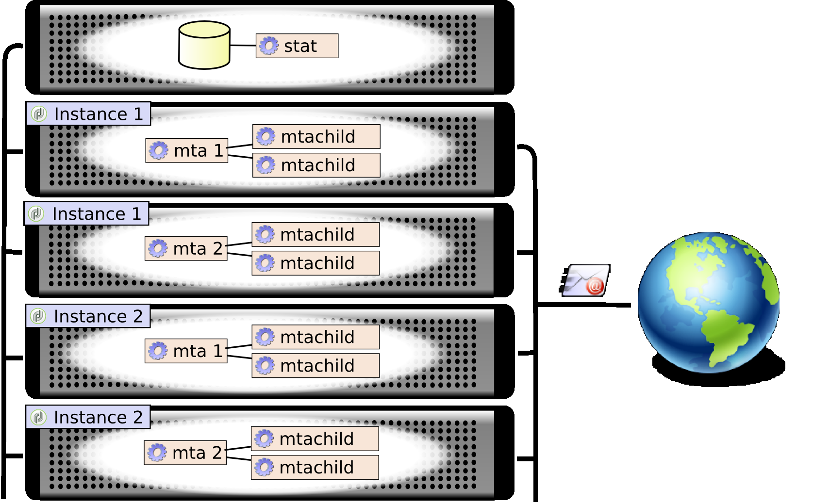

# 技術的な電子メールの設定{#email-deliverability}

## 概要 {#overview}

次の節では、電子メールを配信する際に、Adobe Campaignインスタンスの出力を制御するために必要な設定の概要を説明します。

>[!NOTE]
>
>一部の設定は、アドビがホストするデプロイメントに対してのみアドビが実行できます。例えば、サーバーおよびインスタンスの設定ファイルにアクセスする場合などです。 各デプロイメントの詳細については、「ホスティングモデル [」の節または](../../installation/using/hosting-models.md) 、この記事を参照 [してください](https://helpx.adobe.com/jp/campaign/kb/acc-on-prem-vs-hosted.html)。

配信品質に関する概念とベストプラクティスについて詳しくは、このセクションを参照してく [ださい](../../delivery/using/about-deliverability.md)。

この節では、Adobe Campaignプラットフォームによる電子メールの効率的な送受信に関する技術的な推奨事項をすべて示 [します](../../delivery/using/technical-recommendations.md)。

## 動作の仕組み {#operating-principle}

1つ以上のドメインインスタンスの出力を制御して、Adobe Campaignに応じて送信される電子メールの数を制限することができます。 例えば、 **** yahoo.comアドレスの出力を1時間あたり20,000件に制限し、その他すべてのドメインの場合は1時間あたり100,000件のメッセージを設定できます。

メッセージ出力は、配信サーバー(**mta**)が使用する各IPアドレスに対して制御する必要があります。 複数の **マシン** で分類され、様々なAdobe Campaignインスタンスに属する複数のメタデータは、電子メール配信用に同じIPアドレスを共有できます。これらのIPアドレスの使用を調整するために、プロセスを設定する必要があります。

以下は **stat** モジュールの動作です。一連のIPアドレスに対してメールサーバに送信されるすべての接続要求とメッセージを転送します。 統計サーバは、配信を追跡し、設定されたクォータに基づいて送信を有効または無効にできます。



* 統計サーバ(**stat**)は、構成を読み込むためにAdobe Campaignベースにリンクされる。
* 配信サーバ(**mta**)は、必ずしも自身のインスタンスに属していない統計サーバにUDPを使用して接続します。

### 配信サーバ {#delivery-servers}

mtaモジュ **ールは** 、メッセージをmtachild子モ **ジュールに** 配信します。 各mtchildは **** 、統計サーバーから認証を要求し、送信する前に、メッセージを準備します。

手順は、以下のとおりです。

1. mtaは適 **格な** メッセージを選択し、使用可能なmtachildを割り当 **てます**。
1. mtachildは **** 、メッセージの作成に必要なすべての情報（コンテンツ、パーソナライゼーション要素、添付ファイル、画像など）を読み込みます。メッセージを **Email Traffic Shaperに転送します**。
1. 電子メールトラフィックシェーパーが統計サーバーの認証(**smtp stat**)を受け取るとすぐに、メッセージが受信者に送信されます。


### 電子メールサーバーの統計と制限 {#email-server-statistics-and-limitations}

統計サーバは、メッセージを受信する各電子メールサーバに対して、次の統計情報を保持します。

* 開いているポイントインタイム接続の数、
* 過去1時間に送信されたメッセージの数、
* 成功/拒否された接続の割合、
* 未到達サーバーへの接続率。

同時に、特定の電子メールサーバーの制限リストが読み込まれます。

* 同時接続の最大数、
* 1時間あたりの最大メッセージ数、
* 1回の接続での最大メッセージ数。

### IPアドレスの管理 {#managing-ip-addresses}

統計サーバは、複数のインスタンスまたは同じパブリックIPアドレスを持つ複数のマシンを組み合わせることができます。 したがって、特定のインスタンスにリンクされるわけではありませんが、ドメインごとの制限を回復するために、インスタンスに問い合わせる必要があります。

配信の統計は、各ターゲットMXと各ソースIPに対して保持されます。 例えば、ターゲットドメインのMXが5で、プラットフォームが3つの異なるIPアドレスを使用できる場合、サーバーはこのドメインに対して最大15個の一連のインジケーターを管理できます。

発信元IPアドレスは、パブリックIPアドレス（リモート電子メールサーバーが認識するアドレス）と一致します。 NATルータが指定されている場合、このIPアドレスは、mtaをホストするマシ **ンのアドレス**&#x200B;と異なる可能性があります。 これが、統計サーバがパブリックIP(**publicId**)と一致する識別子を使用する理由です。 ローカルアドレスとこの識別子との関連付けは、 **serverConf.xml設定ファイルで宣言されます** 。 この節では、 **serverConf.xmlで使用できるすべてのパラメー** ターについて [、一覧を示](../../installation/using/the-server-configuration-file.md)します。

## 配信出力制御 {#delivery-output-controlling}

電子メールサーバーにメッセージを配信するために、 **Email Traffic Shaperコンポーネントは** 、統計サーバーからの接続を要求します。 要求が受け入れられると、接続が開きます。

メッセージを送信する前に、モジュールはサーバーから「トークン」を要求します。 一般に、これらは少なくとも10個のトークンのセットで、サーバーへのクエリ数が減ります。

サーバーは、接続と接続に関連するすべての統計を保存します。配信 再起動の場合、情報は一時的に失われます。各クライアントは、送信統計のローカルコピーを保持し、定期的に（2分ごとに）サーバに返します。 その後、サーバーはデータを再集計できます。

次の節では、 **Email Traffic Shaperコンポーネントによるメッセージの処理について説明します** 。

### Message delivery {#message-delivery}

メッセージが送信されると、次の3つの結果が考えられます。

1. **成功**:メッセージが正常に送信されました。 メッセージが更新されます。
1. **Message Failed**:接続したサーバーが、選択したサーバーのメッセージを拒否しました受信者。 この結果は、リターンコード550 ～ 599に一致しますが、例外を定義できます。
1. **セッション失敗** （5.11上方向）:mtaがこのメ **ッセージの回答を受け取ると** 、メッセージは破棄されます(「メッセージの中断」を [参照](#message-abandonment))。 別のパスにメッセージが送信されるか、他のパスが使用できない場合は保留に設定されます( [Message pendingを参照](#message-pending))。

   >[!NOTE]
   >
   >パス **は** 、Adobe Campaignmtaとターゲット **mtaの間の接続** です ****。 Adobe Campaign **IPは** 、複数の開始IPと複数のターゲットドメインIPから選択できます。

### メッセージの中断 {#message-abandonment}

破棄されたメッセージはmtaに返 **され** 、mtachildで管理されなくな **ります**。

mtaは **この** メッセージの手順(回復、中断、強制隔離など)を決定します。応答コードとルールに応じて異なります。

### 保留中のメッセージ {#message-pending}

メッセージは、アクティブなキューに到達し、使用可能なパスがない場合に保留されます。

通常、パスは、接続エラーの後、一定の時間、使用不可とマークされます。 使用できない期間は、エラーの頻度と発生時間によって異なります。

## 統計サーバの設定 {#statistics-server-configuration}

統計サーバは、複数のインスタンスで使用できます。これを使用するインスタンスとは独立して設定する必要があります。

開始を設定します。

### 開始構成 {#start-configuration}

デフォルトでは、 **stat** モジュールは各インスタンスに対して開始されます。 インスタンスが同じマシン上でミュータライズされる場合、またはインスタンスが同じIPアドレスを共有する場合、単一の統計サーバーが使用されます。その他のユーザーは無効にする必要があります。

### サーバーポートの定義 {#definition-of-the-server-port}

デフォルトでは、統計サーバはポート7777をリッスンします。 このポートは、 **serverConf.xmlファイルで変更できます** 。 この節では、 **serverConf.xmlで使用できるすべてのパラメー** ターについて [、一覧を示](../../installation/using/the-server-configuration-file.md)します。

```
<stat port="1234"/>
```

## MX設定 {#mx-configuration}

### MX ルールについて {#about-mx-rules}

MX（Mail eXchanger）ルールは、送信サーバーと受信サーバーの間の通信を管理するルールです。

>[!IMPORTANT]
>
>For hosted or hybrid installations, if you have upgraded to the Enhanced MTA, the **[!UICONTROL MX management]** delivery throughput rules are no longer used. Enhanced MTA は独自の MX ルールを使用します。これにより、独自の E メールレピュテーション履歴および E メールを送信しているドメインから送信されるリアルタイムのフィードバックに基づいて、スループットをドメインごとにカスタマイズすることができます。
>
>Adobe Campaign Enhanced MTA について詳しくは、この[ドキュメント](https://helpx.adobe.com/campaign/kb/acc-campaign-enhanced-mta.html)を参照してください。

これらのルールは、定期的にクライアントインスタンスを提供するために、毎朝6AM（サーバー時間）に自動的に再読み込みされます。

ISP では、機器の容量や社内ポリシーに応じて、1 時間につき、あらかじめ定義された数の接続とメッセージを受け付けます。これらの変数は、IP のレピュテーションや送信ドメインに応じて ISP システムによって自動的に変更される可能性があります。Adobe Campaign では、配信品質プラットフォームを通じて、ISP 別の 150 個以上の専用ルールに加えて、他のドメイン用の 1 つの汎用ルールを管理します。

接続の最大数は、MTA で使用されるパブリック IP アドレスの数だけに依存しているわけではありません。

例えば、MX ルールで許可した接続数が 5 で、設定したパブリック IP の数が 2 の場合、このドメインに対して同時に開かれる接続の数は 10 を超えることはできないと思われるでしょう。しかし、そうではありません。接続の最大数は、実際には、MTA のパブリック IP の 1 つとクライアントの MTA のパブリック IP の組み合わせであるパスを示します。

以下の例では、ユーザーに 2 つのパブリック IP アドレスが設定されており、ドメインは yahoo.com です。

```
user:~ user$ host -t mx yahoo.com
                yahoo.com mail is handled by 1 mta5.am0.yahoodns.net.
                yahoo.com mail is handled by 1 mta6.am0.yahoodns.net.
                yahoo.com mail is handled by 1 mta7.am0.yahoodns.net.
```

yahoo.com の MX レコードを見ると、yahoo.com に 3 つの Mail Exchanger があることがわかります。ピア Mail Exchanger に接続するには、MTA がその IP アドレスを DNS に要求します。

```
user:~ user$ host -t a mta5.am0.yahoodns.net
                mta5.am0.yahoodns.net has address 98.136.216.26
                mta5.am0.yahoodns.net has address 98.136.217.202
                mta5.am0.yahoodns.net has address 98.138.112.38
                mta5.am0.yahoodns.net has address 66.196.118.37
                mta5.am0.yahoodns.net has address 63.250.192.46
                mta5.am0.yahoodns.net has address 66.196.118.240
                mta5.am0.yahoodns.net has address 98.136.217.203
                mta5.am0.yahoodns.net has address 98.138.112.35
```

このレコードの場合、ユーザーは 8 個のピア IP アドレスに接続できます。ユーザーには 2 つのパブリック IP アドレスがあるので、yahoo.com のメールサーバーに到達するのに、8 * 2 = 16 個の組み合わせが存在することになります。これらの組み合わせをそれぞれパスと呼びます。

2 つ目の MX レコードは次のようになります。

```
user:~ user$ host -t a mta6.am0.yahoodns.net
                mta6.am0.yahoodns.net has address 98.138.112.38
                mta6.am0.yahoodns.net has address 98.136.216.26
                mta6.am0.yahoodns.net has address 63.250.192.46
                mta6.am0.yahoodns.net has address 66.196.118.35
                mta6.am0.yahoodns.net has address 98.136.217.203
                mta6.am0.yahoodns.net has address 98.138.112.32
                mta6.am0.yahoodns.net has address 98.138.112.37
                mta6.am0.yahoodns.net has address 66.196.118.33
```

これら 8 個の IP アドレスのうち 4 個は、mta5 で既に使用されています（98.136.216.26、98.138.112.38、63.250.192.46 および 98.136.217.203）。このレコードでは、ユーザーは 4 つの新しい IP アドレスを使用できます。3 つ目の MX レコードも同様です。

全部で、16 個のリモート IP アドレスがあります。2 つのローカルパブリック IP アドレスと組み合わせると、yahoo.com のメールサーバーに到達するのに 32 個のパスがあります。

>[!NOTE]
>
>2 つの MX レコードが同じ IP アドレスを参照している場合は、これらは 2 つのパスではなく 1 つのパスとみなされます。

MXルールの使用例を以下に示します。


以下の例では、特定のドメインに対して 1 時間あたりのメッセージ数の上限が 10,000 件になっていますが、MTA のスループット能力はこの上限を上回っています。

この場合、トラフィックは 1 時間ごとに 5 分間の 12 周期に分割され、メッセージ数の実際の上限は 1 周期につき 833 件になります。

これらのメッセージはできるだけ速く配信されます。


### MX 管理の設定 {#configuring-mx-management}

MXに準拠するルールは、ツリーのノードの **[!UICONTROL MX management]** ドキュメントで **[!UICONTROL Administration > Campaign Management > Non deliverables Management > Mail rule sets]** 定義されます。

ノードに **[!UICONTROL MX management]** ドキュメントが存在しない場合は、手動で作成できます。 手順は次のとおりです。

1. 新しいメールルールのセットを作成します。
1. モードを選択 **[!UICONTROL MX management]** します。

   

1. フィー **ルドに** defaultMXRulesと入力 **[!UICONTROL Internal name]** します。

変更を考慮するには、統計サーバを再起動する必要があります。

統計サーバーを再起動せずに設定を再読み込みするには、サーバーをホストするマシンで次のコマンドを使用します。 `nlserver stat -reload`

>[!NOTE]
>
>このコマンドラインは、**nlserver restart** よりも推奨されます。再起動するまでに収集された統計データが失われることもなく、また、使用時のピークが MX ルールで定義された割り当てに違反するおそれもなくなります。

### MXルールの設定 {#configuring-mx-rules}

この **[!UICONTROL MX management]** ドキュメントリストは、MXルールにリンクされているすべてのドメインを識別します。

次のルールが順に適用されます。mxマスクがターゲットMXと互換性がある最初のルールが適用されます。

各ルールで使用できるパラメーターは次のとおりです。

* **[!UICONTROL MX mask]**:ルールを適用するドメイン。 各ルールはMXのアドレスマスクを定義します。 したがって、このマスクと名前が一致するMXはすべて有効です。 マスクには、「*」と「?」を含めることができます。 汎用文字。

   例えば、次のアドレスを指定します。

   * a.mx.yahoo.com
   * b.mx.yahoo.com
   * c.mx.yahoo.com
   は、次のマスクと互換性があります。

   * *.yahoo.com
   * ?.mx.yahoo.com
   例えば、E メールアドレス foobar@gmail.com の場合、ドメインは gmail.com で、MX レコードは次のようになります。

   ```
   gmail.com mail exchanger = 20 alt2.gmail-smtp-in.l.google.com.
   gmail.com mail exchanger = 10 alt1.gmail-smtp-in.l.google.com.
   gmail.com mail exchanger = 40 alt4.gmail-smtp-in.l.google.com.
   gmail.com mail exchanger = 5  gmail-smtp-in.l.google.com.
   gmail.com mail exchanger = 30 alt3.gmail-smtp-in.l.google.com.
   ```

   In this case the MX rule `*.google.com` will be used. 見てのとおり、MX ルールマスクは、メール内のドメインと必ずしも一致しません。The MX rules applied for gmail.com email addresses will be the ones with the mask `*.google.com`.

* **[!UICONTROL Range of identifiers]**:このオプションを使用すると、ルールを適用する識別子(publicID)の範囲を指定できます。 次の項目を指定できます。

   * 数値：このルールは、このpublicIdにのみ適用されます。
   * 数値の範囲(**数値1 ～数値2**):この2つの数字の間のすべてのpublicIdにルールが適用されます。
   >[!NOTE]
   >
   >フィールドが空の場合、ルールはすべての識別子に適用されます。

   パブリック ID は、1 つまたは複数の MTA で使用されるパブリック IP アドレスの内部識別子です。これらの ID は MTA サーバーの **config-instance.xml** ファイルに定義されます。

   

* **[!UICONTROL Shared]**:このMXルールのプロパティのスコープを定義します。 これをオンにすると、インスタンスで使用可能なすべての IP アドレスですべてのパラメーターが共有されます。オフにすると、MX ルールは IP アドレスごとに定義されます。メッセージの最大数は、使用可能な IP アドレスの数を乗算したものになります。
* **[!UICONTROL Maximum number of connections]**:送信者のドメインへの同時接続の最大数。
* **[!UICONTROL Maximum number of messages]**:接続時に送信できるメッセージの最大数。 メッセージがこの数を超えると、接続が閉じ、新しい接続が開かれます。
* **[!UICONTROL Messages per hour]**:送信者のドメインに1時間で送信できるメッセージの最大数。
* **[!UICONTROL Connection time out]**:ドメインに接続するための時間のしきい値。

   >[!NOTE]
   >
   >このしきい値より前にタ **イムアウト** （Windowsのバージョンによって異なります）が発生する可能性があります。

* **[!UICONTROL Timeout Data]**:メッセージの内容を送信した後の最大待機時間（SMTPプロトコルのDATAセクション）。
* **[!UICONTROL Timeout]**:smtpサーバーとの他の交換の最大待機時間です。
* **[!UICONTROL TLS]**:電子メールプロトコルの暗号化を可能にするTLS配信を選択して有効にできます。 MXマスクごとに、次のオプションを使用できます。

   * **[!UICONTROL Default configuration]**:これは、適用されるserverConf.xml設定ファイルで指定された一般設定です。

      >[!CAUTION]
      >
      >デフォルトの設定は変更しないことをお勧めします。

   * **[!UICONTROL Disabled]** :メッセージは、暗号化されずに体系的に送信されます。
   * **[!UICONTROL Opportunistic]** :メッセージ配信は、受信サーバー(SMTP)がTLSプロトコルを生成できる場合に暗号化されます。

設定の例：


### E メールフォーマット {#managing-email-formats}

送信メッセージの形式を定義して、表示されるコンテンツが各受信者のアドレスのドメインに合わせて自動的に調整されるようにすることができます。

これを行うには、// **[!UICONTROL Management of email formats]** >にある **[!UICONTROL Administration]** ドキュメントに **[!UICONTROL Campaign management]** 移動し **[!UICONTROL Non deliverables management]** ます **[!UICONTROL Mail rule sets]**。

このドキュメントには、リストで管理される日本語形式に対応する定義済みのすべてのドメインのAdobe Campaignが含まれます。 For more information, refer to [this document](../../delivery/using/defining-the-email-content.md#sending-emails-on-japanese-mobiles).


**MIME構造** (Multipurpose Internet Mail Extensions)パラメータを使用すると、異なるメールクライアントに送信するメッセージ構造を定義できます。 次の3つのオプションを使用できます。

* **マルチパート**:メッセージはテキストまたはHTML形式で送信されます。 HTML形式を受け入れない場合でも、メッセージはテキスト形式で表示できます。

   デフォルトでは、マルチパート構造はマルチパ **ート/代替構造ですが**、メッセージに画像が追加されると、自動的にマル **チパート** /関連構造になります。 一部のプロバイダーでは、デフォ **ルトでマルチパート** /関連の形式が想定されていますが **[!UICONTROL Force multipart/related]** 、画像が添付されていない場合でも、この形式が適用される場合があります。

* **HTML**:HTMLのみのメッセージが送信されます。 HTML形式が受け入れられない場合、メッセージは表示されません。
* **テキスト**:テキストのみの形式のメッセージが送信されます。 テキスト形式のメッセージの利点は、非常に小さいサイズです。

このオプシ **[!UICONTROL Image inclusion]** ョンを有効にすると、電子メールの本文に直接表示されます。 その後、画像がアップロードされ、URLリンクがそのコンテンツで置き換えられます。

このオプションは、特に日本の市場ではDeco-mail、Decore Mail **、** Decoration **Mail** の場合に使用 **されます**。 詳しくは、このドキュメントを参照し [てくださ](../../delivery/using/defining-the-email-content.md#sending-emails-on-japanese-mobiles)い。

>[!CAUTION]
>
>電子メールに画像を挿入すると、サイズが大幅に大きくなります。

## 配信サーバーの設定 {#delivery-server-configuration}

### クロック同期 {#clock-synchronization}

Adobe Campaignプラットフォーム（データベースを含む）を構成するすべてのサーバーのクロックを同期し、同じタイムゾーンに設定する必要があります。

### 統計サーバの座標 {#coordinates-of-the-statistics-server}

統計サーバのアドレスをmtaで指定する必要があ **ります**。

設定 **のmta** 要素の **** statServerAddressプロパティを使用すると、使用するポートのアドレスと番号を指定できます。

```
<mta statServerAddress="emailStatServer:7777">
   [...]
 </mta>
```

同じマシン上で統計サーバーを使用するには、少なくとも **localhostの値を持つマシンの名前を入力する必要があります** 。

```
 <mta statServerAddress="localhost">
```

>[!CAUTION]
>
>このフィールドに値が入力されない場合、 **mtaは** 開始しません。

### 使用するIPアドレスのリスト {#list-of-ip-addresses-to-use}

トラフィック管理に関する設定は、設定フ **ァイルのmta** /child/smtp要素内にあります。

各 **IPAffinity** 要素に対して、マシンに使用できるIPアドレスを宣言する必要があります。

例：

```
<IPAffinity localDomain="<domain>" name="default">
  <IP address="192.168.0.11" publicId="1" weight="5"/>
  <IP address="192.168.0.12" heloHost="revdns1.campaign.com" publicId="2" weight="5"/>
  <IP address="192.168.0.13" publicId="3" weight="1"/>
</IPAffinity>
```

パラメータは次のとおりです。

* **住所**:使用するMTAホストマシンのIPアドレス。
* **heloHost**:この識別子は、SMTPサーバーで表示されるIPアドレスを表します。

* **publicId**:この情報は、NATルータの背後で複数のAdobe CampaignmtaがIPアドレスを **共有する** 場合に役立ちます。 統計サーバは、この識別子を用いて、この起点とターゲットサーバとの間の接続と送信の統計を記憶する。
* **重み付け**:アドレスの相対的な使用頻度を定義できます。 デフォルトでは、すべてのアドレスの重み付けは1です。

>[!NOTE]
>
>serverConf.xmlファイルで、1つのIPが一意の識別子(public_id)を持つ単一のhelohostに対応していることを確認する必要があります。 複数のHeloHostにマッピングできないため、配信の調整の問題が発生する可能性がある。

前の例では、通常の条件で、アドレスは次のように配布されます。

    * &quot;1&quot;: 5 / (5+5+1) = 45%
    * &quot;2&quot;: 5 / (5+5+1) = 45%
    * &quot;3&quot;: 1 / (5+5+1) = 10%

例えば、最初のアドレスを特定のMXに対して使用できない場合、次のようなメッセージが送信されます。

    * &quot;2&quot;: 5 / (5+1) = 83%
    * &quot;3&quot;: 1 / (5+1) = 17%

* **includeDomains**:このIPアドレスを、特定のドメインに属する電子メールに対して予約できます。 これは、1つ以上のワイルドカード(&#39;*&#39;)を含むマスクのリストです。 属性を指定しない場合、すべてのドメインでこのIPアドレスを使用できます。

   例： **includeDomains=&quot;wanadoo.com,orange.com,yahoo.*&quot;**

* **excludeDomains**:このIPアドレスのリストのドメインを除外します。 このフィルターは、includeDomainsフィルターの後 **に適用され** ます。

   

## 電子メール送信の最適化 {#email-sending-optimization}

Adobe Campaignmtaの内部アーキテクチャは **** 、電子メールの配信を最適化するための設定に影響を与えます。 以下に、配信の改善に関するヒントを示します。

### maxWaitingMessagesパラメーターの調整 {#adjust-the-maxwaitingmessages-parameter}

maxWaitingMessagesパラメ **ータは** 、一致子によって事前に準備されたメッセージの最大数を示 **します**。 メッセージは、送信または破棄されたリストからのみ削除されます。

メッセージがドメインで並べ替えられていない場合、このパラメーターは非常に重要で、特に重要です。

maxWorkingSetMb **** (256)のしきい値に達すると、配信サーバはメッセージの送信を停止します。 mtachildのパフォーマンスが再び上がるまで、パフ **ォーマンスは** 開始が大幅に低下します。 この問題を回避するには、 **maxWorkingSetMbパラメータのしきい値を増やすか** 、maxWaitingMessagesパラメータのしきい値を減らし **ます** 。

maxWorkingSetMbパ **ラメータは** 、メッセージの最大数に平均メッセージサイズを乗算し、結果に2.5を乗じて経験的に計算されます。例えば、メッセージの平均サイズが50 KBで、 **maxWaitingMessagesパラメーターが** 1,000の場合、使用メモリは平均125 MBになります。

### mtachildの数を調整する {#adjust-the-number-of-mtachild}

子の数が、コンピューターのプロセッサーの数を超えてはなりません(約1,000セッション)。 8個を超えないようお勧め **します**。 その後、十分な寿命を達成するために **** 、子(**maxMsgPerChild**)あたりのメッセージ数を増やすことができます。
