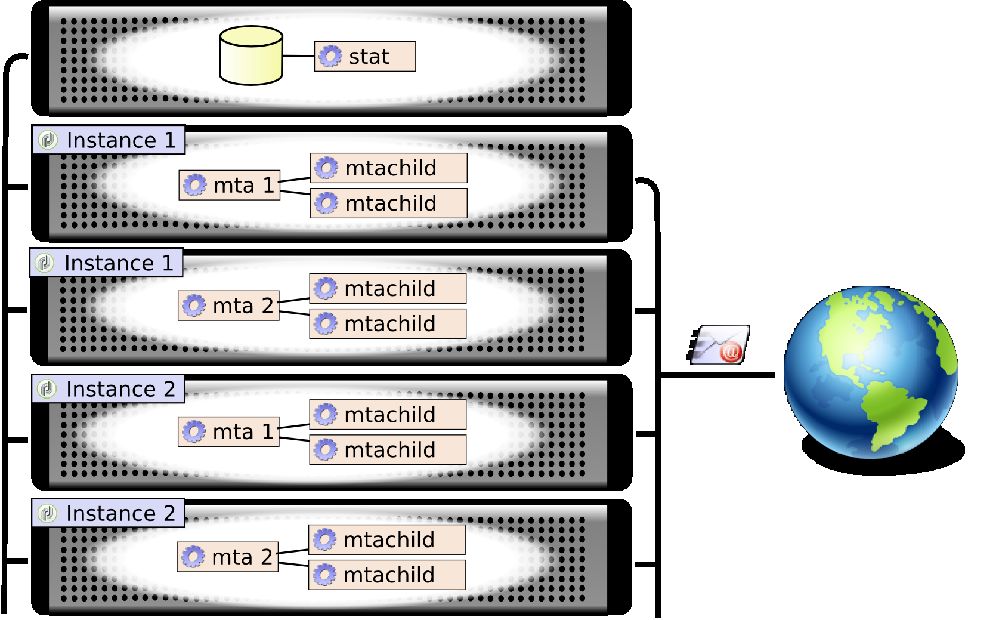
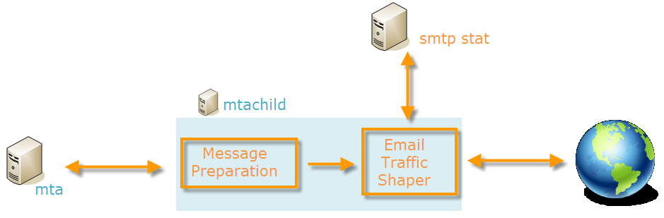
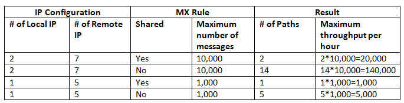
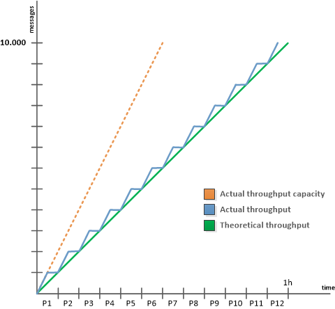
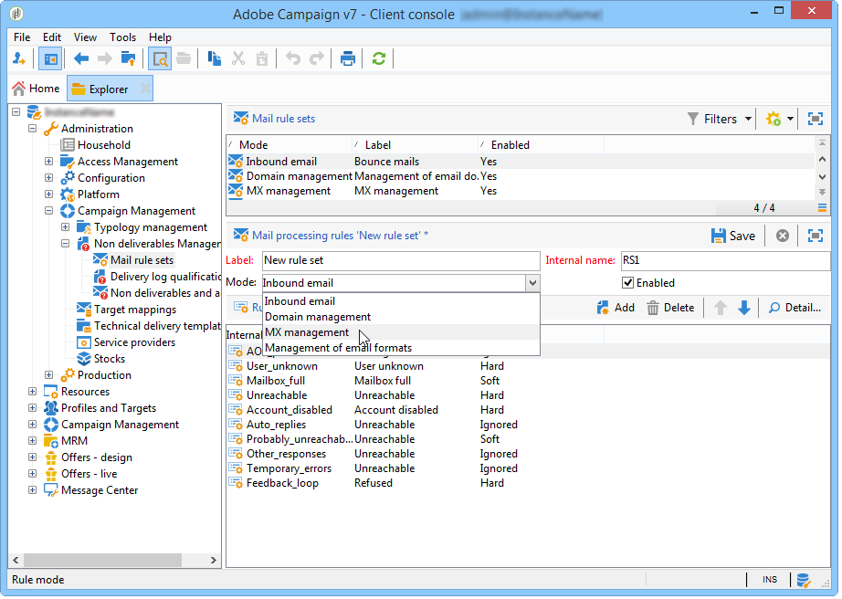
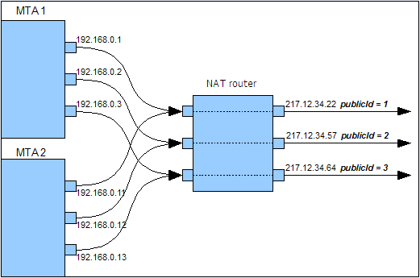
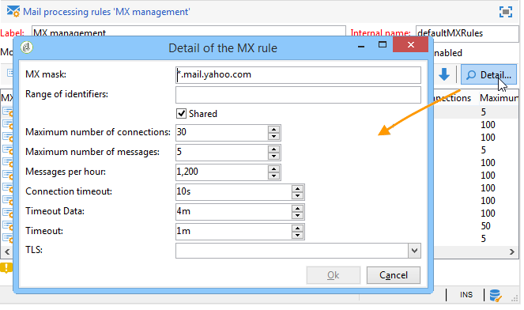
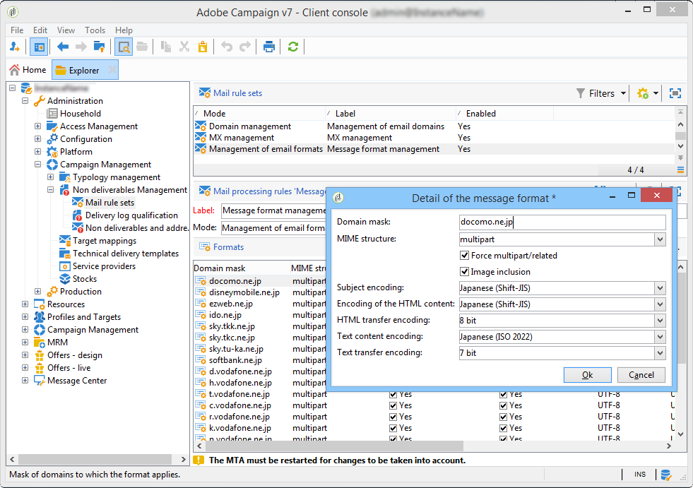

# 技術的なメール設定{#email-deliverability}


## 概要 {#overview}

次の節では、メールを配信する際にAdobe Campaign インスタンスの出力を制御するために必要な設定の概要を示します。

>[!NOTE]
>
>一部の設定は、Adobeがホストするデプロイメントに対してのみAdobeで実行できます。例えば、サーバーとインスタンスの設定ファイルにアクセスできます。 様々なデプロイメントについて詳しくは、[ ホスティングモデル ](../../installation/using/hosting-models.md) セクションまたは[このページ ](../../installation/using/capability-matrix.md)を参照してください。

Adobe Campaignでの配信品質に関する概念とベストプラクティスについて詳しくは、この[ セクション ](../../delivery/using/about-deliverability.md)を参照してください。

Adobe プラットフォームによる電子メールの効率的な送受信に関するすべての技術的な推奨事項など、配信品質について詳しくは、[Adobe配信品質のベストプラクティスガイド ](https://experienceleague.adobe.com/docs/deliverability-learn/deliverability-best-practice-guide/introduction.html?lang=ja)を参照してください。

## 動作の原則 {#operating-principle}

1つまたは複数のAdobe Campaign インスタンスの出力を制御して、ドメインに応じて送信されるメールの数を制限することができます。 例えば、**yahoo.com** アドレスの出力を1時間あたり20,000件に制限し、その他のすべてのドメインに対して1時間あたり100,000件のメッセージを設定できます。

配信サーバー（**mta**）で使用される各IP アドレスに対して、メッセージ出力を制御する必要があります。 複数のマシンで分割され、様々なAdobe Campaign インスタンスに属する複数の&#x200B;**mta**&#x200B;は、メール配信に同じIP アドレスを共有できます。これらのIP アドレスの使用を調整するには、プロセスを設定する必要があります。

これは、**stat** モジュールが実行する処理です。すべての接続要求とメッセージが、IP アドレスのセットに対してメールサーバーに送信されます。 統計サーバーは配信を追跡し、設定されたクォータに基づいて送信を有効または無効にできます。



* 統計サーバー（**stat**）は、設定を読み込むためにAdobe Campaign ベースにリンクされています。
* 配信サーバー（**mta**）は、UDPを使用して、必ずしも自分のインスタンスに属しているとは限らない統計サーバーに連絡します。

### 配信サーバー {#delivery-servers}

**mta** モジュールは、メッセージを&#x200B;**mtachild**&#x200B;子モジュールに配布します。 各&#x200B;**mtachild**&#x200B;は、統計サーバーに認証を要求して送信する前に、メッセージを準備します。

手順は、以下のとおりです。

1. **mta**&#x200B;は、対象となるメッセージを選択し、使用可能な&#x200B;**mtachild**&#x200B;を割り当てます。
1. **mtachild**&#x200B;は、メッセージの作成に必要なすべての情報（コンテンツ、パーソナライゼーション要素、添付、画像など）を読み込みます メッセージを&#x200B;**電子メールトラフィックシェーパー**&#x200B;に転送します。
1. メールトラフィックシェーパーが統計サーバーの認証（**smtp stat**）を受信するとすぐに、メッセージが受信者に送信されます。



### メールサーバーの統計と制限 {#email-server-statistics-and-limitations}

統計サーバーは、メッセージを受信するメールサーバーごとに次の統計を保持します。

* 開いているポイント・イン・タイム接続の数
* 過去1時間に送信されたメッセージの数，
* 接続の成功/拒否の割合，
* 到達できないサーバーへの接続の割合。

同時に、モジュールは特定のメールサーバーの制限のリストを読み込みます。

* 同時接続の最大数，
* 1時間あたりのメッセージの最大数，
* 接続あたりのメッセージの最大数。

### IP アドレスの管理 {#managing-ip-addresses}

統計サーバーは、同じパブリック IP アドレスを持つ複数のインスタンスまたは複数のマシンを組み合わせることができます。 したがって、特定のインスタンスにはリンクされていませんが、ドメインごとの制限を回復するには、インスタンスに連絡する必要があります。

配信統計は、各ターゲット MXおよび各ソース IPに対して保持されます。 例えば、ターゲットドメインに5 MXがあり、プラットフォームが3つの異なるIP アドレスを使用できる場合、サーバーはこのドメインに対して最大15個の一連の指標を管理できます。

ソース IP アドレスは、パブリック IP アドレス、つまりリモート メール サーバーで表示されるアドレスと一致します。 このIP アドレスは、NAT ルーターが提供されている場合、**mta**&#x200B;をホストするマシンのアドレスとは異なる可能性があります。 そのため、統計サーバーはパブリック IP （**publicId**）に一致する識別子を使用します。 ローカルアドレスとこの識別子との関連付けは、**serverConf.xml**&#x200B;設定ファイルで宣言されます。 **serverConf.xml**&#x200B;で使用可能なすべてのパラメーターは、この[ セクション ](../../installation/using/the-server-configuration-file.md)に一覧表示されます。

## 配信の出力制御 {#delivery-output-controlling}

メールサーバーにメッセージを配信するには、**電子メールトラフィックシェーパー** コンポーネントが統計サーバーからの接続を要求します。 リクエストが受け入れられると、接続が開きます。

メッセージを送信する前に、モジュールはサーバーに「トークン」をリクエストします。 これらは通常、少なくとも10 トークンのセットであり、サーバーへのクエリ数を減らします。

サーバーは、接続と配信に関連するすべての統計情報を保存します。 再起動の場合、情報は一時的に失われます。各クライアントは、送信統計のローカルコピーを保持し、定期的に（2分ごとに）サーバーに返します。 その後、サーバーはデータを再集計する場合があります。

次の節では、**Email Traffic Shaper** コンポーネントによるメッセージの処理について説明します。

### メッセージ配信 {#message-delivery}

メッセージが送信されると、次の3つの結果が得られます。

1. **成功**: メッセージは正常に送信されました。 メッセージが更新されます。
1. **メッセージが失敗しました**：選択した受信者のメッセージが接続サーバーによって拒否されました。 この結果は、リターンコード 550から599に一致しますが、例外を定義できます。
1. **セッションが失敗しました** （5.11以降）:**mta**&#x200B;がこのメッセージに対する回答を受信した場合、メッセージは破棄されます（[ メッセージ放棄](#message-abandonment)を参照）。 メッセージは別のパスに送信されるか、他のパスがない場合は保留中に設定されます（[ メッセージ保留中](#message-pending)を参照）。

   >[!NOTE]
   >
   >**パス**&#x200B;は、Adobe Campaign **mta**&#x200B;とターゲット **mta**&#x200B;の間の接続です。 Adobe Campaign **mta**&#x200B;は、複数の開始IPと複数のターゲットドメイン IPから選択できます。

### メッセージの放棄 {#message-abandonment}

放棄されたメッセージは&#x200B;**mta**&#x200B;に返され、**mtachild**&#x200B;によって管理されなくなります。

**mta**&#x200B;は、このメッセージの手順（回復、放棄、強制隔離など）を決定します。 応答コードとルールによって異なります。

### メッセージ保留中 {#message-pending}

アクティブなキューに到着し、使用可能なパスがない場合、メッセージは保留中です。

一般的に、接続エラーの後の一定期間は、パスを利用できないようにマークします。 利用不能期間は、エラーの頻度と年齢によって異なります。

## 統計サーバー設定 {#statistics-server-configuration}

統計サーバーは、複数のインスタンスで使用できます。そのインスタンスを使用するインスタンスとは別に設定する必要があります。

まず、設定をホストするAdobe Campaign データベースを定義します。

### 設定を開始 {#start-configuration}

デフォルトでは、各インスタンスに対して&#x200B;**stat** モジュールが開始されます。 インスタンスが同じマシン上にプールされている場合、またはインスタンスが同じIP アドレスを共有している場合、1つの統計サーバーが使用されます。他のサーバーは無効にする必要があります。

### サーバーポートの定義 {#definition-of-the-server-port}

デフォルトでは、統計サーバーはポート 7777でリッスンします。 このポートは、**serverConf.xml** ファイルで変更できます。 **serverConf.xml**&#x200B;で使用可能なすべてのパラメーターは、この[ セクション ](../../installation/using/the-server-configuration-file.md)に一覧表示されます。

```
<stat port="1234"/>
```

## MX設定 {#mx-configuration}

>[!IMPORTANT]
>
>ホストインストールまたはハイブリッドインストールで [Enhanced MTA](../../delivery/using/sending-with-enhanced-mta.md) にアップグレードした場合、**[!UICONTROL MX 管理]**&#x200B;配信スループットは使用されなくなります。 Enhanced MTA は独自の MX ルールを使用します。これにより、独自のメールレピュテーション履歴およびメールを送信しているドメインから送信されるリアルタイムのフィードバックに基づいて、スループットをドメインごとにカスタマイズすることができます。

### MX ルールについて {#about-mx-rules}

>[!NOTE]
>
>この節と以下の節は、従来のCampaign MTAを使用したオンプレミスインストールとホスト/ハイブリッドインストールにのみ適用されます。

MX（Mail eXchanger）ルールは、送信サーバーと受信サーバーの間の通信を管理するルールです。

これらのルールは、クライアントインスタンスに定期的に供給するために、毎朝6時（サーバー時間）に自動的にリロードされます。

マテリアル容量と内部ポリシーに応じて、ISPは1時間あたり事前定義された数の接続とメッセージを受け入れます。 これらの変数は、IPおよび送信ドメインのレピュテーションに応じて、ISP システムによって自動的に変更される場合があります。 Adobe Campaign では、配信品質プラットフォームを通じて、ISP 別の 150 個以上の専用ルールに加えて、他のドメイン用の 1 つの汎用ルールを管理します。

接続の最大数は、MTA で使用されるパブリック IP アドレスの数だけに依存しているわけではありません。

例えば、MX ルールで5つの接続を許可し、2つのパブリック IPを設定している場合、このドメインに対して同時に10を超える接続を開くことはできません。 しかし、そうではありません。接続の最大数は、実際には、MTA のパブリック IP の 1 つとクライアントの MTA のパブリック IP の組み合わせであるパスを示します。

以下の例では、ユーザーに 2 つのパブリック IP アドレスが設定されており、ドメインは yahoo.com です。

```
user:~ user$ host -t mx yahoo.com
                yahoo.com mail is handled by 1 mta5.am0.yahoodns.net.
                yahoo.com mail is handled by 1 mta6.am0.yahoodns.net.
                yahoo.com mail is handled by 1 mta7.am0.yahoodns.net.
```

yahoo.comのMX レコードは、yahoo.comに3つのMail Exchangersがあることを教えてくれます。 ピア Mail Exchanger に接続するには、MTA がその IP アドレスを DNS に要求します。

```
user:~ user$ host -t a mta5.am0.yahoodns.net
                mta5.am0.yahoodns.net has address 98.136.216.26
                mta5.am0.yahoodns.net has address 98.136.217.202
                mta5.am0.yahoodns.net has address 98.138.112.38
                mta5.am0.yahoodns.net has address 66.196.118.37
                mta5.am0.yahoodns.net has address 63.250.192.46
                mta5.am0.yahoodns.net has address 66.196.118.240
                mta5.am0.yahoodns.net has address 98.136.217.203
                mta5.am0.yahoodns.net has address 98.138.112.35
```

このレコードの場合、ユーザーは8つのピア IP アドレスに問い合わせることができます。 ユーザーは2つのパブリック IP アドレスを持っているので、これにより、8 * 2 = 16の組み合わせでyahoo.com メールサーバーにアクセスできます。 それぞれの組み合わせはパスと呼ばれます。

2 つ目の MX レコードは次のようになります。

```
user:~ user$ host -t a mta6.am0.yahoodns.net
                mta6.am0.yahoodns.net has address 98.138.112.38
                mta6.am0.yahoodns.net has address 98.136.216.26
                mta6.am0.yahoodns.net has address 63.250.192.46
                mta6.am0.yahoodns.net has address 66.196.118.35
                mta6.am0.yahoodns.net has address 98.136.217.203
                mta6.am0.yahoodns.net has address 98.138.112.32
                mta6.am0.yahoodns.net has address 98.138.112.37
                mta6.am0.yahoodns.net has address 66.196.118.33
```

これらの8つのIP アドレスのうち4つは、既にmta5で使用されています（98.136.216.26、98.138.112.38、63.250.192.46、98.136.217.203）。 このレコードでは、ユーザーは4つの新しいIP アドレスを使用できます。 3 つ目の MX レコードも同様です。

合計で、16個のリモート IP アドレスがあります。 2 つのローカルパブリック IP アドレスと組み合わせると、yahoo.com のメールサーバーに到達するのに 32 個のパスがあります。

>[!NOTE]
>
>2 つの MX レコードが同じ IP アドレスを参照している場合は、これらは 2 つのパスではなく 1 つのパスとみなされます。

MX ルールの使用例を次に示します。



以下の例では、特定のドメインに対して 1 時間あたりのメッセージ数の上限が 10,000 件になっていますが、MTA のスループット能力はこの上限を上回っています。

この場合、トラフィックは 1 時間ごとに 5 分間の 12 周期に分割され、メッセージ数の実際の上限は 1 周期につき 833 件になります。

これらのメッセージはできるだけ速く配信されます。



### MX 管理の設定 {#configuring-mx-management}

MXに対して準拠するルールは、ツリーの&#x200B;**[!UICONTROL 管理/ キャンペーン管理/非成果物の管理/ メールルールセット]** ノードの&#x200B;**[!UICONTROL MX管理]** ドキュメントで定義されています。

ノードに&#x200B;**[!UICONTROL MX管理]** ドキュメントが存在しない場合は、手動で作成できます。 手順は次のとおりです。

1. 新しいメールルールのセットを作成します。
1. **[!UICONTROL MX管理]** モードを選択します。

   

1. **[!UICONTROL 内部名]** フィールドに&#x200B;**defaultMXRules**&#x200B;と入力します。

変更を考慮に入れるには、統計サーバーを再起動する必要があります。

統計サーバーを再起動せずに構成を再読み込みするには、サーバーをホストするコンピューターで次のコマンドを使用します：`nlserver stat -reload`

>[!NOTE]
>
>このコマンドラインは、**nlserver restart**&#x200B;よりも優先されます。 再起動するまでに収集された統計データが失われることもなく、また、使用時のピークが MX ルールで定義された割り当てに違反するおそれもなくなります。

### MX ルールの設定 {#configuring-mx-rules}

**[!UICONTROL MX管理]** ドキュメントには、MX ルールにリンクされているすべてのドメインが一覧表示されます。

これらのルールは順番に適用されます。MX マスクがターゲット MXと互換性のある最初のルールが適用されます。

各ルールで使用できる次のパラメーターは次のとおりです。

* **[!UICONTROL MX マスク]**：ルールが適用されるドメイン。 各ルールは、MXのアドレスマスクを定義します。 したがって、このマスクに一致する名前のMXは適格です。 マスクには「&#42;」と「?」を含めることができます 汎用文字。

  例えば、次のアドレスを指定します。

   * a.mx.yahoo.com
   * b.mx.yahoo.com
   * c.mx.yahoo.com

  は、次のマスクと互換性があります。

   * &#42;.yahoo.com
   * ?.mx.yahoo.com

  例えば、E メールアドレス foobar@gmail.com の場合、ドメインは gmail.com で、MX レコードは次のようになります。

  ```
  gmail.com mail exchanger = 20 alt2.gmail-smtp-in.l.google.com.
  gmail.com mail exchanger = 10 alt1.gmail-smtp-in.l.google.com.
  gmail.com mail exchanger = 40 alt4.gmail-smtp-in.l.google.com.
  gmail.com mail exchanger = 5  gmail-smtp-in.l.google.com.
  gmail.com mail exchanger = 30 alt3.gmail-smtp-in.l.google.com.
  ```

  この場合、MX ルール `*.google.com`が使用されます。 ご覧のとおり、MX ルールマスクはメール内のドメインと必ずしも一致しません。 gmail.com電子メールアドレスに適用されるMX ルールは、マスク `*.google.com`を持つルールになります。

* **[!UICONTROL 識別子の範囲]**：このオプションを使用すると、ルールが適用される識別子（publicID）の範囲を指定できます。 次を指定できます。

   * 番号：このルールはこのpublicIdにのみ適用されます。
   * 数字の範囲（**number1-number2**）：このルールは、これら2つの数字の間のすべてのpublicIdに適用されます。

  >[!NOTE]
  >
  >フィールドが空の場合、ルールはすべての識別子に適用されます。

  パブリック IDは、1つまたは複数のMTAで使用されるパブリック IPの内部識別子です。 これらの ID は MTA サーバーの **config-instance.xml** ファイルに定義されます。

  

* **[!UICONTROL Shared]**：このMX ルールのプロパティの範囲を定義します。 オンにすると、インスタンスで使用可能なすべてのIPですべてのパラメーターが共有されます。 オフにすると、各IPに対してMX ルールが定義されます。 メッセージの最大数は、使用可能な IP アドレスの数を乗算したものになります。
* **[!UICONTROL 最大接続数]**：送信者のドメインに対する同時接続の最大数。
* **[!UICONTROL メッセージの最大数]**：接続で送信できるメッセージの最大数。 メッセージがこの数を超えると、接続が閉じられ、新しい接続が開きます。
* **[!UICONTROL 1時間あたりのメッセージ]**：送信者のドメインに1時間で送信できるメッセージの最大数。
* **[!UICONTROL 接続タイムアウト]**: ドメインに接続するための時間のしきい値。

  >[!NOTE]
  >
  >Windowsでは、Windowsのバージョンに応じて、このしきい値の前に&#x200B;**タイムアウト**&#x200B;を発行できます。

* **[!UICONTROL タイムアウトデータ]**：メッセージコンテンツの送信後の最大待機時間（SMTP プロトコルのDATA セクション）。
* **[!UICONTROL タイムアウト]**: SMTP サーバーとの他の交換の最大待機時間です。
* **[!UICONTROL TLS]**: メール配信を暗号化できるTLS プロトコルを選択して有効にできます。 MX マスクごとに、次のオプションを使用できます。

   * **[!UICONTROL デフォルト設定]**：これは、適用されるserverConf.xml設定ファイルで指定される一般的な設定です。

     >[!IMPORTANT]
     >
     >デフォルト設定を変更することはお勧めしません。

   * **[!UICONTROL 無効]**：メッセージは暗号化なしで体系的に送信されます。
   * **[!UICONTROL 商談]**：受信サーバー（SMTP）がTLS プロトコルを生成できる場合、メッセージ配信は暗号化されます。

設定例：



>[!NOTE]
>
>Adobe CampaignでのMX サーバーの使用について詳しくは、[この節](../../installation/using/using-mx-servers.md)を参照してください。

### メール形式の管理 {#managing-email-formats}

送信メッセージの形式を定義すると、表示されるコンテンツが各受信者のアドレスのドメインに応じて自動的に適応します。

これを行うには、**[!UICONTROL 管理]** > **[!UICONTROL キャンペーン管理]** > **[!UICONTROL 配信不能管理]** > **[!UICONTROL メールルールセット]**&#x200B;にある&#x200B;**[!UICONTROL 電子メール形式の管理]**&#x200B;文書に移動します。

このドキュメントには、Adobe Campaignが管理する日本語形式に対応する、事前定義済みのすべてのドメインのリストが含まれています。 詳しくは、[Campaign v8 ドキュメント](https://experienceleague.adobe.com/docs/campaign/campaign-v8/send/emails/sending-emails-on-japanese-mobiles.html?lang=ja){target="_blank"}を参照してください。



**MIME構造** （多目的インターネットメール拡張機能）パラメーターを使用すると、異なるメールクライアントに送信されるメッセージ構造を定義できます。 次の 3 つのオプションを使用できます。

* **マルチパート**: メッセージはテキスト形式またはHTML形式で送信されます。 HTML形式が受け入れられない場合でも、メッセージはテキスト形式で表示できます。

  デフォルトでは、マルチパート構造は&#x200B;**マルチパート/オルタナティブ**&#x200B;ですが、画像がメッセージに追加されると、自動的に&#x200B;**マルチパート/関連**&#x200B;になります。 一部のプロバイダーは、デフォルトで&#x200B;**マルチパート/関連**&#x200B;形式を想定しています。**[!UICONTROL マルチパート/関連]**&#x200B;を強制オプションでは、画像が添付されていなくても、この形式が適用されます。

* **HTML**: HTMLのみのメッセージが送信されます。 HTMLのフォーマットが受け付けられない場合、メッセージは表示されません。
* **テキスト**: テキストのみの形式のメッセージが送信されます。 テキストフォーマットメッセージの利点は、それらの非常に小さいサイズです。

「**[!UICONTROL 画像を含める]**」オプションが有効になっている場合、これらはメールの本文に直接表示されます。 その後、画像がアップロードされ、URL リンクがコンテンツに置き換えられます。

このオプションは、**Deco-mail**、**Decore Mail**&#x200B;または&#x200B;**Decoration Mail**&#x200B;の日本市場で特に使用されます。 詳しくは、[Campaign v8 ドキュメント ](https://experienceleague.adobe.com/docs/campaign/campaign-v8/send/emails/sending-emails-on-japanese-mobiles.html?lang=ja){target="_blank"}を参照してください。

>[!IMPORTANT]
>
>メールに画像を挿入すると、サイズが大幅に大きくなります。

## 配信サーバー設定 {#delivery-server-configuration}

### クロック同期 {#clock-synchronization}

Adobe Campaign プラットフォーム（データベースを含む）を構成するすべてのサーバーのクロックを同期し、それらのシステムを同じタイムゾーンに設定する必要があります。

### 統計サーバーの座標 {#coordinates-of-the-statistics-server}

統計サーバーのアドレスは、**mta**&#x200B;で指定する必要があります。

設定の&#x200B;**mta**&#x200B;要素の&#x200B;**statServerAddress** プロパティを使用すると、使用するポートのアドレスと番号を指定できます。

```
<mta statServerAddress="emailStatServer:7777">
   [...]
 </mta>
```

同じマシンで統計サーバーを使用するには、少なくとも&#x200B;**localhost**&#x200B;値を持つマシンの名前を入力する必要があります。

```
 <mta statServerAddress="localhost">
```

>[!IMPORTANT]
>
>このフィールドが入力されていない場合、**mta**&#x200B;は開始されません。

### 使用するIP アドレスのリスト {#list-of-ip-addresses-to-use}

トラフィック管理に関する設定は、設定ファイルの&#x200B;**mta/child/smtp**&#x200B;要素にあります。

**IPAffinity**&#x200B;要素ごとに、マシンに使用できるIP アドレスを宣言する必要があります。

例：

```
<IPAffinity localDomain="<domain>" name="default">
  <IP address="192.168.0.11" publicId="1" weight="5"/>
  <IP address="192.168.0.12" heloHost="revdns1.campaign.com" publicId="2" weight="5"/>
  <IP address="192.168.0.13" publicId="3" weight="1"/>
</IPAffinity>
```

パラメーターは次のとおりです。

* **address**：これは、使用するMTA ホストマシンのIP アドレスです。
* **heloHost**：この識別子は、SMTP サーバーで表示されるIP アドレスを表します。

* **publicId**：この情報は、NAT ルーターの背後にある複数のAdobe Campaign **mtas**&#x200B;によってIP アドレスが共有されている場合に役立ちます。 統計サーバーは、この識別子を使用して、この開始点とターゲットサーバー間の接続と送信の統計を記憶します。
* **weight**: アドレスの相対的な使用頻度を定義できます。 デフォルトでは、すべてのアドレスの重みは1に等しくなります。

>[!NOTE]
>
>serverConf.xml ファイルでは、1つのIPが一意の識別子（public_id）を持つ単一のhelohostに対応していることを確認する必要があります。 複数のhelohostにマッピングできないため、配信のスロットリングの問題が発生する可能性があります。

前の例では、通常の条件では、アドレスは次のように分配されます。

* &quot;1&quot;: 5 / (5+5+1) = 45%
* &quot;2&quot;: 5 / (5+5+1) = 45%
* &quot;3&quot;: 1 / (5+5+1) = 10%

例えば、最初のアドレスを特定のMXに使用できない場合、メッセージは次のように送信されます。

* &quot;2&quot;: 5 / (5+1) = 83%
* &quot;3&quot;: 1 / (5+1) = 17%

* **includeDomains**：特定のドメインに属する電子メール用にこのIP アドレスを予約できます。 これは、1つ以上のワイルドカード （&#39;&#42;&#39;）を含めることができるマスクのリストです。 属性が指定されていない場合は、すべてのドメインがこのIP アドレスを使用できます。

  例：**includeDomains=&quot;wanadoo.com,orange.com,yahoo.&#42;&quot;**

* **excludeDomains**：このIP アドレスのドメインのリストを除外します。 このフィルターは、**includeDomains** フィルターの後に適用されます。

  

## メール送信の最適化 {#email-sending-optimization}

Adobe Campaign **mta**&#x200B;の内部アーキテクチャは、メール配信を最適化するための設定に影響を与えます。 ここでは、電子メールの配信品質を向上させるためのヒントをいくつか紹介します。

### maxWaitingMessages パラメーターの調整 {#adjust-the-maxwaitingmessages-parameter}

**maxWaitingMessages** パラメーターは、**mtachild**&#x200B;が事前に準備したメッセージの数が最も多いことを示します。 メッセージは、送信または放棄された場合にのみ、このリストから削除されます。

メッセージがドメイン別に並べ替えられない場合、このパラメーターは非常に重要であり、特に重要です。

**maxWorkingSetMb** （256）のしきい値に達すると、配信サーバーはメッセージの送信を停止します。 **mtachild**&#x200B;が再び起動するまで、パフォーマンスは大幅に低下します。 この問題を回避するには、**maxWorkingSetMb** パラメーターのしきい値を増やすか、**maxWaitingMessages** パラメーターのしきい値を減らします。

**maxWorkingSetMb** パラメーターは、最大数のメッセージに平均メッセージサイズを掛け、結果に2.5を掛けることで経験的に計算されます。 例えば、メッセージの平均サイズが50 kBで、**maxWaitingMessages** パラメーターが1,000に等しい場合、使用されるメモリは平均125 MBになります。

### マチャイルドの数を調整 {#adjust-the-number-of-mtachild}

子の数は、マシン内のプロセッサの数（約）を超えてはなりません。 1,000 セッション）。 8 **mtachild**&#x200B;を超えないことをお勧めします。 次に、**child** （**maxMsgPerChild**）ごとにメッセージ数を増やして、十分な寿命を確保できます。
