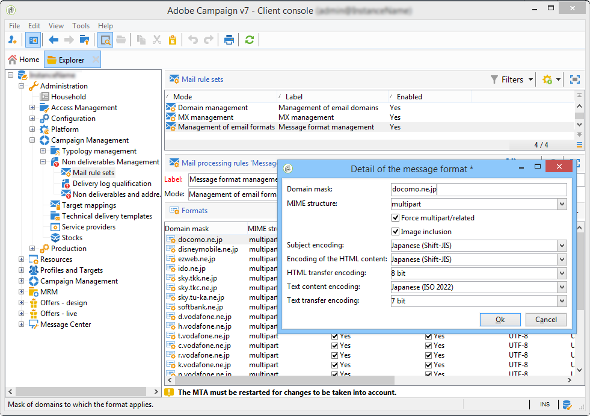

# 技術的なメール設定{#email-deliverability}


## 概要 {#overview}

次の節では、メール配信時のAdobe Campaign インスタンスの出力を制御するために必要な設定の概要について説明します。

>[!NOTE]
>
>サーバーやインスタンスの設定ファイルにアクセスする場合など、Adobeがホストするデプロイメントの場合にのみ、Adobeが実行できる設定もあります。 様々なデプロイメントの詳細については、 [ホスティングモデル](../../installation/using/hosting-models.md) セクションまたは宛先 [このページ](../../installation/using/capability-matrix.md).

Adobe Campaignの配信品質に関する概念とベストプラクティスについて詳しくは、こちらを参照してください。 [セクション](../../delivery/using/about-deliverability.md).

Adobeプラットフォームによるメールの効率的な送受信に関するすべての技術的な推奨事項など、配信品質の概要について詳しくは、を参照してください。 [Adobe配信品質のベストプラクティスガイド](https://experienceleague.adobe.com/docs/deliverability-learn/deliverability-best-practice-guide/introduction.html?lang=ja).

## 動作の原則 {#operating-principle}

1 つ以上のAdobe Campaign インスタンスの出力を制御して、ドメインに応じて送信されるメールの数を制限できます。 例えば、以下の場合は、出力を 1 時間あたり 20,000 に制限できます。 **yahoo.com** 他のすべてのドメインで 1 時間あたり 100,000 メッセージを設定する際に使用するアドレス。

メッセージ出力は、配信サーバーが使用する IP アドレスごとに制御する必要があります（**mta**）に設定します。 複数 **mta** 複数のマシンに分割し、様々なAdobe Campaign インスタンスに属すると、メール配信用に同じ IP アドレスを共有できます。これらの IP アドレスを使用するには、プロセスを設定する必要があります。

これが以下の内容です **統計** モジュールは以下を行います：一連の IP アドレスに対してメールサーバーに送信されるすべての接続要求とメッセージを転送します。 統計サーバーは配信を追跡し、設定されたクォータに基づいて送信を有効または無効にすることができます。


* 統計サーバー（**統計**）は、設定を読み込むためにAdobe Campaign ベースにリンクされています。
* 配信サーバー（**mta**）を使用する必要があります。UDP を使用して、統計サーバーに接続します。このサーバーは、独自のインスタンスに属しないことがあります。

### 配信サーバー {#delivery-servers}

この **mta** モジュールがメッセージを配布します **mtachild** 子モジュール。 Each **mtachild** メッセージを準備してから、統計サーバーに認証をリクエストして送信します。

手順は、以下のとおりです。

1. この **mta** 適格なメッセージを選択し、使用可能なメッセージを割り当てます。 **mtachild**.
1. この **mtachild** メッセージの作成に必要なすべての情報（コンテンツ、パーソナライゼーション要素、添付ファイル、画像など）を読み込みます。 メッセージをに転送します。 **メールトラフィックシェーパー**.
1. メールトラフィックシェーパーが統計サーバーの認証を受信するとすぐに（**smtp stat**）、メッセージが受信者に送信されます。


### メールサーバーの統計と制限 {#email-server-statistics-and-limitations}

統計サーバーは、メッセージを受信するメールサーバーごとに、次の統計を保持します。

* 開いているポイント・イン・タイム接続の数
* 過去 1 時間に送信されたメッセージの数、
* 接続の成功率/拒否率、
* 到達不能なサーバーへの接続率。

同時に、モジュールは特定のメールサーバーの制限事項のリストを読み込みます。

* 同時接続の最大数
* 1 時間あたりの最大メッセージ数、
* 接続ごとの最大メッセージ数。

### IP アドレスの管理 {#managing-ip-addresses}

統計サーバーは、複数のインスタンスまたは同じパブリック IP アドレスを持つ複数のマシンを組み合わせることができます。 したがって、特定のインスタンスにリンクされていませんが、ドメインごとの制限を復元するには、インスタンスに問い合わせる必要があります。

配信統計は、ターゲット MX ごと、およびソース IP ごとに保持されます。 例えば、ターゲットドメインの MX が 5 で、プラットフォームが 3 つの異なる IP アドレスを使用できる場合、サーバーはこのドメインに対して最大 15 系列の指標を管理できます。

送信元の IP アドレスは、パブリック IP アドレス、つまり、リモート E メール サーバーによって認識されるアドレスと一致します。 この IP アドレスは、をホストするマシンのアドレスとは異なる場合があります。 **mta**（NAT ルータが提供されている場合）。 これが、統計サーバーがパブリック IP に一致する識別子（**publicId**）に設定します。 ローカルアドレスとこの識別子の間の関連付けは、 **serverConf.xml** 設定ファイル。 で使用できるすべてのパラメーター **serverConf.xml** の一覧はこちら [セクション](../../installation/using/the-server-configuration-file.md).

## 配信出力制御 {#delivery-output-controlling}

メールサーバーにメッセージを配信するには、 **メールトラフィックシェーパー** コンポーネントが、統計サーバーからの接続をリクエストします。 リクエストが承認されると、接続が開きます。

メッセージを送信する前に、モジュールはサーバーから「トークン」をリクエストします。 これらは通常、10 個以上のトークンのセットで、サーバーへのクエリの数を減らします。

サーバーは、接続と配信に関連するすべての統計を保存します。 再起動すると、情報が一時的に失われます。各クライアントは送信統計情報のローカル・コピーを保持し、定期的に（2 分ごとに）サーバに返します。 その後、サーバーはデータを再集計する場合があります。

以下の節では、によるメッセージの処理について説明します **メールトラフィックシェーパー** コンポーネント。

### メッセージ配信 {#message-delivery}

メッセージが送信された場合、次の 3 つの結果が考えられます。

1. **成功**：メッセージは正常に送信されました。 メッセージが更新されます。
1. **メッセージが失敗しました**：接続されたサーバーは選択した受信者のメッセージを拒否しました。 この結果はリターン コード 550 ～ 599 と一致しますが、例外は定義できます。
1. **セッションに失敗しました** （5.11 以上）：次の場合 **mta** がこのメッセージに対する応答を受け取ると、メッセージは破棄されます（ [メッセージの放棄](#message-abandonment)）に設定します。 メッセージは別のパスに送信されるか、その他のパスが利用できない場合は保留に設定されます（ [メッセージを保留中](#message-pending)）に設定します。

   >[!NOTE]
   >
   >A **パス** は、Adobe Campaign間の接続です **mta** およびターゲット **mta**. Adobe Campaign **mta** 複数の開始 IP および複数のターゲットドメイン IP から選択できます。

### メッセージの放棄 {#message-abandonment}

破棄されたメッセージは、 **mta** およびは、による管理ではなくなりました。 **mtachild**.

この **mta** このメッセージの手順（回復、放棄、強制隔離など）を決定します （応答コードとルールによる）

### メッセージを保留中 {#message-pending}

アクティブなキューに届き、使用可能なパスがない場合、メッセージは保留されます。

通常、パスは、接続エラー後に一定の時間、使用できないものとしてマークされます。 使用不能期間は、エラーの頻度と年齢によって異なります。

## 統計サーバーの設定 {#statistics-server-configuration}

統計サーバーは、複数のインスタンスで使用できます。使用するインスタンスとは別に設定する必要があります。

まず、設定をホストするAdobe Campaign データベースを定義します。

### 設定を開始 {#start-configuration}

デフォルトでは、 **統計** モジュールは、インスタンスごとに起動されます。 インスタンスが同じマシン上でプールされる場合、またはインスタンスが同じ IP アドレスを共有する場合は、1 つの統計サーバーが使用され、それ以外は無効にする必要があります。

### サーバーポートの定義 {#definition-of-the-server-port}

デフォルトでは、統計サーバーはポート 7777 でリッスンします。 このポートは **serverConf.xml** ファイル。 で使用できるすべてのパラメーター **serverConf.xml** の一覧はこちら [セクション](../../installation/using/the-server-configuration-file.md).

```
<stat port="1234"/>
```

## MX 設定 {#mx-configuration}

>[!IMPORTANT]
>
>ホストインストールまたはハイブリッドインストールで [Enhanced MTA](../../delivery/using/sending-with-enhanced-mta.md) にアップグレードした場合、**[!UICONTROL MX 管理]**&#x200B;配信スループットは使用されなくなります。Enhanced MTA は独自の MX ルールを使用します。これにより、独自のメールレピュテーション履歴およびメールを送信しているドメインから送信されるリアルタイムのフィードバックに基づいて、スループットをドメインごとにカスタマイズすることができます。

### MX ルールについて {#about-mx-rules}

>[!NOTE]
>
>この節と以下の節は、従来の Campaign MTA を使用したオンプレミスインストールとホスト/ハイブリッドインストールにのみ適用されます。

MX（Mail eXchanger）ルールは、送信サーバーと受信サーバーの間の通信を管理するルールです。

これらのルールは、クライアントインスタンスを定期的に提供するために、毎日午前 6 時（サーバー時間）に自動的に再読み込みされます。

材料容量と内部ポリシーに応じて、ISP は 1 時間あたりの事前定義済みの接続数とメッセージ数を受け入れます。 これらの変数は、IP および送信ドメインの評判に応じて、ISP システムによって自動的に変更される場合があります。 Adobe Campaign では、配信品質プラットフォームを通じて、ISP 別の 150 個以上の専用ルールに加えて、他のドメイン用の 1 つの汎用ルールを管理します。

接続の最大数は、MTA で使用されるパブリック IP アドレスの数だけに依存しているわけではありません。

例えば、MX ルールで 5 つの接続を許可していて、2 つのパブリック IP を設定している場合、このドメインに対して同時に開かれる接続は 10 個を超えることはできません。 しかし、そうではありません。接続の最大数は、実際には、MTA のパブリック IP の 1 つとクライアントの MTA のパブリック IP の組み合わせであるパスを示します。

以下の例では、ユーザーに 2 つのパブリック IP アドレスが設定されており、ドメインは yahoo.com です。

```
user:~ user$ host -t mx yahoo.com
                yahoo.com mail is handled by 1 mta5.am0.yahoodns.net.
                yahoo.com mail is handled by 1 mta6.am0.yahoodns.net.
                yahoo.com mail is handled by 1 mta7.am0.yahoodns.net.
```

yahoo.comの MX レコードは、yahoo.comに 3 つの Mail Exchanger があることを示しています。 ピア Mail Exchanger に接続するには、MTA がその IP アドレスを DNS に要求します。

```
user:~ user$ host -t a mta5.am0.yahoodns.net
                mta5.am0.yahoodns.net has address 98.136.216.26
                mta5.am0.yahoodns.net has address 98.136.217.202
                mta5.am0.yahoodns.net has address 98.138.112.38
                mta5.am0.yahoodns.net has address 66.196.118.37
                mta5.am0.yahoodns.net has address 63.250.192.46
                mta5.am0.yahoodns.net has address 66.196.118.240
                mta5.am0.yahoodns.net has address 98.136.217.203
                mta5.am0.yahoodns.net has address 98.138.112.35
```

このレコードの場合、ユーザーは 8 つのピア IP アドレスに接続できます。 ユーザは 2 つのパブリック IP アドレスを持っているので、yahoo.com メールサーバに到達するための 8 * 2 = 16 の組み合わせを提供します。 これらの組み合わせはそれぞれパスと呼ばれます。

2 つ目の MX レコードは次のようになります。

```
user:~ user$ host -t a mta6.am0.yahoodns.net
                mta6.am0.yahoodns.net has address 98.138.112.38
                mta6.am0.yahoodns.net has address 98.136.216.26
                mta6.am0.yahoodns.net has address 63.250.192.46
                mta6.am0.yahoodns.net has address 66.196.118.35
                mta6.am0.yahoodns.net has address 98.136.217.203
                mta6.am0.yahoodns.net has address 98.138.112.32
                mta6.am0.yahoodns.net has address 98.138.112.37
                mta6.am0.yahoodns.net has address 66.196.118.33
```

これらの 8 つの IP アドレスのうち 4 つは、既に mta5 で使用されています（98.136.216.26、98.138.112.38、63.250.192.46 および 98.136.217.203）。 このレコードを使用すると、ユーザーは 4 つの新しい IP アドレスを使用できます。 3 つ目の MX レコードも同様です。

合計 16 個のリモート IP アドレスがあります。 2 つのローカルパブリック IP アドレスと組み合わせると、yahoo.com のメールサーバーに到達するのに 32 個のパスがあります。

>[!NOTE]
>
>2 つの MX レコードが同じ IP アドレスを参照している場合は、これらは 2 つのパスではなく 1 つのパスとみなされます。

MX ルールを使用する例を以下にいくつか示します。


以下の例では、特定のドメインに対して 1 時間あたりのメッセージ数の上限が 10,000 件になっていますが、MTA のスループット能力はこの上限を上回っています。

この場合、トラフィックは 1 時間ごとに 5 分間の 12 周期に分割され、メッセージ数の実際の上限は 1 周期につき 833 件になります。

これらのメッセージはできるだけ速く配信されます。


### MX 管理の設定 {#configuring-mx-management}

MX について準拠するルールは、 **[!UICONTROL MX 管理]** のドキュメント **[!UICONTROL 管理/Campaign Management/配信不能件数の管理/メールルールセット]** ツリーのノード。

次の場合 **[!UICONTROL MX 管理]** ドキュメントがノードに存在しないので、手動で作成できます。 手順は次のとおりです。

1. 新しいメール ルールのセットを作成します。
1. を選択します。 **[!UICONTROL MX 管理]** モード。

   

1. Enter **defaultMXRules** が含まれる **[!UICONTROL 内部名]** フィールド。

変更を反映するには、統計サーバーを再起動する必要があります。

統計サーバーを再起動せずに設定をリロードするには、サーバーをホストしているマシンで次のコマンドを使用します： `nlserver stat -reload`

>[!NOTE]
>
>このコマンドラインは、次の場合に推奨されます **nlserver の再起動**. 再起動するまでに収集された統計データが失われることもなく、また、使用時のピークが MX ルールで定義された割り当てに違反するおそれもなくなります。

### MX ルールの設定 {#configuring-mx-rules}

この **[!UICONTROL MX 管理]** ドキュメントには、MX ルールにリンクされているすべてのドメインが一覧表示されます。

これらのルールは順番に適用されます。MX マスクがターゲットの MX と互換性がある最初のルールが適用されます。

各ルールで使用できるパラメーターは次のとおりです。

* **[!UICONTROL MX マスク]**：ルールが適用されるドメイン。 各ルールは、MX のアドレスマスクを定義します。 したがって、このマスクと名前が一致する MX が適格となります。 マスクには、を含めることができます&#42;「?」 汎用文字。

  例えば、次のアドレスです。

   * a.mx.yahoo.com
   * b.mx.yahoo.com
   * c.mx.yahoo.com

  は、次のマスクと互換性があります。

   * &#42;.yahoo.com
   * ?.mx.yahoo.com

  例えば、E メールアドレス foobar@gmail.com の場合、ドメインは gmail.com で、MX レコードは次のようになります。

  ```
  gmail.com mail exchanger = 20 alt2.gmail-smtp-in.l.google.com.
  gmail.com mail exchanger = 10 alt1.gmail-smtp-in.l.google.com.
  gmail.com mail exchanger = 40 alt4.gmail-smtp-in.l.google.com.
  gmail.com mail exchanger = 5  gmail-smtp-in.l.google.com.
  gmail.com mail exchanger = 30 alt3.gmail-smtp-in.l.google.com.
  ```

  この場合は MX ルール `*.google.com` が使用されます。 このように、MX ルールマスクは必ずしもメールのドメインと一致しません。 gmail.com メールアドレスに適用される MX ルールは、マスクが付いたルールになります `*.google.com`.

* **[!UICONTROL 識別子の範囲]**：このオプションを使用すると、ルールが適用される識別子の範囲（publicID）を指定できます。 以下を指定できます。

   * A 数字：ルールはこの publicId にのみ適用されます。
   * 数値範囲（**number1-number2**）：ルールは、これら 2 つの数値間のすべての publicId に適用されます。

  >[!NOTE]
  >
  >フィールドが空の場合、ルールはすべての識別子に適用されます。

  パブリック ID は、1 つ以上の MTA で使用されるパブリック IP の内部識別子です。 これらの ID は MTA サーバーの **config-instance.xml** ファイルに定義されます。

  

* **[!UICONTROL 共有]**：この MX ルールのプロパティの範囲を定義します。 オンにすると、すべてのパラメーターがインスタンスで使用可能なすべての IP で共有されます。 オフにすると、IP ごとに MX ルールが定義されます。 メッセージの最大数は、使用可能な IP アドレスの数を乗算したものになります。
* **[!UICONTROL 接続の最大数]**：送信者のドメインへの同時接続の最大数。
* **[!UICONTROL メッセージの最大数]**:1 つの接続で送信できるメッセージの最大数。 メッセージがこの数を超えると、接続が閉じられ、新しい接続が開かれます。
* **[!UICONTROL 1 時間あたりのメッセージ数]**：送信者のドメインに 1 時間で送信できるメッセージの最大数。
* **[!UICONTROL 接続タイムアウト]**：ドメインへの接続に必要な時間のしきい値。

  >[!NOTE]
  >
  >Windows は、 **timeout** このしきい値の前（Windows のバージョンによって異なります）。

* **[!UICONTROL タイムアウトデータ]**：メッセージコンテンツを送信した後の最大待機時間（SMTP プロトコルの DATA セクション）。
* **[!UICONTROL Timeout]**:SMTP サーバーとの他の交換の最大待機時間。
* **[!UICONTROL TLS]**：メール配信を暗号化できる TLS プロトコルを選択的に有効にすることができます。 各 MX マスクに対して、次のオプションを使用できます。

   * **[!UICONTROL デフォルトの設定]**：これは、適用される serverConf.xml 設定ファイルで指定された一般設定です。

     >[!IMPORTANT]
     >
     >デフォルトの設定は変更しないことをお勧めします。

   * **[!UICONTROL Disabled]** ：メッセージは、暗号化なしで体系的に送信されます。
   * **[!UICONTROL 便宜的]** ：受信サーバー（SMTP）が TLS プロトコルを生成できる場合、メッセージ配信は暗号化されます。

設定例：


>[!NOTE]
>
>Adobe Campaignでの MX サーバーの使用について詳しくは、以下を参照してください。 [この節](../../installation/using/using-mx-servers.md).

### E メールフォーマットの管理 {#managing-email-formats}

送信するメッセージの形式を定義して、各受信者のアドレスのドメインに合わせて自動的にコンテンツが表示されるように設定できます。

これをおこなうには、 **[!UICONTROL E メールフォーマットの管理]** ドキュメント（に配置） **[!UICONTROL 管理]** > **[!UICONTROL キャンペーン管理]** > **[!UICONTROL 配信不能件数の管理]** > **[!UICONTROL メールルールセット]**.

このドキュメントには、Adobe Campaignが管理する日本語フォーマットに対応する、事前に定義されたドメインのリストが含まれています。 詳しくは、次を参照してください。 [このドキュメント](../../delivery/using/defining-the-email-content.md#sending-emails-on-japanese-mobiles).



この **MIME 構造** （Multipurpose Internet Mail Extensions） パラメーターを使用すると、さまざまなメール クライアントに送信されるメッセージ構造を定義できます。 次の 3 つのオプションを使用できます。

* **Multipart**：メッセージはテキスト形式またはHTML形式で送信されます。 HTMLが許可されない場合でも、メッセージはテキストフォーマットで表示できます。

  デフォルトのマルチパート構造は次のとおりです。 **multipart/alternative**&#x200B;しかし、自動的にはになります **multipart/related** 画像がメッセージに追加された場合。 特定のプロバイダーは以下を期待している： **multipart/related** デフォルトでは、 **[!UICONTROL multipart/related を強制]** 画像が添付されていない場合でも、オプションはこの形式を適用します。

* **HTML**:HTMLのみのメッセージが送信されます。 HTMLが許可されない場合、メッセージは表示されません。
* **テキスト**：テキスト形式のメッセージのみが送信されます。 テキストフォーマットのメッセージの利点は、サイズが非常に小さいことです。

次の場合 **[!UICONTROL 画像を含める]** オプションが有効になっている場合は、メールの本文に直接表示されます。 その後、画像がアップロードされ、URL リンクがコンテンツに置き換えられます。

このオプションは、特に次の目的で日本市場で使用されています **デコメール**, **メールをデコア** または **デコレーションメール**. 詳しくは、次を参照してください [このドキュメント](../../delivery/using/defining-the-email-content.md#sending-emails-on-japanese-mobiles).

>[!IMPORTANT]
>
>E メールに画像を挿入すると、サイズが大幅に増加します。

## 配信サーバーの設定 {#delivery-server-configuration}

### クロック同期 {#clock-synchronization}

Adobe Campaign プラットフォーム（データベースを含む）を構成するすべてのサーバーのクロックを同期し、それらのシステムを同じタイムゾーンに設定する必要があります。

### 統計サーバーの座標 {#coordinates-of-the-statistics-server}

統計サーバーのアドレスは、で指定する必要があります。 **mta**.

この **statServerAddress** のプロパティ **mta** 設定の要素を使用すると、使用するポートのアドレスと番号を指定できます。

```
<mta statServerAddress="emailStatServer:7777">
   [...]
 </mta>
```

統計サーバーを同じマシンで使用するには、少なくともマシンの名前を **localhost** 値：

```
 <mta statServerAddress="localhost">
```

>[!IMPORTANT]
>
>このフィールドが空の場合、 **mta** 開始しません。

### 使用する IP アドレスのリスト {#list-of-ip-addresses-to-use}

トラフィック管理に関する設定は、にあります。 **mta/child/smtp** 設定ファイルの要素。

それぞれに対して **IPAffinity** 要素：マシンに使用できる IP アドレスを宣言する必要があります。

例：

```
<IPAffinity localDomain="<domain>" name="default">
  <IP address="192.168.0.11" publicId="1" weight="5"/>
  <IP address="192.168.0.12" heloHost="revdns1.campaign.com" publicId="2" weight="5"/>
  <IP address="192.168.0.13" publicId="3" weight="1"/>
</IPAffinity>
```

パラメーターは次のとおりです。

* **住所**：使用する MTA ホストマシンの IP アドレス。
* **heloHost**：この識別子は、SMTP サーバーで表示される IP アドレスを表します。

* **publicId**:1 つの IP アドレスが複数のAdobe Campaignで共有される場合に役立ちます **mta** NAT ルータの背後。 統計サーバーはこの識別子を使用して、この開始点とターゲットサーバーの間の接続および送信統計を記憶します。
* **重み**：アドレスの相対的な使用頻度を定義できます。 デフォルトでは、すべてのアドレスの重み付けは 1 に等しくなります。

>[!NOTE]
>
>serverConf.xml ファイルで、1 つの IP が一意の識別子（public_id）を持つ 1 つの helohost に対応していることを確認する必要があります。 複数の helohost にマッピングすることはできず、結果として配信スロットルの問題が発生する可能性があります。

前の例では、通常の条件では、アドレスは次のように配布されます。

    * &quot;1&quot;: 5 / （5+5+1） = 45%
    * &quot;2&quot;: 5 / （5+5+1） = 45%
    * &quot;3&quot;: 1 / （5+5+1） = 10%

例えば、特定の MX に対して最初のアドレスを使用できない場合、メッセージは次のように送信されます。

    * &quot;2&quot;: 5 / （5+1） = 83%
    * &quot;3&quot;: 1 / （5+1） = 17%

* **includeDomains**：特定のドメインに属するメール用に、この IP アドレスを予約できます。 これは、1 つ以上のワイルドカード （&#39;&#42;&#39;）に含まれます。 属性が指定されていない場合、すべてのドメインがこの IP アドレスを使用できます。

  例： **includeDomains=&quot;wanadoo.com,orange.com,yahoo.&#42;“**

* **excludeDomain**：この IP アドレスのドメインのリストを除外します。 このフィルターは、の後に適用されます **includeDomains** フィルター。

  

## メール送信の最適化 {#email-sending-optimization}

Adobe Campaignの内部アーキテクチャ **mta** メール配信の最適化の設定に影響します。 配信を改善するためのヒントを以下に示します。

### maxWaitingMessages パラメーターの調整 {#adjust-the-maxwaitingmessages-parameter}

この **maxWaitingMessages** パラメーターは、が事前に準備したメッセージの最大数を示します **mtachild**. メッセージはこのリストから削除されるのは、送信または破棄された後のみです。

このパラメーターは非常に重要で、メッセージがドメインで並べ替えられない場合に特に重要です。

に達したら、 **maxWorkingSetMb** （256）しきい値に達すると、配信サーバーはメッセージの送信を停止します。 パフォーマンスは、 **mtachild** 再び起動します。 この問題を回避するには、このしきい値を増やすことができます **maxWorkingSetMb** パラメーター、またはしきい値を減らす **maxWaitingMessages** パラメーター。

この **maxWorkingSetMb** パラメーターは、メッセージの最大数に平均メッセージサイズを乗算し、その結果に 2.5 を乗算することで、経験的に計算されます。例えば、メッセージの平均サイズが 50 kB で、 **maxWaitingMessages** パラメーターが 1,000 に等しい場合、使用されるメモリは平均 125 MB になります。

### mtachild の数の調整 {#adjust-the-number-of-mtachild}

子供の数は、マシン内のプロセッサの数を超えてはいけません（約 1,000 セッション）。 8 を超えないようにすることをお勧めします **mtachild**. その後、1 つあたりのメッセージ数を増やすことができます **子** （**maxMsgPerChild**）を選択することにより、十分な寿命を確保することが可能です。
