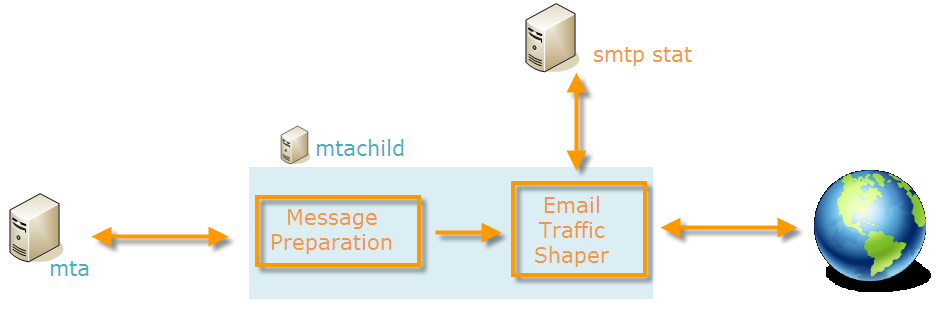

# 技術的なメール設定{#email-deliverability}


## 概要 {#overview}

次の節では、E メールの配信時にAdobe Campaignインスタンスの出力を制御するために必要な設定の概要を示します。

>[!NOTE]
>
>一部の設定は、AdobeがAdobeでホストするデプロイメント（サーバーおよびインスタンスの設定ファイルにアクセスする場合など）に対してのみ実行できます。 様々なデプロイメントについて詳しくは、 [ホスティングのモデル](../../installation/using/hosting-models.md) セクションまたは [このページ](../../installation/using/capability-matrix.md).

Adobe Campaignでの配信品質に関する概念とベストプラクティスについて詳しくは、こちらを参照してください。 [セクション](../../delivery/using/about-deliverability.md).

Adobeプラットフォームによる E メールの効率的な送受信に関するすべての技術的な推奨事項など、配信品質について詳しくは、 [Adobe配信品質のベストプラクティスガイド](https://experienceleague.adobe.com/docs/deliverability-learn/deliverability-best-practice-guide/introduction.html?lang=ja).

## 動作の原則 {#operating-principle}

1 つ以上のAdobe Campaignインスタンスの出力を制御して、1 つのドメインに応じて送信される E メールの数を制限できます。 例えば、 **yahoo.com** アドレスを指定し、その他のすべてのドメインに対して 1 時間に 100,000 件のメッセージを設定します。

メッセージの出力は、配信サーバーで使用される IP アドレス (**mta**) をクリックします。 複数 **mta** 複数のマシンに分類し、様々なAdobe Campaignインスタンスに属するものは、E メール配信用に同じ IP アドレスを共有できます。これらの IP アドレスの使用を調整するには、プロセスを設定する必要があります。

これが、 **stat** モジュールは、一連の IP アドレスについて、メールサーバーに送信されるすべての接続要求とメッセージを転送します。 統計サーバーは配信を追跡し、設定された割り当てに基づいて送信を有効または無効にできます。


* 統計サーバー (**stat**) はAdobe Campaignベースにリンクされ、設定を読み込みます。
* 配信サーバー (**mta**)UDP を使用して、必ずしも自分のインスタンスに属しているとは限らない統計サーバに接続します。

### 配信サーバー {#delivery-servers}

The **mta** モジュールはメッセージを配信します **mtachild** 子モジュール。 各 **mtachild** 統計サーバーからの認証をリクエストして送信する前に、メッセージを準備します。

手順は、以下のとおりです。

1. The **mta** 有効なメッセージを選択し、使用可能に割り当てます **mtachild**.
1. The **mtachild** は、メッセージの作成に必要なすべての情報（コンテンツ、パーソナライゼーション要素、添付ファイル、画像など）を およびは、 **メールトラフィックシェーパー**.
1. E メールトラフィックシェイパーが統計サーバーの認証 (**smtp stat**) の場合、メッセージは受信者に送信されます。



### メールサーバーの統計と制限事項 {#email-server-statistics-and-limitations}

統計サーバーは、メッセージを受信する各電子メールサーバーについて、次の統計情報を保持します。

* 開いているポイントインタイム接続の数。
* 過去 1 時間に送信されたメッセージ数。
* 成功/拒否された接続の割合
* 未到達サーバーへの接続率。

同時に、モジュールは、特定の電子メールサーバーに関する制限のリストを読み込みます。

* 同時接続の最大数
* 1 時間あたりの最大メッセージ数
* 接続ごとの最大メッセージ数。

### IP アドレスの管理 {#managing-ip-addresses}

統計サーバは、複数のインスタンスまたは複数のマシンを、同じパブリック IP アドレスと組み合わせることができます。 したがって、特定のインスタンスにリンクされるわけではありませんが、ドメインごとの制限を回復するために、インスタンスに連絡する必要があります。

配信統計は、ターゲット MX ごとに、およびソース IP ごとに保持されます。 例えば、ターゲットドメインの MX が 5 つで、プラットフォームが 3 つの異なる IP アドレスを使用できる場合、サーバーはこのドメインに対して最大 15 個の一連の指標を管理できます。

ソース IP アドレスは、パブリック IP アドレス（リモート電子メールサーバーで確認されるアドレス）と一致します。 この IP アドレスは、 **mta**（NAT ルータが指定されている場合） このため、統計サーバーは、パブリック IP(**publicId**) をクリックします。 ローカルアドレスとこの識別子の関連付けは、 **serverConf.xml** 設定ファイル。 次の **serverConf.xml** を [セクション](../../installation/using/the-server-configuration-file.md).

## 配信出力コントロール {#delivery-output-controlling}

E メールサーバーにメッセージを配信するには、 **メールトラフィックシェーパー** コンポーネントは、統計サーバーからの接続をリクエストします。 要求が受け入れられると、接続が開きます。

モジュールは、メッセージを送信する前に、サーバーから「トークン」をリクエストします。 これらは、通常、少なくとも 10 個のトークンのセットで、サーバーに対するクエリの数を減らします。

サーバーは、接続と配信に関するすべての統計を保存します。 再起動時には、情報が一時的に失われます。各クライアントは、送信統計のローカルコピーを保持し、定期的に（2 分ごとに）サーバに返します。 その後、サーバーはデータを再集計できます。

次の節では、 **メールトラフィックシェーパー** コンポーネント。

### メッセージ配信 {#message-delivery}

メッセージが送信されると、次の 3 つの結果が考えられます。

1. **成功**：メッセージは正常に送信されました。 メッセージが更新されます。
1. **メッセージ失敗**：連絡先のサーバーが、選択された受信者に対するメッセージを拒否しました。 この結果は、リターンコード 550 ～ 599 に一致しますが、例外を定義することもできます。
1. **セッション失敗** （上向きの 5.11 の場合）: **mta** がこのメッセージに対する回答を受け取ると、メッセージは破棄されます ( [メッセージの中断](#message-abandonment)) をクリックします。 メッセージは別のパスに送信されます。他のパスがない場合は「保留」に設定されます ( [保留中のメッセージ](#message-pending)) をクリックします。

   >[!NOTE]
   >
   >A **パス** は、Adobe Campaign **mta** とターゲット **mta**. ザAdobe Campaign **mta** は、複数の開始 IP および複数のターゲットドメイン IP から選択できます。

### メッセージの中断 {#message-abandonment}

破棄されたメッセージは、 **mta** で管理されなくなりました。 **mtachild**.

The **mta** は、このメッセージの手順（回復、放棄、強制隔離など）を 応答コードとルールに応じて異なります。

### 保留中のメッセージ {#message-pending}

アクティブなキューにメッセージが届き、使用可能なパスがない場合は、メッセージが保留されます。

通常、パスは、接続エラーの後、変化した時間は使用不可とマークされます。 使用できない期間は、エラーの頻度と期間によって異なります。

## 統計サーバーの設定 {#statistics-server-configuration}

統計サーバーは、複数のインスタンスで使用できます。統計サーバーを使用するインスタンスとは別に設定する必要があります。

まず、設定をホストするAdobe Campaignデータベースを定義します。

### 設定を開始 {#start-configuration}

デフォルトでは、 **stat** モジュールは、各インスタンスに対して開始されます。 インスタンスが同じマシン上でプールされた場合、またはインスタンスが同じ IP アドレスを共有する場合は、1 つの統計サーバーが使用されます。その他のサーバーは無効にする必要があります。

### サーバーポートの定義 {#definition-of-the-server-port}

デフォルトでは、統計サーバーはポート 7777 でリッスンします。 このポートは、 **serverConf.xml** ファイル。 次の **serverConf.xml** を [セクション](../../installation/using/the-server-configuration-file.md).

```
<stat port="1234"/>
```

## MX 設定 {#mx-configuration}

>[!IMPORTANT]
>
>ホストインストールまたはハイブリッドインストールで [Enhanced MTA](../../delivery/using/sending-with-enhanced-mta.md) にアップグレードした場合、**[!UICONTROL MX 管理]**&#x200B;配信スループットは使用されなくなります。Enhanced MTA は独自の MX ルールを使用します。これにより、独自のメールレピュテーション履歴およびメールを送信しているドメインから送信されるリアルタイムのフィードバックに基づいて、スループットをドメインごとにカスタマイズすることができます。

### MX ルールについて {#about-mx-rules}

>[!NOTE]
>
>この節および以下の節は、レガシー Campaign MTA を使用したオンプレミスインストールおよびホスト/ハイブリッドインストールにのみ適用されます。

MX（Mail eXchanger）ルールは、送信サーバーと受信サーバーの間の通信を管理するルールです。

これらのルールは、クライアントインスタンスを定期的に提供するために、毎朝午前 6 時（サーバー時間）に自動的にリロードされます。

ISP は、事前に定義された数の接続と 1 時間あたりのメッセージを受け付けます（数量と内部ポリシーに応じて異なります）。 これらの変数は、IP と送信ドメインのレピュテーションに応じて、ISP システムによって自動的に変更される場合があります。 Adobe Campaign では、配信品質プラットフォームを通じて、ISP 別の 150 個以上の専用ルールに加えて、他のドメイン用の 1 つの汎用ルールを管理します。

接続の最大数は、MTA で使用されるパブリック IP アドレスの数だけに依存しているわけではありません。

例えば、MX ルールで 5 つの接続を許可し、2 つのパブリック IP を設定した場合、このドメインに対して同時に 10 個を超える接続を開くことはできないと考えられます。 しかし、そうではありません。接続の最大数は、実際には、MTA のパブリック IP の 1 つとクライアントの MTA のパブリック IP の組み合わせであるパスを示します。

以下の例では、ユーザーに 2 つのパブリック IP アドレスが設定されており、ドメインは yahoo.com です。

```
user:~ user$ host -t mx yahoo.com
                yahoo.com mail is handled by 1 mta5.am0.yahoodns.net.
                yahoo.com mail is handled by 1 mta6.am0.yahoodns.net.
                yahoo.com mail is handled by 1 mta7.am0.yahoodns.net.
```

yahoo.comの MX レコードは、yahoo.comには 3 つの Mail Exchangers があることを教えてください。 ピア Mail Exchanger に接続するには、MTA がその IP アドレスを DNS に要求します。

```
user:~ user$ host -t a mta5.am0.yahoodns.net
                mta5.am0.yahoodns.net has address 98.136.216.26
                mta5.am0.yahoodns.net has address 98.136.217.202
                mta5.am0.yahoodns.net has address 98.138.112.38
                mta5.am0.yahoodns.net has address 66.196.118.37
                mta5.am0.yahoodns.net has address 63.250.192.46
                mta5.am0.yahoodns.net has address 66.196.118.240
                mta5.am0.yahoodns.net has address 98.136.217.203
                mta5.am0.yahoodns.net has address 98.138.112.35
```

このレコードでは、ユーザは 8 つのピア IP アドレスにアクセスできます。 ユーザーにはパブリック IP アドレスが 2 つあるので、8 * 2 = 16 の組み合わせでyahoo.comメールサーバーにアクセスできます。 これらの組み合わせはそれぞれパスと呼ばれます。

2 つ目の MX レコードは次のようになります。

```
user:~ user$ host -t a mta6.am0.yahoodns.net
                mta6.am0.yahoodns.net has address 98.138.112.38
                mta6.am0.yahoodns.net has address 98.136.216.26
                mta6.am0.yahoodns.net has address 63.250.192.46
                mta6.am0.yahoodns.net has address 66.196.118.35
                mta6.am0.yahoodns.net has address 98.136.217.203
                mta6.am0.yahoodns.net has address 98.138.112.32
                mta6.am0.yahoodns.net has address 98.138.112.37
                mta6.am0.yahoodns.net has address 66.196.118.33
```

これらの 8 つの IP アドレスのうち 4 つは、既に mta5 で使用されています (98.136.216.26、98.138.112.38、63.250.192.46、98.136.217.203)。 このレコードを使用すると、ユーザーは 4 つの新しい IP アドレスを使用できます。 3 つ目の MX レコードも同様です。

合計 16 のリモート IP アドレスがあります。 2 つのローカルパブリック IP アドレスと組み合わせると、yahoo.com のメールサーバーに到達するのに 32 個のパスがあります。

>[!NOTE]
>
>2 つの MX レコードが同じ IP アドレスを参照している場合は、これらは 2 つのパスではなく 1 つのパスとみなされます。

MX ルールの使用例を以下に示します。


以下の例では、特定のドメインに対して 1 時間あたりのメッセージ数の上限が 10,000 件になっていますが、MTA のスループット能力はこの上限を上回っています。

この場合、トラフィックは 1 時間ごとに 5 分間の 12 周期に分割され、メッセージ数の実際の上限は 1 周期につき 833 件になります。

これらのメッセージはできるだけ速く配信されます。


### MX 管理の設定 {#configuring-mx-management}

MX に準拠するルールは、 **[!UICONTROL MX 管理]** のドキュメント **[!UICONTROL 管理/Campaign Management/配信不能件数の管理/メールルールセット]** ツリーのノードに設定します。

次の場合、 **[!UICONTROL MX 管理]** ドキュメントがノードに存在しない場合は、手動で作成できます。 手順は次のとおりです。

1. 一連の新しいメールルールを作成します。
1. を選択します。 **[!UICONTROL MX 管理]** モード。

   

1. 入力 **defaultMXRules** （内） **[!UICONTROL 内部名]** フィールドに入力します。

変更を反映するには、統計サーバーを再起動する必要があります。

統計サーバを再起動せずに構成を再読み込みするには、サーバをホストするマシンで次のコマンドを使用します。 `nlserver stat -reload`

>[!NOTE]
>
>このコマンドラインは、 **nlserver restart**. 再起動するまでに収集された統計データが失われることもなく、また、使用時のピークが MX ルールで定義された割り当てに違反するおそれもなくなります。

### MX ルールの設定 {#configuring-mx-rules}

The **[!UICONTROL MX 管理]** ドキュメントには、MX ルールにリンクされているすべてのドメインのリストが表示されます。

これらのルールは順番に適用されます。最初のルールの MX マスクは、ターゲット MX と互換性があります。

各ルールで使用できるパラメーターは次のとおりです。

* **[!UICONTROL MX マスク]**：ルールを適用するドメイン。 各ルールは、MX のアドレスマスクを定義します。 したがって、このマスクと名前が一致する MX が有効です。 マスクには、「&#42;「それと？」 汎用文字。

  例えば、次のアドレスがあるとします。

   * a.mx.yahoo.com
   * b.mx.yahoo.com
   * c.mx.yahoo.com

  は、次のマスクと互換性があります。

   * &#42;.yahoo.com
   * ?.mx.yahoo.com

  例えば、E メールアドレス foobar@gmail.com の場合、ドメインは gmail.com で、MX レコードは次のようになります。

  ```
  gmail.com mail exchanger = 20 alt2.gmail-smtp-in.l.google.com.
  gmail.com mail exchanger = 10 alt1.gmail-smtp-in.l.google.com.
  gmail.com mail exchanger = 40 alt4.gmail-smtp-in.l.google.com.
  gmail.com mail exchanger = 5  gmail-smtp-in.l.google.com.
  gmail.com mail exchanger = 30 alt3.gmail-smtp-in.l.google.com.
  ```

  この場合、MX ルール `*.google.com` が使用されます。 ご覧のように、MX ルールマスクは、必ずしもメール内のドメインと一致しているとは限りません。 gmail.com E メールアドレスに適用される MX ルールは、マスクの付いたものになります `*.google.com`.

* **[!UICONTROL 識別子の範囲]**：ルールを適用する識別子の範囲 (publicID) を指定できます。 次を指定できます。

   * 数値：ルールはこの publicId にのみ適用されます。
   * 数値の範囲 (**number1-number2**)：ルールはこの 2 つの数値の間のすべての publicIds に適用されます。

  >[!NOTE]
  >
  >フィールドが空の場合、ルールはすべての識別子に適用されます。

  パブリック ID は、1 つまたは複数の MTA で使用されるパブリック IP の内部識別子です。 これらの ID は MTA サーバーの **config-instance.xml** ファイルに定義されます。

  

* **[!UICONTROL 共有済み]**：この MX ルールのプロパティの範囲を定義します。 オンにすると、すべてのパラメーターがインスタンスで使用可能なすべての IP で共有されます。 オフにすると、MX ルールが IP ごとに定義されます。 メッセージの最大数は、使用可能な IP アドレスの数を乗算したものになります。
* **[!UICONTROL 接続の最大数]**：送信者のドメインへの同時接続の最大数。
* **[!UICONTROL メッセージの最大数]**：接続で送信できるメッセージの最大数。 メッセージがこの数を超えると、接続が閉じられ、新しい接続が開きます。
* **[!UICONTROL 1 時間あたりのメッセージ数]**：送信者のドメインに 1 時間で送信できるメッセージの最大数。
* **[!UICONTROL 接続がタイムアウトしました]**：ドメインに接続するための時間のしきい値。

  >[!NOTE]
  >
  >Windows では、 **timeout** このしきい値より前（Windows のバージョンによって異なります）。

* **[!UICONTROL タイムアウトデータ]**：メッセージコンテンツを送信した後の最大待機時間（SMTP プロトコルの「DATA」セクション）。
* **[!UICONTROL タイムアウト]**:SMTP サーバーとの他の交換の最大待機時間。
* **[!UICONTROL TLS]**:E メール配信を暗号化する TLS プロトコルを選択して有効にできます。 各 MX マスクに対して、次のオプションを使用できます。

   * **[!UICONTROL デフォルトの設定]**：適用される serverConf.xml 設定ファイルで指定される一般的な設定です。

     >[!IMPORTANT]
     >
     >デフォルトの設定を変更することはお勧めしません。

   * **[!UICONTROL 無効]** ：メッセージは、暗号化されずに体系的に送信されます。
   * **[!UICONTROL 便宜的]** ：受信サーバー (SMTP) が TLS プロトコルを生成できる場合、メッセージ配信は暗号化されます。

設定例：


>[!NOTE]
>
>Adobe Campaignでの MX サーバーの使用について詳しくは、 [この節](../../installation/using/using-mx-servers.md).

### E メールフォーマットの管理 {#managing-email-formats}

送信メッセージのフォーマットを定義して、表示されるコンテンツを、各受信者のアドレスのドメインに応じて自動的に適応させることができます。

これをおこなうには、に移動します。 **[!UICONTROL E メールフォーマットの管理]** 次の場所にあるドキュメント： **[!UICONTROL 管理]** > **[!UICONTROL キャンペーン管理]** > **[!UICONTROL 配信不能件数の管理]** > **[!UICONTROL メールルールセット]**.

このドキュメントには、Adobe Campaignが管理する日本語形式に対応するすべての定義済みドメインの一覧が含まれています。 詳しくは、 [このドキュメント](../../delivery/using/defining-the-email-content.md#sending-emails-on-japanese-mobiles).


The **MIME 構造** （多目的インターネットメール拡張）パラメーターを使用すると、様々なメールクライアントに送信されるメッセージ構造を定義できます。 次の 3 つのオプションを使用できます。

* **マルチパート**：メッセージはテキスト形式またはHTML形式で送信されます。 HTML形式が受け入れられない場合でも、メッセージはテキスト形式で表示できます。

  デフォルトでは、マルチパート構造は **マルチパート/オルタナティブ**&#x200B;に設定されますが、自動的に **マルチパート/関連** メッセージに画像が追加されたとき。 特定のプロバイダーは、 **マルチパート/関連** デフォルトの形式は、 **[!UICONTROL マルチパート/関連を強制]** オプションは、画像がアタッチされていない場合でも、この形式を適用します。

* **HTML**:HTMLのみのメッセージが送信されます。 メッセージの形式が受け入れられない場合、HTMLは表示されません。
* **テキスト**：テキストのみの形式のメッセージが送信されます。 テキスト形式のメッセージの利点は、非常に小さいサイズです。

次の場合、 **[!UICONTROL 画像を含める]** オプションを有効にすると、電子メールの本文に直接表示されます。 画像がアップロードされ、URL リンクがコンテンツで置き換えられます。

このオプションは、特に日本の市場で **デコメール**, **デコレメール** または **デコレーションメール**. 詳しくは、 [このドキュメント](../../delivery/using/defining-the-email-content.md#sending-emails-on-japanese-mobiles).

>[!IMPORTANT]
>
>E メールに画像を挿入すると、サイズが大幅に大きくなります。

## 配信サーバーの設定 {#delivery-server-configuration}

### クロックの同期 {#clock-synchronization}

Adobe Campaignプラットフォームを構成するすべてのサーバー（データベースを含む）のクロックを同期する必要があります。また、そのシステムを同じタイムゾーンに設定する必要があります。

### 統計サーバーの座標 {#coordinates-of-the-statistics-server}

統計サーバーのアドレスを **mta**.

The **statServerAddress** のプロパティ **mta** 設定の要素を使用して、使用するポートのアドレスと番号を指定できます。

```
<mta statServerAddress="emailStatServer:7777">
   [...]
 </mta>
```

同じマシン上で統計サーバーを使用するには、少なくとも **localhost** 値：

```
 <mta statServerAddress="localhost">
```

>[!IMPORTANT]
>
>このフィールドに値が入力されていない場合、 **mta** が開始されません。

### 使用する IP アドレスのリスト {#list-of-ip-addresses-to-use}

トラフィック管理に関する設定は、 **mta/child/smtp** 設定ファイルの要素。

次ごとに **IPAffinity** 要素を使用する場合は、マシンで使用できる IP アドレスを宣言する必要があります。

例：

```
<IPAffinity localDomain="<domain>" name="default">
  <IP address="192.168.0.11" publicId="1" weight="5"/>
  <IP address="192.168.0.12" heloHost="revdns1.campaign.com" publicId="2" weight="5"/>
  <IP address="192.168.0.13" publicId="3" weight="1"/>
</IPAffinity>
```

パラメーターは次のとおりです。

* **住所**：使用する MTA ホストマシンの IP アドレスです。
* **heloHost**：この識別子は、SMTP サーバーで確認される IP アドレスを表します。

* **publicId**：この情報は、複数のAdobe Campaignで IP アドレスが共有されている場合に役立ちます。 **mtas** NAT ルータの背後に 統計サーバは、この識別子を用いて、この開始点とターゲットサーバとの間の接続および送信統計を記憶する。
* **重み**：アドレスの相対的な使用頻度を定義できます。 デフォルトでは、すべてのアドレスの重み付けは 1 に等しくなります。

>[!NOTE]
>
>serverConf.xml ファイルで、1 つの IP が一意の識別子 (public_id) を持つ単一の helohost に対応していることを確認する必要があります。 複数のヘロホストにマッピングすることはできません。そのため、配信のスロットルの問題が発生する可能性があります。

前の例では、通常の条件の場合、アドレスは次のように配分されます。

    * &quot;1&quot;: 5 / (5+5+1) = 45%
    * &quot;2&quot;: 5 / (5+5+1) = 45%
    * &quot;3&quot;: 1 / (5+5+1) = 10%

例えば、最初のアドレスを指定の MX に対して使用できない場合、メッセージは次のように送信されます。

    * &quot;2&quot;: 5 / (5+1) = 83%
    * &quot;3&quot;: 1 / (5+1) = 17%

* **includeDomains**：特定のドメインに属する E メールに対して、この IP アドレスを予約できます。 これは、1 つ以上のワイルドカード (&#39;&#42;&#39;) です。 属性を指定しない場合、すべてのドメインでこの IP アドレスを使用できます。

  例： **includeDomains=&quot;wanadoo.com,orange.com,yahoo.&#42;&quot;**

* **excludeDomains**：この IP アドレスのドメインのリストを除外します。 このフィルターは、 **includeDomains** フィルター。

  

## E メール送信の最適化 {#email-sending-optimization}

Adobe Campaignの内部アーキテクチャ **mta** は、e メール配信を最適化するための設定に影響を与えます。 配信の改善に関するヒントを以下に示します。

### maxWaitingMessages パラメーターの調整 {#adjust-the-maxwaitingmessages-parameter}

The **maxWaitingMessages** パラメーターは、事前に **mtachild**. メッセージは、送信または破棄された場合にのみ、このリストから削除されます。

このパラメーターは非常に重要で、メッセージがドメインで並べ替えられない場合は特に重要です。

1 回 **maxWorkingSetMb** (256) しきい値に達すると、配信サーバーはメッセージの送信を停止します。 パフォーマンスは、 **mtachild** が再び起動します。 この問題を回避するには、 **maxWorkingSetMb** パラメーターを使用するか、 **maxWaitingMessages** パラメーター。

The **maxWorkingSetMb** パラメーターは、メッセージの最大数に平均メッセージサイズを掛け、その結果に 2.5 を掛けて経験的に計算されます。例えば、メッセージの平均サイズが 50 KB で、 **maxWaitingMessages** パラメーターが 1,000 に等しい場合、使用されるメモリは平均 125 MB です。

### mtachild の数を調整 {#adjust-the-number-of-mtachild}

子の数は、マシン内のプロセッサ数を超えてはなりません ( 約 1,000 セッション )。 8 を超えないことをお勧めします **mtachild**. その後、メッセージ数を 1 件に増やすことができます。 **子** (**maxMsgPerChild**) を使用して十分な寿命を達成できます。
