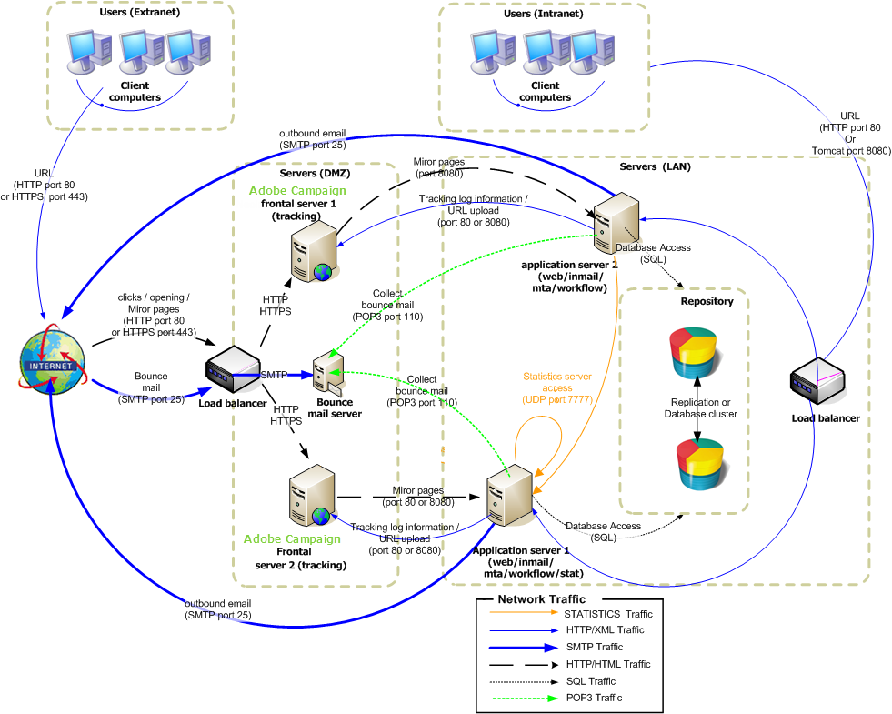

# 企業へのデプロイメント{#enterprise-deployment}


これは最も完全な設定です。 これは、より優れたセキュリティと可用性を実現する標準設定に基づいて構築されています。

* スケーラビリティと可用性を実現する、HTTPまたはTCP ロードバランサーの背後にある専用リダイレクトサーバー，
* スループットとフェイルオーバー機能を向上させる2つのアプリケーションサーバー（フォールトトレランス）と、LAN内で分離されたサーバー。

サーバーとプロセス間の一般的な通信は、次のスキーマに従って実行されます。



このタイプの設定では、適切な帯域幅とチューニングを使用すると、予想されるスループットが1時間あたり100,000通を超える可能性があります。

## 機能 {#features}

### メリット {#advantages}

* セキュリティの最適化：外部に公開する必要があるサーバーのみが、DMZのコンピューターにインストールされます。
* 高可用性の確保が容易：外部から見えるコンピュータのみが、高可用性を念頭に置いて管理する必要があります。

### 欠点 {#disadvantages}

ハードウェアと管理のコストの増大：

### 推奨される機器 {#recommended-equipment}

* アプリケーションサーバー：2 Ghz クアッドコアCPU、4 GB RAM、ソフトウェア RAID 1 80 GB SATA ハードドライブ。
* リダイレクションサーバー：2 Ghz クアッドコア CPU、4 GB RAM、ソフトウェア RAID 1 80 GB SATA ハードドライブ。

>[!NOTE]
>
>既存のロードバランサーをリダイレクトサーバーへのトラフィックに再利用できます。

## インストールと設定手順 {#installation-and-configuration-steps}

### 前提条件 {#prerequisites}

* JDKを両方のアプリケーションサーバー，
* Web サーバー（IIS、Apache）を，
* アプリケーションサーバーとデータベースサーバーの両方に，
* POP3経由でアクセス可能なバウンスメールボックス，
* ロードバランサーでの2つのDNS エイリアスの作成：

   * 最初にパブリックに公開され、仮想IP アドレス（VIP）上のロードバランサーをトラッキングおよびポイントし、次に2つのフロントタルサーバーに配布されます。
   * 2つ目は、コンソール経由でアクセスするために内部ユーザーに公開され、仮想IP アドレス（VIP）上のロードバランサーを指し、次に2つのアプリケーションサーバーに配布されます。

* STMP （25）、DNS （53）、HTTP （80）、HTTPS （443）、SQL （1521 for Oracle、5432 for PostgreSQLなど）を開くように設定されたファイアウォール ポート。 詳細については、「[ データベースアクセス ](../../installation/using/network-configuration.md#database-access)」の節を参照してください。

>[!CAUTION]
>
>アプリケーションサーバーが単一のデータベースインスタンスを指している場合、1つのインスタンスに標準パッケージをインポートした後、パッケージに含まれるスキーマは他のインスタンスには読み込まれません。
>  
>アプリケーションサーバーが単一のデータベースインスタンスを指している場合、一方のインスタンスでスキーマを変更した後、もう一方のインスタンスでスキーマが読み込まれません。
>
>これらの問題を回復するには、エラーが発生した2番目のインスタンスで「web@default」プロセスを再起動する必要があります。

### アプリケーションサーバーのインストールと設定1 {#installing-and-configuring-the-application-server-1}

次の例では、インスタンスのパラメーターは次のとおりです。

* インスタンスの名前：デモ
* DNS マスク：tracking.campaign.net&#42;, console.campaign.net&#42; （アプリケーションサーバーは、クライアントコンソール接続とレポート、ミラーページと購読解除ページのURLを処理します）
* 言語：英語
* データベース：campaign:demo@dbsrv

最初のサーバーをインストールする手順は次のとおりです。

1. Linuxでは&#x200B;**nlserver** パッケージ、Windowsでは&#x200B;**setup.exe**&#x200B;というAdobe Campaign サーバーのインストール手順に従います。

   詳しくは、「[LinuxでのCampaign インストールの前提条件](../../installation/using/prerequisites-of-campaign-installation-in-linux.md) （Linux）」および「[Windows](../../installation/using/prerequisites-of-campaign-installation-in-windows.md) （Windows）でのCampaign インストールの前提条件」を参照してください。

1. Adobe Campaign サーバーがインストールされたら、コマンド **nlserver web -tomcat**&#x200B;を使用してアプリケーションサーバー（web）を起動します（Web モジュールを使用すると、ポート 8080で待機しているスタンドアロン Web サーバーモードでTomcatを起動できます）。また、Tomcatが正しく起動することを確認します。

   ```sql
   12:08:18 >   Application server for Adobe Campaign Classic (7.X YY.R build XXX@SHA1) of DD/MM/YYYY
   12:08:18 >   Starting Web server module (pid=28505, tid=-1225184768)...
   12:08:18 >   Tomcat started
   12:08:18 >   Server started
   ```


   >[!NOTE]
   >
   >Web モジュールを初めて実行すると、インストールフォルダーの下の&#x200B;**conf** ディレクトリに&#x200B;**config-default.xml**&#x200B;と&#x200B;**serverConf.xml** ファイルが作成されます。 **serverConf.xml**&#x200B;で使用可能なすべてのパラメーターは、この[ セクション ](../../installation/using/the-server-configuration-file.md)に一覧表示されます。

   サーバーを停止するには、**Ctrl+C**&#x200B;を押します。

   詳しくは、以下の節を参照してください。

   * Linuxの場合：[ サーバーの最初の起動](../../installation/using/installing-packages-with-linux.md#first-start-up-of-the-server)
   * Windowsの場合：[ サーバーの最初の起動](../../installation/using/installing-the-server.md#first-start-up-of-the-server)

1. 次のコマンドを使用して、**internal** パスワードを変更します。

   ```
   nlserver config -internalpassword
   ```

   詳しくは、[この節](../../installation/using/configuring-campaign-server.md#internal-identifier)を参照してください。

1. トラッキング用のDNS マスク（この場合は&#x200B;**tracking.campaign.net**）とクライアントコンソールへのアクセス（この場合は&#x200B;**console.campaign.net**）を使用して、**デモ** インスタンスを作成します。 それには、次の 2 つの方法があります。

   * コンソールでインスタンスを作成します。

     

     詳しくは、[ インスタンスの作成と](../../installation/using/creating-an-instance-and-logging-on.md)へのログオンを参照してください。

     または

   * コマンドラインでインスタンスを作成します。

     ```
     nlserver config -addinstance:demo/tracking.campaign.net*,console.campaign.net*
     ```

     詳しくは、[ インスタンスの作成](../../installation/using/command-lines.md#creating-an-instance)を参照してください。

1. **config-demo.xml** ファイル （前のコマンドで作成され、**config-default.xml** ファイルの横にある）を編集し、**mta** （配信）、**wfserver** （ワークフロー）、**inMail** （リバウンドメール）および&#x200B;**stat** （統計）プロセスが有効であることを確認してから、**アプリ**&#x200B;統計サーバーのアドレスを設定します。

   ```xml
   <?xml version='1.0'?>
   <serverconf>  
     <shared>    
       <!-- add lang="eng" to dataStore to force English for the instance -->    
       <dataStore hosts="tracking.campaign.net*,console.campaign.net*">      
         <mapping logical="*" physical="default"/>    
       </dataStore>  </shared>  
       <mta autoStart="true" statServerAddress="app">
       <wfserver autoStart="true"/>  
       <inMail autoStart="true"/>  
       <sms autoStart="false"/>  
       <listProtect autoStart="false"/>
   </serverconf>
   ```

   詳しくは、[この節](../../installation/using/configuring-campaign-server.md#enabling-processes)を参照してください。

1. **serverConf.xml** ファイルを編集して配信ドメインを指定し、MTA モジュールがMX タイプのDNS クエリに応答するために使用するDNS サーバーのIP アドレス（またはホスト）を指定します。

   ```xml
   <dnsConfig localDomain="campaign.com" nameServers="192.0.0.1, 192.0.0.2"/>
   ```

   >[!NOTE]
   >
   >**nameServers** パラメーターは、Windowsでのみ使用されます。

   詳しくは、[Campaign サーバー設定](../../installation/using/configuring-campaign-server.md)を参照してください。

1. クライアントコンソール設定プログラム **setup-client-7.XX**, **YYYY.exe**&#x200B;を&#x200B;**/datakit/nl/eng/jsp** フォルダーにコピーします。 [詳細情報](../../installation/using/client-console-availability-for-windows.md)。

1. Adobe Campaign サーバー（**net start nlserver6** in Windows、**/etc/init.d/nlserver6 start** in Linux）を起動し、コマンド **nlserver pdump**&#x200B;をもう一度実行して、有効なすべてのモジュールが存在するかどうかを確認します。

   >[!NOTE]
   >
   >20.1以降では、代わりに次のコマンドを使用することをお勧めします（Linuxの場合）: **systemctl start nlserver**


   ```sql
   12:09:54 >   Application server for Adobe Campaign Classic (7.X YY.R build XXX@SHA1) of DD/MM/YYYY
   syslogd@default (7611) - 9.2 MB
   stat@demo (5988) - 1.5 MB
   inMail@demo (7830) - 11.9 MB
   watchdog (27369) - 3.1 MB
   mta@demo (7831) - 15.6 MB
   wfserver@demo (7832) - 11.5 MB
   web@default (28671) - 40.5 MB
   ```

   また、このコマンドを使用すると、コンピューターにインストールされているAdobe Campaign サーバーのバージョンとビルド番号を確認できます。

1. URL [https://console.campaign.net/nl/jsp/logon.jsp](https://tracking.campaign.net/r/test)を使用して、**nlserver web** モジュールをテストします。

   このURLを使用すると、クライアント設定プログラムのダウンロードページにアクセスできます。 [詳細情報](../../installation/using/client-console-availability-for-windows.md)。

   アクセス制御ページにアクセスしたら、**internal** ログインと関連パスワードを入力します。

   

### アプリケーションサーバー2のインストールと設定 {#installing-and-configuring-the-application-server-2}

次の手順に従います。

1. Adobe Campaign サーバーをインストールします。
1. 作成したインスタンスのファイルをアプリケーションサーバー1にコピーします。

   アプリケーションサーバー1と同じインスタンス名を保持します。

1. **internal**&#x200B;をアプリケーションサーバー1と同じに変更します。
1. データベースをインスタンスにリンクします。

   ```
   nlserver config -setdblogin:PostgreSQL:campaign:demo@dbsrv -instance:demo
   ```

1. **config-demo.xml** ファイル （前のコマンドで作成され、**config-default.xml** ファイルの横にある）を編集し、**mta** （配信）、**wfserver** （ワークフロー）、**inMail** （リバウンドメール）および&#x200B;**stat** （統計）プロセスが有効であることを確認してから、**アプリ**&#x200B;統計サーバーのアドレスを設定します。

   ```xml
   <?xml version='1.0'?>
   <serverconf>  
     <shared>    
       <!-- add lang="eng" to dataStore to force English for the instance -->    
       <dataStore hosts="tracking.campaign.net*,console.campaign.net*">      
         <mapping logical="*" physical="default"/>    
       </dataStore>  </shared>  
       <mta autoStart="true" statServerAddress="app">
       <wfserver autoStart="true"/>  
       <inMail autoStart="true"/>  
       <sms autoStart="false"/>  
       <listProtect autoStart="false"/>
   </serverconf>
   ```

   詳しくは、[この節](../../installation/using/configuring-campaign-server.md#enabling-processes)を参照してください。

1. **serverConf.xml** ファイルを編集し、MTA モジュールのDNS設定を入力します。

   ```xml
   <dnsConfig localDomain="campaign.com" nameServers="192.0.0.1, 192.0.0.2"/>
   ```

   >[!NOTE]
   >
   >**nameServers** パラメーターはWindowsでのみ使用されます。

   詳しくは、[Campaign サーバー設定](../../installation/using/configuring-campaign-server.md)を参照してください。

1. Adobe Campaign サーバーを起動します。

   詳しくは、以下の節を参照してください。

   * Linuxの場合：[ サーバーの最初の起動](../../installation/using/installing-packages-with-linux.md#first-start-up-of-the-server)
   * Windowsの場合：[ サーバーの最初の起動](../../installation/using/installing-the-server.md#first-start-up-of-the-server)

### フロントタルサーバーのインストールと設定 {#installing-and-configuring-the-frontal-servers}

インストール手順と設定手順は、両方のコンピューターで同じです。

手順は、以下のとおりです。

1. Adobe Campaignサーバーをインストールします，
1. 次の節で説明するWeb サーバー統合手順（IIS、Apache）に準拠します。

   * Linuxの場合：[Linux用Web サーバーへの統合](../../installation/using/integration-into-a-web-server-for-linux.md),
   * Windowsの場合：[Windows](../../installation/using/integration-into-a-web-server-for-windows.md)のWeb サーバーに統合します。

1. インストール中に作成された&#x200B;**config-demo.xml**&#x200B;および&#x200B;**serverConf.xml** ファイルをコピーします。 **config-demo.xml** ファイルで、**trackinglogd** プロセスをアクティブ化し、**mta**、**inmail**、**wfserver**&#x200B;および&#x200B;**stat** プロセスを非アクティブ化します。
1. **serverConf.xml** ファイルを編集し、リダイレクトのパラメーターに冗長トラッキングサーバーを入力します。

   ```xml
   <spareServer enabledIf="$(hostname)!='front_srv1'" id="1" url="https://front_srv1:8080"/>
   <spareServer enabledIf="$(hostname)!='front_srv2'" id="2" url="https://front_srv2:8080"/>
   ```

1. Web サイトを開始し、URL [https://tracking.campaign.net/r/test](https://tracking.campaign.net/r/test)からリダイレクトをテストします

   ブラウザーには、次のメッセージが表示されます（ロードバランサーがリダイレクトするURLに応じて異なります）。

   ```xml
   <redir status="OK" date="AAAA/MM/JJ HH:MM:SS" build="XXXX" host="tracking.campaign.net" localHost="front_srv1"/>
   ```

   または

   ```xml
   <redir status="OK" date="AAAA/MM/JJ HH:MM:SS" build="XXXX" host="tracking.campaign.net" localHost="front_srv2"/>
   ```

   詳しくは、以下の節を参照してください。

   * Linuxの場合：[Web サーバーを起動し、設定をテストしています](../../installation/using/integration-into-a-web-server-for-linux.md#launching-the-web-server-and-testing-the-configuration)。
   * Windowsの場合：[Web サーバーを起動し、設定をテストします](../../installation/using/integration-into-a-web-server-for-windows.md#launching-the-web-server-and-testing-the-configuration)。

1. Adobe Campaign サーバーを起動します。
