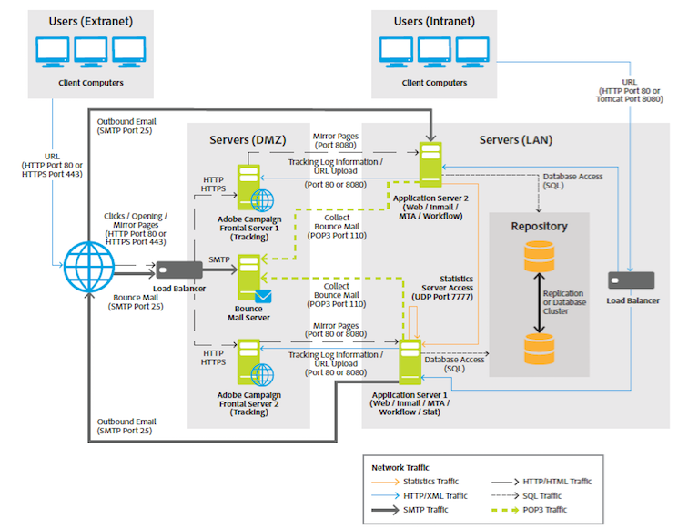

# 一般的なアーキテクチャ{#general-architecture}

一般的な Adobe Campaign ソリューションのデプロイメントは、次のコンポーネントで構成されます。

* **パーソナライズされたクライアント環境**

  マーケティングオファーのコミュニケーションと追跡、キャンペーンの作成、メール、ワークフロー、ランディングページなどのマーケティング活動、プログラムおよびプランのレビューと管理、顧客プロファイルの作成と管理、顧客オーディエンスタイプの定義などを実行できる、直感的なグラフィカルインターフェイスを備えています。

* **開発環境**

  サーバーサイドのソフトウェア。ユーザーインターフェイスで定義するルールとワークフローに基づき、選択したコミュニケーションチャネル（メール、SMS、プッシュ通知、ダイレクトメール、Web、Social など）を通じてマーケティングキャンペーンを実施できます。

* **データベースコンテナ**

  リレーショナルデータベーステクノロジーに基づいて、Adobe Campaign データベースは、すべての顧客情報、キャンペーンコンポーネント、オファーおよびワークフロー、ならびにキャンペーン結果を顧客データベースコンテナに保存します。

Adobe Campaignは、SOA （サービス指向アーキテクチャ）をベースとしており、複数の機能モジュールで構成されています。 これらのモジュールは、スケーラビリティ、可用性、サービス分離の制約に応じて、単一または複数のインスタンスで1台または複数のコンピューターにデプロイできます。 したがって、デプロイメント設定の範囲は非常に広く、単一の中央コンピューターから複数のサイト上の複数の専用サーバーを含む構成までにまたがっています。

>[!NOTE]
>
>ソフトウェアベンダーとして、互換性のあるハードウェアとソフトウェアインフラストラクチャを指定します。 ここに記載されているハードウェアの推奨事項は、情報提供のみを目的としており、当社の経験に基づいています。 Adobeは、これに基づいて行われた決定について責任を負いません。 また、ビジネスルールや慣行、プロジェクトの重要度や必要なパフォーマンスレベルによっても異なります。

>[!CAUTION]
>
>明示的に明記されていない場合、Adobe Campaign プラットフォームのすべてのコンポーネントのインストール、アップデート、およびメンテナンスは、それらをホストするマシン管理者の責任となります。 これには、Adobe Campaign アプリケーションの前提条件の実装や、コンポーネント間のCampaign [互換性マトリックス ](../../rn/using/compatibility-matrix.md)の準拠が含まれます。

## プレゼンテーションレイヤー {#presentation-layer}

アプリケーションには、ユーザーのニーズに応じて、リッチクライアント、シンクライアント、またはAPI統合などのさまざまな方法でアクセスできます。

* **リッチ クライアント**: アプリケーションのメイン ユーザーインターフェイスは、リッチ クライアントです。つまり、標準のインターネット プロトコル（SOAP、HTTPなど）だけでAdobe Campaign アプリケーション サーバーと通信するネイティブ アプリケーション （Windows）です。 このコンソールは、生産性に優れた使いやすさを提供し、（ローカルキャッシュを使用して）帯域幅をほとんど使用せず、簡単にデプロイメントできるように設計されています。 このコンソールは、インターネットブラウザーからデプロイでき、自動的に更新でき、HTTP （S） トラフィックのみを生成するため、特定のネットワーク設定は必要ありません。
* **シンクライアント**: レポートモジュール、配信承認ステージ、分散型マーケティングモジュールの機能（中央/ローカル）、インスタンスモニタリングなど、HTML ユーザーインターフェイスを使用して、シンプルなweb ブラウザーからアプリケーションの一部にアクセスできます。このモードを使用すると、イントラネットまたはエクストラネットにAdobe Campaign機能を組み込むことができます。
* **APIを介した統合**：場合によっては、SOAP プロトコルを介して公開されたWeb サービス APIを使用して、外部アプリケーションからシステムを呼び出すことができます。

## 論理アプリケーションレイヤー {#logical-application-layer}

Adobe Campaign は、さまざまなアプリケーションを備えたプラットフォームです。それらのアプリケーションを組み合わせて、オープンで拡張性の高いアーキテクチャを構築できます。 Adobe Campaignの基盤は、柔軟性の高いアプリケーションレイヤー上に構築されており、企業のビジネスニーズに合わせて容易に構成できます。 これは、技術的な観点だけでなく、機能的な観点からも、企業のニーズの高まりに対応します。 分散型のアーキテクチャであるため、メッセージの処理件数を数千から数百万へ拡張するなど、システムを線形的に拡張できます。

Adobe Campaignは、連携するサーバーサイドプロセスのセットに依存しています。

主なプロセスは次のとおりです。

**アプリケーションサーバー**（nlserver web）

このプロセスは、Web サービス API（SOAP - HTTP + XML）経由で、Adobe Campaign のさまざまな機能を公開します。 また、HTML ベースでアクセスできるよう、Web ページ（レポート、Web フォームなど）を動的に生成します。 そのため、このプロセスには Apache Tomcat JSP サーバーが含まれています。 これは、コンソールが接続するプロセスです。

**ワークフローエンジン**（nlserver wfserver）

このプロセスは、アプリケーションで定義したワークフローを実行します。

次のような、定期的に実行するテクニカルワークフローも処理します。

* トラッキング：トラッキングログの復元と統合。 リダイレクトサーバーからログを取得し、レポートモジュールで使用する集計インジケーターを作成します。
* クリーンアップ：データベースのクリーニング。 古いレコードを削除し、データベースが加速度的に肥大化するのを防ぎます。
* 請求：プラットフォームのアクティビティレポートの自動送信（データベースサイズ、マーケティングアクション数、アクティブプロファイル数など）。

**配信サーバー**（nlserver mta）

Adobe Campaign には、メールをブロードキャストする機能がネイティブで備わっています。 このプロセスは、SMTP のメール転送エージェント（MTA）として機能します。 メッセージを「一対一」でパーソナライズし、物理的に配信します。 配信ジョブを実行し、自動による再試行も処理します。 さらに、トラッキングを有効にすると、URL が自動的に置き換えられ、リダイレクトサーバーを指すようになります。

このプロセスでは、SMS、FAX、ダイレクトメール用に、カスタマイズやサードパーティルータへの自動送信を処理できます。

**リダイレクトサーバー**（nlserver webmdl）

Adobe Campaign では、メールの開封とクリック追跡を自動的に処理できます（Web サイトレベルでのトランザクショントラッキングについては、今後の課題です）。 これを実現するため、メールメッセージに含まれる URL を書き換えて、このモジュールを指すようにします。このモジュールは、目的の URL にリダイレクトされる前に、そのインターネットユーザーが通過したことを登録します。

高可用性を確保するため、このプロセスはデータベースから独立しています。他のサーバープロセスとの通信には、SOAP 呼び出し（HTTP、HTTP(S) および XML）のみを使用します。 技術的には、この機能はHTTP サーバーの拡張モジュール（IISのISAPI拡張、DSO Apache モジュールなど）に実装されます。 はWindowsでのみ使用できます。

その他の技術的なプロセスも利用できます。

**バウンスメールの管理**（nlserver inMail）

このプロセスは、配信エラーによって返されたバウンスメッセージを、バウンスメッセージ受信用のメールボックスから自動的に取得します。 その後、これらのメッセージはルールベースの処理を受けて、配信不能の理由（不明な受信者、クォータを超えているなど）を決定します。 データベース内の配信ステータスを更新します。

これらの動作は事前に設定されており、すべて自動でおこなわれます。

**SMS 配信ステータス**（nlserver sms）

このプロセスは、SMS ルータをポーリングして進行状況のステータスを収集し、データベースを更新します。

**ログメッセージの書き込み**（nlserver syslogd）

この技術プロセスは、他のプロセスで生成されたログメッセージとトレースを取得して、ハードディスクに書き込みます。 これにより、問題発生時の診断に使える十分な情報を取得します。

**トラッキングログの書き込み** (nlserver trackinglogd)

このプロセスは、リダイレクトプロセスによって生成されたトラッキングログをディスクに保存します。

**受信イベントの書き込み** (nlserver interactiond)

このプロセスは、インタラクションのフレームワークで発生するインバウンドイベントをディスクに記録します。

**監視モジュール**（nlserver watchodg）

このプロセスは、他の子プロセスを生成するメインプロセスとして機能します。 障害発生時には子プロセスの監視や再開を自動的に行うため、システムの稼働時間を最大限に維持できます。

**統計サーバー**（nlserver stat）

このプロセスは、接続数、送信メッセージ数（送信先メールサーバー別）、接続や送信の制限値（同時接続数の上限、1 時間あたりや 1 接続あたりのメッセージ数の上限）などの統計情報を保持します。 同じパブリック IP アドレスを共有している場合は、複数のインスタンスやマシンを統合することもできます。

>[!NOTE]
>
>Adobe Campaign モジュールの一覧については、[このドキュメント ](../../production/using/operating-principle.md)を参照してください。

## 永続性レイヤー {#persistence-layer}

データベースは永続性レイヤーとして使用され、Adobe Campaignで管理されるほぼすべての情報が含まれています。 これには、機能データ（プロファイル、サブスクリプション、コンテンツなど）、技術データ（配信ジョブとログ、トラッキングログなど）の両方が含まれます 作業データ（購入、リード）などの詳細が表示されます。

データベースの信頼性は最も重要です。ほとんどのAdobe Campaign コンポーネントは、タスクを実行するためにデータベースへのアクセスを必要とします（ただし、リダイレクトモジュールは例外です）。

このプラットフォームには、マーケティング中心のデータマートが事前に定義されているか、主要なリレーショナルデータベース管理システム（RDBMS）のいずれかを使用して、既存のデータマートやスキーマの上に簡単に座ることができます。 データマート内のすべてのデータには、Adobe CampaignからデータベースへのSQL呼び出しを介してAdobe Campaignプラットフォームからアクセスされます。 Adobe Campaign には、ETL（抽出、変換、ロード）ツールを補完する機能も備わっており、システムとの間でのデータのインポートとエクスポートを実行することができます。
