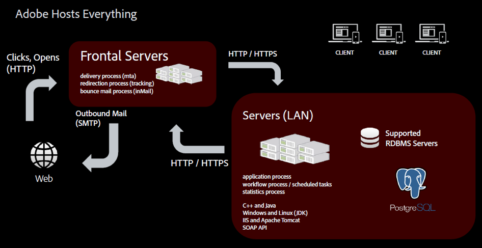

# ホスティングモデル{#hosting-models}

Adobe Campaignでは、3つのホスティングモデルから選択でき、ビジネスニーズに合わせて最適なモデルやモデルを柔軟に選択できます。

>[!NOTE]
>
>Adobeでホストされている環境の場合、メインインストールと設定の手順は、サーバーの設定やインスタンス設定ファイルのカスタマイズなど、Adobeでのみ実行できます。 デプロイメントモードの主な違いについて詳しくは、[このページ &#x200B;](../../installation/using/capability-matrix.md)を参照してください。

## Managed Services / ホスト型

Adobe Campaignをデプロイできます。as a Managed Service: ユーザーインターフェイス、実行管理エンジン、お客様のCampaign データベースなど、Adobe Campaignのすべてのコンポーネントは、メール実行、ミラーページ、トラッキングサーバー、配信停止ページ/プリファレンスセンターやランディングページなどの外部に向かうweb コンポーネントなど、Adobeによって完全にホストされます。

ホストされているお客様は、インストールと設定の手順のほとんどをAdobeで実行できます。 以下のセクションにアクセスして、実装をカスタマイズできます。

* ブランドごとにトラッキングページとミラーページのURLを設定します。 トランザクションメッセージについては、[この節](../../message-center/using/additional-configurations.md#configuring-multibranding)を参照してください。
* クライアントコンソールをインストールします。[この節](../../installation/using/installing-the-client-console.md)を参照してください。
* 配信品質ツールとベストプラクティスについて詳しくは、[詳細ドキュメント &#x200B;](../../delivery/using/about-deliverability.md)を参照してください。
* Campaign オプションの設定：この節の[を参照してください](../../installation/using/configuring-campaign-options.md)。
* CRM コネクタの設定：このセクションについては[を参照してください](../../platform/using/crm-connectors.md)。

## オンプレミス

Adobe Campaignはオンプレミスでデプロイできます。ユーザーインターフェイス、実行管理エンジン、データベースなど、Adobe Campaignのすべてのコンポーネントは、お客様のデータセンターにオンサイトで保管されます。 このデプロイメントモデルでは、お客様がすべてのソフトウェアとハードウェアのアップデートとアップグレードを管理します。Campaign インスタンス管理を確実に行うには、専用のデータベース管理者がメンテナンスと最適化タスクを実行する必要があります。

オンプレミス環境のお客様は、Campaign Classicの導入を開始する前に、次の前提条件と推奨事項に注意してください。

* Adobe Campaignでサポートされているシステムとコンポーネントのすべてのバージョンを一覧表示する[互換性マトリックス &#x200B;](../../rn/using/compatibility-matrix.md)を読んでください。
* お使いの環境に応じて、「[Windowsの前提条件](../../installation/using/prerequisites-of-campaign-installation-in-windows.md)」と「[Linuxの前提条件](../../installation/using/prerequisites-of-campaign-installation-in-linux.md)」をお読みください。
* データベース エンジン [に関する推奨事項については、この節](../../installation/using/database.md)を参照してください。
* 必要なデータベースアクセスレイヤーがサーバーにインストールされ、Adobe Campaign アカウントからアクセスできることを確認します。 [詳細情報](../../installation/using/application-server.md)。
* 一部のプロセスが他のプロセスと通信したり、LANやインターネットにアクセスしたりする必要があるため、ネットワークを設定します。 つまり、一部のTCP ポートは、これらのプロセスに対してオープンにする必要があります。 ネットワーク構成の要件について[詳細](../../installation/using/network-configuration.md)を確認します。
* [Campaign セキュリティとプライバシーのチェックリスト &#x200B;](https://helpx.adobe.com/jp/campaign/kb/acc-security.html)をお読みください。
* オンプレミス展開[のハードウェア要件の見積もりに関する一般的なガイドラインについては、この記事](https://helpx.adobe.com/jp/campaign/kb/hardware-sizing-guide.html)を参照してください。

## ハイブリッド

ハイブリッドモデルとして導入した場合、Adobe Campaignソリューションソフトウェアは顧客サイトのオンプレミスで使用され、実行管理はAdobeによってクラウドサービスとして提供されます。 Adobe Campaignのマーケティングインスタンスは、顧客のファイアウォール内にインストールされるため、PII （個人を特定できる情報）は社内に保持され、電子メールをパーソナライズするために必要なデータのみがクラウドに送信され、電子メールを実行できます。 実行インスタンスは、クラウドでホストされ、オンプレミスインスタンスからリクエストを受信してメールを配信します。 このインスタンスでは、すべてのメールをパーソナライズして配信します。 いかなる種類のデータも、クラウドに永続的に保存されることはありません。

ハイブリッド版のお客様は、ほとんどのインストールおよび設定手順をAdobeで実行できます。 以下のセクションにアクセスして、実装をカスタマイズできます。

* トランザクションメッセージの設定：このセクションについては[を参照してください](../../message-center/using/transactional-messaging-architecture.md)。
* ブランドごとにトラッキングページとミラーページのURLを設定します。 トランザクションメッセージについては、[この節](../../message-center/using/additional-configurations.md#configuring-multibranding)を参照してください。
* クライアントコンソールをインストールします。[この節](../../installation/using/installing-the-client-console.md)を参照してください。
* 組み込みパッケージをインストールします。このセクションについては[を参照してください](../../installation/using/installing-campaign-standard-packages.md)。
* 配信品質：[MX ルール &#x200B;](../../installation/using/email-deliverability.md#mx-configuration)と[&#x200B; メール形式](../../installation/using/email-deliverability.md#managing-email-formats)を設定します。 配信品質ツールとベストプラクティスについて詳しくは、[詳細ドキュメント &#x200B;](../../delivery/using/about-deliverability.md)を参照してください。
* Campaign オプションの設定：この節の[を参照してください](../../installation/using/configuring-campaign-options.md)。
* 外部データベース （Federated Data Access）を設定します。この節は[を参照してください](../../installation/using/about-fda.md)。
* CRM コネクタの設定：このセクションについては[を参照してください](../../platform/using/crm-connectors.md)。
* ミッドソーシングのデプロイメント原則について詳しくは、この節[を参照してください](../../installation/using/mid-sourcing-deployment.md)。
