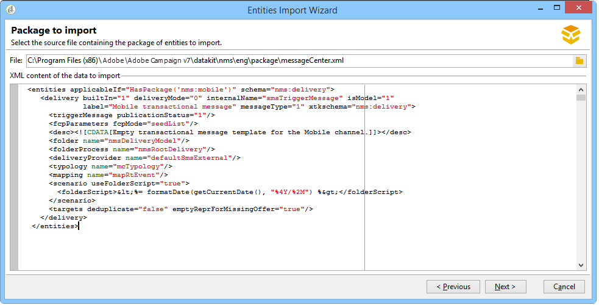

# Campaign Classic標準パッケージのインストール{#installing-campaign-standard-packages}

## 標準パッケージについて {#campaign-standard-packages}

パッケージとは、ニーズに応じてインストールできる機能のセットです。 これにより、インスタンスにさらにオプションを追加できます。

>[!CAUTION]
>
>お客様のライセンス契約に記載されているオプションに対応するパッケージのみをインストールできます。
>
>パッケージをインストールした後は、アンインストールできません。 新しいパッケージをインストールすると、すべてのプラットフォームに影響を与える可能性があります。最終的な導入の前に、テストおよび検証を行う必要があります。

標準パッケージをインストールするには：

1. Adobe Campaignクライアントコンソールからパッケ **[!UICONTROL Tools > Advanced > Package import...]** ージのインポートウィザードにアクセスします。
1. 選択 **[!UICONTROL Install a standard package]**.
1. 表示されるリストで、インストールするパッケージを確認します。
   >[!NOTE]
   >
   >パッケージがグレー表示になっている場合は、そのパッケージをインストールできません。 これは、が既にインストールされているか、お使いのインスタンスと互換性がないことを意味します。 例えば、マーケティングインスタンスに中間ソーシ **ングプラットフォーム** パッケージをインストールすることはできません。 この情報は、次の表に記載されています。
1. をクリック **[!UICONTROL Next]**&#x200B;し、パッケージ **[!UICONTROL Start]** のインストールを開始します。

   パッケージがインストールされると、プログレスバーに **100%と表示さ** れ、インストールログに次のメッセージが表示されます。 **[!UICONTROL Installation of packages successful]**.

1. **[!UICONTROL Close]** インストールウィンドウ

これでパッケージがインストールされます。

### そのまま使用できるパッケージのリスト {#list-of-standard-packages}

次の表に、すべての標準パッケージとその説明、それらをインストールできるインスタンスタイプ（Marketing、Midなど）を示します。と追加情報が含まれます。

<table> 
 <thead> 
  <tr> 
   <th> パッケージ </th> 
   <th> 説明 </th> 
   <th> インスタンスタイプ </th> 
   <th> 詳細情報 </th> 
  </tr> 
 </thead> 
 <tbody> 
  <tr> 
   <td> 配信<br /> </td> 
   <td> メッセージの送信時に発生した配信と最終的な問題を監視します。<br /> </td> 
   <td> すべて</td> 
   <td> <a href="../../delivery/using/monitoring-a-delivery.md">さらに詳しく</a></td> 
  </tr> 
  <tr> 
   <td> マーケティングキャンペーン (キャンペーン)<br /> </td> 
   <td> 通信とマーケティングキャンペーンを定義、最適化、実行、分析します。<br /> </td> 
   <td> マーケティング</td> 
   <td> <a href="../../campaign/using/designing-marketing-campaigns.md">詳細情報</a> </td> 
  </tr> 
  <tr> 
   <td> マーケティングリソース (MRM)<br /> </td> 
   <td> タスク、予算、およびマーケティングリソースの管理と追跡を提供することで、共同モードでのマーケティングアクションを制御します。<br /> </td> 
   <td> マーケティング</td> 
   <td> <a href="../../campaign/using/about-marketing-resource-management.md">詳細情報</a> </td> 
  </tr> 
  <tr> 
   <td> Offer engine (interaction)<br /> </td> 
   <td> Responds in real time during an interaction with a given contact (a customer or target) by making them a single or several adapted offers. <br /> </td> 
   <td> すべて<br /> </td> 
   <td> オプション、 <a href="../../interaction/using/interaction-and-offer-management.md">詳細情報</a></td> 
  </tr> 
  <tr> 
   <td> 実行インスタンスによるオファーエンジンのコントロール<br /> </td> 
   <td> </td> 
   <td> マーケティング<br /> </td> 
   <td> オプション</td> 
  </tr> 
  <tr> 
   <td> 実行インスタンス用のオファーエンジン<br /> </td> 
   <td> </td> 
   <td> 中間、実行 <br /> </td> 
   <td> オプション</td> 
  </tr> 
  <!--tr> 
   <td> Lead Management (Leads) (deprecated)<br /> </td> 
   <td> Simplifies the process of building and maintaining the entire leads management life cycle. <br /> </td> 
   <td> Yes<br /> </td> 
   <td> Optional, <a href="https://helpx.adobe.com/campaign/kb/deprecated-and-removed-features.html">Learn More</a> </td> 
  </tr--> 
  <tr> 
   <td> ソーシャルネットワーク (ソーシャルマーケティング) <br /> </td> 
   <td> Adobe CampaignをTwitterおよびFacebookと同期します。<br /> </td> 
   <td> すべて</td> 
   <td> <a href="../../social/using/starting-workflows.md">詳細情報</a> </td> 
  </tr> 
  <tr> 
   <td> トランザクションメッセージコントロール (Message Center - コントロール)<br /> </td> 
   <td> 情報システムからトリガーされたイベントから生成されたトリガーメッセージを管理します。<br /> </td> 
   <td> マーケティング<br /> </td> 
   <td> オプション、 <a href="../../message-center/using/about-transactional-messaging.md">詳細情報</a> </td> 
  </tr> 
  <tr> 
   <td> トランザクションメッセージ実行 (Message Center - 実行) <br /> </td> 
   <td> 可用性の向上と負荷管理の向上を実現<br /> </td> 
   <td> 実行<br /> </td> 
   <td> オプション、 <a href="../../message-center/using/about-transactional-messaging.md">詳細情報</a> </td> 
  </tr> 
  <tr> 
   <td> LINE チャネル<br /> </td> 
   <td> Adobe CampaignでLINEチャネルを使用して配信を送信します。<br /> </td> 
   <td> すべて<br /> </td> 
   <td> オプション、メッセージセンター必須</td> 
  </tr> 
  <tr> 
   <td> ダイレクトメールチャネル<br /> </td> 
   <td> Adobe Campaignでダイレクトメールチャネルを使用して配信を送信します。<br /> </td> 
   <td> すべて<br /> </td> 
   <td> オプション、 <a href="../../delivery/using/about-direct-mail-channel.md">詳細情報</a> </td> 
  </tr> 
  <tr> 
   <td> モバイルチャネル (SMS) <br /> </td> 
   <td> Adobe Campaignでモバイル/SMSチャネルを使用して配信を送信します。<br /> </td> 
   <td> すべて<br /> </td> 
   <td> オプション、 <a href="../../delivery/using/sms-channel.md">詳細情報</a> </td> 
  </tr> 
  <tr> 
   <td> 電話チャネル<br /> </td> 
   <td> Adobe Campaignで電話チャネルを使用して配信を送信します。<br /> </td> 
   <td> すべて<br /> </td> 
   <td> オプション</td> 
  </tr> 
  <tr> 
   <td> FAX チャネル<br /> </td> 
   <td> Adobe CampaignでFAXチャネルを使用して配信を送信します。<br /> </td> 
   <td> すべて<br /> </td> 
   <td> オプション</td> 
  </tr> 
  <tr> 
   <td> モバイルアプリチャネル<br /> </td> 
   <td> Adobe Campaignプラットフォームを使用して、アプリを介してiOSおよびAndroid端末にパーソナライズされた通知を送信します。 <br /> </td> 
   <td> すべて<br /> </td> 
   <td> オプション、 <a href="../../delivery/using/about-mobile-app-channel.md">詳細情報</a> </td> 
  </tr> 
  <tr> 
   <td> コンテンツマネージャー<br /> </td> 
   <td> 定期的なニュースレターまたはWebサイトを作成し、メッセージを検証して公開します。<br /> </td> 
   <td> </td> 
   <td> <a href="../../delivery/using/about-content-management.md">詳細情報</a> </td> 
  </tr> 
  <tr> 
   <td> オンライン調査 (調査マネージャー)<br /> </td> 
   <td> プロファイル情報の追加や変更、購読、登録解除、競合参加者入力フォームを行うオンラインフォームを作成および管理します。<br /> </td> 
   <td> マーケティング<br /> </td> 
   <td> オプション、 <a href="../../web/using/about-surveys.md">詳細情報</a> </td> 
  </tr> 
  <tr> 
   <td> マーケティング分析<br /> </td> 
   <td> データの分析と測定、統計の計算、レポートの作成と計算の簡素化と最適化を行うことができます。 また、レポートを作成し、ターゲット訪問者を作成することもできます。 <br /> </td> 
   <td> マーケティング<br /> </td> 
   <td> オプション、 <a href="../../reporting/using/about-cubes.md">詳細情報</a> </td> 
  </tr> 
  <tr> 
   <td> Response Manager<br /> </td> 
   <td> マーケティングキャンペーンの成功と収益性、またはすべてのコミュニケーションチャネルのオファー提案を測定します。<br /> </td> 
   <td> マーケティング<br /> </td> 
   <td> オプション、 <a href="../../campaign/using/about-response-manager.md">詳細情報</a> </td> 
  </tr> 
  <tr> 
   <td> 外部データへのアクセス (Federated Data Access)<br /> </td> 
   <td> Provides the Federated Data Access (FDA) option in order to process information stored in one or more external databases so that you can access external data without changing the structure of Adobe Campaign data.<br /> </td> 
   <td> すべて<br /> </td> 
   <td> オプション、 <a href="../../workflow/using/accessing-an-external-database--fda-.md">詳細情報</a> </td> 
  </tr> 
  <tr> 
   <td> キャンペーンの最適化<br /> </td> 
   <td> 配信の送信を制御、フィルタリング、監視し、送信されたメッセージが、会社のコミュニケーションポリシーに従って、顧客のニーズと期待に最も合うようにします。 <br /> </td> 
   <td> マーケティング<br /> </td> 
   <td> オプション、 <a href="../../campaign/using/about-campaign-typologies.md">詳細情報</a> </td> 
  </tr> 
  <tr> 
   <td> 配信品質の監視 (E メールの配信品質)<br /> </td> 
   <td> Measures the success of your campaigns reaching your recipients' inbox without bouncing, or being marked as spam.<br /> </td> 
   <td> すべて </td> 
   <td> オプション、 <a href="https://docs.campaign.adobe.com/doc/AC/getting_started/EN/deliverability.html">詳細情報</a> </td> 
  </tr> 
  <tr> 
   <td> Coupon Management<br /> </td> 
   <td> クーポンのセットを作成して、今後のマーケティングオファーに追加します。<br /> </td> 
   <td> マーケティング<br /> </td> 
   <td> オプション、 <a href="../../delivery/using/personalized-coupons.md">詳細情報</a> </td> 
  </tr> 
  <tr> 
   <td> 受信ボックスレンダリング (IR)<br /> </td> 
   <td> 様々な状況で送信されたメッセージをプレビューし、受信可能なメッセージを主要なデスクトップおよびアプリケーションで互換性を確認できます。 リトマスアカウントが必要です。<br /> </td> 
   <td> マーケティング<br /> </td> 
   <td> オプション、 <a href="../../delivery/using/about-deliverability.md#inbox-rendering">詳細情報</a> </td> 
  </tr> 
  <tr> 
   <td> セントラル / ローカルマーケティング (分散型マーケティング)<br /> </td> 
   <td> 中央企業（本社、マーケティング部門など）間の協力キャンペーンを実装地元企業（販売地点、地方機関等）<br /> </td> 
   <td> マーケティング </td> 
   <td> オプション、 <a href="../../campaign/using/about-distributed-marketing.md">詳細情報</a> </td> 
  </tr> 
  <tr> 
   <td> CRM コネクタ<br /> </td> 
   <td> Provides various CRM connectors for linking your Adobe Campaign platform to your third-party systems.<br /> </td> 
   <td> マーケティング</td> 
   <td> <a href="../../platform/using/crm-connectors.md">詳細情報</a> </td> 
  </tr> 
  <tr> 
   <td> Web 分析コネクタ<br /> </td> 
   <td> Adobe CampaignとAdobe AnalyticsがWeb Analyticsコネクターパッケージを通じてやり取りできるようにします。<br /> </td> 
   <td> マーケティング </td> 
   <td> トランザクションメッセージングとの互換性が <a href="../../platform/using/adobe-analytics-data-connector.md">ない詳細情報</a> </td> 
  </tr> 
  <tr> 
   <td> AEM 統合<br /> </td> 
   <td> AEMのコンテンツ編集機能とAdobe Campaignの配信機能を活用するために、電子メール配信のコンテンツとフォームをAdobe Experience Managerで直接管理できます。<br /> </td> 
   <td> マーケティング</td> 
   <td> <a href="../../integrations/using/about-adobe-experience-manager.md">詳細情報</a> </td> 
  </tr> 
  <tr> 
   <td> Adobe Marketing Cloud との共有オーディエンスの統合<br /> </td> 
   <td> Allows you to exchange and share audiences/segments with Adobe Experience Cloud solutions and core services.<br /> </td> 
   <td> マーケティング<br /> </td> 
   <td> IMSが必要、詳 <a href="../../integrations/using/sharing-audiences-with-adobe-experience-cloud.md">細情報</a> </td> 
  </tr> 
  <tr> 
   <td> Integration with Adobe Marketing Cloud<br /> </td> 
   <td> 様々なAdobe Marketing cloudソリューションからAdobe Campaignにオーディエンス/セグメントをインポートおよびエクスポートできます。 </td> 
   <td> マーケティング</td> 
   <td> オプション、 <a href="../../integrations/using/configuring-ims.md#installing-the-package">詳細情報</a> </td> 
  </tr> 
  <tr> 
   <td> プライバシーデータ保護規則<br /> </td> 
   <td> Campaign ClassicでプロジェクトがGDPRに準拠するよう支援する追加機能が含まれています。<br /> </td> 
   <td> すべて</td> 
   <td> <a href="https://helpx.adobe.com/campaign/kb/how-to-install-gdpr-package-on-legacy-versions.html">詳細情報</a> </td> 
  </tr> 
  <tr> 
   <td> ミッドソーシング転送 <br /> </td> 
   <td> 中間ソーシングサーバーのインストールと設定、およびサードパーティが中間ソーシングモードでメッセージを送信できるようにするインスタンスのデプロイメントについて詳しく説明します。<br /> </td> 
   <td> マーケティング </td> 
   <td> オプション、 <a href="../../installation/using/mid-sourcing-server.md">詳細情報</a> </td> 
  </tr> 
  <tr> 
   <td> ミッドソーシングプラットフォーム<br /> </td> 
   <td> この設定は、ホスト型(ASP)設定と内部化の最適な中間ソリューションです。 外向きの実行コンポーネントは、Adobe Campaignでホストされる「ミッドソーシング」サーバーで実行されます。<br /> </td> 
   <td> ミッドソーシング </td> 
   <td> オプション、 <a href="../../installation/using/mid-sourcing-server.md">詳細情報</a> </td> 
  </tr> 
  <tr> 
   <td> ACS コネクタ<br /> </td> 
   <td> Adobe Campaign v7とAdobe Campaign Standardを橋渡しします。 It is an integrated feature in Campaign v7 that automatically replicates data to Campaign Standard, uniting the best of both applications. <br /> </td> 
   <td> マーケティング </td> 
   <td> オプション、 <a href="../../integrations/using/acs-connector-principles-and-data-cycle.md">詳細情報</a> </td> 
  </tr> 
 </tbody> 
</table>

### Message centerパッケージ {#message-center-package}

配信チャネル（モバイルチャネル、モバイルアプリチャネルなど）を追加するには、Message Centerパッケージをインストールする前に、この操作を実行する必要があります。 電子メールチャネルでMessage Centerプロジェクトを開始し、プロジェクトの途中で新しいチャネルを追加する場合は、次の手順に従う必要があります。

1. Install the channel you wish, for example the **Mobile channel**, using the package import wizard ( **[!UICONTROL Tools > Advanced > Import package > Adobe Campaign package]**).
1. ファイル( **[!UICONTROL Tools > Advanced > Import package > File]**)を読み込み、次を選択します。

   ```
   \datakit\nms\[Your language]\package\messageCenter.xml
   ```

1. では、添付され **[!UICONTROL XML data content to import]**&#x200B;たチャネルに対応するMessage Center配信テンプレートのみを保持します。 例えば、モバイルチャネルを追加した **場合は**、(smsTriggerMessage **)テンプレートに対応** するエンティティ要素のみ **[!UICONTROL Mobile transactional message]** を保持します。 If you have added the **Mobile App Channel**, keep only the **iOS transactional message** templates (iosTriggerMessage) and **Android transactional message** (androidTriggerMessage).

   

### LINEパッケージ {#line-package}

Adobe CampaignでLINEチャネルを使用して配信を送信するには、LINEパッケージをインストールする必要があります。

LINEパッケージのインストールは、「パッケージのインポート」の節で詳しく説明している [標準インストール](../../platform/using/working-with-data-packages.md#importing-packages) です。


>[!CAUTION]
>
>LINEのMessage Center配信テンプレートは、Message CenterパッケージがLINEの前にインストールされている場合は使用できません。
