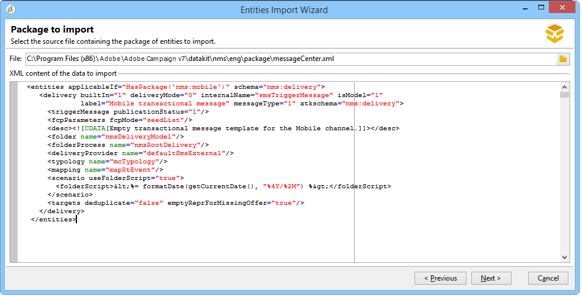

# Campaign Classicのビルトインパッケージのインストール{#installing-campaign-standard-packages}


## ビルトインパッケージについて {#campaign-standard-packages}

ビルトインパッケージには、ニーズや契約に応じてインストールできる一連の機能が含まれています。 Campaignの組み込みパッケージの完全なリストは、以下を参照してください。

>[!CAUTION]
>
>ライセンス契約に記載されているオプションに対応するパッケージのみをインストールできます。
>
>新しいパッケージをインストールすると、すべてのプラットフォームに影響する可能性があります。最終的なデプロイメントの前に、パッケージをテストして検証する必要があります。
>
>パッケージがインストールされると、アンインストールできません。
>
>ホスト型またはハイブリッド型のお客様は、Adobeに連絡して、新しいビルトインパッケージをデプロイしてください。

ビルトインパッケージをインストールするには：

1. Adobe Campaign クライアントコンソールの&#x200B;**[!UICONTROL ツール／高度なツール／パッケージをインポート]**&#x200B;から、パッケージインポートアシスタントにアクセスします。
1. 「**[!UICONTROL 標準パッケージをインストール]**」を選択します。
1. パッケージリストで、インストールするパッケージを確認します。
   >[!NOTE]
   >
   >パッケージがグレー表示されている場合は、そのパッケージが既にインストールされているか、インスタンスと互換性がないことを意味します。 互換性について詳しくは、以下の表を参照してください。
1. 「**[!UICONTROL 次へ]**」、「**[!UICONTROL 開始]**」の順にクリックして、パッケージのインストールを開始します。

   パッケージがインストールされると、進行状況バーに **100%** と表示され、インストールログに、「**[!UICONTROL パッケージが正常にインストールされました]**」と表示されます。

1. インストールウィンドウを&#x200B;**[!UICONTROL 閉じます]**。

パッケージがインストールされました。

### すぐに利用できるパッケージの一覧 {#list-of-standard-packages}

次の表に、Campaignのすべてのビルトインパッケージを示します。

<table> 
 <thead> 
  <tr> 
   <th> パッケージ </th> 
   <th> 説明 </th> 
   <th> インスタンスタイプ </th>
  </tr> 
 </thead> 
 <tbody> 
  <tr> 
   <td> 配信<br /> </td> 
   <td> メッセージの送信時に発生する配信と最終的な問題を監視します。 <a href="../../delivery/using/about-delivery-monitoring.md">詳細情報</a><br /> </td> 
   <td> すべて</td> 
  </tr> 
  <tr> 
   <td> マーケティングキャンペーン （キャンペーン） <br /> </td> 
   <td> コミュニケーションおよびマーケティング施策を定義、最適化、実行、分析。 <a href="https://experienceleague.adobe.com/docs/campaign/campaign-v8/campaigns/campaigns.html?lang=ja" target="_blank">詳細情報</a><br /> </td> 
   <td> マーケティング</td>
  </tr> 
  <tr> 
   <td> マーケティングリソース （MRM） <br /> </td> 
   <td> タスク、予算、マーケティングリソースの管理と追跡を提供することで、共同作業モードでのマーケティング活動を制御します。 <a href="https://experienceleague.adobe.com/docs/campaign/automation/mrm/about-marketing-resource-management.html?lang=ja" target="_blank">詳細情報</a> <br /> </td> 
   <td> マーケティング</td> 
  </tr> 
  <tr> 
   <td> オファーエンジン （インタラクション） <br /> </td> 
   <td> 特定の連絡先（顧客またはターゲット）とのインタラクション中に、1つまたは複数の適合したオファーを作成することで、リアルタイムで対応します。  オプション。 <a href="../../interaction/using/interaction-and-offer-management.md#packages-configuration">詳細情報</a> <br /> </td> 
   <td> すべて<br /> </td> 
  </tr> 
  <tr> 
   <td> 実行インスタンスによるオファーエンジンの制御。 オプション。<br /> </td> 
   <td> オファーエンジン（インタラクション）のコントロールインスタンスにインストールするパッケージ。 <a href="../../interaction/using/distributed-architectures.md#packages-configuration">詳細情報</a> </td> 
   <td> マーケティング <br /> </td>  
  </tr> 
  <tr> 
   <td> 実行インスタンス用のオファーエンジン。 オプション。<br /> </td> 
   <td> オファーエンジン（インタラクション）の実行インスタンスにインストールするパッケージ。 <a href="../../interaction/using/distributed-architectures.md">詳細情報</a> </td> 
   <td> 中間、実行<br /> </td>  
  </tr> 
  <!--
  tr> 
   <td> Lead Management (Leads) (deprecated)<br /> </td> 
   <td> Simplifies the process of building and maintaining the entire leads management life cycle. <br /> </td> 
   <td> Yes<br /> </td> 
   <td> Optional, <a href="https://helpx.adobe.com/campaign/kb/deprecated-and-removed-features.html">Learn More</a> </td> 
  </tr
  --> 
  <tr> 
   <td> ソーシャルネットワーク （ソーシャルマーケティング） <br /> </td> 
   <td> Adobe CampaignをX （旧Twitter）およびFacebookと同期します。 <a href="../../social/using/about-social-marketing.md">詳細情報</a> <br /> </td> 
   <td> すべて</td> 
  </tr> 
  <tr> 
   <td> トランザクションメッセージ制御（Message Center - Control） <br /> </td> 
   <td> 情報システムからトリガーされたイベントから生成されたトリガーメッセージを管理します。 オプション。 <a href="../../message-center/using/about-transactional-messaging.md">詳細情報</a> <br /> </td> 
   <td> マーケティング <br /> </td> 
  </tr> 
  <tr> 
   <td> トランザクションメッセージの実行（Message Center – 実行） <br /> </td> 
   <td> 可用性の向上と読み込み管理の強化： オプション。 <a href="../../message-center/using/about-transactional-messaging.md">詳細情報</a><br /> </td> 
   <td> 実行<br /> </td>
  </tr> 
  <tr> 
   <td> LINE チャネル<br /> </td> 
   <td> Adobe CampaignのLINE チャネルを使用して配信を送信します。 オプション。 トランザクションメッセージ（メッセージセンターパッケージ）が必須です。 <a href="../../delivery/using/line-channel.md">詳細情報</a> <br /> </td> 
   <td> すべて<br /> </td> 
  </tr> 
  <tr> 
   <td> ダイレクトメールチャネル <br /> </td> 
   <td> Adobe Campaignのダイレクトメールチャネルを使用して配信を送信します。 オプション。 <a href="../../delivery/using/about-direct-mail-channel.md">詳細情報</a><br /> </td> 
   <td> すべて<br /> </td>
  </tr> 
  <tr> 
   <td> モバイルチャネル （SMS） <br /> </td> 
   <td> Adobe Campaignのモバイル/SMS チャネルを使用して配信を送信します。 オプション。 <a href="../../delivery/using/sms-channel.md">詳細情報</a> <br /> </td> 
   <td> すべて<br /> </td> 
  </tr> 
   <tr> 
   <td> 電話チャネル <br /> </td> 
   <td> Adobe Campaignの電話チャネルを使用して配信を送信します。 コールセンターに使用。 オプション。 <a href="../../delivery/using/communication-channels.md">詳細情報</a> <br /> </td> 
   <td> すべて<br /> </td> 
  </tr> 
  <tr> 
   <td> モバイルアプリチャネル<br /> </td> 
   <td> Adobe Campaign プラットフォームを使用して、アプリを介してiOSおよびAndroid端末にパーソナライズされた通知を送信します。 オプション。 <a href="../../delivery/using/about-mobile-app-channel.md">詳細情報</a> <br /> </td> 
   <td> すべて<br /> </td> 
  </tr> 
  <tr> 
   <td> Content Manager<br /> </td> 
   <td> 定期的なニュースレターまたはweb サイトを作成し、メッセージを検証して公開します。 <a href="../../delivery/using/about-content-management.md">詳細情報</a> <br /> </td> 
   <td> </td>
  </tr> 
  <tr> 
   <td> オンライン調査（Survey Manager） <br /> </td> 
   <td> オンラインフォームを作成および管理して、プロファイル情報を追加または変更したり、購読したり、購読解除したり、競合他社のエントリフォームを作成します。 オプション。 <a href="../../surveys/using/about-surveys.md">詳細情報</a> <br /> </td> 
   <td> マーケティング <br /> </td> 
  </tr> 
  <tr> 
   <td> マーケティング分析<br /> </td> 
   <td> データの分析と測定、統計の計算、レポートの作成と計算の簡素化と最適化が可能です。 また、レポートを作成し、ターゲット母集団を構築することもできます。 オプション。 <a href="../../reporting/using/ac-cubes.md">詳細情報</a><br /> </td> 
   <td> マーケティング <br /> </td> 
  </tr> 
  <tr> 
   <td> Response Manager<br /> </td> 
   <td> マーケティングキャンペーンの成功と収益性を測定し、あらゆるコミュニケーションチャネルに対して提案を行うことができます。  オプション。 <a href="../../response/using/about-response-manager.md">詳細情報</a> <br /> </td> 
   <td> マーケティング <br /> </td> 
  </tr> 
  <tr> 
   <td> 外部データへのアクセス （Federated Data Access） <br /> </td> 
   <td> 1つ以上の外部データベースに保存されているデータを処理するために、Federated Data Access （FDA）オプションを提供します。これにより、Adobe Campaign データの構造を変更せずに外部データにアクセスできます。  オプション。 <a href="https://experienceleague.adobe.com/docs/campaign/automation/workflows/advanced-management/accessing-an-external-database-fda.html?lang=ja" target="_blank">詳細情報</a> <br /> </td> 
   <td> すべて<br /> </td> 
  </tr> 
  <tr> 
   <td> キャンペーンの最適化<br /> </td> 
   <td> 配信の送信を制御、フィルタリング、監視することで、送信されるメッセージが、会社のコミュニケーションポリシーに従って、顧客のニーズや期待に最適に対応します。 オプション。 <a href="https://experienceleague.adobe.com/docs/campaign/automation/campaign-optimization/campaign-typologies.html?lang=ja" target="_blank">詳細情報</a> <br /> </td> 
   <td> マーケティング <br /> </td> 
  </tr> 
  <tr> 
   <td> 配信品質の監視 (メールの配信品質)<br /> </td> 
   <td> バウンスしたり、迷惑メールとしてマークされたりすることなく、施策を受信者の受信トレイに送信して成果を測定。 オプション。 <a href="../../delivery/using/about-deliverability.md">詳細情報</a> <br /> </td> 
   <td> すべて </td> 
  </tr> 
  <tr> 
   <td> クーポン管理<br /> </td> 
   <td> 今後のマーケティングオファーに追加する一連のクーポンを作成します。 オプション。 <a href="https://experienceleague.adobe.com/docs/campaign/campaign-v8/send/personalize/personalized-coupons.html?lang=ja" target="_blank">詳細情報</a> <br /> </td> 
   <td> マーケティング <br /> </td> 
  </tr> 
  <tr> 
   <td> 受信トレイのレンダリング （IR） <br /> </td> 
   <td> メッセージを受信する可能性のある様々なコンテキストで送信されたメッセージをプレビューし、主要なデスクトップおよびアプリケーションの互換性を確認できます。 オプション。 <a href="../../delivery/using/inbox-rendering.md">詳細情報</a><br /> </td> 
   <td> マーケティング <br /> </td> 
  </tr> 
  <tr> 
   <td> 中央/ローカル マーケティング （分散型マーケティング） <br /> </td> 
   <td> 中央エンティティ（本社、マーケティング部門等）間の連携を図る。 ローカルエンティティ（セールスポイント、地域代理店など）。 オプション。 <a href="https://experienceleague.adobe.com/docs/campaign/automation/distributed-marketing/about-distributed-marketing.html?lang=ja" target="_blank">詳細情報</a><br /> </td> 
   <td> マーケティング </td> 
  </tr> 
  <tr> 
   <td> CRM コネクタ<br /> </td> 
   <td> は、Adobe Campaign プラットフォームをサードパーティシステムにリンクするための様々なCRM コネクタを提供します。  <a href="../../platform/using/crm-connectors.md">詳細情報</a> <br /> </td> 
   <td> マーケティング</td> 
  </tr> 
  <tr> 
   <td> Web Analytics コネクタ <br /> </td> 
   <td> Adobe CampaignとAdobe AnalyticsがWeb Analytics Connectors パッケージを介して対話できるようにします。 トランザクションメッセージ（メッセージセンターパッケージ）と互換性がありません。 <a href="../../integrations/using/gs-aa.md">詳細情報</a><br /> </td> 
   <td> マーケティング </td> 
  </tr> 
  <tr> 
   <td> AEMとの統合<br /> </td> 
   <td> AEMのコンテンツ編集機能とAdobe Campaignの配信機能を活用するために、Adobe Experience Managerでメール配信のコンテンツとフォームを直接管理できます。 <a href="../../integrations/using/about-adobe-experience-manager.md">詳細情報</a> <br /> </td> 
   <td> マーケティング</td> 
  </tr> 
  <tr> 
   <td> Adobe Experience Cloud Shared Audiences Integration<br /> </td> 
   <td> Adobe Experience Cloudのソリューションやアプリとオーディエンス/セグメントを交換および共有できます。 IMSが必要です。 <a href="../../integrations/using/sharing-audiences-with-adobe-experience-cloud.md">詳細情報</a> <br /> </td> 
   <td> マーケティング <br /> </td> 
  </tr> 
  <tr> 
   <td> Adobe Experience Cloud<br />との統合 </td> 
   <td> 様々なAdobe Experience Cloud ソリューションからAdobe Campaignにオーディエンス/セグメントをインポートおよびエクスポートできます。 オプション。 <a href="../../integrations/using/configuring-ims.md#installing-the-package">詳細情報</a> </td> 
   <td> マーケティング</td> 
  </tr> 
  <tr> 
   <td> プライバシーデータ保護規則<br /> </td> 
   <td> Campaign Classicのプライバシーコンプライアンスに役立つ追加機能が含まれています。 <a href="https://helpx.adobe.com/jp/campaign/kb/acc-privacy.html">詳細情報</a> <br /> </td> 
   <td> すべて</td> 
  </tr> 
  <tr> 
   <td> ミッドソーシング <br />に転送 </td> 
   <td> ミッドソーシングサーバーのインストールと設定、およびサードパーティがミッドソーシングモードでメッセージを送信できるようにするインスタンスのデプロイメントについて詳しく説明します。 オプション。 <a href="../../installation/using/mid-sourcing-server.md">詳細情報</a> <br /> </td> 
   <td> マーケティング </td> 
  </tr> 
  <tr> 
   <td> ミッドソーシングプラットフォーム<br /> </td> 
   <td> この設定は、ホスト型（ASP）設定と内部化の間の最適な中間ソリューションです。 外向きの実行コンポーネントは、Adobe Campaignでホストされている「ミッドソーシング」サーバー上で実行されます。 オプション。 <a href="../../installation/using/mid-sourcing-server.md">詳細情報</a> <br /> </td> 
   <td> ミッドソーシング </td> 
  </tr> 
  <tr> 
   <td> AMP サポート <br /> </td> 
   <td> 新しいインタラクティブ AMPをメール形式に使用し、動的なメールを送信できます。 オプション。 <a href="https://experienceleague.adobe.com/docs/campaign/campaign-v8/send/emails/defining-interactive-content.html?lang=ja" target="_blank">詳細情報</a> <br /> </td> 
   <td> すべて </td> 
  </tr> 
  <tr> 
   <td> ACS コネクタ （非推奨） <br /> </td> 
   <td> Adobe Campaign v7とAdobe Campaign Standardを橋渡しする。 Campaign v7 の統合機能で、Campaign Standard にデータを自動的にレプリケートして、両方のアプリケーションの優れた機能を連携させます。 オプション。<br /> </td> 
   <td> マーケティング </td> 
  </tr> 
 </tbody> 
</table>

### Message Center パッケージ {#message-center-package}

配信チャネル（電子メール、モバイルチャネル、モバイルアプリチャネル、LINEなど）をインストールする必要があります トランザクションメッセージ（メッセージセンターパッケージ）をインストールする前。 メールのみのMessage Center プロジェクトを開始し、その後に新しいチャネルを追加する必要がある場合は、次の手順に従う必要があります。

1. パッケージ読み込みアシスタント（**[!UICONTROL ツール/詳細/ パッケージを読み込み/ Adobe Campaign パッケージ]**）を使用して、新しいチャネル（例：**モバイルチャネル**）をインストールします。
1. ファイル（**[!UICONTROL ツール/詳細/パッケージの読み込み/ファイル]**）を読み込み、次を選択します。

   ```
   \datakit\nms\[Your language]\package\messageCenter.xml
   ```

1. インポートする&#x200B;**[!UICONTROL XML データコンテンツ]**&#x200B;で、関連するチャネルに対応するMessage Center配信テンプレートのみを保持します。 例えば、**モバイルチャネル**&#x200B;を追加した場合、**[!UICONTROL モバイルトランザクションメッセージ]** （smsTriggerMessage）テンプレートに対応する&#x200B;**entities**&#x200B;要素のみを保持します。 **モバイルアプリチャネル**&#x200B;を追加した場合、**iOS トランザクションメッセージ**&#x200B;のテンプレート（iosTriggerMessage）と&#x200B;**Android トランザクションメッセージ** （androidTriggerMessage）のみを保持します。

   


### [!DNL LINE] チャネル設定{#line-package}

[!DNL LINE] チャネルを設定するには、まず[!DNL LINE] パッケージをインストールする必要があります。

ミッドソーシング設定のコンテキストでは、次のことが必要です。

* Marketing インスタンスとMID インスタンスの両方に[!DNL LINE] パッケージをインストールします

* 配信モードを変更して、mkt インスタンスの[!DNL LINE]外部アカウントをミッドインスタンスを指すように設定します。 [詳細情報](../../delivery/using/line-channel.md#configure-line-external)

* MID インスタンスの外部アカウントで[!DNL LINE]資格情報を設定します。

>[!CAUTION]
>
>Message Center パッケージが[!DNL LINE]より前にインストールされている場合、[!DNL LINE] チャネルのMessage Center配信テンプレートは使用できません。