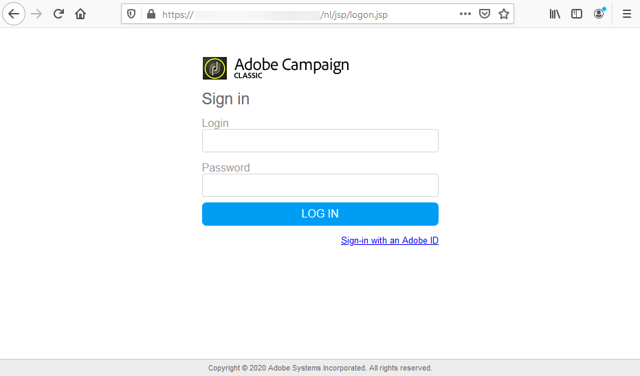

# クライアントコンソールのインストール{#installing-the-client-console}

Adobe Campaignコンソールのインストール手順を以下に示します。

Adobe Campaignコンソールをインストールする前に、互換表に記載されている前提条件を確 [認します](https://helpx.adobe.com/campaign/kb/compatibility-matrix.html)。

Adobe Campaignコンソールをインストールするには、次の手順を適用します。

1. ウェブブラウザを開き、次のアドレスからコンソールをダウンロードします。

   [`https://<your adobe campaign server>:<port number>/nl/jsp/logon.jsp`](https://machine/nl/jsp/logon.jsp)を参照してください。

1. IDウィンドウで、ログイン名とパスワードを入力します。

   

   必要に応じて、インスタンスの作成時に定義した内部アカウントの資格情報を使用します。

1. インストールペ **[!UICONTROL Download]** ージのリンクをクリックします。
1. クライアントセットアップファイルをダウンロードして保存します。
1. Windows上のコンピューターで、ダウンロードしたファイルを実行します。インストールが開始します。 クライアントコンソールのデフォルトのインストールパスは、 **$PROGRAMFILES$/Adobe/Adobe Campaign Classic vX Clientです。「X」は**「6」または「7」で、Adobe Campaignのバージョンに応じて変わります。
1. インストールプログラムが完了したら、Windowsメニュー( **[!UICONTROL Start]** Adobe Campaign **** プログラムグループ)からコンソールを起動します。

>[!NOTE]
>
>Windowsでは、Windowsサーバー上のディレクトリから **nlclient.exe** ()ファイルを直 `[INSTALL]/bin` 接起動できます。ここで、はAdobe Campaignのインストールフォルダーのア `[INSTALL]` クセスパスです。\
>新しい接続を作成するには、「インスタンスの作 [成とログオン」を参照してください](../../installation/using/creating-an-instance-and-logging-on.md)。

