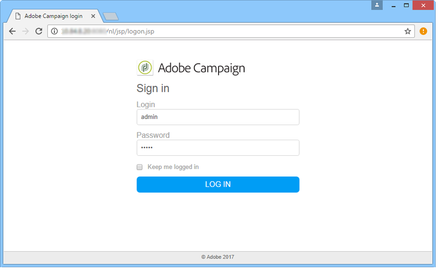
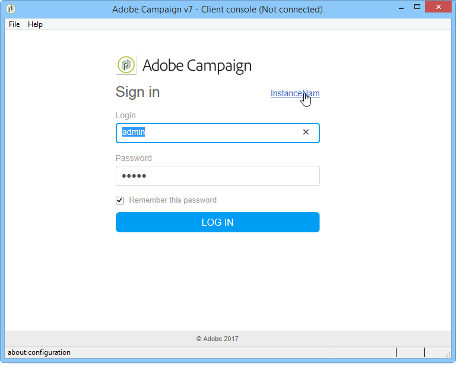
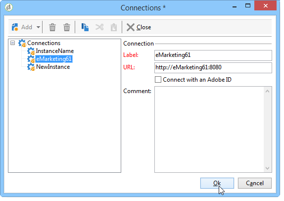

# Campaign クライアントコンソールのインストールと更新{#installing-the-client-console}

Campaign クライアントコンソールは、Campaign アプリケーションサーバーに接続できるリッチクライアントです。

クライアントコンソールのインストールを開始する前に、次の手順を実行する必要があります。

* お使いのシステムとツールについて、Adobe Campaign クライアントコンソールとの互換性を[互換性マトリックス](../../rn/using/compatibility-matrix.md#ClientConsoleoperatingsystems)で確認してください。
* Campaign サーバーの URL を取得する
* ユーザー資格情報を取得する
* Microsoft Edge Webview2 ランタイムがシステムにインストールされている（Campaign Classic 7.3 ビルド版から）。 [詳細情報](#webview)

クライアントコンソールをインストールまたは更新するプロセスは、Adobe Campaign Classicの実装によって異なります。
以下の詳細を確認して、導入に必要な要件を理解してください。

 [&#x200B; ビデオ &#x200B;](#video)でAdobe Campaign クライアントをインストールおよびセットアップする方法を説明します

>[!CAUTION]
>
>* Campaign クライアントコンソールとCampaign アプリケーションサーバーは、同じ製品バージョン **で**&#x200B;実行する必要があります。 Adobeでは、**同じ製品ビルド**&#x200B;を使用することを強くお勧めします。 Campaign クライアントとサーバーのバージョンを確認する方法については、[この節](../../platform/using/launching-adobe-campaign.md#getting-your-campaign-version)を参照してください。
>
>* コンソールがインストールされているインストールフォルダーへのアクセスは、目的のユーザーのみに制限し、書き込み権限を制限する必要があります。


## Microsoft Edge WebView2 ランタイムのインストール {#webview}

Campaign Classic 7.3 ビルドバージョン以降、コンソールのインストールには Microsoft Edge WebView2 ランタイムのインストールが必要です。

WebView は、Windows 11 オペレーティングシステムの一部としてデフォルトでインストールされます。 システムに既に存在しない場合は、[Campaign Classic Developer web サイト &#x200B;](https://www.adobe.com/go/acc-ms-webview2-runtime-download_jp)からダウンロードするよう求めるメッセージがMicrosoft Console インストーラーから表示されます。 Microsoft により Internet Explorer 11 ブラウザーのサポートが非推奨（廃止予定）となったので、Internet Explorer 11 ブラウザーではダウンロードリンクは機能しません。 別のブラウザーを使用してリンクにアクセスしてください。

## Adobeのホスト型実装 {#hosted-customers}

ホスト型のお客様は、クライアントコンソールをインストールまたは更新する2つのオプションがあります。

1. Adobeは直接デプロイできます。 コンソールが更新されると、ポップアップウィンドウで最新のクライアントコンソールのバージョンをダウンロードするように求められます。

1. [&#x200B; ソフトウェア配布](https://experience.adobe.com/#/downloads/content/software-distribution/jp/campaign.html)からクライアントコンソールにダウンロードできます

   **ユーザーは、更新を完了するには管理者アクセス権が必要です。 ユーザーに管理者権限がない場合、システム管理者はすべてのクライアントコンソールにデプロイする必要があります**

## ハイブリッドおよびオンプレミスの実装 {#hybrid-onprem-customers}

Adobe Campaign ユーザーが、作成および設定したインスタンスにログオンできるようにするには、クライアントコンソールを使用する必要があります。

### ユーザーがコンソールを利用できるようにします {#make-console-available}

Adobe Campaign アプリケーションサーバー（nlserver web）の起動に使用するコンピューターがクライアントコンソールからユーザー接続を受け取った場合、Adobe Campaign リッチクライアントのセットアッププログラムをHTML インターフェイス経由で利用できるように設定できます。 新しいバージョンのクライアントコンソールが使用可能になると、クライアントコンソールの起動時にダウンロードするようにユーザーが招待されます。

そのためには、次の手順を実行する必要があります。

1. コンソールのインストールプログラムを含むパッケージを選択します。

   このファイルはsetup-client-7.X.XXXX.exeと呼ばれます。XはAdobe Campaignのサブバージョン、XXXXはビルド番号です。

1. このパッケージをコピーして、/datakit/nl/eng/jspの下のAdobe Campaign インストールフォルダー（ハイブリッドインストール用のマーケティングサーバー上）に貼り付けます。

1. Adobe Campaign serverを起動します。


### この質問オプションに質問する必要はありません

Adobeでは、新しいバージョンのコンソールが使用可能になったときに、すべてのユーザーにアラートが通知されるようにするために、「**[!UICONTROL この質問に対する回答]**&#x200B;を選択解除しなくなります」オプションをオフにすることをお勧めします。  このオプションを選択すると、新しく利用可能になったバージョンは通知されません。

**[!UICONTROL この質問に対する質問]**&#x200B;が選択されていない場合は、このプロンプトをリセットできます。 Windows レジストリの編集に慣れているシステム管理者のみが、次の変更を行う必要があります。

1. **[!UICONTROL 開始/実行]** メニューから&#x200B;**regedit** コマンドを使用してレジストリエディターを開きます。

1. ノードを検索して展開します。

   ```
   \HKEY_CURRENT_USER\Software\Neolane\NL_6\nlclient
   ```

1. **confAdvisedUpgrade** エントリを削除し、レジストリエディターを閉じます。

>[!NOTE]
>
>更新されたコンソールを既存の実装に適用する場合、ユーザーはクライアントコンソールを更新するためのプロンプトを自動的に受け取ります。 Campaignを初めて実装する場合は、ユーザーがコンソールをダウンロードする必要があります。 両方のオプションについて詳しくは、以下を参照してください

### 既存の実装のコンソールを更新する{#update-the-client-console}

コンソールがCampaign サーバーフォルダーで使用可能になると、ポップアップウィンドウで最新のクライアントコンソールバージョンをダウンロードするように求められます。

**ユーザーは、更新を完了するには管理者アクセス権が必要です。 ユーザーに管理者権限がない場合、システム管理者はすべてのクライアントコンソールにデプロイする必要があります**


### 新しい実装のためにコンソールをダウンロード{#download-the-client-console}

ユーザーは、次の手順に従って、コンソールをダウンロードしてインストールする必要があります。

1. Web ブラウザーを開き、次のアドレスからコンソールをダウンロードします。

   `https://<your adobe campaign server>:<port number>/nl/jsp/logon.jsp` を参照してください。

1. ID ウィンドウで、ログインとパスワードを入力します。

   

   必要に応じて、インスタンス作成時に定義された内部アカウントの資格情報を使用します。

1. インストールページの「**[!UICONTROL ダウンロード]**」リンクをクリックします。
1. クライアント設定ファイルをダウンロードして保存します。
1. Windows上のコンピュータ上でダウンロードしたファイルを実行します。インストールが起動します。 クライアントコンソールのデフォルトのインストールパスは&#x200B;**$PROGRAMFILES$/Adobe/Adobe Campaign Classic vX Client**&#x200B;です。Adobe Campaignのバージョンに応じて、「X」は「6」または「7」です。

### 接続の作成 – 初回ユーザーのみ{#create-the-connection}

クライアントコンソールをインストールしたら、次の手順に従ってアプリケーションサーバーへの接続を作成します。

1. **Adobe Campaign** プログラムグループのWindows **[!UICONTROL 開始]** メニューからコンソールを起動します。

1. 資格情報フィールドの右上隅にあるリンクをクリックして、接続設定ウィンドウにアクセスします。

   

1. **[!UICONTROL 追加／接続]**&#x200B;をクリックし、Adobe Campaign アプリケーションサーバーのラベルと URL を入力します。

   

1. URL 経由で Adobe Campaign アプリケーションサーバーへの接続を指定します。 DNS、マシンのエイリアス、または IP アドレスを使用します。

   例えば、`https://<machine>.<domain>.com` タイプの URL を使用できます。

1. Adobe IMSが組織に設定されている場合は、「**[!UICONTROL Adobe IDと連携する]**」オプションを確認します

1. 「**[!UICONTROL OK]**」をクリックして設定を保存します。

例えば、テスト、ステージ、本番環境に接続するために必要な数の接続を追加できます。

>[!NOTE]
>
>「**[!UICONTROL 追加]**」ボタンを使用すると、すべての接続を整理する&#x200B;**[!UICONTROL フォルダー]**&#x200B;を作成できます。 各接続をフォルダーにドラッグ＆ドロップします。

### Adobe Campaign へのログオン

既存のインスタンスにログオンするには、以下の手順に従います。

1. **Adobe Campaign** プログラムグループのWindows **[!UICONTROL 開始]** メニューからコンソールを起動します。

1. 資格情報フィールドの右上隅にあるリンクをクリックして、接続設定ウィンドウにアクセスします。

1. ログインする必要がある Campaign インスタンスを選択します。

1. **[!UICONTROL OK]**&#x200B;をクリック

1. ユーザーのログイン資格情報を入力し、**[!UICONTROL ログイン]**&#x200B;をクリックします

>[!NOTE]
>
>Campaign Classic 7.3 ビルドバージョンでは、Adobe Campaign クライアントコンソールは、プロキシ認証中にプロキシ資格情報を 2 回要求する場合があります。 これは、Internet Explorer とは異なり、Microsoft Edge WebView2 がプロキシ資格情報をキャッシュ／パスワードストアに保存しないためです。

**関連トピック**

* [&#x200B; インスタンスを作成して](../../installation/using/creating-an-instance-and-logging-on.md)にログオンします。
* [互換性マトリックス](https://helpx.adobe.com/jp/campaign/kb/compatibility-matrix.html)

## チュートリアルビデオ

このビデオでは、Adobe Campaign クライアントをインストールして設定する方法を説明します。

>[!VIDEO](https://video.tv.adobe.com/v/35124?quality=12)

Campaign Classic に関するその他のハウツービデオは[こちら](https://experienceleague.adobe.com/docs/campaign-classic-learn/tutorials/overview.html?lang=ja)で参照できます。
