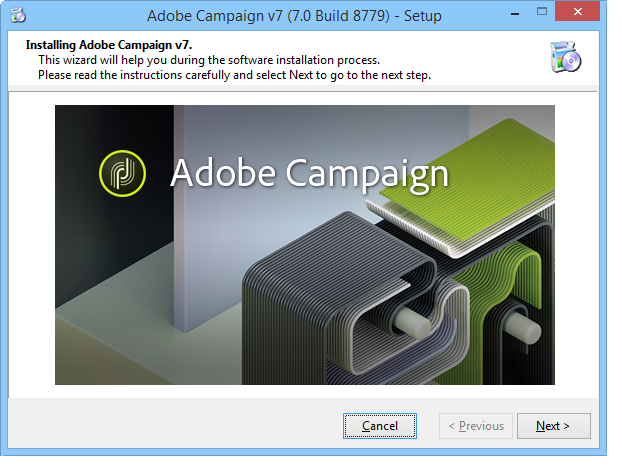
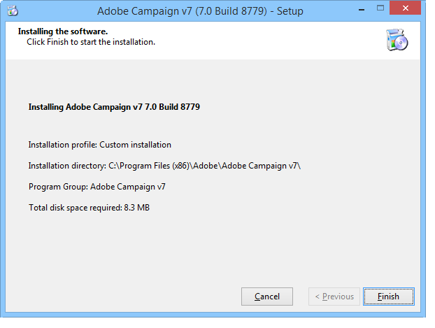
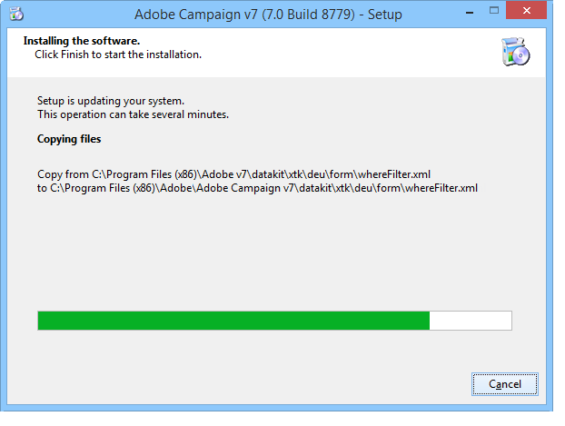

# サーバーのインストール{#installing-the-server}

## インストールプログラムの実行 {#executing-the-installation-program}

Windows 32ビットプラットフォームの場合は、Adobe Campaign 32ビットをインストールします。 Windows 64ビットプラットフォームの場合は、Adobe Campaign 64ビットをインストールします。

Adobe Campaignサーバーのインストール手順は次のとおりです。

1. ファイル **setup.exeを実行します**。

   

1. インストールの種類を選択します。

   

   次のインストールタイプを使用できます。

   * **[!UICONTROL Installation of an application server]** :Adobe Campaignアプリケーションサーバーとクライアントコンソールをインストールします。
   * **[!UICONTROL Minimal installation (Network)]** :ネットワークからのクライアントコンピューターのインストール。 必要に応じて、限られた数のDLLのみがコンピュータにインストールされ、その他のすべてのコンポーネントがネットワークドライブから使用されます。
   * **[!UICONTROL Installation of a client]** :Adobe Campaignクライアントに必要なコンポーネントのインストール。
   * **[!UICONTROL Custom installation]** :ユーザは、インストールする要素を選択します。
   「 **Installation of application server**」を選択し、次に示す別の手順に従います。

   

1. インストールディレクトリを選択します。

   

1. Click **[!UICONTROL Finish]** to start the installation:

   

   プログレスバーには、インストールの範囲が表示されます。

   

   インストールが完了すると、次の内容を知らせるメッセージが表示されます。

   

   >[!NOTE]
   >
   >サーバのインストールが完了したら、ネットワークの問題を回避するために、サーバの再起動が必要です。

   インストールが完了したら、Adobe Campaignを起動して設定ファイルを作成します。 「サーバ [ーの最初の起動」を参照](#first-start-up-of-the-server)。

## インストールの概要テスト {#summary-installation-testing}

次のコマンドを使用して、初期インストールをテストできます。

```
nlserver pdump
```

Adobe Campaignが開始されていない場合の応答は次のとおりです。

```
No task
```

## サーバーの初回起動 {#first-start-up-of-the-server}

インストールテストが完了したら、メニューからコマンドプロンプトを **[!UICONTROL Start > Programs > Adobe Campaign]** 開き、次のコマンドを入力します。

```
nlserver web
```


インストールディレクトリ内のファイルは、Adobe Campaignサーバーモジュールの設定に使用されます。

次の情報が表示されます。

```
15:30:12 >   Application server for Adobe Campaign Classic (7.X YY.R build XXX@SHA1) of DD/MM/YYYY
15:30:12 >   Web server start (pid=664, tid=4188)...
15:30:12 >   Creation of server configuration file '[INSTALL]bin..confserverConf.xml' server via '[INSTALL]bin..conffraserverConf.xml.sample
15:30:12 >   Creation of server configuration file '[INSTALL]bin..confconfig-default.xml' server via '[INSTALL]bin..confmodelsconfig-default.xml
15:30:12 >   Server started
15:30:12 >   Stop requested (pid=664)
15:30:12 >   Web server stop (pid=664, tid=4188)...
```

Ctrl + cキ **ーを押して** 、処理を停止し、次のコマンドを入力します。

```
nlserver start web
```

次の情報が表示されます。

```
12:17:21 >   Application server for Adobe Campaign Classic (7.X YY.R build XXX@SHA1) of DD/MM/YYYY
12:17:21 >   Start of the 'web@default' ('nlserver web -tracefile:web@default -instance:default -detach -tomcat -autorepair') task in a new process 
12:17:21 >   Application server for Adobe Campaign Classic (7.X YY.R build XXX@SHA1) of DD/MM/YYYY
12:17:21 >   Web server start (pid=29188, tid=-1224824320)...
12:17:21 >   Generation of configuration changes '[INSTALL]bin..confserverConf.xml.diff' between '[INSTALL]bin..confserverConf.xml' and '[INSTALL]bin..conffraserverConf.xml.sample'
12:17:22 >   Tomcat started
12:17:22 >   Server started
```

これを停止するには、次のように入力します。

```
nlserver stop web
```

次の情報が表示されます。

```
12:18:31 >   Application server for Adobe Campaign Classic (7.X YY.R build XXX@SHA1) of DD/MM/YYYY
12:18:31 >   Stop requested for 'web@default' ('nlserver web -tracefile:web@default -instance:default -detach -tomcat -autorepair', pid=29188, tid=-1224824320)...
12:18:31 >   Stop requested (pid=29188)
12:18:31 >   Web server stopped (pid=29188, tid=-1224824320)...
```

## 内部識別子のパスワード {#password-for-the-internal-identifier}

Adobe Campaignサーバーは、すべてのインスタンスに対してすべての権限を持つ **internal** （内部）と呼ばれる技術的なログインを定義します。 インストール直後に、ログインにパスワードが設定されていません。 1つを定義する必要があります。

内部識別子を参 [照してください](../../installation/using/campaign-server-configuration.md#internal-identifier)。

## Adobe Campaignサービスの起動 {#starting-adobe-campaign-services}

Adobe Campaignサービスを開始するには、サービスマネージャーを使用するか、コマンドラインで次の情報を適切な権限で入力します。

```
net start nlserver6
```

後でAdobe Campaignプロセスを停止する必要がある場合は、次のコマンドを使用します。

```
net stop nlserver6
```

## LibreOfficeのインストール {#installing-libreoffice}

例えば、https://www.libreoffice.org/download/libreoffice-fresh/からLibreOfficeをダウンロードし [て](https://www.libreoffice.org/download/libreoffice-fresh/) 、通常のインストール手順に従います。

次の環境変数を追加します。

```
OOO_BASIS_INSTALL_DIR="C:\Program Files (x86)\LibreOffice 5\"
```

