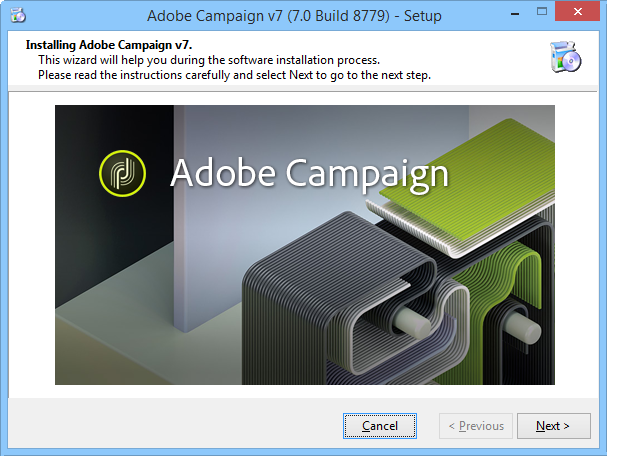
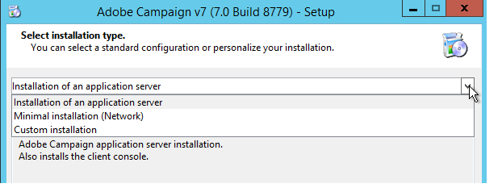
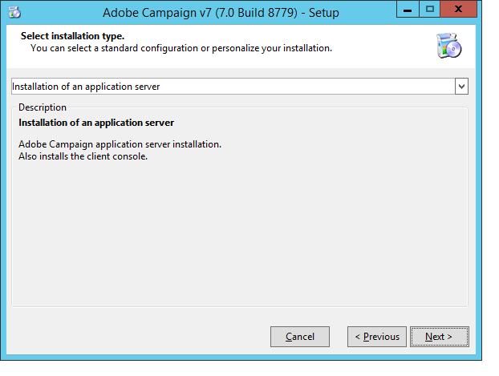
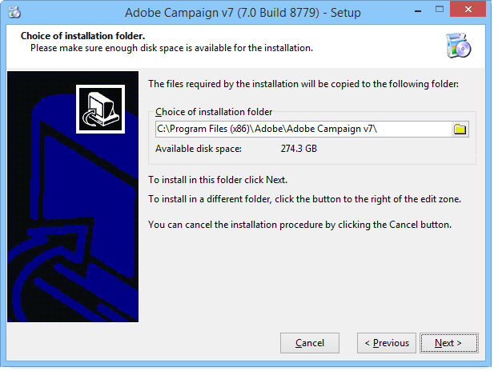
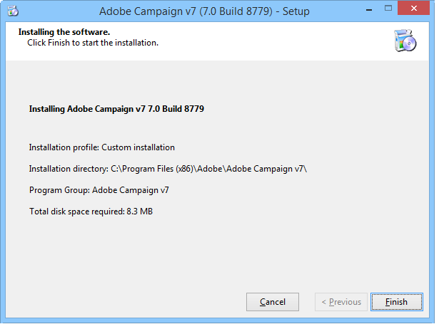
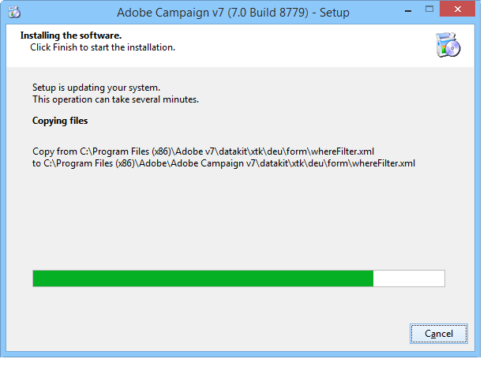
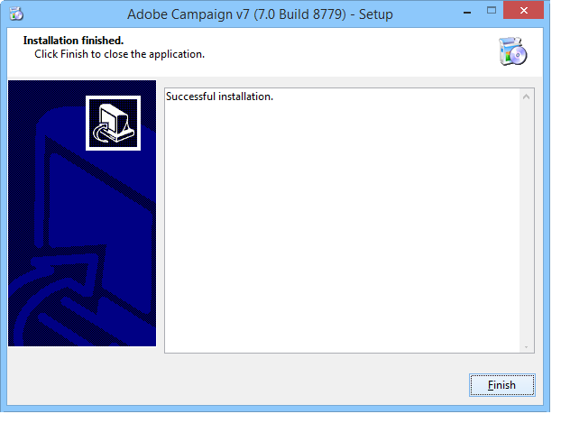

# サーバーのインストール{#installing-the-server}

## インストールプログラムの実行 {#executing-the-installation-program}

Adobe Campaign サーバーのインストール手順は次のとおりです。

1. ファイル **setup.exe**&#x200B;を実行します。

   

1. インストールタイプを選択します。

   

   いくつかのインストールタイプを使用できます。

   * **[!UICONTROL アプリケーションサーバーのインストール]** :Adobe Campaign アプリケーションサーバーとクライアントコンソールをインストールします。
   * **[!UICONTROL 最小インストール （ネットワーク）]**：ネットワークからのクライアントコンピューターのインストール。 必要に応じて、限られた数のDLLのみがコンピューターにインストールされ、他のすべてのコンポーネントがネットワークドライブから使用されます。
   * **[!UICONTROL クライアントのインストール]** :Adobe Campaign クライアントに必要なコンポーネントのインストール。
   * **[!UICONTROL カスタムインストール]**：ユーザーはインストールする要素を選択します。

   「**アプリケーションサーバーのインストール**」を選択し、次に示すさまざまな手順を実行します。

   

1. インストールディレクトリを選択します。

   

1. 「**[!UICONTROL 完了]**」をクリックして、インストールを開始します。

   

   プログレスバーには、インストールの距離が表示されます。

   

   インストールが完了すると、次のメッセージが表示されます。

   

   >[!NOTE]
   >
   >サーバーのインストールが完了したら、ネットワークの問題を回避するためにサーバーの再起動が必要です。

   インストールが完了したら、Adobe Campaignを起動して設定ファイルを作成します。 サーバー](#first-start-up-of-the-server)の[最初の起動を参照してください。

## インストールテストの概要 {#summary-installation-testing}

次のコマンドを使用して、初期インストールをテストできます。

```sql
nlserver pdump
```

Adobe Campaignが開始されない場合、応答は次のとおりです。

```sql
No task
```

## サーバーの最初の起動 {#first-start-up-of-the-server}

インストールテストが完了したら、**[!UICONTROL スタート/プログラム/Adobe Campaign]** メニューでコマンドプロンプトを開き、次のコマンドを入力します。

```sql
nlserver web
```

インストールディレクトリ内のファイルは、Adobe Campaign サーバーモジュールの設定に使用されます。

次の情報が表示されます。

```sql
15:30:12 >   Application server for Adobe Campaign Classic (7.X YY.R build XXX@SHA1) of DD/MM/YYYY
15:30:12 >   Web server start (pid=664, tid=4188)...
15:30:12 >   Creation of server configuration file '[INSTALL]bin..confserverConf.xml' server via '[INSTALL]bin..conffraserverConf.xml.sample
15:30:12 >   Creation of server configuration file '[INSTALL]bin..confconfig-default.xml' server via '[INSTALL]bin..confmodelsconfig-default.xml
15:30:12 >   Server started
15:30:12 >   Stop requested (pid=664)
15:30:12 >   Web server stop (pid=664, tid=4188)...
```

**Ctrl+C**&#x200B;を押してプロセスを停止し、次のコマンドを入力します。

```sql
nlserver start web
```

次の情報が表示されます。

```sql
12:17:21 >   Application server for Adobe Campaign Classic (7.X YY.R build XXX@SHA1) of DD/MM/YYYY
12:17:21 >   Start of the 'web@default' ('nlserver web -tracefile:web@default -instance:default -detach -tomcat -autorepair') task in a new process 
12:17:21 >   Application server for Adobe Campaign Classic (7.X YY.R build XXX@SHA1) of DD/MM/YYYY
12:17:21 >   Web server start (pid=29188, tid=-1224824320)...
12:17:21 >   Generation of configuration changes '[INSTALL]bin..confserverConf.xml.diff' between '[INSTALL]bin..confserverConf.xml' and '[INSTALL]bin..conffraserverConf.xml.sample'
12:17:22 >   Tomcat started
12:17:22 >   Server started
```

停止するには、次のように入力します。

```sql
nlserver stop web
```

次の情報が表示されます。

```sql
12:18:31 >   Application server for Adobe Campaign Classic (7.X YY.R build XXX@SHA1) of DD/MM/YYYY
12:18:31 >   Stop requested for 'web@default' ('nlserver web -tracefile:web@default -instance:default -detach -tomcat -autorepair', pid=29188, tid=-1224824320)...
12:18:31 >   Stop requested (pid=29188)
12:18:31 >   Web server stopped (pid=29188, tid=-1224824320)...
```

## 内部識別子のパスワード {#password-for-the-internal-identifier}

Adobe Campaign サーバーは、すべてのインスタンスに対するすべての権限を持つ&#x200B;**internal**&#x200B;というテクニカルログインを定義します。 インストール直後に、ログインにパスワードがありません。 1を定義することは必須です。

詳しくは、[こちら](../../installation/using/configuring-campaign-server.md#internal-identifier)を参照してください。

## Adobe Campaign サービスの開始 {#starting-adobe-campaign-services}

Adobe Campaign サービスを開始するには、サービスマネージャーを使用するか、コマンドラインで次のように入力します（適切な権限を持つ）。

```sql
net start nlserver6
```

後でAdobe Campaign プロセスを停止する必要がある場合は、次のコマンドを使用します。

```sql
net stop nlserver6
```

## LibreOfficeのインストール {#installing-libreoffice}

LibreOfficeをダウンロードし、通常のインストール手順に従います。

次の環境変数を追加します。

```sql
OOO_BASIS_INSTALL_DIR="C:\Program Files (x86)\LibreOffice 6\"
```
