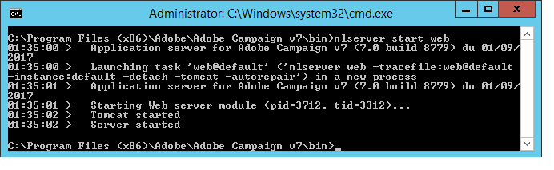

# サーバーのインストール{#installing-the-server}


## インストールプログラムの実行 {#executing-the-installation-program}

Windows 32 ビットプラットフォームの場合は、Adobe Campaign 32 ビットをインストールします。 Windows 64 ビットプラットフォームの場合は、Adobe Campaign 64 ビットをインストールします。

Adobe Campaignサーバーのインストール手順は次のとおりです。

1. ファイル **setup.exe** を実行します。

   

1. インストールの種類を選択します。

   

   次のインストールタイプを使用できます。

   * **[!UICONTROL アプリケーションサーバーのインストール]** :Adobe Campaignアプリケーションサーバーとクライアントコンソールをインストールします。
   * **[!UICONTROL 最小インストール（ネットワーク）]** :ネットワークからのクライアントコンピューターのインストール。必要に応じて、限られた数の DLL のみがコンピュータにインストールされ、その他のすべてのコンポーネントはネットワークドライブから使用されます。
   * **[!UICONTROL クライアントのインストール]** :Adobe Campaignクライアントに必要なコンポーネントのインストール。
   * **[!UICONTROL カスタムインストール]** :ユーザーは、インストールする要素を選択します。

   「**アプリケーションサーバーのインストール**」を選択し、次に示すように、別の手順を実行します。

   

1. インストールディレクトリを選択します。

   

1. **[!UICONTROL Finish]** をクリックして、インストールを開始します。

   

   進行状況バーには、インストールの範囲が表示されます。

   

   インストールが完了すると、次の情報を知らせるメッセージが表示されます。

   

   >[!NOTE]
   >
   >サーバーのインストールが完了したら、ネットワークの問題を回避するために、サーバーの再起動が必要です。

   インストールが完了したら、Adobe Campaignを起動して設定ファイルを作成します。 [ サーバーの最初の起動 ](#first-start-up-of-the-server) を参照してください。

## インストールの概要テスト {#summary-installation-testing}

次のコマンドを使用して、初期インストールをテストできます。

```
nlserver pdump
```

Adobe Campaignが起動されていない場合の応答は次のようになります。

```
No task
```

## サーバーの最初の起動 {#first-start-up-of-the-server}

インストールテストが完了したら、**[!UICONTROL スタート/プログラム/Adobe Campaign]** メニューからコマンドプロンプトを開き、次のコマンドを入力します。

```
nlserver web
```



インストールディレクトリ内のファイルを使用して、Adobe Campaignサーバーモジュールを設定します。

次の情報が表示されます。

```
15:30:12 >   Application server for Adobe Campaign Classic (7.X YY.R build XXX@SHA1) of DD/MM/YYYY
15:30:12 >   Web server start (pid=664, tid=4188)...
15:30:12 >   Creation of server configuration file '[INSTALL]bin..confserverConf.xml' server via '[INSTALL]bin..conffraserverConf.xml.sample
15:30:12 >   Creation of server configuration file '[INSTALL]bin..confconfig-default.xml' server via '[INSTALL]bin..confmodelsconfig-default.xml
15:30:12 >   Server started
15:30:12 >   Stop requested (pid=664)
15:30:12 >   Web server stop (pid=664, tid=4188)...
```

**Ctrl+C** キーを押してプロセスを停止し、次のコマンドを入力します。

```
nlserver start web
```

次の情報が表示されます。

```
12:17:21 >   Application server for Adobe Campaign Classic (7.X YY.R build XXX@SHA1) of DD/MM/YYYY
12:17:21 >   Start of the 'web@default' ('nlserver web -tracefile:web@default -instance:default -detach -tomcat -autorepair') task in a new process 
12:17:21 >   Application server for Adobe Campaign Classic (7.X YY.R build XXX@SHA1) of DD/MM/YYYY
12:17:21 >   Web server start (pid=29188, tid=-1224824320)...
12:17:21 >   Generation of configuration changes '[INSTALL]bin..confserverConf.xml.diff' between '[INSTALL]bin..confserverConf.xml' and '[INSTALL]bin..conffraserverConf.xml.sample'
12:17:22 >   Tomcat started
12:17:22 >   Server started
```

停止するには、次のように入力します。

```
nlserver stop web
```

次の情報が表示されます。

```
12:18:31 >   Application server for Adobe Campaign Classic (7.X YY.R build XXX@SHA1) of DD/MM/YYYY
12:18:31 >   Stop requested for 'web@default' ('nlserver web -tracefile:web@default -instance:default -detach -tomcat -autorepair', pid=29188, tid=-1224824320)...
12:18:31 >   Stop requested (pid=29188)
12:18:31 >   Web server stopped (pid=29188, tid=-1224824320)...
```

## 内部識別子のパスワード {#password-for-the-internal-identifier}

Adobe Campaignサーバーでは、**内部** と呼ばれる技術的なログインが定義され、すべてのインスタンスに対するすべての権限を持ちます。 インストール直後に、ログインにパスワードが含まれていません。 定義する必要があります。

詳しくは、[この節](../../installation/using/configuring-campaign-server.md#internal-identifier)を参照してください。

## Adobe Campaignサービスの開始 {#starting-adobe-campaign-services}

Adobe Campaignサービスを開始するには、サービスマネージャーを使用するか、（適切な権限を持つ）コマンドラインで次のように入力します。

```
net start nlserver6
```

後でAdobe Campaignプロセスを停止する必要がある場合は、次のコマンドを使用します。

```
net stop nlserver6
```

## LibreOffice のインストール {#installing-libreoffice}

LibreOffice を ( 例えば [https://www.libreoffice.org/download/libreoffice-fresh/](https://www.libreoffice.org/download/libreoffice-fresh/) から ) ダウンロードし、通常のインストール手順に従います。

次の環境変数を追加します。

```
OOO_BASIS_INSTALL_DIR="C:\Program Files (x86)\LibreOffice 6\"
```
