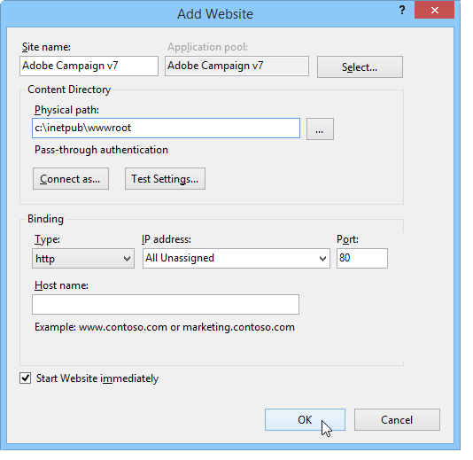
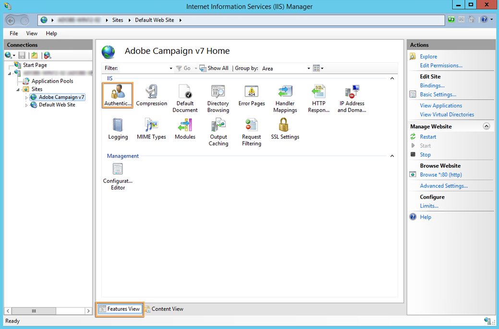
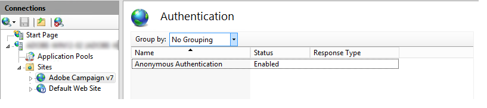

# Windows用Web サーバーへの統合 {#integration-into-a-web-server-for-windows}

Adobe Campaignには、HTTP （およびSOAP）を介してアプリケーションサーバーのエントリポイントとして機能するApache Tomcatが含まれています。

この統合されたTomcat サーバーを使用して、HTTP リクエストを処理できます。

この場合：

* デフォルトのリスニングポートは8080です。 変更する場合は、[このセクション &#x200B;](../../installation/using/configure-tomcat.md)を参照してください。
* 次に、クライアントコンソールは、```https:// `<computer>`:8080```などのURLを使用して接続します。

ただし、セキュリティと管理上の理由から、Adobe Campaignを実行しているコンピューターがインターネット上に公開され、ネットワーク外でコンソールへのアクセスを開く場合は、HTTP トラフィックのメインエントリポイントとして専用Web サーバーを使用することをお勧めします。

Web サーバーでは、HTTPs プロトコルによるデータの機密性を保証することもできます。

同様に、Web サーバー拡張機能モジュールとしてのみ使用できるトラッキング機能を使用する場合は、Web サーバーを使用する必要があります。

## IIS Web サーバーの設定 {#configuring-the-iis-web-server}

Microsoft IIS Web サーバーの設定手順は、主にグラフィックです。 Web サイトを使用して、Java （.jsp）ファイル、スタイルシート（.css、.xsl）、画像（.png）、リダイレクト用のISAPI DLLなど、Adobe Campaign サーバーのリソースにアクセスする必要があります。


### 設定の手順 {#configuration-steps}

Adobe CampaignをMicrosoft IIS web サーバーと統合するには、次の手順に従います。

1. Microsoft IISを開きます。
1. ネットワークのパラメーター（TCP接続ポート、DNS ホスト、IP アドレス）に応じて、サイト（Adobe Campaignなど）を作成して設定します。

   少なくとも、サイトの名前と仮想ディレクトリへのアクセスパスを指定する必要があります。 Web サイト ディレクトリにアクセスするためのパスは使用されないので、次のディレクトリを使用できます。

   ```
   C:\inetpub\wwwroot
   ```

   

1. **VBS** スクリプトを使用すると、先ほど作成したバーチャル ディレクトリでAdobe Campaign サーバーが使用するリソースを自動的に設定できます。 起動するには、`[INSTALL]\conf` フォルダーにある&#x200B;**iis_neolane_setup.vbs** ファイルをダブルクリックします。ここで、`[INSTALL]`はAdobe Campaign インストールフォルダーにアクセスするためのパスです。

   >[!NOTE]
   >
   >VBS スクリプトを実行するには、管理者としてログインするか、管理者としてスクリプトを実行する必要があります。

   Web サーバーがトラッキング リダイレクト サーバーとして使用されている場合は、**[!UICONTROL OK]**&#x200B;をクリックします。そうでない場合は、**[!UICONTROL キャンセル]**&#x200B;をクリックします。

   Web サーバーで複数のサイトが既に設定されている場合、インストールが適用されるWeb サイトを指定する中間ページが表示されます。サイトにリンクされている番号を入力し、**[!UICONTROL OK]**&#x200B;をクリックします。

1. 「**[!UICONTROL コンテンツ表示]**」タブで、Adobe Campaign リソースを使用してWeb サイトが正しく設定されていることを確認します。

   ツリーが表示されない場合は、Microsoft IISを再起動します。

### 権限の管理 {#managing-rights}

次に、ISAPI DLLおよびAdobe Campaign インストールディレクトリのリソースのセキュリティ設定を行う必要があります。

それには、次の手順に従います。

1. 「**[!UICONTROL 機能ビュー]**」タブを選択し、**認証** リンクをダブルクリックします。

   

1. Web サイトの「**ディレクトリセキュリティ**」タブで、匿名アクセスが有効になっていることを確認します。 必要に応じて、**[!UICONTROL 編集]** リンクをクリックして、設定を変更します。

   

### Web サーバーの起動と設定のテスト {#launching-the-web-server-and-testing-the-configuration}

次に、設定が正しいかどうかをテストする必要があります。

これを行うには、次の手順を適用します。

1. **iisreset** コマンドラインを使用して、Microsoft IIS サーバーを再起動します。

1. Adobe Campaign サービスを開始し、実行中であることを確認します。

1. Web ブラウザーに次のURLを挿入して、トラッキングモジュールをテストします。

   ```
   https://<computer>/r/test
   ```

   ブラウザーには、次の応答が表示されます。

   ```
   <redir status='OK' date='YYYY/MM/DD HH:MM:SS' build='XXXX' host='myserver.mydomain.com' localHost='localhost'/>
   ```

リダイレクトモジュールが存在するかどうかをテストするには、次のコマンドラインを実行します。

```
nlserver pdump
```

次の情報を返す必要があります。

```sql
HH:MM:SS >   Application server for Adobe Campaign Classic (7.X YY.R build XXX@SHA1) of DD/MM/YYYY
webmdl@default (1644) - 18.2 Mo
```

ISAPI DLLが正しく読み込まれていることを確認することもできます。

それには、次の手順に従います。

1. **[!UICONTROL ドライバーマッピング]** アイコンをクリックして、Adobe Campaign サイトのISAPI フィルターを編集します。
1. ISAPI フィルターのコンテンツを確認します。


## アップロードファイルサイズの制限の変更 {#changing-the-upload-file-size-limit}

IIS Web サーバーを設定する場合、サーバーにアップロードされるセットファイルの上限は約28 MBです。

Adobe Campaignでは、この制限を超えるファイルをアップロードする場合に特に影響を与える可能性があります。

例えば、ワークフローで&#x200B;**データ読み込み（ファイル）**&#x200B;型アクティビティを使用して50 MBのファイルを読み込むと、エラーによりワークフローが正しく実行されなくなります。

この場合は、この制限を増やす必要があります。

このMicrosoft IIS オプションについて詳しくは、[Microsoft ドキュメント &#x200B;](https://learn.microsoft.com/en-us/iis/configuration/system.webServer/security/requestFiltering/requestLimits/){target="_blank"}の「方法」セクションを参照してください。

