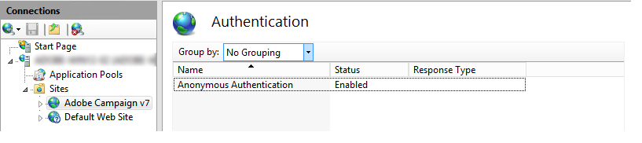

# Windows 用 Web サーバーへの統合{#integration-into-a-web-server-for-windows}


Adobe Campaignには、HTTP （および SOAP）経由でアプリケーションサーバーへのエントリポイントとして機能する Apache Tomcat が含まれています。

この統合 Tomcat サーバーを使用して、HTTP リクエストを提供できます。

この場合の解決策は、次のとおりです。

* デフォルトのリスニングポートは 8080 です。 変更するには、を参照してください。 [この節](../../installation/using/configure-tomcat.md).
* その後、クライアントコンソールは、次のような URL を使用して接続します ```https:// `<computer>`:8080```.

ただし、セキュリティおよび管理上の理由から、Adobe Campaignを実行しているコンピューターがインターネットに公開され、ネットワークの外部にあるコンソールにアクセスする場合は、HTTP トラフィックの主なエントリポイントとして専用の web サーバーを使用することをお勧めします。

また、web サーバーを使用すると、HTTP プロトコルでデータの機密性を保証できます。

同様に、トラッキング機能を使用する場合は、web サーバーを使用する必要があります。この機能は、web サーバー拡張機能モジュールとしてのみ使用できます。

>[!NOTE]
>
>トラッキング機能を使用しない場合は、Campaign へのリダイレクトを使用して Apache または IIS の標準インストールを実行できます。 トラッキング web サーバー拡張機能モジュールは必須ではありません。

## IIS Web サーバーの設定 {#configuring-the-iis-web-server}

IIS Web サーバの設定手順は、大部分がグラフィカルです。 このツールでは、Web サイト（既に作成済みまたは作成保留中）を使用して、Adobe Campaign サーバーのリソース（Java （.jsp） ファイル、スタイルシート （.css、.xsl）、イメージ （.png）、リダイレクト用の ISAPI DLL など）にアクセスします。

以下のセクションでは、IIS 7 での設定について詳しく説明します。 IIS8 の設定は基本的に同じです。

Web IIS サーバーがまだコンピュータにインストールされていない場合は、 **[!UICONTROL 追加/プログラムを削除/Windows 機能を有効または無効にする]** メニュー。

IIS 7 では、標準のサービスに加えて、ISAPI 拡張機能と ISAPI フィルタをインストールする必要があります。


### 設定の手順 {#configuration-steps}

次の設定手順を実行します。

1. から IIS を開きます。 **[!UICONTROL コントロールパネル /管理ツール / サービス]** メニュー。
1. ネットワークのパラメーター（TCP 接続ポート、DNS ホスト、IP アドレス）に応じて、サイト（Adobe Campaignなど）を作成し、設定します。

   

   少なくとも、サイトの名前と仮想ディレクトリへのアクセスパスを指定する必要があります。 Web サイトディレクトリにアクセスするためのパスは使用されないので、次のディレクトリを使用できます。

   ```
   C:\inetpub\wwwroot
   ```

   

1. A **VBS** スクリプトを使用すると、Adobe Campaign サーバーが使用するリソースを、作成した仮想ディレクトリに自動的に設定できます。 起動するには、 **iis_neolane_setup.vbs** に置かれたファイル `[INSTALL]\conf` フォルダー（ `[INSTALL]` は、Adobe Campaign インストールフォルダーにアクセスするためのパスです。

   

   >[!NOTE]
   >
   >Windows Server 2008/IIS7 のインストールを行っている場合、VBS スクリプトを実行するか、スクリプトを管理者として実行するには、管理者としてログインする必要があります。

   クリック **[!UICONTROL OK]** web サーバーがトラッキングリダイレクションサーバーとして使用されている場合は、クリックします **[!UICONTROL キャンセル]**.

   Web サーバーに複数のサイトが既に構成されている場合は、インストールの適用先となる Web サイトを示す中間ページが表示されます。サイトにリンクされている番号を入力し、 **[!UICONTROL OK]**.

   

   確認メッセージが表示されます。

   

1. が含まれる **[!UICONTROL コンテンツ ビュー]** タブをクリックし、web サイトがAdobe Campaign リソースで正しく設定されていることを確認します。

   

   ツリーが表示されない場合は、IIS を再起動します。

### 権限の管理 {#managing-rights}

次に、ISAPI DLL とAdobe Campaign インストールディレクトリ内のリソースのセキュリティ設定を行う必要があります。

それには、次の手順に従います。

1. 「」を選択します **[!UICONTROL 機能ビュー]** tab キーを押しながら **認証** リンク。

   

1. が含まれる **ディレクトリセキュリティ** タブをクリックし、匿名アクセスが有効になっていることを確認します。 必要に応じて、 **[!UICONTROL 編集]** 設定を変更するためのリンクです。

   

### Web サーバーの起動と設定のテスト {#launching-the-web-server-and-testing-the-configuration}

設定が正しいかどうかをテストする必要があります。

それには、次の手順を適用します。

1. を使用して IIS サーバーを再起動します。 **iisreset** コマンドライン。

1. Adobe Campaign サービスを起動し、実行中であることを確認します。

1. Web ブラウザーに次の URL を挿入して、トラッキングモジュールをテストします。

   ```
   https://<computer>/r/test
   ```

   ブラウザーには、次の応答が表示されます。

   ```
   <redir status='OK' date='YYYY/MM/DD HH:MM:SS' build='XXXX' host='myserver.mydomain.com' localHost='localhost'/>
   ```

リダイレクトモジュールが存在するかどうかをテストするには、次のコマンドラインを実行します。

```
nlserver pdump
```

次の情報を返す必要があります。

```
12:00:33 >   Application server for Adobe Campaign Classic (7.X YY.R build XXX@SHA1) of DD/MM/YYYY
webmdl@default (1644) - 18.2 Mo
```

また、ISAPI DLL が正しく読み込まれていることを確認することもできます。

それには、次の手順に従います。

1. をクリックして、Adobe Campaign サイトの ISAPI フィルターを編集します。 **[!UICONTROL ドライバのマッピング]** アイコン。
1. ISAPI フィルターの内容を確認します。

   

## その他の設定 {#additional-configurations}

### アップロードファイルのサイズ制限の変更 {#changing-the-upload-file-size-limit}

IIS Web サーバーを設定する場合、サーバーにアップロードされる設定ファイルには、自動的に約 28 MB の制限が適用されます。

これは、Adobe Campaignに影響を与える可能性があります。特に、この制限を超えるファイルをアップロードする場合に影響が大きくなります。

例えば、 **データ読み込み（ファイル）** ワークフローにアクティビティを入力する 50 MB のファイルを読み込むには、エラーが発生するとワークフローが正しく実行されなくなります。

この場合、この上限を増やす必要があります。

1. から IIS を開きます。 **[!UICONTROL スタート > （コントロールパネル） > 管理ツール]** メニュー。
1. が含まれる **接続** ウィンドウを開き、Adobeのインストール用に作成したサイトを選択して、 **要求のフィルター** メインウィンドウで確認できます。
1. が含まれる **アクション** ペイン、選択 **機能設定の編集** で値を編集できる **許可されたコンテンツの最大サイズ （バイト）** フィールド。

   例えば、50 MB のファイルのアップロードを許可するには、「52428800」バイトを超える値を指定する必要があります。

>[!NOTE]
>
>この IIS オプションの詳細については、 [公式ドキュメント](https://www.iis.net/configreference/system.webserver/security/requestfiltering/requestlimits).

