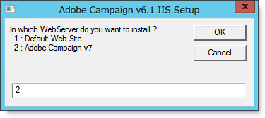

# Windows用のWebサーバーへの統合{#integration-into-a-web-server-for-windows}

Adobe Campaignには、HTTP（およびSOAP）を介してアプリケーションサーバーのエントリポイントとして機能するApache tomcatが含まれています。

この統合Tomcatサーバーを使用して、HTTP要求を処理できます。

この場合：

* デフォルトのリスニングポートは8080です。 変更するには、「Tomcatの設定」を参 [照してください](../../installation/using/configuring-campaign-server.md#configuring-tomcat)。
* 次に、クライアントコンソールはhttps:// [`<computer>`:8080などのURLを使用して接続します](https://machine:8080)。

ただし、セキュリティと管理上の理由から、Adobe Campaignを実行しているコンピューターがインターネット上で公開され、ネットワーク外のコンソールにアクセスする場合は、HTTPトラフィックのメインエントリポイントとして専用のWebサーバーを使用することをお勧めします。

また、Webサーバーを使用すると、HTTPsプロトコルでのデータの機密性を保証できます。

同様に、トラッキング機能を使用する場合はWebサーバを使用する必要があります。この機能は、Webサーバ拡張モジュールとしてのみ使用できます。

>[!NOTE]
>
>トラッキング機能を使用しない場合は、ApacheまたはIISの標準インストールを実行し、Campaignへのリダイレクトを行うことができます。 追跡用Webサーバー拡張モジュールは不要です。

## IIS webサーバーを構成しています {#configuring-the-iis-web-server}

IIS webサーバーの構成手順は、ほとんどグラフィカルです。 Webサイト（既に作成済みまたは保留中の作成）を使用してAdobe Campaignサーバーのリソースにアクセスします。Java (.jsp)ファイル、スタイルシート(.css、.xsl)、画像(.png)、リダイレクト用のISAPI DLLなど。

以下の節では、IIS 7での設定について詳しく説明します。 IIS8の設定は基本的に同じです。

Web IISサーバーがコンピューターにまだインストールされていない場合は、メニューを使用してインストールで **[!UICONTROL Add > Remove Programs > Enable or disable Windows functionalities]** きます。

IIS 7では、標準のサービスに加えて、ISAPI拡張機能とISAPIフィルターをインストールする必要があります。


### 設定の手順 {#configuration-steps}

次の設定手順を実行します。

1. メニューからIISを開き **[!UICONTROL Control panel > Administrative tools > Services]** ます。
1. ネットワークのパラメーター（TCP接続ポート、DNSホスト、IPアドレス）に応じて、サイト（Adobe Campaignなど）を作成し、設定します。

   

   サイトの名前と仮想ディレクトリへのアクセスパスを少なくとも指定する必要があります。 Webサイトディレクトリにアクセスするパスは使用されないので、次のディレクトリを使用できます。

   ```
   C:\inetpub\wwwroot
   ```

   

1. VBSスクリプトを使用すると **** 、先ほど作成した仮想ディレクトリ上でAdobe Campaignサーバーが使用するリソースを自動的に設定できます。 起動するには、フォルダー内の **iis_neolane_setup.vbs** (はAdobe Campaignのインストールフォルダーにアクセスする `[INSTALL]\tomcat-7\conf` ための `[INSTALL]` パス)ファイルをダブルクリックします。

   

   >[!NOTE]
   >
   >Windows Server 2008/IIS7をインストールする場合は、VBSスクリプトを実行するか、管理者としてスクリプトを実行するには、管理者としてログインする必要があります。

   Webサーバ **[!UICONTROL OK]** ーがトラッキングリダイレクトサーバーとして使用されている場合はクリックし、それ以外の場合はクリックしま **[!UICONTROL Cancel]**&#x200B;す。

   ウェブサーバ上で複数のサイトが既に設定されている場合は、中間ページが表示され、インストールが適用されるウェブサイトを指定します。サイトにリンクされている番号を入力し、をクリックしま **[!UICONTROL OK]**&#x200B;す。

   

   確認メッセージが表示されます。

   

1. タブで、Webサ **[!UICONTROL Content View]** イトがAdobe Campaignリソースを使用して正しく設定されていることを確認します。

   

   ツリーが表示されない場合は、IISを再起動します。

### 権限の管理 {#managing-rights}

次に、ISAPI DLLとAdobe Campaignのインストールディレクトリ内のリソースのセキュリティ設定を行う必要があります。

それには、次の手順に従います。

1. タブを選択 **[!UICONTROL Features View]** し、「Authentication **** 」リンクをダブルクリックします。

   

1. Webサイトの **[ディレクトリセキュリティ** ]タブで、匿名アクセスが有効になっていることを確認します。 必要に応じて、リンクをクリ **[!UICONTROL Edit]** ックして設定を変更します。

   

### Webサーバーの起動と設定のテスト {#launching-the-web-server-and-testing-the-configuration}

次に、設定が正しいかどうかをテストする必要があります。

これを行うには、次の手順を適用します。

1. iisresetコマンドラインを使用してIISサー **バーを再** 起動します。
1. 次のURLをWebブラウザーに挿入して、トラッキングモジュールをテストします。

   ```
   https://<computer>/r/test
   ```

   ブラウザーに次の応答が表示されます。

   ```
   <redir status='OK' date='YYYY/MM/DD HH:MM:SS' build='XXXX' host='myserver.mydomain.com' localHost='localhost'/>
   ```

リダイレクトモジュールの存在をテストするには、次のコマンドラインを実行します。

```
nlserver pdump
```

次の情報を返す必要があります。

```
12:00:33 >   Application server for Adobe Campaign Classic (7.X YY.R build XXX@SHA1) of DD/MM/YYYY
webmdl@default (1644) - 18.2 Mo
```

また、ISAPI DLLが正しく読み込まれていることを確認することもできます。

それには、次の手順に従います。

1. アイコンをクリックして、Adobe CampaignサイトのISAPIフィルターを編集 **[!UICONTROL Driver mapping]** します。
1. ISAPIフィルターの内容の確認：

   

## 任意の追加設定 {#additional-configurations}

### アップロードファイルのサイズ制限の変更 {#changing-the-upload-file-size-limit}

IIS webサーバーを構成する場合、サーバーにアップロードされる設定ファイルに対しては、自動的に約28 MBの制限が設定されます。

これは、特にこの制限を超えるファイルをアップロードする場合に、Adobe Campaignに影響を与える可能性があります。

例えば、ワークフローで **** Data loading (file)タイプのアクティビティを使用して50 MBのファイルをインポートすると、エラーが発生し、ワークフローの正しい実行が停止します。

この場合、次の制限値を増やす必要があります。

1. メニューからIISを開き **[!UICONTROL Start > (Control panel) > Administration tools]** ます。
1. 「 **Connections** 」ペインで、アドビのインストール用に作成したサイトを選択し、メインペインの「 **Request Filtering** 」をダブルクリックします。
1. 「 **Actions** 」ペインで「 **Edit Feature Settings** 」を選択し、「 **Maximum authorized content size (bytes)** 」フィールドの値を編集できるようにします。

   例えば、50 MBのファイルのアップロードを承認するには、「52428800」バイトを超える値を指定する必要があります。

>[!NOTE]
>
>このIISオプションの詳細については、公式ドキュメントの「使い方」の節を参照し [てください](https://www.iis.net/configreference/system.webserver/security/requestfiltering/requestlimits)。

### httpエラーメッセージ表示の設定 {#configuring-http-error-message-display}

6.1バージョンのIISサーバーを使用している場合は、メッセージにHTMLコードが表示されるので、生成されたエラーメッセージを読み取るのが困難な場合があります。

この問題を修正し、エラーを正しく表示するには、次の設定を適用します。

1. メニューからIISを開き **[!UICONTROL Start > Control Panel > Administrative tools]** ます。
1. 「 **Connections** 」ペインで、Adobe Campaignのインストール用に作成したサイトを選択し、メインペインで「 **Configuration editor** 」をダブルクリックします。
1. 「セクシ **ョン** 」ドロップダウンリストで、 **system.webServer** / **httpErrorsを選択します**。
1. 既存の応答 **行で** 「PassThrough」値を選 **択します** 。


