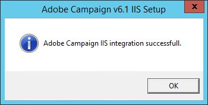

# Windows 用 web サーバーへの統合{#integration-into-a-web-server-for-windows}


Adobe Campaignには、HTTP（および SOAP）を介してアプリケーションサーバーのエントリポイントとして機能する Apache Tomcat が含まれています。

この統合 Tomcat サーバーを使用して、HTTP リクエストを処理できます。

この場合：

* デフォルトのリスニングポートは 8080 です。 変更するには、[ この節 ](../../installation/using/configure-tomcat.md) を参照してください。
* 次に、クライアントコンソールは、[https:// `<computer>`:8080](https://myserver.adobe.com:8080) のような URL を使用して接続します。

ただし、セキュリティと管理上の理由から、Adobe Campaignを実行しているコンピューターがインターネット上で公開され、ネットワーク外のコンソールにアクセスする場合は、専用の Web サーバーを HTTP トラフィックのメインエントリポイントとして使用することをお勧めします。

また、Web サーバーを使用すると、HTTPs プロトコルでデータの機密性を保証できます。

同様に、Web サーバーは、Web サーバー拡張モジュールとしてのみ使用可能なトラッキング機能を使用する場合に使用する必要があります。

>[!NOTE]
>
>トラッキング機能を使用しない場合は、Apache または IIS の標準インストールを実行し、Campaign にリダイレクトできます。 トラッキング Web サーバー拡張モジュールは不要です。

## IIS Web サーバーの設定 {#configuring-the-iis-web-server}

IIS Web サーバーの設定手順は、ほとんどグラフィカルです。 Web サイト（作成済みまたは作成保留中）を使用して、Adobe Campaignサーバーのリソースにアクセスします。Java(.jsp) ファイル、スタイルシート (.css、.xsl)、画像 (.png)、リダイレクト用の ISAPI DLL など

次の節では、IIS 7 の設定について詳しく説明します。 IIS8 の設定は基本的に同じです。

Web IIS サーバーがまだコンピューターにインストールされていない場合は、**[!UICONTROL 追加/プログラムの削除/Windows 機能を有効または無効にする]** メニューからインストールできます。

IIS 7 では、標準サービスに加えて、ISAPI 拡張および ISAPI フィルターをインストールする必要があります。


### 設定の手順 {#configuration-steps}

次の設定手順を実行します。

1. **[!UICONTROL コントロールパネル/管理ツール/サービス]** メニューから IIS を開きます。
1. ネットワークのパラメーター（TCP 接続ポート、DNS ホスト、IP アドレス）に応じて、サイト (Adobe Campaignなど ) を作成し、設定します。

   

   少なくとも、サイトの名前と仮想ディレクトリへのアクセスパスを指定する必要があります。 Web サイトディレクトリにアクセスするためのパスは使用されないので、次のディレクトリを使用できます。

   ```
   C:\inetpub\wwwroot
   ```

   

1. **VBS** スクリプトを使用すると、先ほど作成した仮想ディレクトリで、Adobe Campaignサーバーが使用するリソースを自動的に設定できます。 起動するには、`[INSTALL]\conf` フォルダーにある **iis_neolane_setup.vbs** ファイルをダブルクリックします。`[INSTALL]` は、Adobe Campaignのインストールフォルダーにアクセスするパスです。

   

   >[!NOTE]
   >
   >Windows Server 2008/IIS7 のインストールの場合、VBS スクリプトを実行するか、スクリプトを管理者として実行するには、管理者としてログインする必要があります。

   Web サーバーをトラッキングリダイレクトサーバーとして使用する場合は「**[!UICONTROL OK]**」をクリックし、使用しない場合は「**[!UICONTROL キャンセル]**」をクリックします。

   複数のサイトが既に Web サーバー上で設定されている場合は、インストールを適用する Web サイトを指定する中間ページが表示されます。サイトにリンクする番号を入力し、[**[!UICONTROL OK]**] をクリックします。

   

   確認メッセージが表示されます。

   

1. 「**[!UICONTROL コンテンツビュー]**」タブで、Web サイトがAdobe Campaignのリソースで正しく設定されていることを確認します。

   

   ツリーが表示されない場合は、IIS を再起動します。

### 権限の管理 {#managing-rights}

次に、ISAPI DLL とAdobe Campaignインストールディレクトリ内のリソースのセキュリティ設定を構成する必要があります。

それには、次の手順に従います。

1. 「**[!UICONTROL 機能ビュー]**」タブを選択し、「**認証**」リンクをダブルクリックします。

   

1. Web サイトの「**Directory Security**」タブで、匿名アクセスが有効になっていることを確認します。 必要に応じて、**[!UICONTROL 編集]** リンクをクリックして設定を変更します。

   

### Web サーバーの起動と設定のテスト {#launching-the-web-server-and-testing-the-configuration}

次に、設定が正しいかどうかをテストする必要があります。

これをおこなうには、次の手順に従います。

1. **iisreset** コマンドラインを使用して IIS サーバーを再起動します。

1. Adobe Campaignサービスを起動し、実行中であることを確認します。

1. 次の URL を Web ブラウザーに挿入して、トラッキングモジュールをテストします。

   ```
   https://<computer>/r/test
   ```

   ブラウザーには次の応答が表示されます。

   ```
   <redir status='OK' date='YYYY/MM/DD HH:MM:SS' build='XXXX' host='myserver.mydomain.com' localHost='localhost'/>
   ```

リダイレクトモジュールの有無をテストするには、次のコマンドラインを実行します。

```
nlserver pdump
```

次の情報を返す必要があります。

```
12:00:33 >   Application server for Adobe Campaign Classic (7.X YY.R build XXX@SHA1) of DD/MM/YYYY
webmdl@default (1644) - 18.2 Mo
```

また、ISAPI DLL が正しく読み込まれていることを確認することもできます。

それには、次の手順に従います。

1. **[!UICONTROL ドライバーマッピング]** アイコンをクリックして、Adobe Campaignサイトの ISAPI フィルターを編集します。
1. ISAPI フィルターの内容を確認します。

   

## その他の設定 {#additional-configurations}

### アップロードファイルのサイズ制限の変更 {#changing-the-upload-file-size-limit}

IIS Web サーバーを設定する場合、サーバーにアップロードされる設定ファイルに対しては、自動的に約 28 MB の制限が適用されます。

これは、特にこの制限を超えるファイルをアップロードする場合に、Adobe Campaignで影響を受ける可能性があります。

例えば、ワークフローで「**データの読み込み（ファイル）**」タイプアクティビティを使用して 50 MB のファイルをインポートすると、エラーによってワークフローの正しい実行が停止されます。

この場合、次の制限を引き上げる必要があります。

1. **[!UICONTROL スタート/（コントロールパネル）/管理ツール]** メニューから IIS を開きます。
1. **Adobe** ウィンドウで、接続のインストール用に作成したサイトを選択し、メインウィンドウの **Request Filtering** をダブルクリックします。
1. **アクション** ウィンドウで、**機能設定を編集** を選択して、**許可された最大コンテンツサイズ（バイト）** フィールドの値を編集できます。

   例えば、50 MB のファイルのアップロードを承認するには、「52428800」バイトを超える値を指定する必要があります。

>[!NOTE]
>
>この IIS オプションの詳細については、[ 公式ドキュメント ](https://www.iis.net/configreference/system.webserver/security/requestfiltering/requestlimits) の「使い方」の節を参照してください。

### HTTP エラーメッセージ表示の設定 {#configuring-http-error-message-display}

6.1 バージョンの IIS サーバーを使用している場合、メッセージに望ましくないHTMLコードが表示されるので、生成されたエラーメッセージを読み取るのが困難な場合があります。

この問題を修正し、エラーを正しく表示するには、次の設定を適用します。

1. **[!UICONTROL スタート/Campaign コントロールパネル/管理ツール]** メニューから IIS を開きます。
1. **接続** ウィンドウで、Adobe Campaignのインストール用に作成したサイトを選択し、メインウィンドウで **設定エディター** をダブルクリックします。
1. **セクション** ドロップダウンリストで、**system.webServer** > **httpErrors** を選択します。
1. **existingResponse** 行で **PassThrough** 値を選択します。


