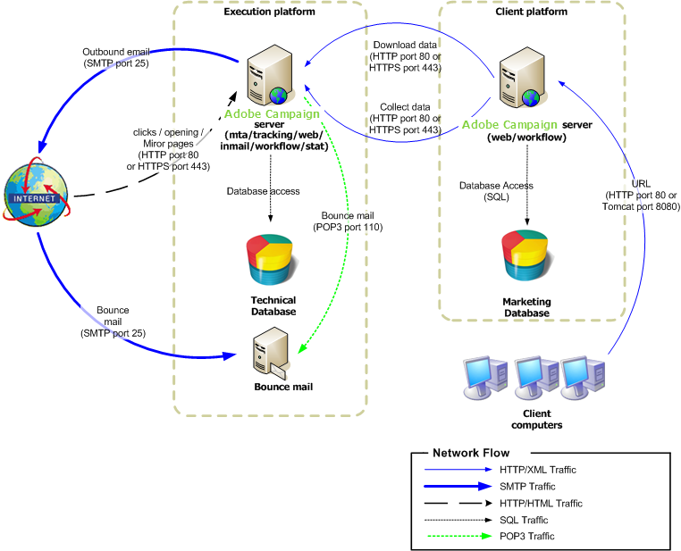

# ミッドソーシングへのデプロイメント{#mid-sourcing-deployment}

この設定は、ホスト型（ASP）設定と内部化の間の最適な中間ソリューションです。 外向きの実行コンポーネントは、Adobe Campaignでホストされている「ミッドソーシング」サーバー上で実行されます。

>[!NOTE]
>
>このタイプのデプロイメントを設定するには、適切なオプションを取得する必要があります。 ライセンス契約を確認してください。

サーバーとプロセス間の一般的な通信は、次のスキーマに従って実行されます。

* 実行とバウンスの管理モジュールがインスタンスで無効になっています。
* アプリケーションは、SOAP 呼び出し（HTTP または HTTPS 経由）を使用して駆動されるリモートの「ミッドソース」サーバーでメッセージを実行するように設定されています。

## 機能 {#features}

### メリット {#advantages}

* 簡素化されたサーバー設定：お客様が外向きモジュール（mtaおよびinMail）を設定する必要はありません。
* 帯域幅の使用制限：実行はミッドソーシングサーバーによって実行されるため、パーソナライゼーションデータをミッドソーシングサーバーに送信するのに十分な帯域幅のみが必要です。
* 高可用性はもはや内部の問題ではありません。問題はミッドソーシングサーバー（リダイレクト、ミラーページ、実行サーバーなど）に移行されます。
* データベースは会社を離れません：メッセージの組み立てに必要なデータのみがミッドソーシングサーバーに送信されます（HTTPSは使用できます）。
* このタイプのデプロイメントは、大量のアーキテクチャ（データベース内の多数の受信者）に対するソリューションであり、配信スループットが大幅に向上します。

### 欠点 {#disadvantages}

* ミッドソーシングサーバーから情報を取得するのにかかる時間により、メッセージ実行情報の表示とレポート機能の表示がわずかに遅れます。
* アンケートやweb フォームは依然としてクライアントプラットフォーム上に存在します。

### 推奨される機器 {#recommended-equipment}

* アプリケーションサーバー：2 Ghz クアッドコアCPU、4 GB RAM、ソフトウェア RAID 1 80 GB SATA ハードドライブ。
* データベースサーバー：3 GHzのバイクアッドコア CPU、最小4 GB RAM、ハードウェア RAID 10 15000RPM SAS ハードドライブ、データベースのサイズと期待されるパフォーマンスに応じた数。

>[!NOTE]
>
>リダイレクトとミッドソーシングは別々の要素ですが、トラッキングサーバーは一般的にミッドソーシングサーバーと共有されます。

## インストールと設定手順 {#installation-and-configuration-steps-}

### 前提条件 {#prerequisites}

* アプリケーションサーバー上のJDK。
* アプリケーションサーバー上のデータベースサーバーへのアクセス。
* ミッドソーシングサーバーへのHTTP （80）またはHTTPS （443）ポートを開くように構成されたファイアウォール。

### インストールと設定（ミッドソーシングデプロイメント） {#installing-and-configuring--mid-sourcing-deployment-}

[&#x200B; ミッドソーシングサーバー](../../installation/using/mid-sourcing-server.md)を参照してください。
