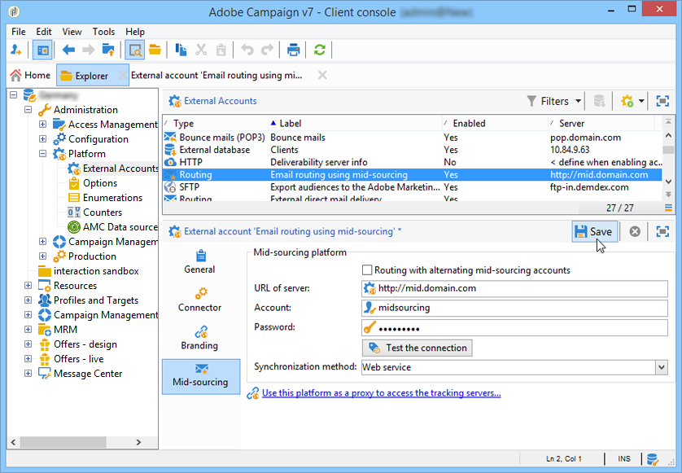

# ミッドソーシングサーバー{#mid-sourcing-server}

この節では、中間ソーシングサーバーのインストールと設定、およびサードパーティが中間ソーシングモードでメッセージを送信できるようにするインスタンスのデプロ **イメントについて説明し** ます。

「ミッドソーシング」アーキテクチャは、ミッドソーシン [グデプロイメントで提供されます](../../installation/using/mid-sourcing-deployment.md)。

ミッドソーシングサーバーのインストールは、通常の方法でサーバーをインストールするのと同じプロセスに従います（標準設定を参照）。 独自のデータベースを持つ独立したインスタンスで、配信の実行に使用できます。 簡単に言うと、リモートインスタンスがミッドソーシングモードで配信を実行できるように、追加の設定が含まれています。

## インスタンスのインストールと設定の手順 {#steps-for-installing-and-configuring-an-instance}

### インスタンスのインストールおよび設定の前提条件 {#prerequisites-for-installing-and-configuring-an-instance}

* アプリケーションサーバー上のJDK。
* アプリケーションサーバー上のデータベースサーバーへのアクセス。
* ファイアウォールは、ミッドソーシングサーバーに対してHTTP(80)またはHTTPS(443)ポートを開くように設定されています。

次の手順では、単一のミッドソーシングサーバーを使用した設定について説明します。 また、複数のサーバーを使用することもできます。 同様に、内部設定から特定のメッセージ（例えば、ワークフロー通知）を送信することもできます。

### 中間ソーシングデプロイメント用のアプリケーションサーバーのインストールと設定 {#installing-and-configuring-the-application-server-for-mid-sourcing-deployment}

インストール手順は、スタンドアロンインスタンスと同じです。 『インストー [ルと設定（シングルマシン）』を参照してくださ](../../installation/using/standalone-deployment.md#installing-and-configuring--single-machine-)い。

ただし、次の条件を適用する必要があります。

* 手順 **5で**、mta **（配信）モジュールと** inMail **** （バウンスメール）モジュールを無効にする必要があります。 ただし、 **wfserver** (workflow)モジュールは、アクティブな状態を維持する必要があります。

   ```
   <?xml version='1.0'?>
   <serverconf>  
     <shared>    
       <!-- add lang="eng" to dataStore to force English for the instance -->    
       <dataStore hosts="console.campaign.net*">      
         <mapping logical="*" physical="default"/>    
       </dataStore>  </shared>  
       <mta autoStart="false"/>  
       <wfserver autoStart="true"/>  
       <inMail autoStart="false"/>  
       <sms autoStart="false"/>  
       <listProtect autoStart="false"/>
   </serverconf>
   ```

   For more on this, refer to [Enabling processes](../../installation/using/campaign-server-configuration.md#enabling-processes).

* 手順 **6**、 **9** 、 **10** は必要ありません。
* 手順 **12** と **13の間は**、接続URLに8080ポートを指定する必要があります（コンソールはWebサーバーを経由せずにTomcatと直接通信するため）。 URLはhttp://console.campaign.net:8080にな [ります](http://console.campaign.net)。 手順 **13で**、インストー **[!UICONTROL Issue towards Mid-sourcing]** ルするパッケージと共に選択します。

   

   >[!CAUTION]
   >
   >技術的な配信のデフォルトのルーティングは、ミッドソーシングを介した電子メールルーティングに自動的に置き換えられます。

### ミッドソーシングサーバーのインストールと設定 {#installing-and-configuring-the-mid-sourcing-server}

クライアントコンソールから、中間ソーシング **(** /Administration/External accounts/フォルダー内)の中間ソーシングアカウントを使用した電子メールルーティングを探します **** 。 サーバーの **URL、アカウント**、パスワ **ード****、****** ミラーページのURLミラーの各設定に、ミッドソーシングサーバーをホストするプロバイダーが提供する情報を入力します。 接続をテストします。

>[!NOTE]
>
>mid-sourcingEmitterオプ **ションは** 、2つの中間ソーシ **ングワークフローを作成し** ます。 これは、デフォルトで1時間20分おきに実行され、中間ソーシングサーバー上の配信情報を収集するプロセスです。

## ミッドソーシングサーバーのデプロイ {#deploying-a-mid-sourcing-server}

1. アプリケーションサーバーのインストール：

   >[!CAUTION]
   >
   >ミッドソーシングサーバーをインストールし、追加のAdobe Campaignモジュールをインストールする場合は、Campaignモジュールではなく、配信モジュールを使用することをお勧めします。

   標準の配置と同じ手順に従い、オプションのみを選択し **[!UICONTROL Mid-sourcing platform]** ます。

   

1. 中間ソーシングモードでの受信の設定

   送信アカウントのパスワードの設定：/ **Mid-sourcing/Access Management/Operators/** フォルダーでは、 **mid** 演算子は、ミッドソーシングモードでの送信に対してリモートインスタンスで使用されます。 この演算子のパスワードを設定し、送信インスタンスの管理者に渡す必要があります。

   「 **Mid-sourcing platform** 」オプションは、送信された配信と送信を実行するデフォルトの演算子を保存するデフォルトのフォルダーを作成します。

## ミッドソーシングサーバーの多重化 {#multiplexing-the-mid-sourcing-server}

>[!CAUTION]
>
>多重化は、オンプレミス環境でのみサポートされます。

中間ソーシングインスタンスを複数の送信インスタンスで共有できます。 これらの各インスタンスは、ミッドソーシングデータベースの演算子と関連付ける必要があります。 ミッドソーシングサーバーで2番目のアカウントを作成するには：

1. デフォルトの中間ソーシ **[!UICONTROL Mid-sourcing > Deliveries]** ングアカウントに関連付けるノード内にフォルダーを作成します(例：prod)。
1. ノードにアカウントと同 **[!UICONTROL Mid-sourcing > Deliveries]** じ名前のフォルダーを作成します(例：acception_test)。

   

1. で、新 **[!UICONTROL Mid-sourcing > Access Management > Operators]**&#x200B;しいアカウントを作成します。

   

1. タブで、こ **[!UICONTROL Access rights]** の演算子に中間ソーシング送信グル **ープの権限を与えます** 。 このアクセス権は、で使用できま **[!UICONTROL Mid-sourcing > Access Management > Operator groups]**&#x200B;す。

   

1. このオプショ **[!UICONTROL Restrict to data in the sub-folders of]** ンを選択し、配信フォルダーを選択して、この演算子を中間ソーシング配信フォルダーに制限します。

   

1. 次のコマンドを使用して、Webモジュールを再起動します。nlserver **restart web**.

serverConf.xmlファイルで中間ソーシングサーバーの設定を変更する必要があります。 次の行を、既存の行の下の「IPアドレスとの親和性の管理」セクションに追加する必要があります。

```
<IPAffinity IPMask="" localDomain="" name=""/>
```

「@name」属性は、次のルールを適用する必要があります。

**&#39;marketing_account_operator_name&#39;.&#39;affinity_name&#39;.&#39;affinity_group&#39;**

「marketing_account_operator_name」は、中間ソーシングインスタンスで宣言された中間ソーシングアカウントの内部名に関連します。

「affinity_name」は、親和性に与えられた任意の名前に関連します。 この名前は一意である必要があります。 許可された文字はで `[a-z]``[A-Z]``[0-9]`す。 目的は、パブリックIPアドレスのグループを宣言することです。

「affinity_group」は、各配信で使用されるターゲットマッピングで宣言されたサブ親和性を関連付けます。 &#39;.&#39;を含む最後の部分 は、サブ親和性がない場合は無視されます。 許可された文字はで `[a-z]``[A-Z]``[0-9]`す。

変更を考慮するには、サーバーを停止してから再起動する必要があります。

## ミッドソーシングサーバーでのトラッキングの設定 {#configuring-tracking-on-a-mid-sourcing-server}

**ミッドソーシングサーバーの設定**

1. 「operators」に移動し、演算子を選択します **[!UICONTROL mid]**。
1. タブで、トラッ **[!UICONTROL Frontal servers]** キングサーバーの接続パラメーターを入力します。

   トラッキングインスタンスを作成するには、トラッキングサーバーのURL、トラッキングサーバーの内部アカウントパスワード、インスタンスの名前、パスワード、およびそれに関連付けられたDNSマスクを入力します。

   

1. 接続パラメータを入力したら、をクリックしま **[!UICONTROL Confirm the configuration]**&#x200B;す。
1. 必要に応じて、配信に含まれる画像を保存する場所を指定します。 これを行うには、ドロップダウンリストからいずれかのパブリケーションモードを選択します。

   

   このオプションを選 **[!UICONTROL Tracking server(s)]** 択すると、画像がミッドソーシングサーバー上にコピーされます。

**顧客プラットフォームの設定**

1. 外部中間ソーシングルーティングアカウントに移動します。
1. タブで、 **[!UICONTROL Mid-Sourcing]** 中間ソーシングサーバーの接続パラメーターを指定します。

   

1. をクリックして設定を確認しま **[!UICONTROL Test the connection]**&#x200B;す。
1. ミッドソーシングサーバーで参照されるトラッキングインスタンスを宣言します。

   リンクをクリック **[!UICONTROL Use this platform as a platform to access the tracking servers]**&#x200B;し、

   トラッキングインスタンスの名前を指定し、トラッキングサーバーとの接続を確認します。

   

メッセージの配信を複数のミッドソーシングサーバーで管理する場合は、このオプションを選択し、異な **[!UICONTROL Routing with alternating mid-sourcing accounts]** るサーバーを指定します。


