# ミッドソーシングサーバー{#mid-sourcing-server}


この節では、ミッドソーシングサーバーのインストールと設定、およびサードパーティがメッセージを&#x200B;**ミッドソーシング** モードで送信できるようにするインスタンスのデプロイメントについて詳しく説明します。

「ミッドソーシング」アーキテクチャは、[ ミッドソーシングのデプロイメント ](../../installation/using/mid-sourcing-deployment.md)に示されています。

ミッドソーシングサーバーのインストールは、通常の方法でサーバーをインストールするのと同じプロセスに従います（標準設定を参照）。 これは、配信の実行に使用できる独自のデータベースを持つ独立したインスタンスです。 簡単に言えば、リモートインスタンスがミッドソーシングモードで配信を実行できるようにするための追加の設定が含まれています。

>[!CAUTION]
>
>ミッドソーシングサーバーがセットアップされ、[同期ワークフロー](https://experienceleague.adobe.com/docs/campaign/automation/workflows/introduction/wf-type/technical-workflows.html?lang=ja){target="_blank"}が初めて実行されたら、ミッドソーシング外部アカウントの内部名を更新しないことを確認します。

## インスタンスのインストールと設定の手順 {#steps-for-installing-and-configuring-an-instance}

### インスタンスのインストールと設定の前提条件 {#prerequisites-for-installing-and-configuring-an-instance}

* アプリケーションサーバー上のJDK。
* アプリケーションサーバー上のデータベースサーバーへのアクセス。
* ミッドソーシングサーバーへのHTTP （80）またはHTTPS （443）ポートを開くように構成されたファイアウォール。

次の手順では、単一のミッドソーシングサーバーを使用した設定について詳しく説明します。 複数のサーバーを使用することも可能です。 同様に、内部設定から特定のメッセージ（ワークフロー通知など）を送信することもできます。

### ミッドソーシングのデプロイメント用にアプリケーションサーバーをインストールして設定する {#installing-and-configuring-the-application-server-for-mid-sourcing-deployment}

インストール手順は、スタンドアロンインスタンスの手順と同じです。 「[ インストールと設定（単一マシン） ](../../installation/using/standalone-deployment.md#installing-and-configuring--single-machine-)」を参照してください。

ただし、次の項目を適用する必要があります。

* 手順&#x200B;**5**&#x200B;で、**mta** （配信）および&#x200B;**inMail** （バウンスメール）モジュールを無効にする必要があります。 ただし、**wfserver** （ワークフロー） モジュールはアクティブのままである必要があります。

  ```
  <?xml version='1.0'?>
  <serverconf>  
    <shared>    
      <!-- add lang="eng" to dataStore to force English for the instance -->    
      <dataStore hosts="console.campaign.net*">      
        <mapping logical="*" physical="default"/>    
      </dataStore>  </shared>  
      <mta autoStart="false"/>  
      <wfserver autoStart="true"/>  
      <inMail autoStart="false"/>  
      <sms autoStart="false"/>  
      <listProtect autoStart="false"/>
  </serverconf>
  ```

  詳しくは、[この節](../../installation/using/configuring-campaign-server.md#enabling-processes)を参照してください。

* 手順&#x200B;**6**、**9**、**10**&#x200B;は必要ありません。
* 手順&#x200B;**12**&#x200B;および&#x200B;**13**&#x200B;では、接続URLに8080 ポートを指定する必要があります（コンソールはWeb サーバー経由ではなくTomcatと直接通信するため）。 URLは`http://console.campaign.net:8080`になります。 手順&#x200B;**13**&#x200B;の際に、**[!UICONTROL ミッドソーシングに向けた問題]** パッケージと、インストールするパッケージを選択します。

  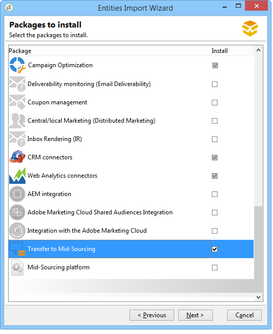

  >[!CAUTION]
  >
  >テクニカル配信のデフォルトのルーティングは、ミッドソーシング経由のメールルーティングに自動的に置き換えられます。

### ミッドソーシングサーバーのインストールと設定 {#installing-and-configuring-the-mid-sourcing-server}

クライアントコンソールから、**ミッドソーシング** ミッドソーシングアカウントを使用した電子メールルーティング（**/Administration/External accounts/** フォルダー）を探します。 ミッドソーシングサーバーをホストするサーバープロバイダーから提供された情報を、サーバー&#x200B;**、** アカウント **、** パスワード **および** ミラーページ URL **の** URL設定に入力します。 接続をテストします。

>[!NOTE]
>
>**mid-sourcingEmitter** オプションは、2つの&#x200B;**Mid-sourcing** ワークフローを作成します。 これは、デフォルトで1時間20分ごとに実行され、ミッドソーシングサーバーで配信情報を収集するプロセスです。

## ミッドソーシングサーバーのデプロイ {#deploying-a-mid-sourcing-server}

1. アプリケーションサーバーのインストール：

   >[!CAUTION]
   >
   >ミッドソーシングサーバーをインストールし、追加のAdobe Campaign モジュールをインストールする場合は、Campaign モジュールではなく、配信モジュールを使用することをお勧めします。

   標準デプロイメントと同じ手順に従い、**[!UICONTROL ミッドソーシングプラットフォーム]** オプションのみを選択します。

   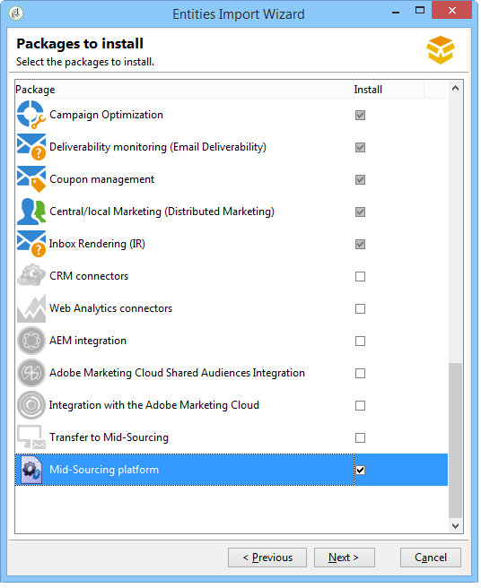

1. ミッドソーシングモードでの受信の設定

   送信アカウントのパスワードを設定します。**/Mid-sourcing/Access Management/Operators/** フォルダーでは、**mid** オペレーターがミッドソーシングモードの送信にリモートインスタンスで使用されます。 このオペレーターのパスワードを設定し、送信インスタンスの管理者に渡す必要があります。

   **ミッドソーシングプラットフォーム** オプションは、送信された配信を保存するためのデフォルトのフォルダーと、送信を実行するデフォルトのオペレーターを作成します。

## ミッドソーシングサーバーの多重化 {#multiplexing-the-mid-sourcing-server}

>[!CAUTION]
>
>多重化は、オンプレミス環境でのみサポートされます。

ミッドソーシングインスタンスは、複数の送信インスタンスで共有できます。 これらの各インスタンスは、ミッドソーシングデータベースのオペレーターに関連付ける必要があります。 ミッドソーシングサーバーで2番目のアカウントを作成するには：

1. デフォルトのミッドソーシングアカウントに関連付けられるフォルダーを&#x200B;**[!UICONTROL ミッドソーシング/配信]** ノードに作成します（例：prod）。
1. アカウントと同じ名前の&#x200B;**[!UICONTROL ミッドソーシング/配信]** ノードにフォルダーを作成します（例：acceptance_test）。

   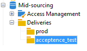

1. **[!UICONTROL ミッドソーシング/アクセス管理/オペレーター]**&#x200B;で、新しいアカウントを作成します。

   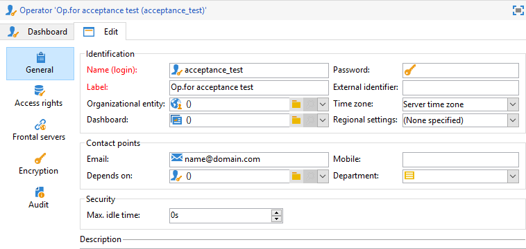

1. 「**[!UICONTROL アクセス権]**」タブで、このオペレーターに&#x200B;**ミッドソーシング送信** グループの権限を付与します。 このアクセス権は、**[!UICONTROL ミッドソーシング/アクセス管理/オペレーターグループ]**&#x200B;で利用できます。

   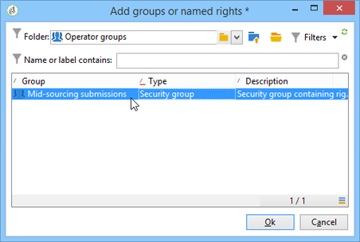

1. 「]**のサブフォルダー内のデータに制限」オプションを選択し、配信フォルダーを選択して、このオペレーターをミッドソーシング配信フォルダーに制限します。**[!UICONTROL 

   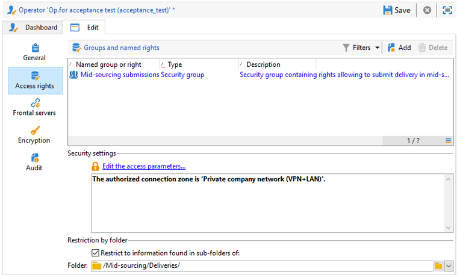

1. 次のコマンドを使用してWeb モジュールを再起動します。** web**.

serverConf.xml ファイルのミッドソーシングサーバー設定を変更する必要があります。 次の行を、既存の行の「IP アドレスを使用したアフィニティの管理」セクションに追加する必要があります。

```
<IPAffinity IPMask="" localDomain="" name=""/>
```

&#39;@name&#39;属性は、次のルールを尊重する必要があります。

**&#39;marketing_account_operator_name&#39;.&#39;affinity_name&#39;.&#39;affinity_group&#39;**

「marketing_account_operator_name」は、ミッドソーシングインスタンスで宣言されたミッドソーシングアカウントの内部名に関連します。

&#39;affinity_name&#39;は、アフィニティに指定された任意の名前に関連します。 この名前は一意である必要があります。 許可されている文字は`[a-z]``[A-Z]``[0-9]`です。 目的は、パブリック IP アドレスのグループを宣言することです。

&#39;affinity_group&#39;は、各配信で使用されるターゲットマッピングで宣言されたサブ親和性を関連付けます。 サブアフィニティがない場合、「。」を含む最後の部分は無視されます。 許可されている文字は`[a-z]``[A-Z]``[0-9]`です。

変更を考慮するには、サーバーを停止してから再起動する必要があります。

## ミッドソーシングサーバーでのトラッキングの設定 {#configuring-tracking-on-a-mid-sourcing-server}

**ミッドソーシングサーバーの設定**

1. 「演算子」に移動し、演算子&#x200B;**[!UICONTROL mid]**&#x200B;を選択します。
1. 「**[!UICONTROL Frontal servers]**」タブで、トラッキングサーバー接続パラメーターを入力します。

   トラッキングインスタンスを作成するには、トラッキングサーバーのURL、トラッキングサーバーの内部アカウントパスワード、インスタンスの名前、パスワード、およびインスタンスに関連付けられているDNS マスクを入力します。

   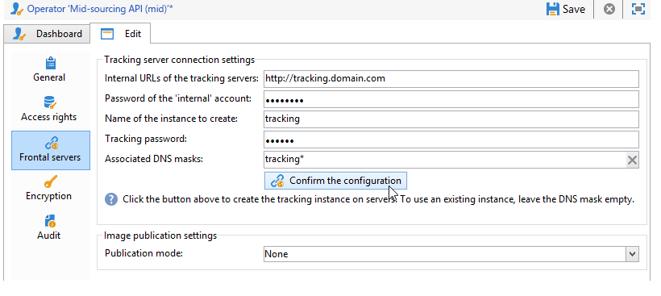

1. 接続パラメーターを入力したら、**[!UICONTROL 設定の確認]**&#x200B;をクリックします。
1. 必要に応じて、配信に含まれる画像を保存する場所を指定します。 これを行うには、ドロップダウンリストから公開モードのいずれかを選択します。

   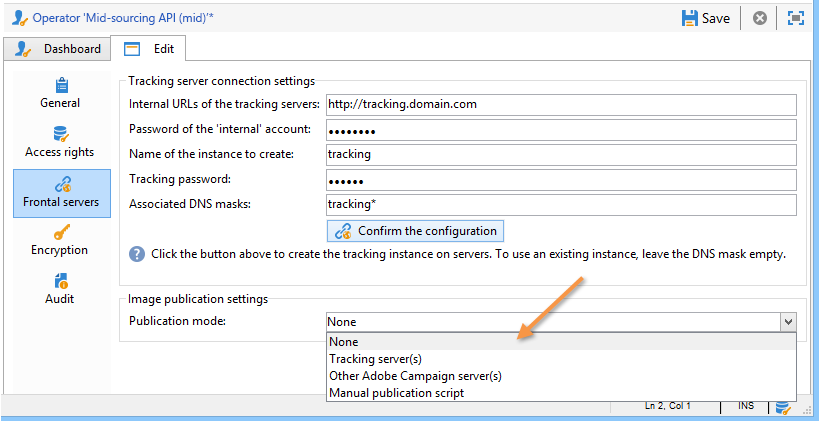

   「**[!UICONTROL トラッキングサーバー]**」オプションを選択すると、画像はミッドソーシングサーバーにコピーされます。

**顧客プラットフォームの設定**

1. 外部ミッドソーシングルーティングアカウントに移動します。
1. 「**[!UICONTROL ミッドソーシング]**」タブで、ミッドソーシングサーバーの接続パラメーターを指定します。

   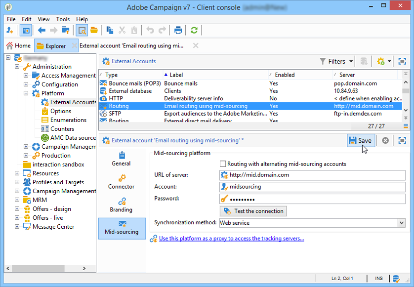

1. 「**[!UICONTROL 接続をテスト]**」をクリックして設定を確認します。
1. ミッドソーシングサーバーで参照されているトラッキングインスタンスを宣言します。

   リンク **[!UICONTROL このプラットフォームをプロキシとして使用して、トラッキングサーバー]**&#x200B;にアクセスします。

   トラッキングインスタンスの名前を指定し、トラッキングサーバーとの接続を確認します。

   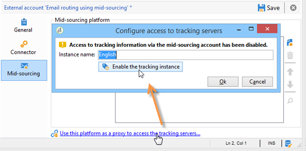

メッセージの配信を複数のミッドソーシングサーバーで管理する場合は、「**[!UICONTROL 代替ミッドソーシングアカウントを使用したルーティング]**」オプションを選択し、異なるサーバーを指定します。

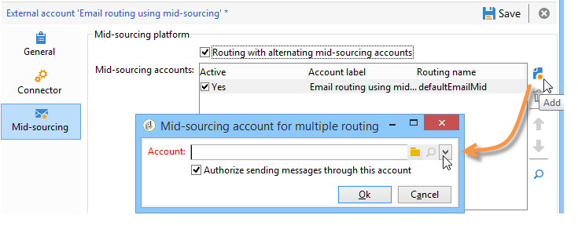
