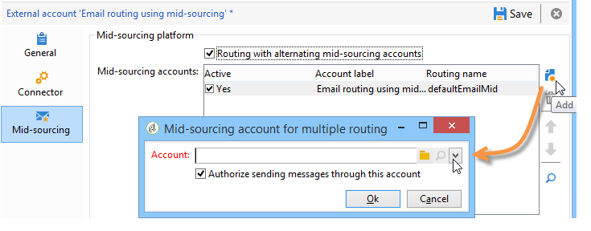

# ミッドソーシングサーバー{#mid-sourcing-server}

この節では、ミッドソーシングサーバーのインストールと設定、およびサードパーティが&#x200B;**ミッドソーシング**&#x200B;モードでメッセージを送信できるようにするインスタンスのデプロイについて説明します。

「ミッドソーシング」アーキテクチャは、[ミッドソーシングのデプロイメント](../../installation/using/mid-sourcing-deployment.md)に示されます。

ミッドソーシングサーバのインストールは、通常の方法でサーバをインストールする場合と同じプロセスに従います（標準設定を参照）。 独自のデータベースを持つ独立したインスタンスで、配信の実行に使用できます。 簡単に言うと、リモートインスタンスがミッドソーシングモードで配信を実行できるようにするための追加の設定が含まれています。

>[!CAUTION]
>
>ミッドソーシングサーバーがセットアップされ、[同期ワークフロー](../../workflow/using/transfer-to-mid-sourcing.md)が初めて実行されたら、ミッドソーシング外部アカウントの内部名を更新しないようにしてください。

## インスタンス{#steps-for-installing-and-configuring-an-instance}のインストールと設定の手順

### インスタンス{#prerequisites-for-installing-and-configuring-an-instance}のインストールおよび設定に必要な前提条件

* アプリケーションサーバーのJDK。
* アプリケーションサーバー上のデータベースサーバーにアクセスします。
* ミッドソーシングサーバーへのHTTP(80)またはHTTPS(443)ポートを開くように構成されたファイアウォール。

次の手順では、1台のミッドソーシングサーバーを使用した設定について説明します。 複数のサーバーを使用することもできます。 同様に、内部設定から特定のメッセージ（ワークフロー通知など）を送信することもできます。

### ミッドソーシング展開用のアプリケーションサーバーのインストールと設定{#installing-and-configuring-the-application-server-for-mid-sourcing-deployment}

インストール手順は、スタンドアロンインスタンスの場合と同じです。 [インストールと設定（シングルマシン）](../../installation/using/standalone-deployment.md#installing-and-configuring--single-machine-)を参照してください。

ただし、次の条件を適用する必要があります。

* ステップ&#x200B;**5**&#x200B;で、**mta** (配信)と&#x200B;**inMail** （バウンスメール）モジュールを無効にする必要があります。 ただし、**wfserver** (workflow)モジュールは、アクティブな状態を維持する必要があります。

   ```
   <?xml version='1.0'?>
   <serverconf>  
     <shared>    
       <!-- add lang="eng" to dataStore to force English for the instance -->    
       <dataStore hosts="console.campaign.net*">      
         <mapping logical="*" physical="default"/>    
       </dataStore>  </shared>  
       <mta autoStart="false"/>  
       <wfserver autoStart="true"/>  
       <inMail autoStart="false"/>  
       <sms autoStart="false"/>  
       <listProtect autoStart="false"/>
   </serverconf>
   ```

   詳しくは、[プロセスの有効化](../../installation/using/campaign-server-configuration.md#enabling-processes)を参照してください。

* 手順&#x200B;**6**、**9**、**10**&#x200B;は不要です。
* **12**&#x200B;と&#x200B;**13**&#x200B;の手順の間に、接続URLの8080ポートを指定する必要があります（コンソールはWebサーバーを経由せずに直接Tomcatと通信するため）。 URLが[http://console.campaign.net:8080](http://console.campaign.net)になります。 手順&#x200B;**13**&#x200B;の間に、**[!UICONTROL ミッドソーシング]**&#x200B;に向けての問題パッケージと、インストールする問題を選択します。

   

   >[!CAUTION]
   >
   >技術配信のデフォルトのルーティングは、自動的にミッドソーシングを介した電子メールルーティングに置き換えられます。

### ミッドソーシングサーバーのインストールと設定{#installing-and-configuring-the-mid-sourcing-server}

クライアントコンソールから、ミッドソーシング&#x200B;**ミッドソーシングアカウントを使用して**&#x200B;電子メールルーティングを探します(**/Administration/folders/**&#x200B;外部アカウント内)。 サーバー&#x200B;**、**&#x200B;アカウント&#x200B;**、**&#x200B;パスワード&#x200B;**、**&#x200B;ミラーページURL **のURLを、ミッドソーシングサーバーをホストするサーバープロバイダーが提供する情報と共に入力します。**&#x200B;接続をテストします。

>[!NOTE]
>
>**mid-sourcingEmitter**&#x200B;オプションは、2つの&#x200B;**ミッドソーシング**&#x200B;ワークフローを作成します。 これは、デフォルトで1時間20分おきに実行され、ミッドソーシングサーバー上の配信情報を収集するプロセスです。

## ミッドソーシングサーバーの展開{#deploying-a-mid-sourcing-server}

1. アプリケーションサーバーのインストール：

   >[!CAUTION]
   >
   >ミッドソーシングサーバーをインストールし、追加のAdobe Campaignモジュールをインストールする場合は、キャンペーンモジュールではなく配信モジュールを使用することをお勧めします。

   標準のデプロイメントと同じ手順で、**[!UICONTROL ミッドソーシングプラットフォーム]**&#x200B;のみを選択します。

   

1. ミッドソーシングモードで受信するための設定

   送信アカウントのパスワードの設定：**/ミッドソーシング/Access Management/Operators/**&#x200B;フォルダー内で、**mid**&#x200B;演算子は、ミッドソーシングモードでの送信のリモートインスタンスで使用されます。 この演算子のパスワードを設定し、送信インスタンスの管理者に渡す必要があります。

   「**ミッドソーシングプラットフォーム**」オプションは、送信された配信と送信を実行するデフォルトの演算子を格納するデフォルトのフォルダーを作成します。

## ミッドソーシングサーバの多重化{#multiplexing-the-mid-sourcing-server}

>[!CAUTION]
>
>多重化は、オンプレミスの環境に対してのみサポートされます。

1つのミッドソーシングインスタンスを複数の送信インスタンスで共有できます。 これらの各インスタンスは、ミッドソーシングデータベース内の演算子と関連付ける必要があります。 ミッドソーシングサーバー上に2番目のアカウントを作成するには：

1. デフォルトのミッドソーシングアカウントに関連付ける&#x200B;**[!UICONTROL ミッドソーシングー/配信]**&#x200B;ノードにーを作成します(例：prod)。
1. **[!UICONTROL ミッドソーシングー/配信ー]**&#x200B;ノードに、アカウントと同じ名前のフォルダーを作成します(例：acception_test)。

   

1. **[!UICONTROL ミッドソーシング/アクセス管理/演算子]**&#x200B;に、新しいアカウントを作成します。

   

1. 「**[!UICONTROL アクセス権]**」タブで、**ミッドソーシング送信**&#x200B;グループの権限をこの演算子に付与します。 このアクセス権は、**[!UICONTROL ミッドソーシング/アクセス管理/演算子グループ]**&#x200B;で利用できます。

   

1. 「****&#x200B;のサブフォルダー内のデータに制限」オプションを選択し、「配信」配信ーを選択して、この演算子をミッドソーシングフォルダーに制限します。

   

1. 次のコマンドを使用して、Webモジュールを再起動します。**nlserver restart web**.

ミッドソーシングサーバーの設定は、serverConf.xmlファイルで変更する必要があります。 既存の行の下の「IPアドレスを持つアフィニティの管理」セクションに次の行を追加する必要があります。

```
<IPAffinity IPMask="" localDomain="" name=""/>
```

&#39;@name&#39;属性は、次のルールを適用する必要があります。

**&#39;marketing_account_operator_name&#39;.&#39;アフィニティ名&#39;.&#39;アフィニティグループ&#39;**

&#39;marketing_account_operator_name&#39;は、ミッドソーシングインスタンスで宣言されたミッドソーシングアカウントの内部名に関連付けられます。

&#39;アフィニティ名&#39;は、アフィニティに与えられた任意の名前に関連します。 この名前は一意にする必要があります。 認証された文字は`[a-z]``[A-Z]``[0-9]`です。 目的は、パブリックIPアドレスのグループを宣言することです。

&#39;アフィニティグループ&#39;は、各配信で使用されるターゲットマッピングで宣言されたサブアフィニティを関連付けます。 「。」を含む最後の部分 は、下位アフィニティがない場合は無視されます。 認証された文字は`[a-z]``[A-Z]``[0-9]`です。

変更を考慮するには、サーバーを停止してから再起動する必要があります。

## ミッドソーシングサーバーでの追跡の設定{#configuring-tracking-on-a-mid-sourcing-server}

**ミッドソーシングサーバーの設定**

1. 「operators」に移動し、演算子&#x200B;**[!UICONTROL mid]**&#x200B;を選択します。
1. 「**[!UICONTROL Frontal servers]**」タブで、トラッキングサーバーの接続パラメーターを入力します。

   トラッキングインスタンスを作成するには、トラッキングサーバーのURL、トラッキングサーバー内部アカウントのパスワード、インスタンスの名前、パスワード、およびそれに関連付けられたDNSマスクを入力します。

   

1. 接続パラメーターを入力したら、「**[!UICONTROL 設定を確認]**」をクリックします。
1. 必要に応じて、配信に含まれる画像を保存する場所を指定します。 これを行うには、ドロップダウンリストからいずれかのパブリケーションモードを選択します。

   

   **[!UICONTROL トラッキングサーバー]**&#x200B;オプションを選択すると、ミッドソーシングはイメージサーバーにコピーされます。

**顧客プラットフォームの設定**

1. 外部ミッドソーシングルーティングアカウントに移動します。
1. 「**[!UICONTROL ミッドソーシング]**」タブで、ミッドソーシングサーバーの接続パラメーターを指定します。

   

1. 「**[!UICONTROL 接続をテスト]**」をクリックして、設定を確認します。
1. ミッドソーシングサーバーで参照されるトラッキングインスタンスを宣言します。

   「**[!UICONTROL Use this platform as a proxy to access the tracking servers]**,」リンクをクリックします。

   トラッキングインスタンスの名前を指定し、トラッキングサーバーとの接続を確認します。

   

メッセージの配信を複数のミッドソーシングサーバーで管理する場合は、**[!UICONTROL ルーティングとミッドソーシングアカウントが交互に設定されているオプション]**&#x200B;を選択し、別のサーバーを指定します。



