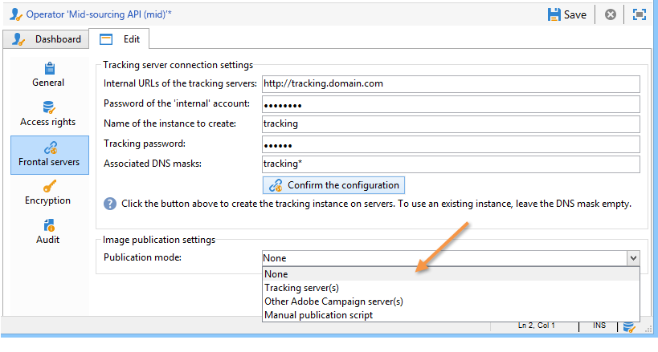

# ミッドソーシングサーバー{#mid-sourcing-server}


この節では、ミッドソーシングサーバーのインストールと設定、およびサードパーティによるメッセージ送信を可能にするインスタンスのデプロイメントについて詳しく説明します **ミッドソーシング** モード。

「ミッドソーシング」アーキテクチャについては、 [ミッドソーシングへのデプロイメント](../../installation/using/mid-sourcing-deployment.md).

ミッドソーシングサーバーのインストール手順は、通常の方法でサーバーをインストールする場合と同じです（標準設定を参照）。 独自のデータベースを持つ独立したインスタンスで、配信の実行に使用できます。 簡単に言えば、リモートインスタンスがミッドソーシングモードで配信を実行できるようにする追加の設定が含まれています。

>[!CAUTION]
>
>ミッドソーシングサーバーを設定し、 [ワークフローを同期](../../workflow/using/about-technical-workflows.md) を初めて実行した場合は、中間ソーシング外部アカウントの内部名を更新しないでください。

## インスタンスのインストールと設定の手順 {#steps-for-installing-and-configuring-an-instance}

### インスタンスのインストールと設定の前提条件 {#prerequisites-for-installing-and-configuring-an-instance}

* アプリケーションサーバーの JDK。
* アプリケーションサーバー上のデータベースサーバーにアクセスする。
* ミッドソーシングサーバーに対して HTTP(80) または HTTPS(443) ポートを開くように設定されたファイアウォール。

以下の手順では、単一のミッドソーシングサーバーを使用した設定の詳細を説明します。 複数のサーバーを使用することもできます。 同様に、内部設定から特定のメッセージ（例えば、ワークフロー通知）を送信することもできます。

### ミッドソーシングデプロイメント用のアプリケーションサーバーのインストールと設定 {#installing-and-configuring-the-application-server-for-mid-sourcing-deployment}

インストール手順は、スタンドアロンインスタンスの手順と同じです。 参照： [インストールと設定（シングルマシン）](../../installation/using/standalone-deployment.md#installing-and-configuring--single-machine-).

ただし、次の条件を満たす必要があります。

* ステップ **5**&#x200B;を無効にするには、 **mta** （配信）および **inMail** （バウンスメール）モジュール この **wfserver** （ワークフロー）モジュールを使用している場合でも、アクティブな状態を維持する必要があります。

  ```
  <?xml version='1.0'?>
  <serverconf>  
    <shared>    
      <!-- add lang="eng" to dataStore to force English for the instance -->    
      <dataStore hosts="console.campaign.net*">      
        <mapping logical="*" physical="default"/>    
      </dataStore>  </shared>  
      <mta autoStart="false"/>  
      <wfserver autoStart="true"/>  
      <inMail autoStart="false"/>  
      <sms autoStart="false"/>  
      <listProtect autoStart="false"/>
  </serverconf>
  ```

  詳しくは、[この節](../../installation/using/configuring-campaign-server.md#enabling-processes)を参照してください。

* 手順 **6**, **9** および **10** 必要ありません。
* ステップ中 **12** および **13**&#x200B;の場合は、接続 URL の 8080 ポートを指定する必要があります（コンソールは、Web サーバーを介せずに Tomcat と直接通信するので）。 URL はになります。 `http://console.campaign.net:8080`. ステップ中 **13**&#x200B;を選択し、 **[!UICONTROL ミッドソーシングに関する問題]** パッケージと、インストールするパッケージ。

  

  >[!CAUTION]
  >
  >テクニカル配信のデフォルトのルーティングは、ミッドソーシング経由の E メールルーティングに自動的に置き換えられます。

### ミッドソーシングサーバーのインストールと設定 {#installing-and-configuring-the-mid-sourcing-server}

クライアントコンソールで、 **ミッドソーシングを使用した E メールルーティング** ミッドソーシングアカウント ( **/管理/外部アカウント/** フォルダー )。 次の項目に **サーバーの URL**, **アカウント**, **パスワード** および **ミラーページの URL** 設定に含まれます。 接続をテストします。

>[!NOTE]
>
>この **mid-sourcingEmitter** オプションは 2 つを作成します **ミッドソーシング** ワークフロー。 これは、デフォルトで 1 時間 20 分ごとに実行され、ミッドソーシングサーバー上の配信情報を収集するプロセスです。

## ミッドソーシングサーバーのデプロイ {#deploying-a-mid-sourcing-server}

1. アプリケーションサーバーのインストール：

   >[!CAUTION]
   >
   >ミッドソーシングサーバーをインストールし、追加のAdobe Campaignモジュールをインストールする場合は、Campaign モジュールではなく配信モジュールを使用することをお勧めします。

   標準の配置と同じ手順に従い、 **[!UICONTROL ミッドソーシングプラットフォーム]** オプション。

   

1. ミッドソーシングモードでの受信の設定

   送信アカウントのパスワードを設定します。内 **/ミッドソーシング/アクセス管理/オペレーター/** フォルダー、 **mid** オペレーターは、ミッドソーシングモードでの送信に対してリモートインスタンスで使用されます。 このオペレーターのパスワードを設定し、送信インスタンスの管理者にパスワードを渡す必要があります。

   この **ミッドソーシングプラットフォーム** 「 」オプションは、送信された配信と送信を実行するデフォルトのオペレーターを保存するためのデフォルトのフォルダーを作成します。

## ミッドソーシングサーバーの多重化 {#multiplexing-the-mid-sourcing-server}

>[!CAUTION]
>
>多重化は、オンプレミス環境でのみサポートされます。

ミッドソーシングインスタンスは、複数の送信インスタンスで共有できます。 これらの各インスタンスは、ミッドソーシングデータベースのオペレーターと関連付ける必要があります。 中間ソーシングサーバーで 2 番目のアカウントを作成するには：

1. にフォルダーを作成します。 **[!UICONTROL ミッドソーシング/配信]** デフォルトの中間ソーシングアカウントに関連付けられるノード ( 例：prod) を参照してください。
1. にフォルダーを作成します。 **[!UICONTROL ミッドソーシング/配信]** アカウントと同じ名前のノード（例： ）accepsence_test) に書き込まれます。

   

1. In **[!UICONTROL ミッドソーシング/アクセス管理/オペレーター]**、新しいアカウントを作成します。

   

1. 内 **[!UICONTROL アクセス権]** 」タブで、このオペレーターに **ミッドソーシング送信** グループ化します。 このアクセス権は、 **[!UICONTROL ミッドソーシング/アクセス管理/オペレーターグループ]**.

   

1. を選択します。 **[!UICONTROL 次のサブフォルダー内のデータに制限：]** 「 」オプションを選択し、「配信」フォルダーを選択して、このオペレーターをミッドソーシング配信フォルダーに制限します。

   

1. 次のコマンドを使用して、Web モジュールを再起動します。 **nlserver 再起動 web**.

serverConf.xml ファイルの中間ソーシングサーバー設定を変更する必要があります。 既存の行の下の「IP アドレスを使用したアフィニティの管理」セクションに、次の行を追加する必要があります。

```
<IPAffinity IPMask="" localDomain="" name=""/>
```

「@name」属性は、次のルールに従う必要があります。

**&#39;marketing_account_operator_name&#39;.&#39;affinity_name&#39;.&#39;affinity_group&#39;**

「marketing_account_operator_name」は、ミッドソーシングインスタンスで宣言されたミッドソーシングアカウントの内部名に関連付けられます。

「affinity_name」は、アフィニティに与えられた任意の名前に関連します。 この名前は一意である必要があります。 許可されている文字は次のとおりです `[a-z]``[A-Z]``[0-9]`. 目的は、パブリック IP アドレスのグループを宣言することです。

「affinity_group」は、各配信で使用されるターゲットマッピングで宣言されたサブアフィニティを関連付けます。 「。」を含む最後の部分 サブアフィニティがない場合、は無視されます。 許可されている文字は次のとおりです `[a-z]``[A-Z]``[0-9]`.

変更を反映させるには、サーバーを停止し、再起動する必要があります。 

## ミッドソーシングサーバーでのトラッキングの設定 {#configuring-tracking-on-a-mid-sourcing-server}

**ミッドソーシングサーバーの設定**

1. 「演算子」に移動し、演算子を選択します。 **[!UICONTROL mid]**.
1. 内 **[!UICONTROL フロントサーバー]** 「 」タブで、トラッキングサーバー接続パラメーターを入力します。

   トラッキングインスタンスを作成するには、トラッキングサーバーの URL、トラッキングサーバーの内部アカウントパスワード、インスタンスの名前、パスワード、およびそれに関連付けられた DNS マスクを入力します。

   

1. 接続パラメータを入力したら、 **[!UICONTROL 設定を確認]**.
1. 必要に応じて、配信に含まれる画像の保存場所を指定します。 それには、ドロップダウンリストからいずれかのパブリッシュモードを選択します。

   

   次を選択した場合、 **[!UICONTROL トラッキングサーバー]** 」オプションを選択すると、画像がミッドソーシングサーバーにコピーされます。

**顧客プラットフォームの設定**

1. 外部ミッドソーシングルーティングアカウントに移動します。
1. 内 **[!UICONTROL ミッドソーシング]** 「 」タブで、ミッドソーシングサーバー接続のパラメーターを指定します。

   

1. 「 **[!UICONTROL 接続をテストする]**.
1. ミッドソーシングサーバーで参照されるトラッキングインスタンスを宣言します。

   リンクをクリックします。 **[!UICONTROL このプラットフォームをプロキシとして使用して、トラッキングサーバーにアクセスします]**,

   トラッキングインスタンスの名前を指定し、トラッキングサーバーとの接続を確認します。

   

メッセージの配信を複数のミッドソーシングサーバーで管理する場合は、「 」オプションを選択します **[!UICONTROL 代替ミッドソーシングアカウントを使用したルーティング]** をクリックし、別のサーバーを指定します。


