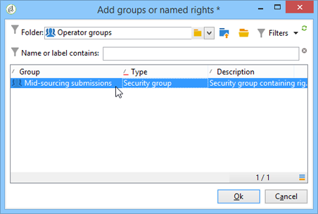

# ミッドソーシングサーバー{#mid-sourcing-server}

この節では、ミッドソーシングサーバーのインストールと設定、およびサードパーティが&#x200B;**ミッドソーシング**&#x200B;モードでメッセージを送信できるようにするインスタンスのデプロイについて説明します。

「ミッドソーシング」アーキテクチャは、[ミッドソーシングデプロイメント](../../installation/using/mid-sourcing-deployment.md)で説明しています。

ミッドソーシングサーバーのインストール手順は、通常の方法でサーバーをインストールする場合と同じです（標準設定を参照）。 独自のデータベースを持つ独立したインスタンスで、配信の実行に使用できます。 簡単に言えば、ミッドソーシングモードでリモートインスタンスを通じて配信を実行できるようにする追加の設定が含まれています。

>[!CAUTION]
>
>ミッドソーシングサーバーが設定され、[同期ワークフロー](../../workflow/using/about-technical-workflows.md)が初めて実行されたら、ミッドソーシング外部アカウントの内部名を更新しないでください。

## インスタンス{#steps-for-installing-and-configuring-an-instance}のインストールと設定の手順

### インスタンス{#prerequisites-for-installing-and-configuring-an-instance}のインストールと設定の前提条件

* アプリケーションサーバーのJDK。
* アプリケーションサーバー上のデータベースサーバーにアクセスする。
* ミッドソーシングサーバーに対してHTTP(80)またはHTTPS(443)ポートを開くように設定されたファイアウォール。

以下の手順では、単一のミッドソーシングサーバーを使用した設定について詳しく説明します。 複数のサーバーを使用することもできます。 同様に、内部設定から特定のメッセージ（例えば、ワークフロー通知）を送信することもできます。

### ミッドソーシングデプロイメント用のアプリケーションサーバーのインストールと設定{#installing-and-configuring-the-application-server-for-mid-sourcing-deployment}

インストール手順は、スタンドアロンインスタンスの手順と同じです。 [インストールと設定（シングルマシン）](../../installation/using/standalone-deployment.md#installing-and-configuring--single-machine-)を参照してください。

ただし、次の条件を適用する必要があります。

* 手順&#x200B;**5**&#x200B;で、**mta** （配信）および&#x200B;**inMail** （バウンスメール）モジュールを無効にする必要があります。 ただし、**wfserver**（ワークフロー）モジュールは、アクティベート状態を維持する必要があります。

   ```
   <?xml version='1.0'?>
   <serverconf>  
     <shared>    
       <!-- add lang="eng" to dataStore to force English for the instance -->    
       <dataStore hosts="console.campaign.net*">      
         <mapping logical="*" physical="default"/>    
       </dataStore>  </shared>  
       <mta autoStart="false"/>  
       <wfserver autoStart="true"/>  
       <inMail autoStart="false"/>  
       <sms autoStart="false"/>  
       <listProtect autoStart="false"/>
   </serverconf>
   ```

   詳細については、[このセクション](../../installation/using/configuring-campaign-server.md#enabling-processes)を参照してください。

* 手順&#x200B;**6**、**9**、**10**&#x200B;は不要です。
* 手順&#x200B;**12**&#x200B;と&#x200B;**13**&#x200B;の間に、接続URLの8080ポートを示す必要があります（コンソールはWebサーバーを介せずにTomcatと直接通信するため）。 URLは[http://console.campaign.net:8080](http://console.campaign.net)になります。 手順&#x200B;**13**&#x200B;の間に、**[!UICONTROL Mid-sourcing]**&#x200B;パッケージに対する問題と、インストールする問題を選択します。

   

   >[!CAUTION]
   >
   >技術的な配信のデフォルトのルーティングは、ミッドソーシング経由のEメールルーティングに自動的に置き換えられます。

### ミッドソーシングサーバー{#installing-and-configuring-the-mid-sourcing-server}のインストールと設定

クライアントコンソールで、ミッドソーシング&#x200B;**ミッドソーシングアカウント（**/Administration/External accounts/**フォルダー）を使用した** Eメールルーティングを探します。 ミッドソーシングサーバーをホストするサーバープロバイダーから提供された情報を使用して、サーバーの&#x200B;**URL、**&#x200B;アカウント&#x200B;**、**&#x200B;パスワード&#x200B;**、**&#x200B;ミラーページのURL **の設定を指定します。**&#x200B;接続をテストします。

>[!NOTE]
>
>**mid-sourcingEmitter**&#x200B;オプションは、2つの&#x200B;**ミッドソーシング**&#x200B;ワークフローを作成します。 これは、デフォルトで1時間20分ごとに実行され、ミッドソーシングサーバー上の配信情報を収集するプロセスです。

## ミッドソーシングサーバーのデプロイ{#deploying-a-mid-sourcing-server}

1. アプリケーションサーバーのインストール：

   >[!CAUTION]
   >
   >ミッドソーシングサーバーをインストールし、追加のAdobe Campaignモジュールをインストールする場合は、Campaignモジュールではなく、配信モジュールを使用することをお勧めします。

   標準のデプロイメントと同じ手順に従い、「**[!UICONTROL ミッドソーシングプラットフォーム]**」オプションのみを選択します。

   

1. ミッドソーシングモードでの受信の設定

   送信アカウントのパスワードを設定します。**/Mid-sourcing/Access Management/Operators/**&#x200B;フォルダーでは、**mid**&#x200B;演算子が、ミッドソーシングモードでの送信にリモートインスタンスで使用されます。 このオペレーターのパスワードを設定し、送信インスタンスの管理者に渡す必要があります。

   「**ミッドソーシングプラットフォーム**」オプションは、送信された配信と送信を実行するデフォルトのオペレーターを保存するためのデフォルトのフォルダーを作成します。

## ミッドソーシングサーバーの多重化{#multiplexing-the-mid-sourcing-server}

>[!CAUTION]
>
>多重化は、オンプレミス環境でのみサポートされます。

ミッドソーシングインスタンスを複数の送信インスタンスで共有できます。 これらの各インスタンスは、ミッドソーシングデータベースのオペレーターに関連付ける必要があります。 ミッドソーシングサーバーで2つ目のアカウントを作成するには：

1. **[!UICONTROL ミッドソーシング/配信]**&#x200B;ノードに、デフォルトのミッドソーシングアカウントに関連付けるフォルダーを作成します(例：prod)を使用します。
1. **[!UICONTROL ミッドソーシング/配信]**&#x200B;ノードに、アカウントと同じ名前のフォルダーを作成します(例：acception_test)を返します。

   

1. **[!UICONTROL ミッドソーシング/アクセス管理/オペレーター]**&#x200B;で、新しいアカウントを作成します。

   

1. 「**[!UICONTROL アクセス権]**」タブで、このオペレーターに「**ミッドソーシング送信**」グループの権限を付与します。 このアクセス権は、**[!UICONTROL ミッドソーシング/アクセス管理/オペレーターグループ]**&#x200B;で使用できます。

   

1. 「****&#x200B;のサブフォルダー内のデータに制限」オプションを選択し、配信フォルダーを選択して、このオペレーターをミッドソーシング配信フォルダーに制限します。

   

1. 次のコマンドを使用して、Webモジュールを再起動します。**nlserverはweb**&#x200B;を再起動します。

serverConf.xmlファイルのミッドソーシングサーバー設定を変更する必要があります。 既存の行の下の「IPアドレスを使用したアフィニティの管理」セクションに、次の行を追加する必要があります。

```
<IPAffinity IPMask="" localDomain="" name=""/>
```

「@name」属性は、次のルールに従う必要があります。

**&#39;marketing_account_operator_name&#39;.&#39;affinity_name&#39;.&#39;affinity_group&#39;**

「marketing_account_operator_name」は、ミッドソーシングインスタンスで宣言されたミッドソーシングアカウントの内部名に関連します。

&#39;affinity_name&#39;は、アフィニティに与えられた任意の名前に関連します。 この名前は一意である必要があります。 許可されている文字は`[a-z]``[A-Z]``[0-9]`です。 目的は、パブリックIPアドレスのグループを宣言することです。

「affinity_group」は、各配信で使用されるターゲットマッピングで宣言されたサブアフィニティを関連付けます。 「。」を含む最後の部分 サブアフィニティがない場合は無視されます。 許可されている文字は`[a-z]``[A-Z]``[0-9]`です。

変更を反映するには、サーバーを停止してから再起動する必要があります。

## ミッドソーシングサーバー{#configuring-tracking-on-a-mid-sourcing-server}でのトラッキングの設定

**ミッドソーシングサーバーの設定**

1. 「operators」に移動し、演算子&#x200B;**[!UICONTROL mid]**&#x200B;を選択します。
1. 「**[!UICONTROL Frontal servers]**」タブで、トラッキングサーバーの接続パラメーターを入力します。

   トラッキングインスタンスを作成するには、トラッキングサーバーのURL、トラッキングサーバーの内部アカウントのパスワード、インスタンスの名前、パスワード、およびそれに関連付けられたDNSマスクを入力します。

   

1. 接続パラメーターを入力したら、「**[!UICONTROL 設定を確認]**」をクリックします。
1. 必要に応じて、配信に含まれる画像の保存場所を指定します。 それには、ドロップダウンリストからパブリッシュモードの1つを選択します。

   

   「**[!UICONTROL トラッキングサーバー]**」オプションを選択した場合、画像はミッドソーシングサーバーにコピーされます。

**顧客プラットフォームの設定**

1. 外部ミッドソーシングルーティングアカウントに移動します。
1. 「**[!UICONTROL ミッドソーシング]**」タブで、ミッドソーシングサーバー接続のパラメーターを指定します。

   

1. 「**[!UICONTROL 接続をテスト]**」をクリックして設定を確認します。
1. ミッドソーシングサーバーで参照されるトラッキングインスタンスを宣言します。

   リンク「**[!UICONTROL Use this platform as a proxy」をクリックして、トラッキングサーバーにアクセスします。]**

   トラッキングインスタンスの名前を指定し、トラッキングサーバーとの接続を確認します。

   

メッセージの配信を複数のミッドソーシングサーバーで管理する場合は、「**[!UICONTROL Routing with alternating mid-sourcing accounts]**」オプションを選択し、別のサーバーを指定します。


