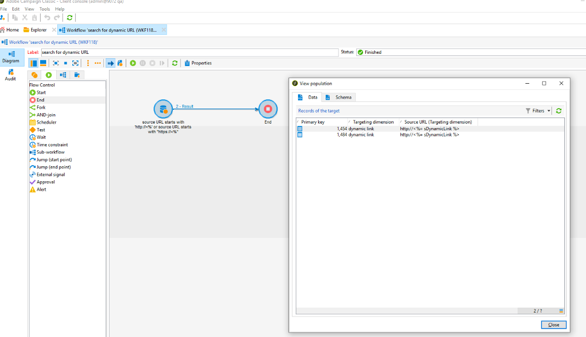
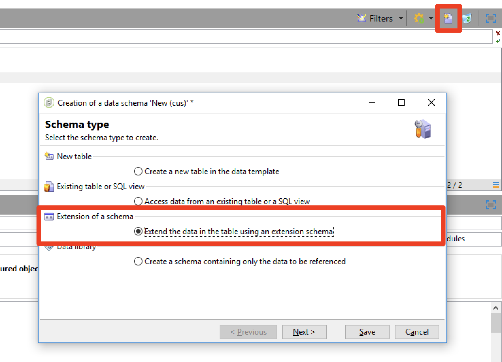

# パーソナライゼーションとプライバシー {#privacy}

## URL のパーソナライゼーション {#url-personalization}

コンテンツにパーソナライズされたリンクを追加する場合、潜在的なセキュリティギャップを回避するために、URL のホスト名部分にパーソナライゼーションを含めないようにしてください。 次の例は、すべての URL 属性 &lt;`a href="">` または `` で使用しないでください。

* `<%= url >`
* `https://<%= url >`
* `https://<%= domain >/path`
* `https://<%= sub-domain >.domain.tld/path`
* `https://sub.domain<%= main domain %>/path`

### レコメンデーション

上記を使用していないことを検証して確認するには、[Campaign汎用クエリエディター](../../platform/using/adobe-campaign-workspace.md#about-queries-in-campaign)を介してトラッキング URL テーブルでクエリを実行するか、クエリアクティビティでフィルター条件を使用するワークフローを作成します。 [Campaign v8 ドキュメント](https://experienceleague.adobe.com/docs/campaign/automation/workflows/wf-activities/targeting-activities/query.html?lang=ja){target="_blank"}を参照してください。

例：

1. ワークフローを作成し、**クエリ** アクティビティを追加します。 [Campaign v8 ドキュメント](https://experienceleague.adobe.com/docs/campaign/automation/workflows/wf-activities/targeting-activities/query.html?lang=ja){target="_blank"}を参照してください。

1. **クエリ** アクティビティを開き、次のように`nmsTrackingUrl` テーブルにフィルターを作成します。

   `source URL starts with http://<% or source URL starts with https://<%`

1. ワークフローを実行し、結果があるかを確認します。

1. 結果がある場合は、出力トランジションを開いて URL のリストを表示します。

   


### URL署名

セキュリティを強化するため、メール内のリンクを追跡するための署名メカニズムが導入されました。 ビルド 19.1.4 （9032@3a9dc9c）および20.2以降で使用できます。 この機能はデフォルトで有効になっています。

>[!NOTE]
>
>形式が正しくない署名済みURLをクリックすると、このエラーが返されます：`Requested URL '…' was not found.`

さらに、機能強化を使用して、以前のビルドで生成されたURLを無効にすることもできます。 この機能はデフォルトで無効になっています。 この機能を有効にするには、[&#x200B; カスタマーケア &#x200B;](https://helpx.adobe.com/jp/enterprise/admin-guide.html/enterprise/using/support-for-experience-cloud.ug.html)にお問い合わせください。

19.1.4 ビルドで実行している場合、トラッキングリンクを使用したプッシュ通知の配信やアンカータグを使用した配信で問題が発生する可能性があります。 その場合は、URL署名を無効にすることをお勧めします。

Campaign ホスト版、Managed Cloud Servicesまたはハイブリッド版のお客様の場合、URL署名を無効にするには、[&#x200B; カスタマーケア &#x200B;](https://helpx.adobe.com/jp/enterprise/using/support-for-experience-cloud.html)にお問い合わせください。

ハイブリッドアーキテクチャでCampaignを実行している場合は、URL署名を有効にする前に、ホストされているミッドソーシングインスタンスが次のようにアップグレードされていることを確認します。

* まず、オンプレミスマーケティングインスタンスは
* 次に、オンプレミスマーケティングインスタンスと同じバージョンに、または少し高いバージョンにアップグレードします

それ以外の場合、次のような問題が発生する可能性があります。

* ミッドソーシングインスタンスをアップグレードする前に、このインスタンスを介して署名なしでURLが送信されます。
* ミッドソーシングインスタンスがアップグレードされ、両方のインスタンスでURL署名が有効になると、署名なしで以前に送信されたURLが拒否されます。 その理由は、マーケティングインスタンスによって提供されたトラッキングファイルによって署名が要求されるためです。

以前のビルドで生成されたURLを無効にするには、すべてのCampaign サーバーで同時に次の手順に従います。

1. サーバー設定ファイル （`serverConf.xml`）で、**blockRedirectForUnsignedTrackingLink** オプションを&#x200B;**true**&#x200B;に変更します。
1. `nlserver` サービスを再起動します。
1. `tracking` サーバーで、`web` サーバー（Debianではapache2、CentOS/RedHatではhttpd、WindowsではIIS）を再起動します。

URL署名を有効にするには、すべてのCampaign サーバーで同時に次の手順に従います。

1. サーバー設定ファイル （`serverConf.xml`）で、**signEmailLinks** オプションを&#x200B;**true**&#x200B;に変更します。
1. **nlserver** サービスを再起動します。
1. `tracking` サーバーで、`web` サーバー（Debianではapache2、CentOS/RedHatではhttpd、WindowsではIIS）を再起動します。

## データの制限

暗号化されたパスワードが、低権限の認証済みユーザーからアクセスできないことを確認する必要があります。 これを行うには、パスワードフィールドへのアクセスのみを制限するか、エンティティ全体へのアクセスを制限します（ビルド >= 8770が必要です）。

この制限をおこなうと、パスワードフィールドを削除する一方で、外部アカウントは全ユーザー向けのインターフェイスからアクセス可能にできます。 [詳細情報](../../configuration/using/restricting-pii-view.md)。

手順は次のとおりです。

1. Campaign エクスプローラーの&#x200B;**[!UICONTROL 管理]** > **[!UICONTROL 設定]** > **[!UICONTROL データスキーマ]** フォルダーを参照します。

1. スキーマ **の**&#x200B;拡張機能として、データスキーマを作成します。

   

1. **[!UICONTROL 外部アカウント]**（extAccount）を選択します。

1. 最後のアシスタント画面で、新しい「srcSchema」を編集して、すべてのパスワードフィールドへのアクセスを制限します。

   メイン要素（`<element name="extAccount" ... >`）は、次の方法で置き換えることができます。

   ```sql
   <element name="extAccount">
       <attribute accessibleIf="$(loginId) = 0 or $(login) = 'admin'" name="password"/>
       <attribute accessibleIf="$(loginId) = 0 or $(login) = 'admin'" name="clientSecret"/>
   
       <element name="s3Account">
           <attribute accessibleIf="$(loginId) = 0 or $(login) = 'admin'" name="awsSecret"/>
       </element>
       <element name="wapPush">
           <attribute accessibleIf="$(loginId) = 0 or $(login) = 'admin'" name="password"/>
           <attribute accessibleIf="$(loginId) = 0 or $(login) = 'admin'" name="clientSecret"/>
       </element>
       <element name="mms">
           <attribute accessibleIf="$(loginId) = 0 or $(login) = 'admin'" name="password"/>
           <attribute accessibleIf="$(loginId) = 0 or $(login) = 'admin'" name="clientSecret"/>
       </element>
   </element>
   ```

   したがって、拡張された srcSchema は次のようになります。

   ```sql
   <srcSchema _cs="External Accounts (cus)" created="2017-05-12 07:53:49.691Z" createdBy-id="0"
               desc="Definition of external accounts (Email, SMS...) used by the modules"
               entitySchema="xtk:srcSchema" extendedSchema="nms:extAccount" img="" label="External Accounts"
               labelSingular="External account" lastModified="2017-05-12 08:33:49.365Z"
               mappingType="sql" md5="E9BB0CD6A4375F500027C86EA854E101" modifiedBy-id="0"
               name="extAccount" namespace="cus" xtkschema="xtk:srcSchema">
       <createdBy _cs="Administrator (admin)"/>
       <modifiedBy _cs="Administrator (admin)"/>
       <element name="extAccount">
           <attribute accessibleIf="$(loginId) = 0 or $(login) = 'admin'" name="password"/>
           <attribute accessibleIf="$(loginId) = 0 or $(login) = 'admin'" name="clientSecret"/>
   
           <element name="s3Account">
               <attribute accessibleIf="$(loginId) = 0 or $(login) = 'admin'" name="awsSecret"/>
           </element>
           <element name="wapPush">
               <attribute accessibleIf="$(loginId) = 0 or $(login) = 'admin'" name="password"/>
               <attribute accessibleIf="$(loginId) = 0 or $(login) = 'admin'" name="clientSecret"/>
           </element>
           <element name="mms">
               <attribute accessibleIf="$(loginId) = 0 or $(login) = 'admin'" name="password"/>
               <attribute accessibleIf="$(loginId) = 0 or $(login) = 'admin'" name="clientSecret"/>
           </element>
       </element>
   </srcSchema>    
   ```

   >[!NOTE]
   >
   >`$(loginId) = 0 or $(login) = 'admin'`を`hasNamedRight('admin')`に置き換えて、管理者権限を持つすべてのユーザーがこれらのパスワードを表示できるようにすることができます。

## PIでページを保護

ミラーページ、web アプリケーションなどの個人情報（PI）を含む可能性のあるページを保護することをオンプレミスのお客様に強くお勧めします。

この手順の目的は、これらのページのインデックス作成を防ぎ、潜在的なセキュリティリスクを回避することです。 以下に、この目的に役立つ記事をいくつか示します。

* [https://developers.google.com/search/reference/robots_txt](https://developers.google.com/search/reference/robots_txt)
* [https://developers.google.com/search/reference/robots_meta_tag](https://developers.google.com/search/reference/robots_meta_tag)

ページを保護するには、次の手順に従います。

1. Web サーバー（ApacheまたはIIS）のルートに`robots.txt` ファイルを追加します。 このファイルの内容は次のとおりです。

   ```sql
   # Make changes for all web spiders
   User-agent:
   *Disallow: /
   ```

   IISについては、[このページ &#x200B;](https://docs.microsoft.com/en-us/iis/extensions/iis-search-engine-optimization-toolkit/managing-robotstxt-and-sitemap-files)を参照してください。

   Apacheの場合は、**/var/www/robots.txt** （Debian）にファイルを配置できます。

1. **robots.txt** ファイルを追加するだけでは、セキュリティの観点から不十分な場合があります。 例えば、他の Web サイトに自社ページへのリンクがある場合は、検索結果に自社ページの情報が表示される可能性があります。

   **robots.txt** ファイルに加えて、**X-Robots-Tag** ヘッダーを追加することをお勧めします。 ApacheまたはIISと&#x200B;**serverConf.xml**&#x200B;設定ファイルで実行できます。

   詳しくは、[この記事](https://developers.google.com/search/reference/robots_meta_tag)を参照してください。


## プライバシーリクエスト

Adobe Campaignのプライバシー管理と実装の手順について詳しくは、[このページ &#x200B;](../../platform/using/privacy-management.md)を参照してください。 また、ベストプラクティスや、ユーザープロセスおよびペルソナの概要についても説明します。
