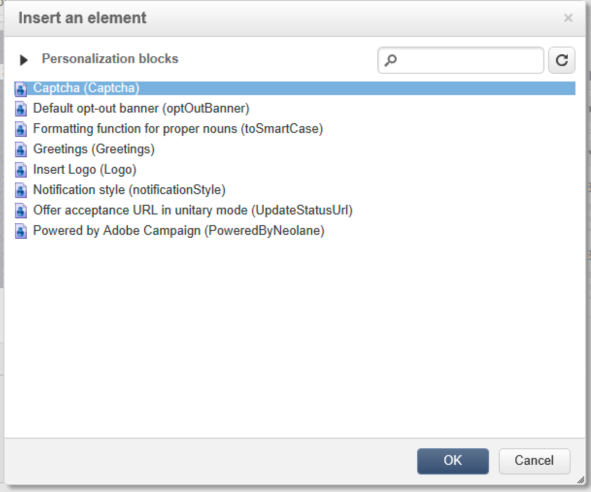

# スクリプトとコーディングのガイドライン {#scripting-coding-guidelines}


## スクリプト作成

詳しくは、[Campaign JSAPI のドキュメント](https://experienceleague.adobe.com/developer/campaign-api/api/index.html?lang=ja)を参照してください。

ワークフロー、Web アプリケーション、JSSP を使用してスクリプトを作成する場合、次のベストプラクティスに従ってください。

* SQL 文はできるだけ使用しないようにしてください。

* どうしても必要な場合は、文字列連結ではなく、パラメーター化関数（prepare 文）を使用します。

  悪い方法：

  ```
  sqlGetInt( "select iRecipientId from NmsRecipient where sEmail ='" + request.getParameter('email') +  "'  limit 1" )
  ```

  ベストプラクティス：

  ```
  sqlGetInt( "select iRecipientId from NmsRecipient where sEmail = $(sz) limit 1", request.getParameter('email'));
  ```

  >[!IMPORTANT]
  >
  >sqlSelect はこの機能をサポートしていないので、DBEngine クラスのクエリ関数を使用する必要があります。

  ```
  var cnx = application.getConnection()
  var stmt = cnx.query("SELECT sFirstName, sLastName FROM NmsRecipient where sEmail = $(sz)", request.getParameter('email'))
  for each(var row in stmt) logInfo(row[0] + " : " + row[1])
  cnx.dispose()
  ```

SQL インジェクションを回避するには、Adobe Campaignで使用するに SQL 関数を追加する必要がありま許可リストに加えるす。 オペレーターがに追加許可リストに加えるすると、式エディターに表示されるようになります。 [このページ](../../configuration/using/adding-additional-sql-functions.md)を参照してください。

>[!IMPORTANT]
>
>8140 より古いビルドを使用している場合、 **XtkPassUnknownSQLFunctionsToRDBMS** オプションは&#39;1&#39;に設定できます。 データベースを保護する場合は、このオプションを削除します（または「0」に設定します）。

ユーザー入力を使用してクエリや SQL 文でフィルターを作成する場合は、常にエスケープ処理をおこなう必要があります（[Campaign JSAPI のドキュメント](https://experienceleague.adobe.com/developer/campaign-api/api/index.html?lang=ja)「データ保護：関数のエスケープ」を参照）。次の関数が該当します。

* NL.XML.escape(data)
* NL.SQL.escape(data)
* NL.JS.escape(data)
* NL.XML.escapeAttribute(data)

## 新しいデータモデルの保護

### フォルダーベース

次のページを参照してください。

* [フォルダーアクセスのプロパティ](../../platform/using/access-management.md)
* [リンクされたフォルダー](../../configuration/using/configuration.md#linked-folder)

### ネームド権限

フォルダーベースのセキュリティモデルに加えて、ネームド権限を使用してオペレーターの操作を制限できます。

* データの読み取り/書き込みを防ぐために、システムフィルタ (sysFilter) を追加できます ( [このページ](../../configuration/using/filtering-schemas.md)) をクリックします。

  ```
  <sysFilter name="writeAccess">    
      <condition enabledIf="hasNamedRight('myNewRole')=false" expr="FALSE"/>  
  </sysFilter>
  ```

* スキーマで定義された一部の操作（SOAP メソッド）を保護することもできます。対応するネームド権限を値として、アクセス属性を設定します。

  ```
  <method name="grantVIPAccess" access="myNewRole">
      <parameters>
  ...
      </parameters>
  </method>
  ```

  詳しくは、[このページ](../../configuration/using/implementing-soap-methods.md)を参照してください。

>[!IMPORTANT]
>
>ネームド権限は、ナビゲーションツリーのコマンドノードで使用できます。 これにより、ユーザーエクスペリエンスは向上しますが、保護はされません（非表示／無効にするには、クライアント側のみを使用します）。アクセス属性を使用する必要があります。

### オーバーフローテーブル

オペレーターのアクセスレベルに応じて機密データ（スキーマの一部）を保護する必要がある場合、フォーム定義で非表示にしないでください（enabledIf／visibleIf 条件）。

エンティティ全体が画面で読み込まれます。また、列定義で表示することもできます。この操作をおこなうには、オーバーフローテーブルを作成する必要があります。参照 [このページ](../../configuration/using/examples-of-schemas-edition.md#overflow-table).

## Web アプリケーションへの Captcha の追加

パブリックのランディングページや購読ページには Captcha を追加することをお勧めします。ただし、DCE（デジタルコンテンツエディター）ページに Captcha を追加することは簡単ではありません。ここでは、Captcha バージョン 5 または Google reCAPTCHA を追加する方法について説明します。

DCE に Captcha を追加する場合、一般的には、Captcha を含めるためのパーソナライゼーションブロックをページコンテンツ内に作成します。**スクリプト**&#x200B;アクティビティと&#x200B;**テスト**&#x200B;を追加する必要があります。

### パーソナライゼーションブロック

1. **[!UICONTROL リソース]**／**[!UICONTROL キャンペーン管理]**／**[!UICONTROL パーソナライゼーションブロック]**&#x200B;に移動し、新しいパーソナライゼーションブロックを作成します。

1. 以下を使用します。 **[!UICONTROL Web アプリケーション]** コンテンツタイプとチェック **[!UICONTROL カスタマイズメニューに表示]**.

   詳しくは、[このページ](../../delivery/using/personalization-blocks.md)を参照してください。

   **Campaign Captcha** の例を示します。

   ```javascript
   <%
   var captchaID = CaptchaIDGen();
   %>
   &width=200&height=50&minWordSize=8&maxWordSize=8"/>
   <input id="captchaValue" name="captchaValue" <%= String(ctx.vars.captchaValid) === "false" ? class="ui-state-error" : "" %>>
   <input type="hidden" name="captchaID" value="<%=captchaID%>"/>
   <%
   if( serverForm.isInputErroneous("captchaValue") ) {
   %>
   <script type="text/javascript"> 
   $("#captchaValue").addClass("ui-state-error")
   </script>
   <%
   }
   %>
   ```

   * 1 ～ 6 行目では、必要な入力をすべて生成します。
   * 7 行目から最終行では、エラーを処理します。
   * 4 行目では、Captcha のグレーボックスのサイズ（width/height）と、生成される単語の長さ（minWordSize/maxWordSize）を変更できます。
   * Google reCAPTCHA を使用する前に、Googleに登録し、新しい reCAPTCHA サイトを作成する必要があります。

     `<div class="g-recaptcha" data-sitekey="YOUR_SITE_KEY"></div>`

   検証ボタンを無効にすることが必要な場合もありますが、標準的なボタンやリンクは用意されていないので、HTML 自体で実現することをお勧めします。その方法については、 [このページ](https://developers.google.com/recaptcha/).

### Web アプリケーションの更新

1. Web アプリケーションのプロパティにアクセスして、という名前のブール変数を追加します。 **captchaValid**.

   

1. 最後のページと&#x200B;**[!UICONTROL ストレージ]**&#x200B;アクティビティの間に、**[!UICONTROL スクリプト]**&#x200B;と&#x200B;**[!UICONTROL テスト]**&#x200B;を追加します。

   分岐「**[!UICONTROL はい]**」を「**[!UICONTROL ストレージ]**」に接続し、別の分岐を、Captcha を追加するページに接続します。

   

1. 分岐の条件を次の式で編集： True `"[vars/captchaValid]"` が True と等しい。

   

1. を編集します。 **[!UICONTROL スクリプト]** アクティビティ。 コンテンツは、選択した Captcha エンジンに応じて異なります。

1. 最後に、パーソナライズされたブロックをページに追加できます。を参照してください。 [このページ](../../web/using/editing-content.md).

   

   

>[!IMPORTANT]
>
>reCAPTCHA 統合の場合は、クライアント側の JavaScript をHTML( `<head>...</head>`):
>
>`<script src="https://www.google.com/recaptcha/api.js" async defer></script>`

### Campaign Captcha

```javascript
var captchaID = request.getParameter("captchaID");
var captchaValue = request.getParameter("captchaValue");
  
if( !CaptchaValidate(captchaID, captchaValue) ) {
  serverForm.logInputError("captchaValue",
                           "The characters you typed for the captcha must match the image ones.",
                           "captchaValue")
  ctx.vars.captchaValid = false
}
else
  ctx.vars.captchaValid = true
```

6 行目：あらゆる種類のエラーメッセージを出力できます。

### Google recaptcha

詳しくは、 [公式文書](https://developers.google.com/recaptcha/docs/verify).

```javascript
ctx.vars.captchaValid = false
var gReCaptchaResponse = request.getParameter("g-recaptcha-response");
  
// Call reCaptcha API to validate it
var req = new HttpClientRequest("https://www.google.com/recaptcha/api/siteverify")
req.method = "POST"
req.header["Content-Type"] = "application/x-www-form-urlencoded"
req.body = "secret=YOUR_SECRET_HERE&response=" + encodeURIComponent(gReCaptchaResponse)
req.execute()
var response = req.response
if( response.code == 200 ) {
  captchaRes = JSON.parse(response.body.toString(response.codePage));
  ctx.vars.captchaValid = captchaRes.success
}
  
if( ctx.vars.captchaValid == false ) {
  serverForm.logInputError("reCaptcha",
                           "Please validate the captcha",
                           "reCaptcha")
  logInfo("reCaptcha not validated")
}
```

JSON.parse を使用するには、webApp に「shared/json2.js」を含める必要があります。


ビルド 8797 以降では、検証 API URL を使用するには、urlPermission ノードにを追加して、serverConf ファイルの許可リストに加えるに URL を追加する必要があります。

`<url dnsSuffix="www.google.com" urlRegEx="https://www.google.com/recaptcha/api/siteverify"/>`
