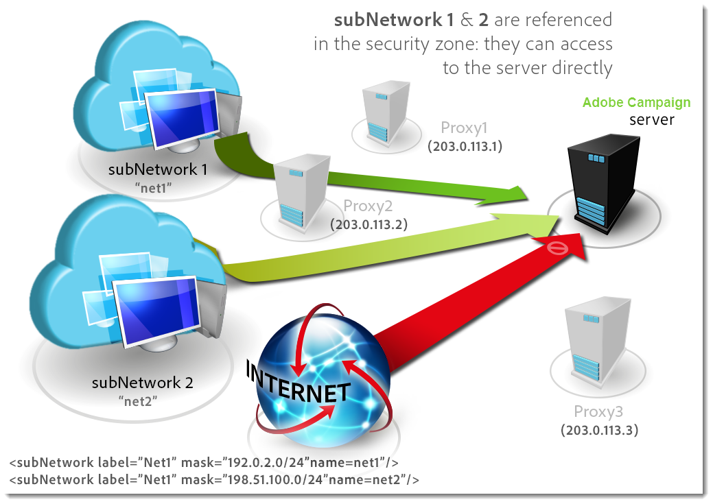
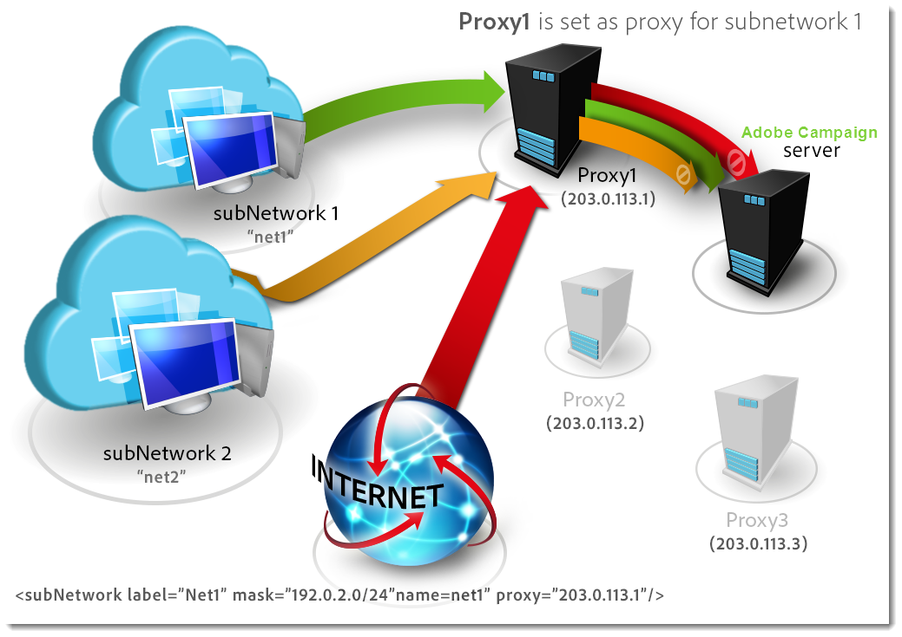
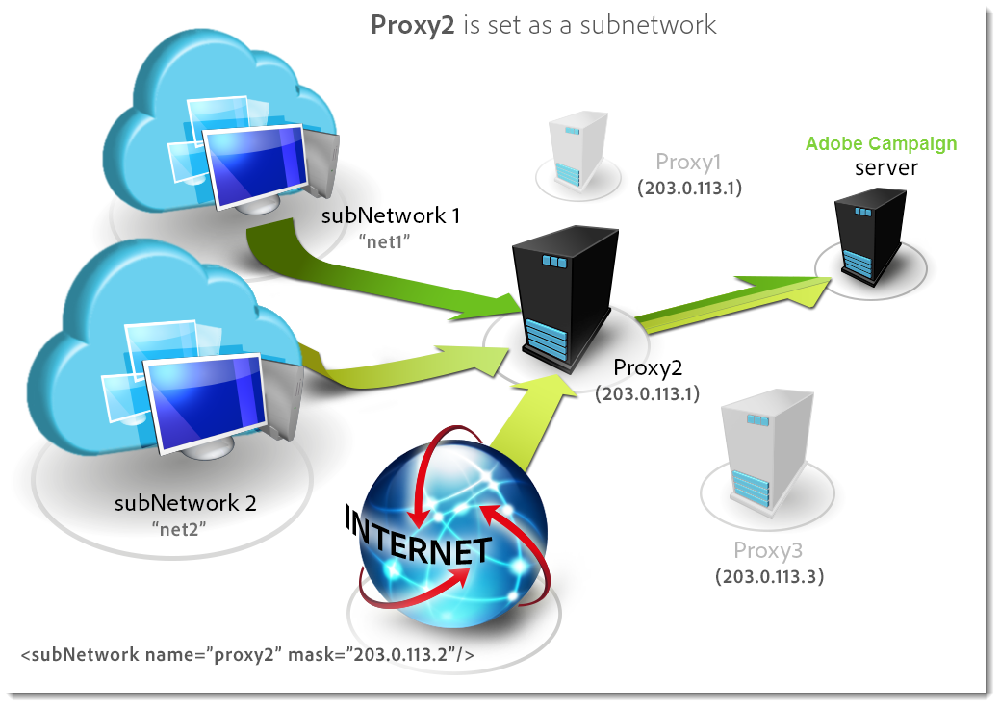
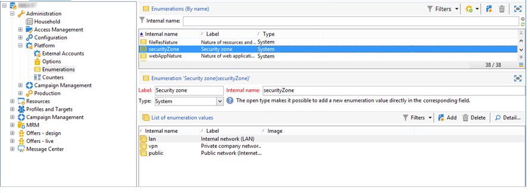
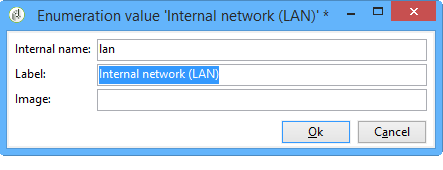
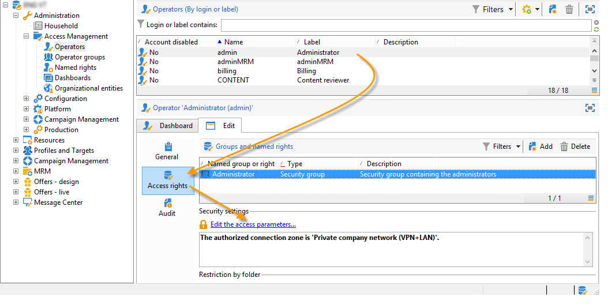
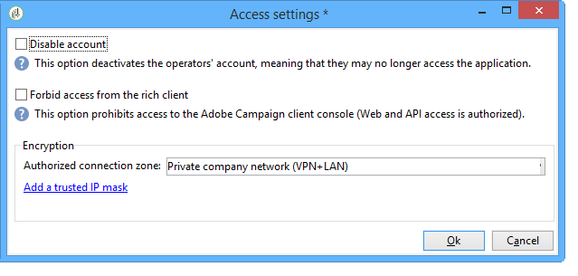

# セキュリティゾーンの定義（オンプレミス）{#defining-security-zones}


インスタンスにログオンするには、各オペレーターがゾーンにリンクされている必要があります。また、セキュリティゾーンで定義されたアドレスまたはアドレスセットにオペレーターの IP が含まれている必要があります。 セキュリティゾーンの設定は、Adobe Campaign サーバーの設定ファイルで実行されます。

オペレーターは、クライアントコンソールでオペレーターのプロファイルからセキュリティゾーンにリンクされます。オペレーターのプロファイルは、**[!UICONTROL 管理／アクセス管理／オペレーター]**&#x200B;ノードでアクセスできます。 [詳細情報](#linking-a-security-zone-to-an-operator)。

>[!NOTE]
>
>この手順は、**オンプレミス**&#x200B;のデプロイメントに制限されています。
>
>**ホスト**&#x200B;のお客様は、[Campaign Campaign コントロールパネル](https://experienceleague.adobe.com/docs/control-panel/using/control-panel-home.html?lang=ja)にアクセスできる場合、セキュリティゾーンのセルフサービスインターフェイスを使用できます。 [詳細情報](https://experienceleague.adobe.com/docs/control-panel/using/instances-settings/ip-allow-listing-instance-access.html?lang=ja)
>
>その他の&#x200B;**ハイブリッド/ホスト**&#x200B;のお客様は、Adobe サポートチームに連絡してIPを契約許可リストに追加する必要があります。
>

## セキュリティゾーンの作成 {#creating-security-zones}

ゾーンは、次のように定義されます。

* 1つ以上のIP アドレス範囲（IPv4およびIPv6）
* IP アドレスの各範囲に関連付けられた技術名

セキュリティゾーンは相互にロックされています。つまり、別のゾーン内に新しいゾーンを定義することで、ログオンできるオペレーターの数を減らしながら、各オペレーターに割り当てられた権限を増やすことができます。

ゾーンは、**serverConf.xml** ファイルでサーバーの構成中に定義する必要があります。 **serverConf.xml**&#x200B;で使用可能なすべてのパラメーターは、[このセクション &#x200B;](../../installation/using/the-server-configuration-file.md)に記載されています。

各ゾーンは、次のような権限を定義します。

* HTTPSではなくHTTP接続
* エラー表示（Java エラー、JavaScript、C++など）
* レポートとweb アプリのプレビュー
* ログイン/パスワードによる認証
* 安全でない接続モード

>[!NOTE]
>
>**各演算子はゾーン**&#x200B;にリンクする必要があります。 オペレーターのIP アドレスがゾーンで定義された範囲に属する場合、オペレーターはインスタンスにログオンできます。\
>オペレーターのIP アドレスは、複数のゾーンで定義できます。 この場合、オペレーターは、各ゾーンで利用可能な権限の&#x200B;**set**&#x200B;を受け取ります。

標準の&#x200B;**serverConf.xml** ファイルには、**パブリック、VPN、およびLAN**&#x200B;の3つのゾーンが含まれています。

>[!NOTE]
>
>**標準設定は安全です**。 ただし、以前のバージョンのAdobe Campaignから移行する前に、新しいルールを移行して承認するために、セキュリティを一時的に軽減する必要がある場合があります。

**serverConf.xml** ファイルでゾーンを定義する方法の例：

```
<securityZone allowDebug="false" allowHTTP="false" label="Public Network" name="public">
<subNetwork label="All addresses" mask="*" name="all"/>

<securityZone allowDebug="true" allowHTTP="false" label="Private Network (VPN)"
              name="vpn" showErrors="true">

  <securityZone allowDebug="true" allowEmptyPassword="true" allowHTTP="true"
                allowUserPassword="false" label="Private Network (LAN)" name="lan"
                sessionTokenOnly="true" showErrors="true">
    <subNetwork label="Lan 1" mask="192.168.0.0/16" name="lan1"/>
    <subNetwork label="Lan 2" mask="172.16.0.0/12" name="lan2"/>
    <subNetwork label="Lan 3" mask="10.0.0.0/8" name="lan3"/>
    <subNetwork label="Localhost" mask="127.0.0.1/16" name="locahost"/>
    <subNetwork label="Lan (IPv6)" mask="fc00::/7" name="lan6"/>
    <subNetwork label="Localhost (IPv6)" mask="::1/128" name="localhost6"/>
  </securityZone>

</securityZone>
</securityZone>
```

ゾーンを定義する権限はすべて次のとおりです。

* **allowDebug**: webAppを「デバッグ」モードで実行できるようにします
* **allowEmptyPassword**：パスワードなしでインスタンスへの接続を許可します
* **allowHTTP**: HTTPS プロトコルを使用せずにセッションを作成できます
* **allowUserPassword**: セッション トークンには次のフォーム「`<login>/<password>`」を指定できます
* **sessionTokenOnly**：接続URLにセキュリティトークンは必要ありません
* **showErrors**: サーバー側のエラーが転送され、表示されます

>[!IMPORTANT]
>
>ゾーン定義では、**true**&#x200B;値を持つ各属性によってセキュリティが低下します。

Message Centerを使用する場合、複数の実行インスタンスがある場合、**sessionTokenOnly**&#x200B;属性が&#x200B;**true**&#x200B;として定義された追加のセキュリティゾーンを作成する必要があります。この際、必要なIP アドレスのみが追加されます。 インスタンスの設定について詳しくは、[このドキュメント &#x200B;](../../message-center/using/configuring-instances.md)を参照してください。

## セキュリティゾーンのベストプラクティス {#best-practices-for-security-zones}

**lan** セキュリティゾーンの定義では、テクニカルアクセスを定義するIP アドレスマスクを追加できます。 この追加により、サーバー上でホストされているすべてのインスタンスにアクセスできるようになります。

```
<securityZone allowDebug="true" allowEmptyPassword="false" allowHTTP="true"
                    allowUserPassword="false" label="Private Network (LAN)" name="lan"
                    sessionTokenOnly="true" showErrors="true">
        <subNetwork label="Lan 1" mask="192.168.0.0/16" name="lan1"/>
        <subNetwork label="Lan 2" mask="172.16.0.0/12" name="lan2"/>
        <subNetwork label="Lan 3" mask="10.0.0.0/8" name="lan3"/>
        <subNetwork label="Localhost" mask="127.0.0.1/16" name="locahost"/>
        <subNetwork label="Lan (IPv6)" mask="fc00::/7" name="lan6"/>
        <subNetwork label="Localhost (IPv6)" mask="::1/128" name="localhost6"/>
  
        <!-- Customer internal IPs -->
        <subNetwork id="internalNetwork" mask="a.b.c.d/xx"/>

      </securityZone>
```

特定のインスタンスのみにアクセスするオペレーターの場合は、インスタンス専用の設定ファイルでIP アドレス範囲を直接定義することをお勧めします。

**`config-<instance>.xml`** ファイルの場合：

```
  <securityZone name="public">
   ...
    <securityZone name="vpn">
      <subNetwork id="cus1" mask="a.b.c.d/xx"/>
```

## セキュリティゾーン内のサブネットワークとプロキシ {#sub-networks-and-proxies-in-a-security-zone}

**proxy** パラメーターは、**subNetwork**&#x200B;要素で使用して、セキュリティゾーンでのプロキシ使用を指定できます。

プロキシが参照され、このプロキシを介して接続が入力された場合（HTTP X-Forwarded-For ヘッダーを介して表示）、検証済みゾーンはプロキシのクライアントのものであり、プロキシのクライアントのものではありません。

>[!IMPORTANT]
>
>プロキシが設定されていて、それを上書きできる場合（または存在しない場合）は、テストするIP アドレスを改ざんできます。
>
>さらに、リレーはプロキシのように生成されるようになりました。 したがって、IP アドレス 127.0.0.1をセキュリティゾーン設定のプロキシのリストに追加できます。
>
>例：「`<subnetwork label="Lan 1" mask="192.168.0.0/16" name="lan1" proxy="127.0.0.1,10.100.2.135" />`」。

様々なケースが発生する可能性があります。

* サブネットワークはセキュリティゾーンで直接参照され、プロキシは設定されません。サブネットワークのユーザーはAdobe Campaign サーバーに直接接続できます。

  

* セキュリティゾーン内のサブネットワークにプロキシが指定されています。このサブネットワークのユーザーは、このプロキシを介してAdobe Campaign サーバーにアクセスできます。

  

* プロキシは、セキュリティゾーンサブネットワークに含まれます。このプロキシを介してアクセスできるユーザーは、出所に関係なく、Adobe Campaign サーバーにアクセスできます。

  

Adobe Campaign サーバーにアクセスする可能性が高いプロキシのIP アドレスは、関連する&#x200B;**`<subnetwork>`**&#x200B;と最初のレベルのサブネットワーク **`<subnetwork name="all"/>`**&#x200B;の両方に入力する必要があります。 例えば、IP アドレスが10.131.146.102のプロキシの場合は次のようになります。

```
<securityZone allowDebug="false" allowHTTP="false" label="Public Network" 
                      name="public">
    <subNetwork label="All addresses" mask="*" name="all"
                      proxy="10.131.146.102,127.0.0.1, ::1"/>

    <securityZone allowDebug="true" allowHTTP="false" label="Private Network (VPN)" 
                      name="vpn" showErrors="true">
        <securityZone allowDebug="true" allowEmptyPassword="false" allowHTTP="true" 
                      allowUserPassword="false" label="Private Network (LAN)" 
                      name="lan" sessionTokenOnly="true" showErrors="true">
            <subNetwork label="Lan proxy" mask="10.131.193.182" name="lan3" 
                      proxy="10.131.146.102,127.0.0.1, ::1"/>
            <subNetwork label="Lan 1" mask="192.168.0.0/16" name="lan1" 
                      proxy="127.0.0.1, ::1"/>

        </securityZone>
    </securityZone>
</securityZone>
```

## セキュリティゾーンをオペレーターにリンクする {#linking-a-security-zone-to-an-operator}

ゾーンを定義したら、インスタンスにログオンできるようにするために、各オペレーターをそのうちの1つにリンクする必要があり、オペレーターのIP アドレスをゾーンで参照されるアドレスまたはアドレスの範囲に含める必要があります。

ゾーンの技術的な設定は、Campaign サーバーの設定ファイル **serverConf.xml**&#x200B;で実行されます。

この手順を実行する前に、最初に、標準装備の&#x200B;**[!UICONTROL セキュリティゾーン]**&#x200B;列挙を設定して、ラベルを&#x200B;**serverConf.xml** ファイルで定義されているゾーンの内部名にリンクする必要があります。

この設定は、Campaign エクスプローラーで行います。

1. **[!UICONTROL 管理/ プラットフォーム / 列挙]** ノードをクリックします。
1. **[!UICONTROL セキュリティゾーン （securityZone）]** システム列挙を選択します。

   

1. サーバーの設定ファイルで定義されている各セキュリティゾーンについて、「**[!UICONTROL 追加]**」ボタンをクリックします。
1. **[!UICONTROL 内部名]** フィールドに、**serverConf.xml** ファイルで定義されているゾーンの名前を入力します。 これは、`<securityzone>`要素の&#x200B;**@name**&#x200B;属性に対応します。 内部名にリンクされたラベルを&#x200B;**ラベル** フィールドに入力します。

   

1. 「OK」をクリックして、変更を保存します。

ゾーンを定義し、**[!UICONTROL セキュリティゾーン]**&#x200B;の列挙を設定したら、各オペレーターをセキュリティゾーンにリンクする必要があります。

1. **[!UICONTROL 管理/ アクセス管理/ オペレーター]** ノードをクリックします。
1. セキュリティゾーンをリンクするオペレーターを選択し、「**[!UICONTROL 編集]**」タブをクリックします。
1. 「**[!UICONTROL アクセス権]**」タブに移動し、「**[!UICONTROL アクセスパラメーターを編集…]**」リンクをクリックします。

   

1. **[!UICONTROL 承認済み接続ゾーン]** ドロップダウンリストからゾーンを選択します

   

1. 「**[!UICONTROL OK]**」をクリックし、変更を保存して、これらの変更を適用します。


## 推奨事項

* リバースプロキシがsubNetworkで許可されていないことを確認してください。 許可されている場合は、**すべての**&#x200B;トラフィックがこのローカル IP から来ているものとして検出され、信頼されます。

* sessionTokenOnly=&quot;true&quot;の使用を最小限に抑えます。

   * 警告：この属性がtrueに設定されている場合、オペレーターは&#x200B;**CRSF攻撃**&#x200B;にさらされる可能性があります。
   * また、sessionToken cookieはhttpOnly フラグで設定されていないため、一部のクライアントサイドのJavaScript コードで読み取ることができます。
   * ただし、複数の実行セルで Message Center が sessionTokenOnly を必要とします。新しいセキュリティゾーンを作成し、sessionTokenOnly を true に設定して、**必要な IP のみ**&#x200B;をこのゾーンに追加します。

* 可能な場合は、すべてのallowHTTP、showErrorsをfalseに設定し（localhostの場合は設定しません）、それらを確認します。

   * allowHTTP = &quot;false&quot;：オペレーターは HTTPS を使用することを強制されます。
   * showErrors = &quot;false&quot;：技術的なエラー（SQL エラーを含む）を非表示にします。 これにより、表示される情報の量を抑えられますが、マーケターが（管理者に追加情報を要求することなしに）問題を解決することが難しくなります。

* 「allowDebug」をtrueに設定するのは、調査、webApps、レポートの作成（実際のプレビュー）が必要なマーケティングユーザーや管理者が使用するIPに対してのみです。 このフラグを使用すると、これらの IP でリレールールが表示され、デバッグできるようになります。

   * allowDebugがfalseに設定されている場合、出力は次のようになります。

     ```
     <redir status='OK' date='...' sourceIP='...'/>
     ```

   * allowDebugがtrueに設定されている場合、出力は次のようになります。

     ```
     <redir status='OK' date='...' build='...' OR version='...' sha1='...' instance='...' sourceIP='...' host='...' localHost='...'/>
     ```

* allowEmptyPassword、allowUserPassword、allowSQLInjectionをtrueに設定しないでください。

   * **allowEmptyPassword**&#x200B;を使用すると、オペレーターは空のパスワードを持つことができます。 そのような場合は、すべてのオペレーターに通知し、期限のあるパスワードの設定を依頼してください。 この期限を経過したら、この属性を false に設定します。

   * **allowUserPassword**&#x200B;を使用すると、オペレーターは資格情報をパラメーターとして送信できます（そのため、apache/IIS/proxyによって記録されます）。 この機能は、以前はAPIの使用を簡素化するために使用されていました。 一部のサードパーティアプリケーションがこの機能を使用しているかどうかをクックブック（または仕様）で確認できます。 使用されている場合、API の使用方法を変更して、なるべく早くこの機能を削除するよう通知する必要があります。

   * **allowSQLInjection**&#x200B;を使用すると、ユーザーは古い構文を使用してSQL インジェクションを実行できます。 この属性はfalseに設定する必要があります。 /nl/jsp/ping.jsp?zones=trueを使用して、セキュリティゾーンの設定を確認できます。 このページには、現在の IP のセキュリティ対策のアクティブステータス（これらのセキュリティフラグで計算）が表示されます。

* HttpOnly cookie／useSecurityToken：**sessionTokenOnly** フラグを参照してください。

* IPを最小限に抑える許可リストに追加する：セキュリティゾーンでは、プライベートネットワーク用に3つの範囲を追加しました。 これらのIP アドレスをすべて使用することはほとんどありません。 そのため、必要なもののみを保持するようにしてください。

* webApp／内部オペレーターを更新して、localhost でのみアクセス可能となるようにしてください。
