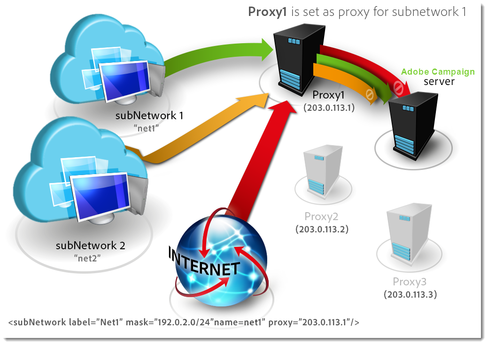

# セキュリティゾーンの定義{#defining-security-zones}

各オペレーターは、インスタンスにログオンするためにゾーンにリンクされている必要があります。また、セキュリティゾーンに定義されているアドレスまたはアドレスセットに、オペレーターIPを含める必要があります。 セキュリティゾーンの設定は、Adobe Campaignサーバーの設定ファイルで行われます。

演算子は、コンソールのプロファイル（**[!UICONTROL 管理/アクセス管理/演算子]**&#x200B;ノード）からセキュリティゾーンにリンクされます。 [このセクション](#linking-a-security-zone-to-an-operator)で、ゾーンをキャンペーン演算子にリンクする方法を説明します。

## セキュリティゾーンの作成{#creating-security-zones}

ゾーンは次の方法で定義します。

* 1つ以上のIPアドレスの範囲（IPv4およびIPv6）
* IPアドレスの各範囲にリンクされた技術名

セキュリティゾーンは相互にロックされています。つまり、別のゾーンに新しいゾーンを定義すると、各オペレータに割り当てられる権限を増やしながら、そのゾーンにログオンできるオペレータの数が減ります。

ゾーンは、サーバーの構成時に、**serverConf.xml**&#x200B;ファイルで定義する必要があります。 **serverConf.xml**&#x200B;で使用できるすべてのパラメーターは、[このセクション](../../installation/using/the-server-configuration-file.md)に一覧表示されます。

各ゾーンは、次のような権限を定義します。

* HTTPSではなくHTTP接続
* エラー表示（Javaエラー、JavaScript、C++など）
* レポートとWebAppのプレビュー
* ログイン/パスワードによる認証
* 非セキュア接続モード

>[!NOTE]
>
>**各演算子はゾーンにリンクする必要があります**。演算子のIPアドレスがゾーンで定義された範囲に属する場合、演算子はインスタンスにログオンできます。\
>オペレータのIPアドレスは、複数のゾーンで定義できます。 この場合、演算子は各ゾーンに対する使用可能な権限の&#x200B;**set**&#x200B;を受け取ります。

標準搭載の&#x200B;**serverConf.xml**&#x200B;ファイルには、次の3つのゾーンが含まれています。**パブリック、VPN、およびLAN**。

>[!NOTE]
>
>**そのまま使用できる設定は安全です**。ただし、以前のバージョンのAdobe Campaignから移行する前に、新しいルールを移行して承認するために、セキュリティを一時的に低減する必要がある場合があります。

**serverConf.xml**&#x200B;ファイル内にゾーンを定義する方法の例：

```
<securityZone allowDebug="false" allowHTTP="false" label="Public Network" name="public">
<subNetwork label="All addresses" mask="*" name="all"/>

<securityZone allowDebug="true" allowHTTP="false" label="Private Network (VPN)"
              name="vpn" showErrors="true">

  <securityZone allowDebug="true" allowEmptyPassword="true" allowHTTP="true"
                allowUserPassword="false" label="Private Network (LAN)" name="lan"
                sessionTokenOnly="true" showErrors="true">
    <subNetwork label="Lan 1" mask="192.168.0.0/16" name="lan1"/>
    <subNetwork label="Lan 2" mask="172.16.0.0/12" name="lan2"/>
    <subNetwork label="Lan 3" mask="10.0.0.0/8" name="lan3"/>
    <subNetwork label="Localhost" mask="127.0.0.1/16" name="locahost"/>
    <subNetwork label="Lan (IPv6)" mask="fc00::/7" name="lan6"/>
    <subNetwork label="Localhost (IPv6)" mask="::1/128" name="localhost6"/>
  </securityZone>

</securityZone>
</securityZone>
```

ゾーンを定義するすべての権限は次のとおりです。

* **allowDebug**:webAppを「debug」モードで実行できるようにします。
* **allowEmptyPassword**:パスワードを使用しないでインスタンスへの接続を許可します
* **allowHTTP**:HTTPSプロトコルを使用せずにセッションを作成できる
* **allowUserPassword**:セッショントークンは、次の形式を持つことができます。`<login>/<password>`&quot;
* **sessionTokenOnly**:接続URLにセキュリティトークンは不要です
* **showErrors**:サーバー側のエラーが転送され、表示されます

>[!IMPORTANT]
>
>ゾーン定義では、**true**&#x200B;値を持つ各属性によってセキュリティが低下します。

Message Centerを使用する場合、複数の実行インスタンスが存在する場合は、**sessionTokenOnly**&#x200B;属性が&#x200B;**true**&#x200B;に定義された追加のセキュリティゾーンを作成する必要があります。ここでは、必要なIPアドレスのみを追加します。 インスタンスの設定について詳しくは、[このドキュメント](../../message-center/using/creating-a-shared-connection.md)を参照してください。

## セキュリティゾーンのベストプラクティス{#best-practices-for-security-zones}

**lan**&#x200B;セキュリティゾーンの定義では、技術的なアクセスを定義するIPアドレスマスクを追加できます。 この追加により、サーバーでホストされているすべてのインスタンスにアクセスできます。

```
<securityZone allowDebug="true" allowEmptyPassword="false" allowHTTP="true"
                    allowUserPassword="false" label="Private Network (LAN)" name="lan"
                    sessionTokenOnly="true" showErrors="true">
        <subNetwork label="Lan 1" mask="192.168.0.0/16" name="lan1"/>
        <subNetwork label="Lan 2" mask="172.16.0.0/12" name="lan2"/>
        <subNetwork label="Lan 3" mask="10.0.0.0/8" name="lan3"/>
        <subNetwork label="Localhost" mask="127.0.0.1/16" name="locahost"/>
        <subNetwork label="Lan (IPv6)" mask="fc00::/7" name="lan6"/>
        <subNetwork label="Localhost (IPv6)" mask="::1/128" name="localhost6"/>
  
        <!-- Customer internal IPs -->
        <subNetwork id="internalNetwork" mask="a.b.c.d/xx"/>

      </securityZone>
```

IPアドレスの範囲は、特定のインスタンスにのみアクセスする演算子のインスタンス専用の設定ファイルに直接定義することをお勧めします。

**`config-<instance>.xml`**&#x200B;ファイル内：

```
  <securityZone name="public">
   ...
    <securityZone name="vpn">
      <subNetwork id="cus1" mask="a.b.c.d/xx"/>
```

## セキュリティゾーン{#sub-networks-and-proxies-in-a-security-zone}のサブネットワークとプロキシ

**proxy**&#x200B;パラメーターは、**subNetwork**&#x200B;要素で使用して、セキュリティゾーンでのプロキシの使用を指定できます。

プロキシが参照され、接続がこのプロキシ経由で入る場合（HTTP X-Forwarded-Forヘッダー経由で表示される）、有効なゾーンはプロキシのクライアントのものであり、プロキシのものではありません。

>[!IMPORTANT]
>
>プロキシが設定されていて、そのプロキシを上書きできる場合（または存在しない場合）、テスト対象のIPアドレスは改ざんできます。
>
>さらに、リレーはプロキシと同じように生成されます。 したがって、IPアドレス127.0.0.1は、セキュリティゾーン構成のプロキシのリストに追加できます。
>
>次に例を示します。&quot; `<subnetwork label="Lan 1" mask="192.168.0.0/16" name="lan1" proxy="127.0.0.1,10.100.2.135" />`&quot;と入力します。

様々なケースが発生します。

* サブネットワークはセキュリティゾーンで直接参照され、プロキシは構成されません。サブネットワークのユーザは、Adobe Campaignサーバに直接接続できます。

   

* セキュリティゾーンのサブネットワークに対してプロキシが指定されています：このサブネットワークのユーザは、このプロキシを介してAdobe Campaignサーバにアクセスできます。

   

* プロキシは、セキュリティゾーンのサブネットワークに含まれます。接触チャネルに関係なく、このプロキシ経由でアクセスできるユーザーは、Adobe Campaignサーバーにアクセスできます。

   

Adobe Campaignサーバーにアクセスする可能性の高いプロキシのIPアドレスは、**`<subnetwork>`**&#x200B;と第1レベルのサブネットワーク&#x200B;**`<subnetwork name="all"/>`**&#x200B;の両方に入力する必要があります。 例えば、IPアドレスが10.131.146.102のプロキシの場合、次のようになります。

```
<securityZone allowDebug="false" allowHTTP="false" label="Public Network" 
                      name="public">
    <subNetwork label="All addresses" mask="*" name="all"
                      proxy="10.131.146.102,127.0.0.1, ::1"/>

    <securityZone allowDebug="true" allowHTTP="false" label="Private Network (VPN)" 
                      name="vpn" showErrors="true">
        <securityZone allowDebug="true" allowEmptyPassword="false" allowHTTP="true" 
                      allowUserPassword="false" label="Private Network (LAN)" 
                      name="lan" sessionTokenOnly="true" showErrors="true">
            <subNetwork label="Lan proxy" mask="10.131.193.182" name="lan3" 
                      proxy="10.131.146.102,127.0.0.1, ::1"/>
            <subNetwork label="Lan 1" mask="192.168.0.0/16" name="lan1" 
                      proxy="127.0.0.1, ::1"/>

        </securityZone>
    </securityZone>
</securityZone>
```

## セキュリティゾーンをオペレータ{#linking-a-security-zone-to-an-operator}にリンクする

ゾーンを定義したら、各演算子を1つのインスタンスにログオンできるように、いずれかの演算子にリンクする必要があります。また、演算子のIPアドレスを、ゾーンで参照されるアドレスまたはアドレスの範囲に含める必要があります。

ゾーンの技術的な構成は、キャンペーンサーバーの構成ファイルで行います。**serverConf.xml**.

これに先立って、**[!UICONTROL セキュリティゾーン]**&#x200B;定義済みリストを設定し、**serverConf.xml**&#x200B;ファイルで定義されたゾーンの内部名にラベルをリンクするように開始する必要があります。

この設定は、キャンペーンエクスプローラーで行います。

1. **[!UICONTROL 管理/プラットフォーム/定義済みリスト]**&#x200B;ノードをクリックします。
1. **[!UICONTROL セキュリティゾーン(securityZone)]**&#x200B;システム定義済みリストを選択します。

   

1. サーバーの構成ファイルで定義されているセキュリティゾーンごとに、**[!UICONTROL 追加]**&#x200B;ボタンをクリックします。
1. **[!UICONTROL Internal name]**&#x200B;フィールドに、**serverConf.xml**&#x200B;ファイルで定義されているゾーンの名前を入力します。 これは、`<securityzone>`要素の&#x200B;**@name**&#x200B;属性に対応します。 内部名にリンクされているラベルを&#x200B;**ラベル**&#x200B;フィールドに入力します。

   

1. 「OK」をクリックし、変更を保存します。

ゾーンを定義し、**[!UICONTROL セキュリティゾーン]**&#x200B;定義済みリストを設定したら、各演算子をセキュリティゾーンにリンクする必要があります。

1. **[!UICONTROL 管理/アクセス管理/演算子]**&#x200B;ノードをクリックします。
1. セキュリティゾーンのリンク先の演算子を選択し、「**[!UICONTROL 編集]**」タブをクリックします。
1. 「**[!UICONTROL アクセス権]**」タブに移動し、「**[!UICONTROL アクセスパラメーターの編集…」をクリックします。]**&#x200B;リンク。

   

1. 「**[!UICONTROL Authorized connection zone]**」ドロップダウンリストからゾーンを選択します

   

1. 「**[!UICONTROL OK]**」をクリックし、変更を保存してこれらの変更を適用します。
