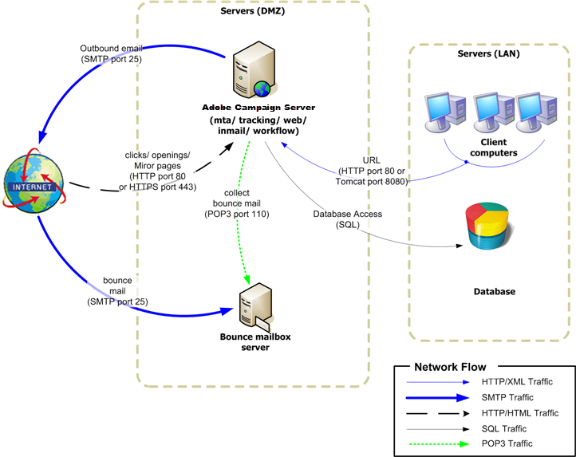
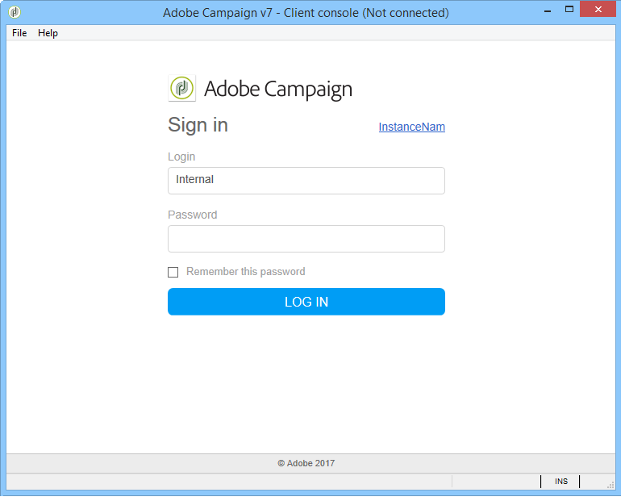
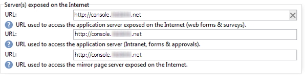

# スタンドアロンデプロイメント{#standalone-deployment}


この設定には、同じコンピューター上のすべてのコンポーネントが含まれます。

* アプリケーションプロセス（web）,
* 配信プロセス（mta）,
* リダイレクションプロセス（トラッキング）,
* ワークフロープロセスとスケジュールされたタスク（wfserver）,
* バウンスメールプロセス（inMail）,
* 統計プロセス（stat）:

プロセス間の全体的な通信は、次のスキーマに従って実行されます。



このタイプの設定は、受信者が100,000人未満で、たとえば次のソフトウェア層を含むリストを管理する場合に実行できます。

* Linux,
* Apache,
* PostgreSQL,
* Qmail:

ボリュームの増加に伴い、このアーキテクチャのバリエーションを使用すると、パフォーマンスを向上させるためにデータベース・サーバを別のコンピュータに移動できます。

>[!NOTE]
>
>既存のデータベース・サーバに十分なリソースがある場合は、そのサーバを使用することもできます。

## 機能 {#features}

### メリット {#advantages}

* 完全にスタンドアロンで設定コストが低い（以下に示すオープンソースソフトウェアを使用する場合、課金可能なライセンスは不要）。
* インストールとネットワーク設定の簡素化：

### 欠点 {#disadvantages}

* インシデントの場合の重要なコンピュータ。
* メッセージを放送する際の帯域幅が限られています（私たちの経験では、1時間あたり数万通のメールが送信されます）。
* ブロードキャスト時にアプリケーションが遅くなる可能性があります。
* アプリケーションサーバーは、リダイレクトサーバーをホストするため、外部（DMZ内など）から利用できる必要があります。

## インストールと設定手順 {#installation-and-configuration-steps}

### 前提条件 {#prerequisites}

* JDK,
* Web サーバー（IIS、Apache）,
* データベースサーバーへのアクセス，
* POP3経由でアクセス可能なバウンスメールボックス，
* 2つのDNS エイリアスの作成：

   * 最初にパブリック IP上のコンピュータを追跡し、指し示すためにパブリックに公開された人物。
   * コンソール アクセス用に内部ユーザーに公開され、同じコンピューターを指す2番目のエイリアス。

* SMTP （25）、DNS （53）、HTTP （80）、HTTPS （443）、SQL （1521 for Oracle、5432 for PostgreSQLなど）を開くように設定されたファイアウォール ポート。 詳しくは、[&#x200B; ネットワーク設定](../../installation/using/network-configuration.md)を参照してください。

次の例では、インスタンスのパラメーターは次のとおりです。

* インスタンスの名前：**demo**
* DNS マスク：**console.campaign.net&#42;** （クライアントコンソール接続およびレポートのみ）
* データベース：**キャンペーン :demo@dbsrv**

### インストールと設定（単一マシン） {#installing-and-configuring--single-machine-}

次の手順に従います。

1. Linuxでは&#x200B;**nlserver** パッケージ、Windowsでは&#x200B;**setup.exe**&#x200B;というAdobe Campaign サーバーのインストール手順に従います。

   詳しくは、「[LinuxでのCampaign インストールの前提条件](../../installation/using/prerequisites-of-campaign-installation-in-linux.md) （Linux）」および「[Windows](../../installation/using/prerequisites-of-campaign-installation-in-windows.md) （Windows）でのCampaign インストールの前提条件」を参照してください。

1. Adobe Campaign サーバーがインストールされたら、コマンド **nlserver web -tomcat**&#x200B;を使用してアプリケーションサーバー（web）を起動します（Web モジュールを使用すると、ポート 8080で待機しているスタンドアロン Web サーバーモードでTomcatを起動できます）。また、Tomcatが正しく起動することを確認します。

   ```sql
   12:08:18 >   Application server for Adobe Campaign Classic (7.X YY.R build XXX@SHA1) of DD/MM/YYYY
   12:08:18 >   Starting Web server module (pid=28505, tid=-1225184768)...
   12:08:18 >   Tomcat started
   12:08:18 >   Server started
   ```

   >[!NOTE]
   >
   >Web モジュールを初めて実行すると、インストールフォルダーの下の&#x200B;**conf** ディレクトリに&#x200B;**config-default.xml**&#x200B;と&#x200B;**serverConf.xml** ファイルが作成されます。 **serverConf.xml**&#x200B;で使用可能なすべてのパラメーターは、この[&#x200B; セクション &#x200B;](../../installation/using/the-server-configuration-file.md)に一覧表示されます。

   サーバーを停止するには、**Ctrl+C**&#x200B;を押します。

   詳しくは、以下の節を参照してください。

   * Linuxの場合：[&#x200B; サーバーの最初の起動](../../installation/using/installing-packages-with-linux.md#first-start-up-of-the-server),
   * Windowsの場合：[&#x200B; サーバーの初回起動](../../installation/using/installing-the-server.md#first-start-up-of-the-server)。

1. 次のコマンドを使用して、**internal** パスワードを変更します。

   ```
   nlserver config -internalpassword
   ```

   詳しくは、[この節](../../installation/using/configuring-campaign-server.md#internal-identifier)を参照してください。

1. トラッキング用のDNS マスク（この場合は&#x200B;**tracking.campaign.net**）とクライアントコンソールへのアクセス（この場合は&#x200B;**console.campaign.net**）を使用して、**デモ** インスタンスを作成します。 それには、次の 2 つの方法があります。

   * コンソールでインスタンスを作成します。

     

     詳しくは、「[&#x200B; インスタンスを作成して](../../installation/using/creating-an-instance-and-logging-on.md)にログオンする」を参照してください。

     または

   * コマンドラインでインスタンスを作成します。

     ```
     nlserver config -addinstance:demo/tracking.campaign.net*,console.campaign.net*
     ```

     詳しくは、[&#x200B; インスタンスの作成](../../installation/using/command-lines.md#creating-an-instance)を参照してください。

1. **config-demo.xml** ファイル（**config-default.xml**&#x200B;の横にある前の手順で作成）を編集し、**mta** （配信）、**wfserver** （ワークフロー）、**inMail** （バウンスメール）および&#x200B;**stat** （統計）プロセスが有効になっていることを確認します。 次に、統計サーバーのアドレスを設定します。

   ```
   <?xml version='1.0'?>
   <serverconf>  
     <shared>    
       <!-- add lang="eng" to dataStore to force English for the instance -->    
       <dataStore hosts="tracking.campaign.net*,console.campaign.net*">      
         <mapping logical="*" physical="default"/>    
       </dataStore>  </shared>  
       <mta autoStart="true" statServerAddress="localhost"/>
       <wfserver autoStart="true"/>  
       <inMail autoStart="true"/>  
       <sms autoStart="false"/>  
       <listProtect autoStart="false"/>
   </serverconf>
   ```

   詳しくは、[この節](../../installation/using/configuring-campaign-server.md#enabling-processes)を参照してください。

1. **serverConf.xml** ファイルを編集して配信ドメインを指定し、MTA モジュールがMX タイプのDNS クエリに応答するために使用するDNS サーバーのIP アドレス（またはホスト）を指定します。

   ```
   <dnsConfig localDomain="campaign.com" nameServers="192.0.0.1, 192.0.0.2"/>
   ```

   >[!NOTE]
   >
   >**nameServers** パラメーターはWindowsでのみ使用されます。

   詳しくは、[Campaign サーバー設定](../../installation/using/configuring-campaign-server.md)を参照してください。

1. クライアントコンソール設定プログラム **setup-client-7.XXX.exe**&#x200B;を&#x200B;**/datakit/nl/eng/jsp** フォルダーにコピーします。 [詳細情報](../../installation/using/client-console-availability-for-windows.md)。

1. 次の節で説明するWeb サーバー統合手順（IIS、Apache）に従います。

   * Linuxの場合：[Linux用Web サーバーへの統合](../../installation/using/integration-into-a-web-server-for-linux.md)
   * Windowsの場合：[Windows用Web サーバーへの統合](../../installation/using/integration-into-a-web-server-for-windows.md)

1. Web サイトを開始し、URL https://tracking.campaign.net/r/testを使用してリダイレクトをテストします。

   ブラウザーには、次のメッセージが表示される必要があります。

   ```
   <redir status="OK" date="AAAA/MM/JJ HH:MM:SS" build="XXXX" host="tracking.campaign.net" localHost="localhost"/>
   ```

   詳しくは、以下の節を参照してください。

   * Linuxの場合：[Web サーバーを起動し、設定をテストする](../../installation/using/integration-into-a-web-server-for-linux.md#launching-the-web-server-and-testing-the-configuration)
   * Windowsの場合：[Web サーバーを起動し、設定をテストしています](../../installation/using/integration-into-a-web-server-for-windows.md#launching-the-web-server-and-testing-the-configuration)

1. Adobe Campaign サーバー（**net start nlserver6** in Windows、**/etc/init.d/nlserver6 start** in Linux）を起動し、コマンド **nlserver pdump**&#x200B;をもう一度実行して、有効なすべてのモジュールが存在するかどうかを確認します。

   >[!NOTE]
   >
   >20.1以降では、代わりに次のコマンドを使用することをお勧めします（Linuxの場合）: **systemctl start nlserver**

   ```sql
   12:09:54 >   Application server for Adobe Campaign Classic (7.X YY.R build XXX@SHA1) of DD/MM/YYYY
   syslogd@default (7611) - 9.2 MB
   stat@demo (5988) - 1.5 MB
   inMail@demo (7830) - 11.9 MB
   watchdog (27369) - 3.1 MB
   mta@demo (7831) - 15.6 MB
   wfserver@demo (7832) - 11.5 MB
   web@default (28671) - 40.5 MB
   ```

   また、このコマンドを使用すると、コンピューターにインストールされているAdobe Campaign サーバーのバージョンとビルド番号を確認できます。

1. URL https://console.campaign.net/nl/jsp/logon.jspを使用して、**nlserver web** モジュールをテストします

   このURLを使用すると、クライアント設定プログラムのダウンロードページにアクセスできます。

   アクセス制御ページにアクセスしたら、**internal** ログインと関連パスワードを入力します。 [詳細情報](../../installation/using/client-console-availability-for-windows.md)。

   

1. （以前のダウンロードページから、またはWindows インストール用にサーバー上で直接起動した）Adobe Campaign クライアントコンソールを起動し、サーバー接続URLをhttps://console.campaign.netに設定し、**internal** ログインを使用して接続します。

   [このページ &#x200B;](../../installation/using/creating-an-instance-and-logging-on.md)と[このセクション &#x200B;](../../installation/using/configuring-campaign-server.md#internal-identifier)を参照してください。

   初めてログインすると、データベース作成アシスタントが表示されます。

   

   アシスタントの手順に従って、接続インスタンスに関連付けられたデータベースを作成します。

   詳しくは、[&#x200B; データベースの作成と設定](../../installation/using/creating-and-configuring-the-database.md)を参照してください。

   データベースを作成したら、ログオフします。

1. パスワードなしで&#x200B;**admin** ログインを使用してクライアントコンソールに再度ログオンし、デプロイメントウィザード（**[!UICONTROL ツール/詳細]** メニュー）を起動して、インスタンスの設定を完了します。

   詳しくは、[&#x200B; インスタンスのデプロイ &#x200B;](../../installation/using/deploying-an-instance.md)を参照してください。

   設定する主なパラメーターは次のとおりです。

   * メール配信：送信者と返信のアドレスと、バウンスメールのエラーメールボックス。
   * トラッキング：リダイレクトに使用する外部URLと内部URLを入力し、**トラッキングサーバーの登録**&#x200B;をクリックしてから、トラッキングサーバーの&#x200B;**デモ** インスタンスで検証します。

     詳しくは、[設定のトラッキング &#x200B;](../../installation/using/deploying-an-instance.md#tracking-configuration)を参照してください。

     

     Adobe Campaign サーバーはアプリケーションサーバーとリダイレクトサーバーの両方として使用されるため、トラッキングログの収集とURLの転送に使用される内部URLは、Tomcat （https://localhost:8080）への直接内部接続です。

   * バウンス管理：バウンスメールを処理するためのパラメーターを入力します（**未処理のバウンスメール** セクションを考慮しないでください）。
   * アクセス元：レポート、Web フォーム、ミラーページの2つのURLを指定します。

     
