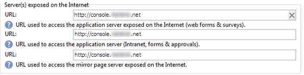

# スタンドアロンデプロイメント{#standalone-deployment}

この設定には、同じコンピューター上のすべてのコンポーネントが含まれます。

* application process (web)、
* 配信プロセス(mta)、
* リダイレクトプロセス（追跡）、
* ワークフロープロセスとスケジュール済みタスク(wfserver)、
* バウンスメールプロセス(inMail)、
* 統計プロセス(stat)。

プロセス間の全体的な通信は、以下のスキーマに従って行われます。


このタイプの設定は、100,000個未満の受信者と、例えば次のリストレイヤーを使用して管理する場合に実行できます。

* Linux、
* Apache,
* PostgreSQL,
* Qmail.

ボリュームが増えると、このアーキテクチャの一種によって、パフォーマンスを向上させるために、データベース・サーバが別のコンピュータに移動されます。

>[!NOTE]
>
>十分なリソースがある場合は、既存のデータベース・サーバも使用できます。

## 機能 {#features}

### メリット {#advantages}

* 完全なスタンドアロンと低い構成コスト（以下に示すオープンソースソフトウェアを使用する場合は、課金対象ライセンスは不要）。
* インストールとネットワークの構成をシンプル化。

### デメリット{#disadvantages}

* 事故が発生した場合に重要なコンピューター。
* メッセージをブロードキャストする際の帯域幅が限られている（当社の経験上、1時間あたり数万通のメール）。
* 放送時のアプリの遅延の可能性。
* アプリケーションサーバーは、リダイレクトサーバーをホストするので、外部（例えばDMZ内にある間）から使用できる必要があります。

## インストールと設定の手順{#installation-and-configuration-steps}

### 前提条件 {#prerequisites}

* JDK,
* Webサーバー(IIS、Apache)、
* データベース・サーバへのアクセス、
* POP3経由でバウンスメールボックスにアクセス可能、
* 2つのDNSエイリアスの作成：

   * 最初に公開され、そのパブリックIP上のコンピュータを追跡し、指し示す。
   * 2つ目のエイリアスは、コンソールアクセスと同じコンピューターのポインティングのために、内部ユーザーに公開されます。

* SMTP (25)、DNS (53)、HTTP (80)、HTTPS (443)、SQL （1521 for PostgreSQLなど）を開くように設定されたファイアウォール ポート。 詳しくは、[ネットワーク構成](../../installation/using/network-configuration.md)を参照してください。

次の例では、インスタンスのパラメーターを示します。

* インスタンスの名前：**demo**
* DNSマスク：**console.console.キャンペーン.net***（クライアントコンソール接続とレポートのみ）
* データベース：**キャンペーン:demo@dbsrv**

### インストールと設定（シングルマシン） {#installing-and-configuring--single-machine-}

次の手順に従います。

1. Adobe Campaignサーバーのインストール手順に従います。Linuxの場合は&#x200B;**nlserver**&#x200B;パッケージ、Windowsの場合は&#x200B;**setup.exe**。

   詳しくは、[Linuxでのキャンペーンインストールの前提条件](../../installation/using/prerequisites-of-campaign-installation-in-linux.md)(Linux)および[Windowsでのキャンペーンインストールの前提条件](../../installation/using/prerequisites-of-campaign-installation-in-windows.md)(Windows)を参照してください。

1. Adobe Campaign・サーバーがインストールされたら、**nlserver web -tomcat**&#x200B;コマンドを使用してアプリケーション・サーバー(web)を開始します(Webモジュールを使用すると、ポート8080で待機するスタンドアロンWebサーバー・モードでTomcatを開始できます)。

   ```
   12:08:18 >   Application server for Adobe Campaign Classic (7.X YY.R build XXX@SHA1) of DD/MM/YYYY
   12:08:18 >   Starting Web server module (pid=28505, tid=-1225184768)...
   12:08:18 >   Tomcat started
   12:08:18 >   Server started
   ```

   >[!NOTE]
   >
   >Webモジュールを初めて実行すると、インストールフォルダーの&#x200B;**conf**&#x200B;ディレクトリに&#x200B;**config-default.xml**&#x200B;ファイルと&#x200B;**serverConf.xml**&#x200B;ファイルが作成されます。 **serverConf.xml**&#x200B;で使用できるすべてのパラメーターは、この[セクション](../../installation/using/the-server-configuration-file.md)に一覧表示されます。

   **Ctrl + C**&#x200B;キーを押して、サーバーを停止します。

   この点について詳しくは、以下の節を参照してください。

   * Linuxの場合：[サーバ](../../installation/using/installing-packages-with-linux.md#first-start-up-of-the-server)の最初の開始アップ、
   * Windowsの場合：[サーバー](../../installation/using/installing-the-server.md#first-start-up-of-the-server)の最初の開始アップ。

1. **内部**&#x200B;パスワードを変更するには、次のコマンドを使用します。

   ```
   nlserver config -internalpassword
   ```

   詳しくは、[内部識別子](../../installation/using/campaign-server-configuration.md#internal-identifier)を参照してください。

1. 追跡用のDNSマスクを使用して&#x200B;**demo**&#x200B;インスタンスを作成し(この場合、**tracking.キャンペーン.net**)、クライアントコンソール(この場合、**console.キャンペーン.net**)にアクセスします。 それには、次の 2 つの方法があります。

   * コンソールからインスタンスを作成します。

      

      詳しくは、[インスタンスの作成と](../../installation/using/creating-an-instance-and-logging-on.md)へのログを参照してください。

      または

   * コマンドラインを使用してインスタンスを作成します。

      ```
      nlserver config -addinstance:demo/tracking.campaign.net*,console.campaign.net*
      ```

      詳しくは、[インスタンスの作成](../../installation/using/command-lines.md#creating-an-instance)を参照してください。

1. **config-demo.xml**&#x200B;ファイル（**config-default.xml**&#x200B;の次の手順で作成）を編集し、**mta**(配信)、**wfserver**（ワークフロー）、**inMail**（バウンス）を確認します。**stat** （統計）プロセスが有効になっています。 次に、統計サーバーのアドレスを設定します。

   ```
   <?xml version='1.0'?>
   <serverconf>  
     <shared>    
       <!-- add lang="eng" to dataStore to force English for the instance -->    
       <dataStore hosts="tracking.campaign.net*,console.campaign.net*">      
         <mapping logical="*" physical="default"/>    
       </dataStore>  </shared>  
       <mta autoStart="true" statServerAddress="localhost"/>
       <wfserver autoStart="true"/>  
       <inMail autoStart="true"/>  
       <sms autoStart="false"/>  
       <listProtect autoStart="false"/>
   </serverconf>
   ```

   詳しくは、[プロセスの有効化](../../installation/using/campaign-server-configuration.md#enabling-processes)を参照してください。

1. **serverConf.xml**&#x200B;ファイルを編集し、配信ドメインを指定して、MTAモジュールがMX型DNSクエリに応答するために使用するDNSサーバーのIP（またはホスト）アドレスを指定します。

   ```
   <dnsConfig localDomain="campaign.com" nameServers="192.0.0.1, 192.0.0.2"/>
   ```

   >[!NOTE]
   >
   >**nameServers**&#x200B;パラメーターはWindowsでのみ使用されます。

   詳しくは、[キャンペーンサーバーの設定](../../installation/using/campaign-server-configuration.md)を参照してください。

1. クライアントコンソールのセットアッププログラム(**setup-client-7.XX**、**YYYY.exe** for v7、**setup-client-6.XX**、**YYYY.exe** for v6.1)を&lt;a8>/datakitにコピーします。/nl/eng/jsp **フォルダー**

   この点について詳しくは、以下の節を参照してください。

   * Linuxの場合：[Linux用のクライアントコンソールの可用性](../../installation/using/client-console-availability-for-linux.md)
   * Windowsの場合：[Windowsでのクライアントコンソールの可用性](../../installation/using/client-console-availability-for-windows.md)

1. 次の節で説明するWebサーバー統合手順(IIS、Apache)に従います。

   * Linuxの場合：[Linux用のWebサーバーへの統合](../../installation/using/integration-into-a-web-server-for-linux.md)
   * Windowsの場合：[Windows用のWebサーバーへの統合](../../installation/using/integration-into-a-web-server-for-windows.md)

1. Webサイトを開始し、URLを使用してリダイレクトをテストします。https://tracking.campaign.net/r/test

   ブラウザーに次のメッセージを表示する必要があります。

   ```
   <redir status="OK" date="AAAA/MM/JJ HH:MM:SS" build="XXXX" host="tracking.campaign.net" localHost="localhost"/>
   ```

   この点について詳しくは、以下の節を参照してください。

   * Linuxの場合：[Webサーバーの起動と設定のテスト](../../installation/using/integration-into-a-web-server-for-linux.md#launching-the-web-server-and-testing-the-configuration)
   * Windowsの場合：[Webサーバーの起動と設定のテスト](../../installation/using/integration-into-a-web-server-for-windows.md#launching-the-web-server-and-testing-the-configuration)

1. Adobe Campaignサーバー(Windowsでは&#x200B;**net開始nlserver6**、Linuxでは&#x200B;**/etc/init.d/nlserver6開始**)を開始し、**nlserver pdump**&#x200B;コマンドをもう一度実行して、有効なすべてのモジュールの存在を確認します。

   >[!NOTE]
   >
   >20.1からは、（Linuxの場合は）次のコマンドを使用することをお勧めします。**systemctl開始nlserver**

   ```
   12:09:54 >   Application server for Adobe Campaign Classic (7.X YY.R build XXX@SHA1) of DD/MM/YYYY
   syslogd@default (7611) - 9.2 MB
   stat@demo (5988) - 1.5 MB
   inMail@demo (7830) - 11.9 MB
   watchdog (27369) - 3.1 MB
   mta@demo (7831) - 15.6 MB
   wfserver@demo (7832) - 11.5 MB
   web@default (28671) - 40.5 MB
   ```

   また、このコマンドを使用すると、コンピューターにインストールされているAdobe Campaignサーバーのバージョンとビルド番号を確認できます。

1. URLを使用して&#x200B;**nlserver web**&#x200B;モジュールをテストします。https://console.campaign.net/nl/jsp/logon.jsp

   このURLを使用すると、クライアントセットアッププログラムのダウンロードページにアクセスできます。

   アクセス制御ページに到達したら、**内部**&#x200B;ログインと関連するパスワードを入力します。

   

   この点について詳しくは、以下の節を参照してください。

   * Linuxの場合：[Linux用のクライアントコンソールの可用性](../../installation/using/client-console-availability-for-linux.md)
   * Windowsの場合：[Windowsでのクライアントコンソールの可用性](../../installation/using/client-console-availability-for-windows.md)

1. Adobe Campaignクライアントコンソールを開始（前のダウンロードページから、またはWindowsインストールの場合はサーバー上で直接起動）し、サーバー接続URLをhttps://console.campaign.netに設定し、**internal**&#x200B;ログインを使用して接続します。

   [インスタンスの作成と](../../installation/using/creating-an-instance-and-logging-on.md)および[内部識別子](../../installation/using/campaign-server-configuration.md#internal-identifier)のログを参照してください。

   初めてログインすると、データベース作成ウィザードが表示されます。

   

   ウィザードの手順に従って、接続インスタンスに関連付けられたデータベースを作成します。

   詳しくは、[データベースの作成と設定](../../installation/using/creating-and-configuring-the-database.md)を参照してください。

   データベースが作成されたら、ログオフします。

1. パスワードを使用せずに&#x200B;**admin**&#x200B;ログインを使用してクライアントコンソールにログオンし直し、デプロイメントウィザード（**[!UICONTROL ツール/詳細]**&#x200B;メニュー）を開始して、インスタンスの設定を完了します。

   詳しくは、[インスタンスのデプロイ](../../installation/using/deploying-an-instance.md)を参照してください。

   設定する主なパラメーターは次のとおりです。

   * 電子メール配信:バウンスメールの送信者と返信アドレス、およびエラーメールボックス。
   * 追跡：リダイレクトに使用する外部URLと内部URLを入力し、[トラッキングサーバー&#x200B;**の登録]をクリックして、トラッキングサーバーの** demo **インスタンスで検証します。**

      詳しくは、[トラッキングの設定](../../installation/using/deploying-an-instance.md#tracking-configuration)を参照してください。

      

      Adobe Campaignサーバーはアプリケーションサーバーとリダイレクトサーバーの両方として使用されるので、トラッキングログの収集とURLの転送に使用される内部URLは、Tomcat(https://localhost:8080)への直接の内部接続です。

   * バウンス管理：バウンスメールを処理するパラメーターを入力します（**未処理のバウンスメール**&#x200B;セクションを考慮しないでください）。
   * アクセス元：レポート、Web フォーム、ミラーページの2つのURLを指定します。

      

