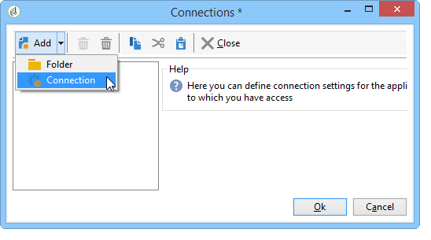

# 標準導入{#standard-deployment}

この構成では、3台のコンピュータが必要です。

* LAN内のエンドユーザー向けのアプリケーションサーバー（キャンペーン、レポート作成など）、
* ロードバランサーの背後のDMZにある2台のフロントサーバー。

DMZ内の2台のサーバは、トラッキング、ミラーページ、配信を処理し、高可用性を実現するために冗長化されています。

LAN内のアプリケーションサーバーは、エンドユーザーに対してサービスを提供し、すべての繰り返しプロセス（ワークフローエンジン）を実行します。 したがって、フロントサーバーでピーク負荷に達した場合、アプリケーションユーザーは影響を受けません。

データベース・サーバは、これら3台とは別のコンピュータにホストできます。 オペレーティングシステムがAdobe Campaign（LinuxまたはWindows）でサポートされている限り、アプリケーションサーバーとデータベースサーバーがLAN内で同じコンピューターを共有する必要があります。

サーバーとプロセス間の一般的な通信は、次のスキーマに従って実行されます。


このタイプの設定では、データベースサーバ（および使用可能な帯域幅）が主な制限要因として、大量の受信者(500,000 ～ 1,000,000)を処理できます。

## 機能 {#features}

### メリット {#advantages}

* フェイルオーバー機能：ハードウェアの問題が発生した場合に、プロセスを1台のコンピュータに切り替える機能。
* MTAとリダイレクト機能はロードバランサーの背後にある両方のコンピューターに展開できるので、全体的なパフォーマンスが向上します。 2つのアクティブなMTAと十分な帯域幅を使用すると、1時間あたり100,000件のメールの領域でブロードキャストレートを達成できます。

## インストールと設定の手順 {#installation-and-configuration-steps}

### 前提条件 {#prerequisites}

* 3台のコンピュータすべてのJDK
* Webサーバー(IIS、Apache)が両方のフロントで使用され、
* 3台のコンピュータすべてのデータベース・サーバへのアクセス、
* POP3経由でバウンスメールボックスにアクセス可能、
* 2つのDNSエイリアスの作成：

   * 最初に公開され、仮想IPアドレス(VIP)上のロードバランサーを追跡し、それを指し示し、2つのフロントサーバーに配布します。
   * 2つ目は、コンソールを介してアクセスし、同じアプリケーションサーバーを指す内部ユーザーに公開されています。

* STMP (25)、DNS (53)、HTTP (80)、HTTPS (443)、SQL （Oracleの場合は1521、PostgreSQLの場合は5432など）を開くように設定されたファイアウォールポート。 詳細は、「データベースアクセス」を参 [照してください](../../installation/using/network-configuration.md#database-access)。

### アプリケーションサーバーのインストール {#installing-the-application-server}

Adobe Campaignアプリケーションサーバーからデータベースの作成までスタンドアロンインスタンスをインストールする手順に従います（手順12）。 『インストー [ルと設定（シングルマシン）』を参照してくださ](#installing-and-configuring--single-machine-)い。

コンピュータはトラッキングサーバではないので、ウェブサーバとの統合を考慮しないでください。

次の例では、インスタンスのパラメーターを示します。

* インスタンスの名前：デ **モ**
* DNSマスク： **console.campaign.net*** （クライアントコンソール接続およびレポートの場合のみ）
* 言語：英語
* データベース：キャンペ **ーン：demo@dbsrv**

### 2台のフロントサーバーのインストール {#installing-the-two-frontal-servers}

インストールと構成の手順は、両方のコンピューターで同じです。

手順は、以下のとおりです。

1. Adobe Campaignサーバーをインストールします。

   詳しくは、 [LinuxでのCampaignのインストールの前提条件](../../installation/using/prerequisites-of-campaign-installation-in-linux.md) (Linux)およびWindowsでのCampaignのイ [ンストールの前提条件(Windows](../../installation/using/prerequisites-of-campaign-installation-in-windows.md) )を参照してください。

1. 以下の節で説明するWebサーバー統合手順(IIS、Apache)に従います。

   * Linuxの場合：Linux [用のWebサーバーへの統合](../../installation/using/integration-into-a-web-server-for-linux.md)
   * Windowsの場合：Windows [用Webサーバーへの統合](../../installation/using/integration-into-a-web-server-for-windows.md)

1. デモインスタ **ンスを作成** 。 それには、次の 2 つの方法があります。

   * コンソールからインスタンスを作成します。

      

      詳しくは、「インスタンスの作成とロ [グオン」を参照してください](../../installation/using/creating-an-instance-and-logging-on.md)。

      または

   * コマンドラインを使用してインスタンスを作成します。

      ```
      nlserver config -addinstance:demo/tracking.campaign.net*
      ```

      For more on this, refer to [Creating an instance](../../installation/using/command-lines.md#creating-an-instance).
   インスタンスの名前は、アプリケーションサーバーの名前と同じです。

   nlserver webモジュール(ミラーページ **** 、購読解除)を使用したサーバーへの接続は、ロードバランサー(tracking.campaign.net)のURLから行われます。

1. 内部をアプリ **ケーション** ・サーバーと同じに変更します。

   For more on this, refer to [Internal identifier](../../installation/using/campaign-server-configuration.md#internal-identifier).

1. データベースをインスタンスにリンクします。

   ```
   nlserver config -setdblogin:PostgreSQL:campaign:demo@dbsrv -instance:demo
   ```

1. config-default.xmlファイルと **config-demo.xmlファイルで** 、web、 **logd、tracking** 、およびtrackingdataモジュールを有効 ************ にします。

   For more on this, refer to [Enabling processes](../../installation/using/campaign-server-configuration.md#enabling-processes).

1. serverConf.xmlフ **ァイルを編集し** 、次の内容を入力します。

   * mtaモジュールのDNS設定：

      ```
      <dnsConfig localDomain="campaign.com" nameServers="192.0.0.1, 192.0.0.2"/>
      ```

      >[!NOTE]
      >
      >nameServersパ **ラメーターは** 、Windowsでのみ使用されます。

      For more on this, refer to [Delivery settings](../../installation/using/campaign-server-configuration.md#delivery-settings).

   * リダイレクトパラメーター内の冗長なトラッキングサーバー：

      ```
      <spareServer enabledIf="$(hostname)!='front_srv1'" id="1" url="https://front_srv1:8080"/>
      <spareServer enabledIf="$(hostname)!='front_srv2'" id="2" url="https://front_srv2:8080"/>
      ```

      For more on this, refer to [Redundant tracking](../../installation/using/configuring-campaign-server.md#redundant-tracking).

1. Webサイトを起動し、URLからのリダイレクトをテストします。https://tracking.campaign.net/r/test [](https://tracking.campaign.net/r/test).

   ブラウザーに次のメッセージが表示されます（ロードバランサーによってリダイレクトされるURLに応じて異なります）。

   ```
   <redir status="OK" date="AAAA/MM/JJ HH:MM:SS" build="XXXX" host="tracking.campaign.net" localHost="front_srv1"/>
   ```

   または

   ```
   <redir status="OK" date="AAAA/MM/JJ HH:MM:SS" build="XXXX" host="tracking.campaign.net" localHost="front_srv2"/>
   ```

   この詳細については、以下の節を参照してください。

   * Linuxの場合：Webサ [ーバーの起動と設定のテスト](../../installation/using/integration-into-a-web-server-for-linux.md#launching-the-web-server-and-testing-the-configuration)
   * Windowsの場合：Webサ [ーバーの起動と設定のテスト](../../installation/using/integration-into-a-web-server-for-windows.md#launching-the-web-server-and-testing-the-configuration)

1. Adobe Campaignサーバーを起動します。
1. Adobe Campaignコンソールで、パスワードを入力せずに **admin** loginを使用して接続し、デプロイメントウィザードを起動します。

   詳しくは、「インスタンスのデプロイ」を [参照してください](../../installation/using/deploying-an-instance.md)。

   設定は、トラッキングモジュールの設定以外は、スタンドアロンインスタンスと同じです。

1. リダイレクトに使用する外部URL（ロードバランサーのURL）と、2つのフロントサーバーの内部URLを入力します。

   For more on this, refer to [Tracking configuration](../../installation/using/deploying-an-instance.md#tracking-configuration).

   

   >[!NOTE]
   >
   >以前に作成した2つのトラッキングサーバーの既存のインスタンスを使用し、内部ログインを **使用し** ます。

