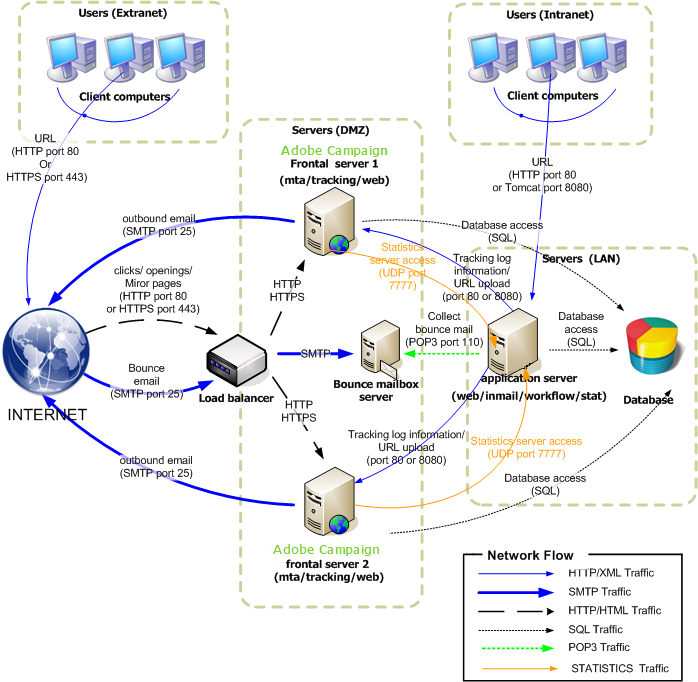
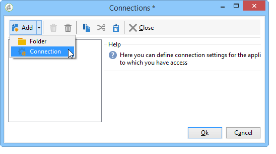
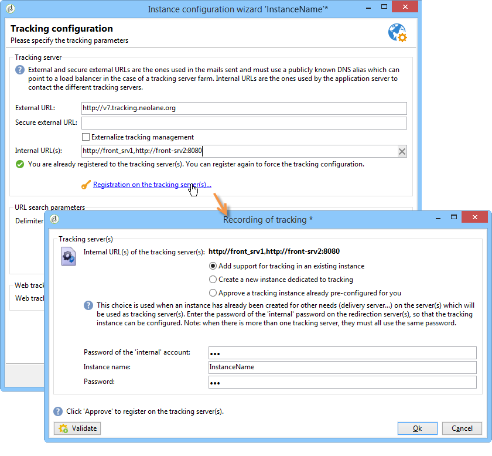

# 標準デプロイメント{#standard-deployment}


この設定には、次の3台のコンピューターが必要です。

* エンドユーザー向けのLAN内のアプリケーションサーバー（キャンペーンの準備、レポートなど）。
* ロードバランサーの背後にあるDMZ内の2つのフロントサーバー。

DMZ内の2つのサーバーは、トラッキング、ミラーページ、配信を処理し、高可用性のために冗長です。

LAN内のアプリケーションサーバーは、エンドユーザーにサービスを提供し、すべての繰り返しプロセス（ワークフローエンジン）を実行します。 したがって、フロントサーバ上でピーク負荷に達しても、アプリケーションユーザには影響はありません。

データベースサーバーは、これら3つとは別のコンピューターでホストできます。 それ以外の場合は、オペレーティングシステムがAdobe Campaign（LinuxまたはWindows）でサポートされている限り、アプリケーションサーバーとデータベースサーバーがLAN内で同じコンピューターを共有します。

サーバーとプロセス間の一般的な通信は、次のスキーマに従って実行されます。



このタイプの設定は、データベースサーバー（および使用可能な帯域幅）が主な制限要因であるため、多数の受信者（500,000～1,000,000）を処理できます。

## 機能 {#features}

### メリット {#advantages}

* フェールオーバー機能：ハードウェアの問題が発生した場合に、プロセスを1台のコンピューターに切り替える機能。
* MTA機能とリダイレクト機能は、ロードバランサーの背後にある両方のコンピューターにデプロイできるため、全体的なパフォーマンスが向上します。 2つのアクティブなMTAと十分な帯域幅で、1時間あたり100,000 メールの領域でブロードキャスト率を達成することが可能です。

## インストールと設定手順 {#installation-and-configuration-steps}

### 前提条件 {#prerequisites}

* 3台のコンピューターすべてで，
* Web サーバー（IIS、Apache）を，
* 3台のコンピューターすべてでデータベースサーバーにアクセスし，
* POP3経由でアクセス可能なバウンスメールボックス，
* 2つのDNS エイリアスの作成：

   * 最初にパブリックに公開され、仮想IP アドレス（VIP）上のロードバランサーをトラッキングおよびポイントし、次に2つのフロントタルサーバーに配布されます。
   * 2つ目は、コンソール経由でアクセスし、同じアプリケーションサーバーを指すために内部ユーザーに公開されます。

* STMP （25）、DNS （53）、HTTP （80）、HTTPS （443）、SQL （1521 for Oracle、5432 for PostgreSQLなど）を開くように設定されたファイアウォール ポート。 詳細については、「[&#x200B; データベースアクセス &#x200B;](../../installation/using/network-configuration.md#database-access)」の節を参照してください。

### アプリケーションサーバーのインストール {#installing-the-application-server}

次の手順に従って、Adobe Campaign アプリケーションサーバーからデータベースの作成にスタンドアロンインスタンスをインストールします（手順12）。 「[&#x200B; インストールと設定（単一マシン） &#x200B;](../../installation/using/standalone-deployment.md#installing-and-configuring--single-machine-)」を参照してください。

コンピューターはトラッキングサーバーではないので、Web サーバーとの統合を考慮しないでください。

次の例では、インスタンスのパラメーターは次のとおりです。

* インスタンスの名前：**demo**
* DNS マスク：**console.campaign.net&#42;** （クライアントコンソール接続およびレポートのみ）
* 言語：英語
* データベース：**キャンペーン :demo@dbsrv**

### 2つのフロントタルサーバーのインストール {#installing-the-two-frontal-servers}

インストールと設定の手順は、両方のコンピューターで同じです。

手順は、以下のとおりです。

1. Adobe Campaign サーバーをインストールします。

   詳しくは、「[LinuxでのCampaign インストールの前提条件](../../installation/using/prerequisites-of-campaign-installation-in-linux.md) （Linux）」および「[Windows](../../installation/using/prerequisites-of-campaign-installation-in-windows.md) （Windows）でのCampaign インストールの前提条件」を参照してください。

1. 次の節で説明するWeb サーバー統合手順（IIS、Apache）に従います。

   * Linuxの場合：[Linux用Web サーバーへの統合](../../installation/using/integration-into-a-web-server-for-linux.md)
   * Windowsの場合：[Windows用Web サーバーへの統合](../../installation/using/integration-into-a-web-server-for-windows.md)

1. **demo** インスタンスを作成します。 それには、次の 2 つの方法があります。

   * コンソールでインスタンスを作成します。

     

     詳しくは、[&#x200B; インスタンスの作成と](../../installation/using/creating-an-instance-and-logging-on.md)へのログオンを参照してください。

     または

   * コマンドラインでインスタンスを作成します。

     ```
     nlserver config -addinstance:demo/tracking.campaign.net*
     ```

     詳しくは、[&#x200B; インスタンスの作成](../../installation/using/command-lines.md#creating-an-instance)を参照してください。

   インスタンスの名前は、アプリケーションサーバーの名前と同じです。

   **nlserver web** モジュール （ミラーページ、購読解除）を使用したサーバーへの接続は、ロードバランサー（tracking.campaign.net）のURLから行われます。

1. **internal**&#x200B;をアプリケーションサーバーと同じに変更します。

   詳しくは、[この節](../../installation/using/configuring-campaign-server.md#internal-identifier)を参照してください。

1. データベースをインスタンスにリンクします。

   ```
   nlserver config -setdblogin:PostgreSQL:campaign:demo@dbsrv -instance:demo
   ```

1. **config-default.xml**&#x200B;および&#x200B;**config-demo.xml** ファイルで、**web**、**trackinglogd**&#x200B;および&#x200B;**mta** モジュールを有効にします。

   詳しくは、[この節](../../installation/using/configuring-campaign-server.md#enabling-processes)を参照してください。

1. **serverConf.xml** ファイルを編集し、次の情報を入力します。

   * mta モジュールのDNS設定：

     ```
     <dnsConfig localDomain="campaign.com" nameServers="192.0.0.1, 192.0.0.2"/>
     ```

     >[!NOTE]
     >
     >**nameServers** パラメーターはWindowsでのみ使用されます。

     詳しくは、[配信設定](configure-delivery-settings.md)を参照してください。

   * リダイレクトパラメーター内の冗長トラッキングサーバー：

     ```
     <spareServer enabledIf="$(hostname)!='front_srv1'" id="1" url="https://front_srv1:8080"/>
     <spareServer enabledIf="$(hostname)!='front_srv2'" id="2" url="https://front_srv2:8080"/>
     ```

     詳しくは、[冗長トラッキング &#x200B;](configuring-campaign-server.md#redundant-tracking)を参照してください。

1. Web サイトを開始し、URL [https://tracking.campaign.net/r/test](https://tracking.campaign.net/r/test)からリダイレクトをテストします。

   ブラウザーには、次のメッセージが表示されます（ロードバランサーがリダイレクトするURLに応じて異なります）。

   ```
   <redir status="OK" date="AAAA/MM/JJ HH:MM:SS" build="XXXX" host="tracking.campaign.net" localHost="front_srv1"/>
   ```

   または

   ```
   <redir status="OK" date="AAAA/MM/JJ HH:MM:SS" build="XXXX" host="tracking.campaign.net" localHost="front_srv2"/>
   ```

   詳しくは、以下の節を参照してください。

   * Linuxの場合：[Web サーバーを起動し、設定をテストする](../../installation/using/integration-into-a-web-server-for-linux.md#launching-the-web-server-and-testing-the-configuration)
   * Windowsの場合：[Web サーバーを起動し、設定をテストしています](../../installation/using/integration-into-a-web-server-for-windows.md#launching-the-web-server-and-testing-the-configuration)

1. Adobe Campaign サーバーを起動します。
1. Adobe Campaign コンソールで、パスワードなしで&#x200B;**admin** ログインを使用して接続し、デプロイメントウィザードを起動します。

   詳しくは、[&#x200B; インスタンスのデプロイ &#x200B;](../../installation/using/deploying-an-instance.md)を参照してください。

   設定は、トラッキングモジュールの設定とは別に、スタンドアロンインスタンスと同じです。

1. リダイレクトに使用される外部URL （ロードバランサーのURL）と、2つのフロントタルサーバーの内部URLを入力します。

   詳しくは、[設定のトラッキング &#x200B;](../../installation/using/deploying-an-instance.md#tracking-configuration)を参照してください。

   

   >[!NOTE]
   >
   >以前に作成した2つのトラッキングサーバーの既存のインスタンスを使用し、**internal** ログインを使用します。
