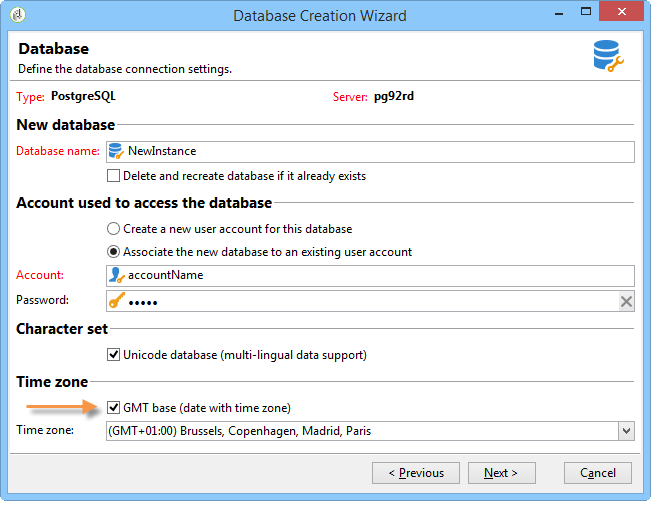

# タイムゾーン管理{#time-zone-management}

## 動作の仕組み {#operating-principle}

Adobe Campaignでは、日付をタイムゾーンの関数として表すことができます。これにより、国際ユーザーは世界中の様々なタイムゾーンで作業を行うことができます。 同じインスタンスを使用する各国で、キャンペーン、追跡、アーカイブなどの実行を管理できます。 ローカル時間に応じて異なります。

Adobe Campaignプラットフォームを国際的に使用できるようにするには、システムで使用されるすべての日付がタイムゾーンにリンク可能である必要があります。 したがって、タイムゾーンが既知の日付は、他のタイムゾーンにも、タイムゾーンに関係なく、任意のタイムゾーンにインポートできます。

Adobe Campaignでは、日付/時刻をUTC（協定世界時）形式で保存できます。 データが公開されると、演算子のローカル日時に変換されます。 変換は、データベースがUTCで設定されると自動的に実行されます(設定を参照 [してください](#configuration))。 データベースがUTCで設定されていない場合、プラットフォーム内の日付のタイムゾーンに関する情報がオプションに格納されます。

タイムゾーン管理に関する主なプラットフォーム機能は次のとおりです。データおよび演算子とワークフロー管理をインポート/エクスポートします。 継承の概 **念は、読み込み** /書き出しまたはワークフローで使用できます。 デフォルトでは、データベースサーバーのタイムゾーンに対して設定されますが、ワークフローや単一のアクティビティに対しても、新しいタイムゾーンを再定義できます。

**演算子は** 、配信設定時にタ **イムゾーンを変更し** 、配信を実行する特定のタイムゾーンを指定できます。

>[!CAUTION]
>
>データベースが複数のタイムゾーンを管理しない場合は、すべてのデータフィルタリング操作に対して、SQLクエリをデータベースサーバーのタイムゾーンで実行する必要があります。

各Adobe Campaignオペレーターは、次のタイムゾーンにリンクされています。この情報は、プロファイルで設定されます。 For more on this, refer to [this document](../../platform/using/access-management.md).

Adobe Campaignプラットフォームでタイムゾーン管理が不要な場合は、特定のリンクされたタイムゾーンを使用して、ローカル形式のストレージモードを維持できます。

## 推奨事項 {#recommendations}

タイムゾーンには、次のような複数の現実が組み合わされています。この式は、UTCの日付での一定のタイムラグ、または年に2回（夏時間）時間が変わる可能性のある地域の時間を表す場合があります。

**例えば、postgreSQLでは、** SET TIME ZONE &#39;Europe/Paris&#39;;コマンドでは、夏と冬の時間が考慮されます。日付は、年の時刻に応じてUTC+1またはUTC+2で表されます。

**ただし、** SET TIME ZONE 0200;コマンドの場合、タイムラグは常にUTC+2になります。

## 設定 {#configuration}

日付と時間の記憶モードは、データベースの作成時に選択します(「新しいインスタ [ンスの作成](#creating-a-new-instance)」を参照)。 移行の場合、日付にリンクされた時間はローカルの日付と時間に変換されます( [Migration](#migration)を参照)。

技術的な観点から、データベースに日付+時間タイプの情報を格納す **る方法は** 2つあります。

1. タイムスタンプ（タイムゾーン形式）:データベースエンジンは、日付をUTCで保存します。 開かれた各セッションにはタイムゾーンが設定され、それに従って日付が変換されます。
1. ローカル形式+ローカルタイムゾーン：すべての日付がローカル形式で保存され（タイムラグ管理は行われません）、それらには単一のタイムゾーンが割り当てられます。 タイムゾーンはAdobe Campaignインスタンスの **WdbcTimeZone** オプションに保存され、ツリーのメニューを使用して **[!UICONTROL Administration > Platform > Options]** 変更できます。

>[!CAUTION]
>
>この変更により、データの整合性と同期の問題が生じる可能性があることに注意してください。

### Creating a new instance {#creating-a-new-instance}

複数の国際ユーザーが同じインスタンスで作業するには、国間の時間差を管理するインスタンスを作成する際に、タイムゾーンを設定する必要があります。 インスタンスの作成時に、データベース設定段階のセクションで日付と時 **[!UICONTROL Time zone]** 間の管理モードを選択します。

日付と時間 **[!UICONTROL UTC database (date fields with time zone)]** を含むすべてのデータをUTC形式で保存する場合は、このオプションを選択します（SQLフィールドとXMLフィールド）。

>[!CAUTION]
>
>Oracleを使用している場合 **は**、Oracleクライアント層のタイムゾーンファイル(.dat)が、サーバーにインストールされているタイムゾーンファイルと互換性がある必要があります。

データベースがUTCでない場合は、ドロップダウンリストで提供されるタイムゾーンの1つを選択できます。 サーバーのタイムゾーンを使用したり、「UTC（協定世界時）」オプションを選択したりすることもできます。

このオプシ **[!UICONTROL UTC Database (date fields with time zone)]** ョンを選択すると、SQLフィールドはTIMESTAMP WITH TIMEZONE形式で保存されます。

それ以外の場合は、ローカル形式で保存され、データベースに適用するタイムゾーンを選択する必要があります。

### Migration {#migration}

以前のバージョン（タイムゾーン管理を使用しない）に移行する場合は、データベースで日付保存モードを定義する必要があります。

Adobe Campaignデータベースにアクセスする外部ツールとの互換性を保証するため、 **Date+timeタイプのSQLフィールドは** 、デフォルトでローカル形式で保存されます。

日付を含むXMLフィールドがUTCで保存されるようになりました。 読み込み中に、UTC形式ではないフィールドは、サーバーのタイムゾーンを使用して自動的に変換されます。 つまり、すべてのXMLフィールドがUTC形式にプログレッシブに変換されます。

既存のインスタンスを使用するには、 **WdbcTimeZone** オプションを追加し、インスタンスのタイムゾーンを入力します。

>[!CAUTION]
>
>WdbcTimeZoneオプションに正しい値が設定されていることを確認してください：後で行われる変更は、矛盾を引き起こす可能性があります。

使用可能な値の例：

* Europe/Paris,
* Europe/London,
* America/New_Yorkなど

   これらの値は、tz(Olson)データベースから取得されます。 詳しくは、https://en.wikipedia.org/wiki/List_of_tz_database_time_zonesを参照してく [ださい](https://en.wikipedia.org/wiki/List_of_tz_database_time_zones)。

