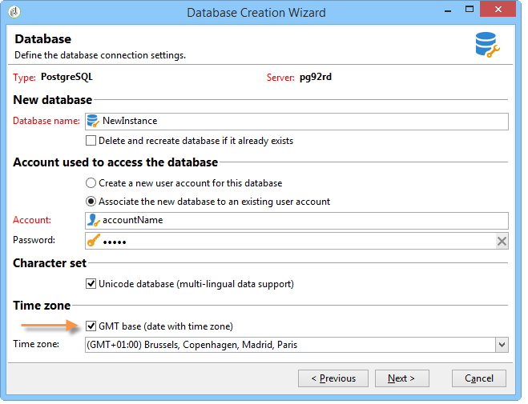

# タイムゾーン管理{#time-zone-management}

## 動作の原則 {#operating-principle}

Adobe Campaignでは、タイムゾーンの機能として日付を表現できます。これにより、世界中のユーザーがさまざまなタイムゾーンで作業できるようになります。 同じインスタンスを使用する各国は、現地時間に応じてキャンペーン、トラッキング、アーカイブなどの実行を管理できます。

Adobe Campaignを国際的な規模で利用できるようにするには、システムで使用されるすべての日付がタイムゾーンにリンクできる必要があります。 したがって、タイムゾーンが既知の日付は、他のタイムゾーンに読み込むことも、タイムゾーンに関係なく読み込むこともできます。

Adobe Campaignでは、日付/時刻をUTC （協定世界時）形式で保存できます。 データが公開されると、オペレーターのローカル日時に変換されます。 変換は、データベースがUTCで設定されている場合に自動的に実行されます（[設定](#configuration)を参照）。 データベースがUTCで設定されていない場合、プラットフォーム内の日付のタイムゾーンに関する情報はオプションに保存されます。

タイムゾーン管理に関する主なプラットフォーム機能は、データの読み込み/書き出し、オペレーターとワークフロー管理です。 **継承の概念**&#x200B;は、インポート/エクスポートまたはワークフローで使用できます。 デフォルトでは、データベースサーバーのタイムゾーン用に設定されますが、ワークフロー用および単一のアクティビティ用に新しいタイムゾーンを再定義することもできます。

**オペレーター**&#x200B;は、**配信設定**&#x200B;中にタイムゾーンを変更し、配信を実行する特定のタイムゾーンを指定できます。

>[!IMPORTANT]
>
>データベースが複数のタイムゾーンを管理しない場合、すべてのデータフィルタリング操作について、SQL クエリはデータベースサーバーのタイムゾーンで実行する必要があります。

各Adobe Campaign オペレーターはタイムゾーンにリンクされています。この情報はプロファイルで設定されます。 詳しくは、[このドキュメント &#x200B;](../../platform/using/access-management.md)を参照してください。

Adobe Campaign Platformでタイムゾーン管理が不要な場合は、特定のリンクされたタイムゾーンを使用して、ストレージモードをローカル形式で保持できます。

## 推奨事項 {#recommendations}

タイムゾーンは、いくつかの現実を組み合わせています。式は、UTC日付を持つ一定のタイムラグ、または年に2回変更される可能性がある地域の時間（夏時間）を表すことができます。

例えば、postgreSQLでは、**SET TIME ZONE &#39;Europe/Paris&#39;;** コマンドは、夏時間と冬時間を考慮します。日付は、時刻に応じてUTC+1またはUTC+2で表されます。

ただし、**SET TIME ZONE 0200;** コマンドを使用する場合、タイムラグは常にUTC+2になります。

## 設定 {#configuration}

日付と時刻のストレージモードは、データベースの作成中に選択されます（[新しいインスタンスの作成](#creating-a-new-instance)を参照）。 移行の場合、日付にリンクされた時間は、ローカルの日付と時間に変換されます（[移行](#migration)を参照）。

技術的な観点から、**日付+時刻**&#x200B;の型情報をデータベースに保存する方法は2つあります。

1. TIMESTAMP WITH TIMEZONE形式：データベースエンジンは日付をUTCで保存します。 開かれた各セッションにはタイムゾーンがあり、それに応じて日付が変換されます。
1. ローカル形式+ ローカルタイムゾーン：すべての日付はローカル形式で保存され（タイムラグ管理なし）、1つのタイムゾーンが割り当てられます。 タイムゾーンは、Adobe Campaign インスタンスの&#x200B;**WdbcTimeZone** オプションに保存され、ツリーの&#x200B;**[!UICONTROL 管理/ プラットフォーム / オプション]** メニューから変更できます。

>[!IMPORTANT]
>
>この変更は、データの一貫性と同期の問題につながる可能性があることに注意してください。

### 新しいインスタンスの作成 {#creating-a-new-instance}

複数の国際的なユーザーが同じインスタンスで作業できるようにするには、インスタンスを作成する際に国をまたいでタイムラグを管理するようにタイムゾーンを設定する必要があります。 インスタンス作成時に、データベース設定ステージの&#x200B;**[!UICONTROL タイムゾーン]** セクションで日付と時刻の管理モードを選択します。

日付と時刻を含むすべてのデータをUTC形式（SQL フィールドとXML フィールド）で保存するには、**[!UICONTROL UTC データベース（タイムゾーンを含む日付フィールド）]** オプションを確認します。

>[!IMPORTANT]
>
>**Oracle**&#x200B;を使用している場合、Oracle クライアントレイヤーのタイムゾーンファイル（.dat）は、サーバーにインストールされているタイムゾーンファイルと互換性がある必要があります。

データベースがUTCでない場合は、ドロップダウンリストで提供されるタイムゾーンのいずれかを選択できます。 サーバーのタイムゾーンを使用するか、UTC （協定世界時）オプションを選択することもできます。

「**[!UICONTROL UTC データベース（タイムゾーンを持つ日付フィールド）]**」オプションを選択すると、SQL フィールドはTIMESTAMP WITH TIMEZONE形式で保存されます。

それ以外の場合は、ローカル形式で保存され、データベースに適用するタイムゾーンを選択する必要があります。

### 移行 {#migration}

以前のバージョン（タイムゾーン管理なし）に移行する場合は、データベースで日付ストレージモードを定義する必要があります。

Adobe Campaign データベースにアクセスする外部ツールとの互換性を保証するために、**日付+時刻** タイプのSQL フィールドは、デフォルトでローカル形式で保存されたままになります。

日付を含むXML フィールドがUTCに保存されるようになりました。 読み込み中に、UTC形式でないフィールドは、サーバーのタイムゾーンを使用して自動的に変換されます。 つまり、すべてのXML フィールドが徐々にUTC形式に変換されます。

既存のインスタンスを使用するには、**WdbcTimeZone** オプションを追加し、インスタンスのタイムゾーンを入力します。

>[!IMPORTANT]
>
>WdbcTimeZone オプションに正しい値が設定されていることを確認してください。後で行われる変更は、不整合につながる可能性があります。

使用可能な値の例：

* ヨーロッパ/パリ，
* ヨーロッパ/ロンドン，
* America/New_Yorkなど。

  これらの値は、tz （Olson）データベースから取得されます。 詳しくは、[https://en.wikipedia.org/wiki/List_of_tz_database_time_zones](https://en.wikipedia.org/wiki/List_of_tz_database_time_zones)を参照してください。

## Oracle データベースとサーバーのタイムゾーン

メインデータベースの場合、Campaignはサーバータイムゾーンを使用して、データベース接続のセッションタイムゾーンを設定します。 「WdbcTimeZone」オプションは影響しません。 そのため、サーバーのタイムゾーンは、Campaignで使用されるメインデータベースのタイムゾーンと一致する必要があります。 サーバーのタイムゾーンを変更できない場合、Campaignで使用されるタイムゾーンは、customer.shでTZ環境変数を設定することで上書きできます。