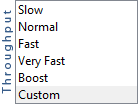

# Campaign での MX サーバーの使用 {#using-mx-servers}

MX サーバーとAdobe Campaign Classicの連携について説明します。

## MX サーバー {#mx-servers}

### MX サーバーとは何ですか？

メール交換者レコード（MX レコード）は、ドメインの代わりにメールメッセージを受け入れるメールサーバーを指定する、ドメイン名システム（DNS）内のリソースレコードのタイプです。

### MX サーバーの仕組み？

電子メールを送信すると、ソフトウェアサーバーは受信者ドメインサーバーとの接続を確立します。 2つのサーバー間の通信はSMTP言語を使用し、ドメインは複数のMX サーバーを持つことができます。 このドメインへの接続は、最優先度（最小図）から開始され、他のサーバーは「バックアップ」サーバーと呼ばれます。 接続プロトコルを尊重する必要があります。

### MX サーバーはAdobe Campaignとどのように連携しますか？

接続プロトコルでは、スパムやサーバーの独占を防ぐためにルールを尊重する必要があります。 重要なデータは次のとおりです。

* **許可される接続の最大数**：この数が尊重される場合、IPはブロックリストに含まれず、追加の接続が原因でメールは拒否されません。
* **最大メッセージ数**：接続中に、送信が許可されるメッセージ数を定義する必要があります。 この数が定義されていない場合、サーバーはできるだけ多くの数を送信します。 その結果、迷惑メール送信者として識別され、ISPによって迷惑メールブロックリストに追加されます。
* **1時間あたりのメッセージ**：電子レピュテーションに合わせるために、Adobe Campaignは1時間あたりのIP送信可能なメール数を制御します。 このシステムは、メールの拒否やブロックリストに加えるから保護します。

## バウンスメール

### バウンスメールとは？

これは、Adobe Campaignがサーバー通信中のエラーを処理するために使用するプロセスです。

### バウンスメールの仕組み？

エラーアドレスは、ISPから送り返されたバウンスを処理します。 このプロセスは、異なるSMTP エラーコードを分析し、RegEx規格に従って適切なアクションを適用します。

例えば、電子メールアドレスにISPから「550 User Unknown」というフィードバックが送信されているとします。 このエラーコードは、Adobe Campaignのエラーアドレス（returnpath アドレス）で処理されます。 このエラーはRegEx標準と比較され、適切なルールが適用されます。 このメールは&#x200B;*ハードバウンス* （タイプに一致）と見なされ、次に&#x200B;*ユーザー不明* （理由に一致）と見なされ、システムへの最初のループ後に強制隔離されます。

### Adobe Campaignはどのように管理しているのですか？

Adobe Campaignは、エラータイプと理由の一致を使用してこのプロセスを管理します。

* **[!UICONTROL User Unknown]**：構文的に正しいが存在しないアドレス。 このエラーはハードバウンスとして分類され、最初のエラー内に強制隔離にプッシュされます。
* **[!UICONTROL Mailbox full]**: メールボックスが最大容量に達しました。 このエラーは、ユーザーがこのメールボックスを使用していないことも示している可能性があります。 このエラーはソフトバウンスとして分類され、3番目のエラー内に強制隔離にプッシュされ、30日後に強制隔離から削除されます。
* **[!UICONTROL 非アクティブユーザー]**：過去6か月間に非アクティブユーザーが発生したため、メールボックスはISPによって非アクティベートされました。 このエラーはソフトバウンスとして分類され、3番目のエラー内に強制隔離に入ります。
* **[!UICONTROL 無効なドメイン]**：電子メールアドレスのドメインが存在しません。 このエラーはソフトバウンスとして分類され、3番目のエラー内に強制隔離に入ります。
* **[!UICONTROL 拒否]**: ISPがユーザーへのメール配信を拒否しました。 このエラーはソフトバウンスとして分類され、メールアドレスではなくIPまたはドメインのレピュテーションにリンクされているため、強制隔離にはプッシュされません。

>[!NOTE]
>
>配信エラーの種類と理由について詳しくは、この[ セクション ](../../delivery/using/delivery-failures-quarantine.md#delivery-failure-types-and-reasons)を参照してください。

## 配信品質インスタンス {#deliveratbility-env}

MX ルールとインバウンスルールの日次アップデートは、これらのルールの配信品質インスタンスオーナーに接続されているクライアントインスタンス内の特定のワークフローによって管理されます。

この日次アップデートは、透明性プロセスを通じてインスタンスを最新の状態に保つことを希望するすべてのクライアントに対して実行されます。

MX ルールには6つの異なるレベルのスループットがあり、主にランプアッププロセスで使用されます。

カスタムモードは、独自のMX ルールを設定したい上級者向けです。 カスタムモードがアクティブ化されると、同期がオフになるため、クライアントは配信品質インスタンスによって更新されません。

## バウンスの例

* **ユーザー不明** （ハードバウンス）: 550 5.1.1 ...ユーザーが不明です {mx003}
* **メールボックスがいっぱいになる** （ソフトバウンス）: 550 5.2.2 ユーザーの割り当て量を超えました
* **非アクティブなメールボックス** （ソフトバウンス）: 550 5.7.1：受信者のアドレスが拒否されました：非アクティブなメールボックス。6か月以上入力されていません
* **ドメインが無効** （ソフトバウンス）:「ourdan.com」のDNS クエリに失敗しました
* **拒否** （ソフトバウンス）：受信メールのバウンス （ルール &#39;Feedback_loop_Hotmail&#39;がこのバウンスと一致しました）
* **到達不能** （ソフトバウンス）: 421 4.16.55 [TS01] x.x.xからのメッセージが、ユーザーからの過剰な苦情により一時的に延期されました

**関連トピック：**
* [MX設定](../../installation/using/email-deliverability.md#mx-configuration)
* [テクニカルメール設定](../../installation/using/email-deliverability.md)
* [配信エラーについて](../../delivery/using/delivery-failures-quarantine.md)
* [Campaign Classic – 技術的な推奨事項](https://experienceleague.adobe.com/docs/deliverability-learn/deliverability-best-practice-guide/additional-resources/campaign/acc-technical-recommendations.html)
