# ACS コネクタの原則とデータサイクル{#acs-connector-principles-and-data-cycle}

## はじめに {#introduction}

ACS コネクタは、Adobe Campaign v7 と Adobe Campaign Standard を橋渡しします。Campaign v7 の統合機能で、Campaign Standard にデータを自動的にレプリケートして、両方のアプリケーションの優れた機能を連携させます。Campaign v7 には、プライマリマーケティングデータベースを管理する高度なツールがあります。Campaign v7 からのデータレプリケーションにより、Campaign Standard の使いやすい環境でリッチデータを活用できます。

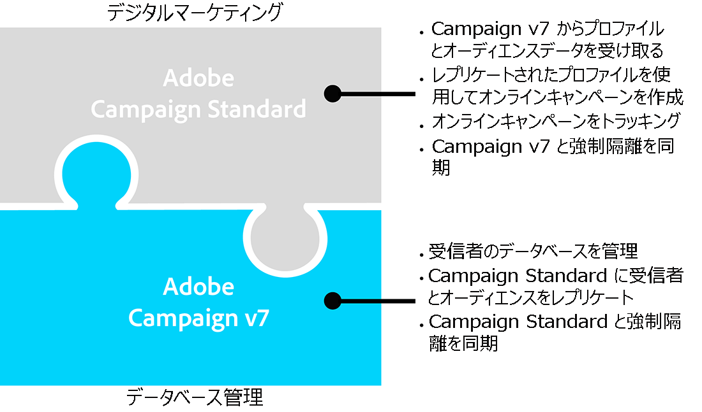

ACS コネクタを使用すると、デジタルマーケターが Campaign Standard を引き続き使用して、キャンペーンを設計、ターゲティングおよび実行したり、データベースマーケターなどのデータ指向のユーザーが Campaign v7 をカスタマイズしたりできます。

>[!CAUTION]
>
>ACS コネクタは、Adobe Campaign Prime の一部としてのみ使用できます。Adobe Campaign Prime のライセンス付与の方法について詳しくは、担当のアカウントマネージャーにお問い合わせください。
>
>ACS コネクタは、ホストアーキテクチャおよびハイブリッドアーキテクチャでのみ使用できます。完全なオンプレミスインストールには使用できません。
>
>この機能を使用するには、Adobe ID（IMS）で Campaign に接続する必要があります。[Adobe ID を使用した接続](../../integrations/using/about-adobe-id.md)を参照してください。

このドキュメントでは、ACS コネクタの機能について説明します。以下の節では、この機能を使用したデータのレプリケート方法に関する情報と、レプリケートされたプロファイルの操作方法を説明します。

* [プロセス](#process)：ACS コネクタの概要とデータレプリケーションの管理方法。
* [実装](#implementation)：ACS コネクタを使い始める方法の概要と基本データおよび高度なデータのレプリケート方法に関する手順。
* [プロファイルの同期](../../integrations/using/synchronizing-profiles.md)：プロファイルのレプリケート方法とそれらを使用した配信の作成方法に関する手順。
* [オーディエンスの同期](../../integrations/using/synchronizing-audiences.md)：Campaign v7 での受信者のリストのターゲティング方法と、その後のリストのオーディエンスとしての Campaign Standard へのレプリケート方法に関する手順。
* [Web アプリケーションの同期](../../integrations/using/synchronizing-web-applications.md)：Campaign v7 Web アプリケーションの Campaign Standard へのリンク方法に関する手順。
* [ACS コネクタのトラブルシューティング](../../integrations/using/troubleshooting-the-acs-connector.md)：よくある問題に対する回答の確認。

>[!NOTE]
>
>ACS コネクタは、ライセンス契約下の Campaign v7 に含まれます。ACS コネクタを使用するには、Campaign v7 と Campaign Standard との間で切り替えられることを確認します。バージョンおよび含まれる機能について不明な場合は、管理者にお問い合わせください。

## プロセス {#process}

### データレプリケーション {#data-replication}

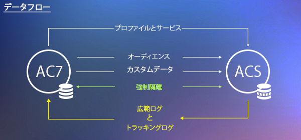

ACS コネクタは、Campaign v7 から Campaign Standard に以下の項目を定期的にレプリケートします。

* **受信者**
* **購読**
* **サービス**
* **ランディングページ**

デフォルトでは、ACS コネクタの定期的なレプリケーションは、15 分ごとに 1 回です。定期的なレプリケーションの長さは、ニーズに合わせて調整できます。変更が必要な場合は、コンサルタントにお問い合わせください。

受信者、購読、サービス、ランディングページのデータレプリケーションは、増分です。つまり、新しい受信者と既存の受信者に対する変更が、Campaign v7 から Campaign Standard にレプリケートされます。ただし、オーディエンスのレプリケーションが単一のインスタンスで発生します。Campaign v7 でオーディエンスを作成したら、Campaign Standard に 1 回レプリケートできます。レプリケーションはただちにおこなわれ、定期的な更新は設定できません。手順については、[オーディエンスの同期](../../integrations/using/synchronizing-audiences.md)を参照してください。

>[!NOTE]
>
>大規模なデータベースの最初のレプリケーションは、数時間かかる場合がありますのでご注意ください。ただし、以降のレプリケーションは増分でおこなわれ、かかる時間も大幅に短縮されます。

ACS コネクタは、Campaign Standard から Campaign v7 に以下の項目を定期的にレプリケートします。

* **[!UICONTROL 配信 ID]**
* **[!UICONTROL E メール配信ログ]**
* **[!UICONTROL E メールトラッキングログ]**

配信 ID および E メールログをレプリケートすることで、Campaign v7 から v7 受信者の配信の履歴およびトラッキングデータにアクセスできます。

>[!CAUTION]
>
>Campaign Standard から Campaign v7 にレプリケートされるのは、E メール配信ログとトラッキングログのみです。

### データの同期 {#data-synchronization}

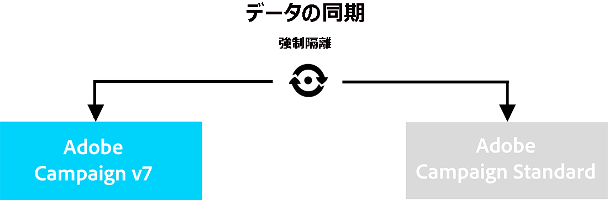

ACS コネクタは、Campaign v7 と Campaign Standard の間で強制隔離を同期します。

例えば、Campaign v7 から Campaign Standard にレプリケートされたプロファイルには、E メールアドレスが含まれます。E メールアドレスが Campaign Standard によって強制隔離されると、次の同期時にデータが Campaign v7 に渡されます。強制隔離について詳しくは、[強制隔離の管理](../../delivery/using/understanding-quarantine-management.md)および [Campaign Standard の強制隔離](https://docs.adobe.com/content/help/ja-JP/campaign-standard/using/testing-and-sending/monitoring-messages/understanding-quarantine-management.html)を参照してください。

### レプリケートされたプロファイルの使用 {#using-replicated-profiles}

レプリケートされたプロファイルは、Campaign Standard および Campaign v7 でマーケティングキャンペーンのワークフローをターゲティングするために使用できます。

レプリケートされたプロファイルを使用して Campaign Standard で配信を送信する手順については、[プロファイルの同期](../../integrations/using/synchronizing-profiles.md)を参照してください。Campaign v7 と Campaign Standard の間の購読解除データを共有する手順が追加されています。

### 制限事項 {#limitations}

レプリケートされたプロファイルは、すぐに配信に使用できますが、Campaign Standard でいくつかの制限があります。以下の項目を参照して、最善の管理方法を確認してください。

* **Campaign Standard の読み取り専用プロファイル**：レプリケートされたプロファイルは、Campaign Standard では読み取り専用です。ただし、Campaign v7 で受信者を編集できます。その変更は ACS コネクタによって Campaign Standard で自動的に更新されます。
* **Campaign Standard で作成されたプロファイル**：ACS コネクタは、Campaign v7 から Campaign Standard への一方向で受信者データをレプリケートします。そのため、Campaign Standard に由来するプロファイルは、Campaign v7 にレプリケートされません。
* **Campaign Standard の基本的な受信者データ**：ACS コネクタは、Campaign Standard に適した受信者データをレプリケートします。このデータには、受信者の名前、住所、E メールアドレス、携帯電話番号、自宅電話番号、その他関連のある連絡先情報が含まれます。Campaign v7 で使用できる追加の受信者フィールドおよびカスタムターゲティングテーブルがワークフローで重要な場合、コンサルタントにお問い合わせください。
* **強制隔離プロファイルのインポート**：連絡を希望しないプロファイルのリストは、強制隔離されたプロファイルとして Campaign v7 または Campaign Standard にインポートできます。プロファイルのステータスは、アプリケーション間の強制隔離の同期に含まれ、配信には使用されません。
* **Campaign Standard のサービスの購読解除**：配信の購読解除の選択は、Campaign Standard から Campaign v7 に同期されません。ただし、Campaign Standard の配信の購読解除リンクを Campaign v7 宛てにするように設定できます。購読解除リンクをクリックする受信者のプロファイルは、Campaign v7 で更新され、そのデータは Campaign Standard にレプリケートされます。[購読解除リンクの変更](../../integrations/using/synchronizing-profiles.md#changing-the-unsubscription-link)を参照してください。
* Campaign Standard から Campaign v7 にレプリケートされるのは、E メール配信ログとトラッキングログのみです。

### 請求 {#billing}

配信を送信するアプリケーションとして Campaign v7 と Campaign Standard のどちらを選択しても、請求に影響はありません。請求情報は、Campaign v7 と Campaign Standard の間で紐付けされています。そのため、両方のアプリケーションを使用して同じ受信者に配信を送信する場合でも、1 つのアクティブなプロファイルとみなされます。

## 実装 {#implementation}

ACS コネクタには、2 つのタイプの実装があります。どちらも、常に Adobe Campaign コンサルティングチームによって実行されます。

>[!CAUTION]
>
>この節では、エキスパートユーザーのみに向けて、実装プロセスの全体像と主な手順について説明します。
>
>どのような手段であれ、これらの実装を自分自身で実行しようとしないでください。これらの実装は厳密に Adobe Campaign コンサルタントによっておこなわれる操作です。

**基本的な実装**&#x200B;により、受信者（標準のフィールド）、サービスと購読、Web アプリケーションおよびオーディエンスをレプリケートできます。これは、Campaign v7 から Campaign Standard の一方向のレプリケーションです。

**高度な実装**&#x200B;により、例えば、追加の受信者フィールドまたはカスタム受信者テーブル（トランザクションテーブルなど）がある場合など、より複雑な使用例を実行できます。[高度な実装](#advanced-implementation)を参照してください。

### パッケージのインストール {#installing-the-package}

この機能を使用するには、**[!UICONTROL ACS コネクタ]**&#x200B;パッケージをインストールする必要があります。これは、常にアドビの技術管理者またはコンサルタントによって実行されます。

ACS コネクタに関連するすべての技術要素は、エクスプローラーの&#x200B;**[!UICONTROL 管理／ACS コネクタ]**&#x200B;ノードで使用できます。

### テクニカルワークフローおよびレプリケーションワークフロー {#technical-and-replication-workflows}

このパッケージをインストールしたら、**[!UICONTROL 管理／ACS コネクタ／プロセス]**&#x200B;で、テクニカルワークフローを使用できます。

>[!CAUTION]
>
>これらのワークフローは決して変更しないでください。エラーや一時停止が発生しないようにしてください。このような状況が発生した場合は、Adobe Campaign コンサルタントにお問い合わせください。

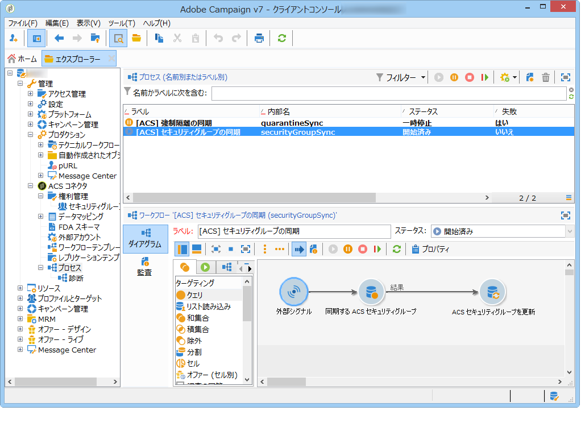

* **[!UICONTROL `[ACS] Quarantine synchronization`]**（quarantineSync）：このワークフローは、すべての強制隔離情報を同期します。Campaign v7 のすべての新しい強制隔離は、Campaign Standard にレプリケートされます。Campaign Standard からのすべての新しい強制隔離は、Campaign v7 にレプリケートされます。これにより、すべての除外ルールが Campaign v7 と Campaign Standard との間で必ず同期されます。
* **[!UICONTROL `[ACS] Security group synchronization`]**（securityGroupSync）：このワークフローは、権限の変換に使用されます。[権限の変換](#rights-conversion)を参照してください。

以下のレプリケーションワークフローが「使用準備完了」テンプレートとして使用できます。Adobe Campaign コンサルタントによって実装される必要があります。

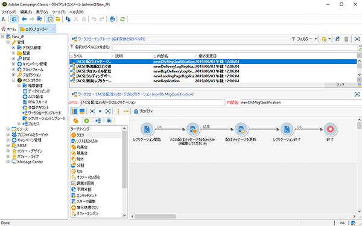

* **[!UICONTROL `[ACS] Profile replication`]**（newProfileReplication）：この増分ワークフローは、受信者を Campaign Standard にレプリケートします。デフォルトでは、すべての標準の受信者フィールドをレプリケートします。[デフォルトの受信者フィールド](#default-recipient-fields)を参照してください。
* **[!UICONTROL `[ACS] Service replication`]**（newServiceReplication）：この増分ワークフローは、選択したサービスを Campaign Standard にレプリケートします。使用例の [Web アプリケーションの同期](../../integrations/using/synchronizing-web-applications.md)を参照してください。
* **[!UICONTROL `[ACS] Landing pages replication`]**（newLandingPageReplication）：この増分ワークフローは、選択した Web アプリケーションを Campaign Standard にレプリケートします。Campaign v7 Web アプリケーションは、Campaign Standard でランディングページとして表示されます。使用例の [Web アプリケーションの同期](../../integrations/using/synchronizing-web-applications.md)を参照してください。
* **[!UICONTROL `[ACS] New replication`]**（newReplication）：この増分ワークフローは、カスタムテーブルのレプリケートに使用できる例です。[高度な実装](#advanced-implementation)を参照してください。
* **[!UICONTROL `[ACS] Delivery-mesage replication`]**（newDlvMsgQualification）：この増分ワークフローは、配信メッセージを Campaign Standard から Campaign v7 にレプリケートします。
* **[!UICONTROL `[ACS] Profile delivery log replication`]**（newRcpDeliveryLogReplication）：この増分ワークフローは、配信 ID、E メール配信ログおよび E メールトラッキングログを Campaign Standard から Campaign v7 にレプリケートします。ここでは、Campaign Standard から Campaign v7 の nms:recipients テーブルの一部であるプロファイルに送信された配信のみが考慮されます。
* **[!UICONTROL `[ACS] New delivery log replication`]**（newRcpDeliveryLogReplication）：この増分ワークフローは、配信 ID、E メール配信ログおよび E メールトラッキングログを Campaign Standard から Campaign v7 にレプリケートします。ここでは、Campaign Standard から Campaign v7 の（nms:recipient 以外の定義する）特定のテーブルの一部であるプロファイルに送信された配信のみが考慮されます。

### デフォルトの受信者フィールド {#default-recipient-fields}

追加のフィールドまたはカスタムテーブル（トランザクションテーブルなど）がある場合、デフォルトではレプリケートされません。実行するには、高度な設定が必要です。[高度な実装](#advanced-implementation)を参照してください。

次に、基本的な実装でレプリケートされた受信者フィールドのリストを示します。これらは標準のフィールドです。

<table> 
 <tbody> 
  <tr> 
   <td> <strong>ラベル</strong>  </td> 
   <td> <strong>内部名</strong>  </td> 
  </tr> 
  <tr> 
   <td> ソース ID  </td> 
   <td> @sourceId  </td> 
  </tr> 
  <tr> 
   <td> 作成日  </td> 
   <td> @created  </td> 
  </tr> 
  <tr> 
   <td> 変更日  </td> 
   <td> @lastModified  </td> 
  </tr> 
  <tr> 
   <td> E メール  </td> 
   <td> @email  </td> 
  </tr> 
  <tr> 
   <td> 姓  </td> 
   <td> @lastName  </td> 
  </tr> 
  <tr> 
   <td> 名  </td> 
   <td> @firstName  </td> 
  </tr> 
  <tr> 
   <td> ミドルネーム  </td> 
   <td> @middleName  </td> 
  </tr> 
  <tr> 
   <td> モバイル  </td> 
   <td> @mobilePhone  </td> 
  </tr> 
  <tr> 
   <td> 生年月日  </td> 
   <td> @birthDate  </td> 
  </tr> 
  <tr> 
   <td> 性別  </td> 
   <td> @gender  </td> 
  </tr> 
  <tr> 
   <td> 敬称  </td> 
   <td> @salutation  </td> 
  </tr> 
  <tr> 
   <td> 今後の連絡は不要 (すべてのチャネル)  </td> 
   <td> @blackList  </td> 
  </tr> 
  <tr> 
   <td> 今後の E メールによる連絡は不要  </td> 
   <td> @blackListEmail  </td> 
  </tr> 
  <tr> 
   <td> 今後の SMS による連絡は不要  </td> 
   <td> @blackListMobile  </td> 
  </tr> 
  <tr> 
   <td> 電話  </td> 
   <td> @phone  </td> 
  </tr> 
  <tr> 
   <td> FAX  </td> 
   <td> @fax  </td> 
  </tr> 
  <tr> 
   <td> 住所 1 (建物名)  </td> 
   <td> [location/@address1]  </td> 
  </tr> 
  <tr> 
   <td> 住所 2  </td> 
   <td> [location/@address2]  </td> 
  </tr> 
  <tr> 
   <td> 住所 3 (番地)  </td> 
   <td> [location/@address3]  </td> 
  </tr> 
  <tr> 
   <td> 住所 4 (郡)  </td> 
   <td> [location/@address4]  </td> 
  </tr> 
  <tr> 
   <td> 郵便番号  </td> 
   <td> [location/@zipCode]  </td> 
  </tr> 
  <tr> 
   <td> 市区町村  </td> 
   <td> [location/@city]  </td> 
  </tr> 
  <tr> 
   <td> 都道府県コード  </td> 
   <td> [location/@stateCode]  </td> 
  </tr> 
  <tr> 
   <td> 国コード  </td> 
   <td> [location/@countryCode]  </td> 
  </tr> 
 </tbody> 
</table>

### 権限の変換 {#rights-conversion}

権限は、Campaign v7 と Campaign Standard で扱いが異なります。Campaign v7 では、権限管理は、フォルダーベースであるのに対して、Campaign Standard では、単位アクセス（組織／地理的単位）に基づいています。Campaign Standard ユーザーは、制限コンテキストのセキュリティグループに属します。そのため、Campaign v7 権限システムは、Campaign Standard のシステムに合わせて変換される必要があります。権限の変換を実行するには、いくつかの方法があります。次に実装の例を示します。

1. **[!UICONTROL 管理／ACS コネクタ／権限管理／セキュリティグループ]**&#x200B;で、「**[!UICONTROL 同期]**」ボタンを使用して、すべての Campaign Standard セキュリティグループを取得します。標準の Campaign Standard グループは除外されます。

   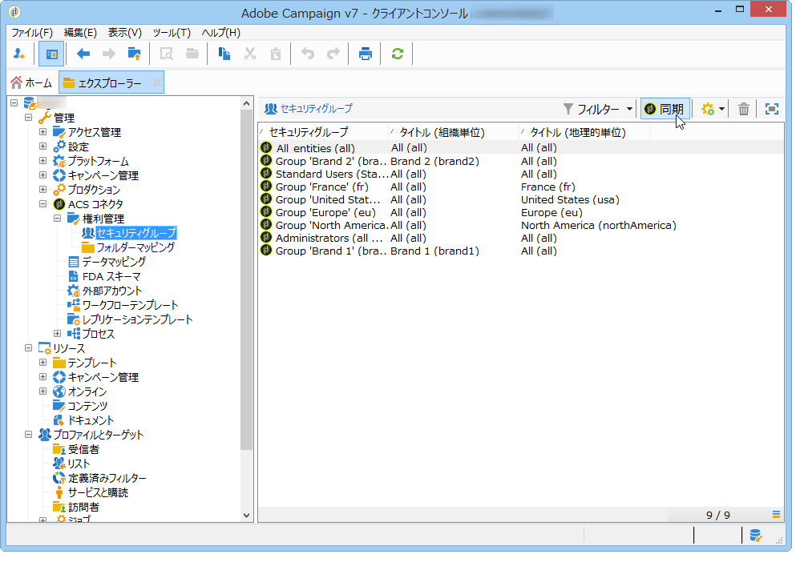

1. 権限管理がフォルダーベースの場合、**[!UICONTROL 管理／ACS コネクタ／権限管理／フォルダーマッピング]**&#x200B;に移動して、必要な各フォルダーをセキュリティグループにマッピングします。

   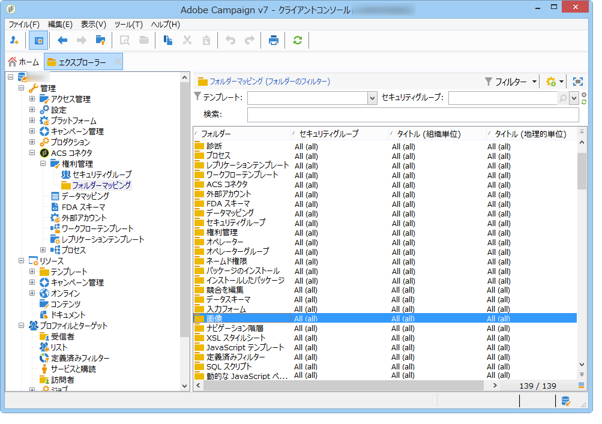

1. レプリケーションワークフローは、次にこの情報を使用して対応する組織／地理的単位を各オブジェクトに追加し、レプリケートします。

### 高度な実装 {#advanced-implementation}

ここでは、高度な実装の観点からいくつかの可能性を説明します。

>[!CAUTION]
>
>この情報は、一般的なガイドラインとしてのみ使用できます。実装については、Adobe Campaign コンサルタントにお問い合わせください。

高度な実装では、お客様のニーズに応じて、カスタムレプリケーションワークフローが追加されます。以下に、いくつかの例を示します。

* 配信レプリケーション
* キャンペーンレプリケーション
* プログラムレプリケーション
* シードメンバーレプリケーション
* トランザクションレプリケーション
* その他

**受信者の拡張フィールドのレプリケート**

基本的な実装では、標準の受信者フィールドがレプリケートされます。受信者スキーマに追加したカスタムフィールドをレプリケートする場合は、それらを識別する必要があります。

1. **[!UICONTROL 管理／ACS コネクタ／データマッピング]**&#x200B;で、**[!UICONTROL nms:recipient]** テーブルのターゲティングマッピングを作成します。

   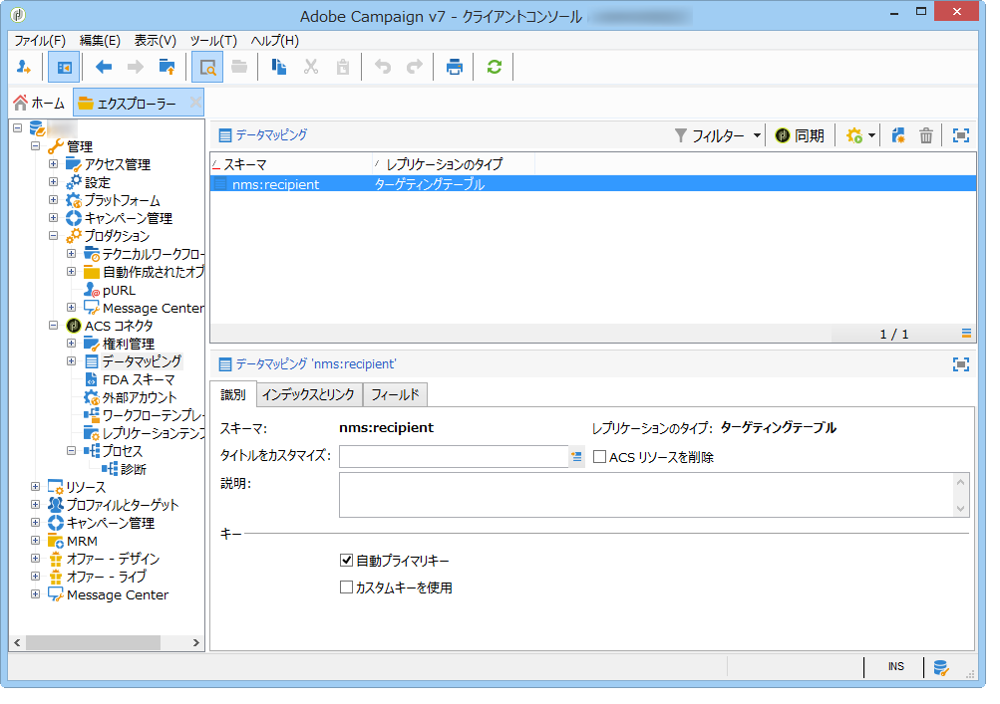

1. レプリケートする追加のフィールドとその他の必要な情報（インデックス、リンク、識別キー）を選択します。

   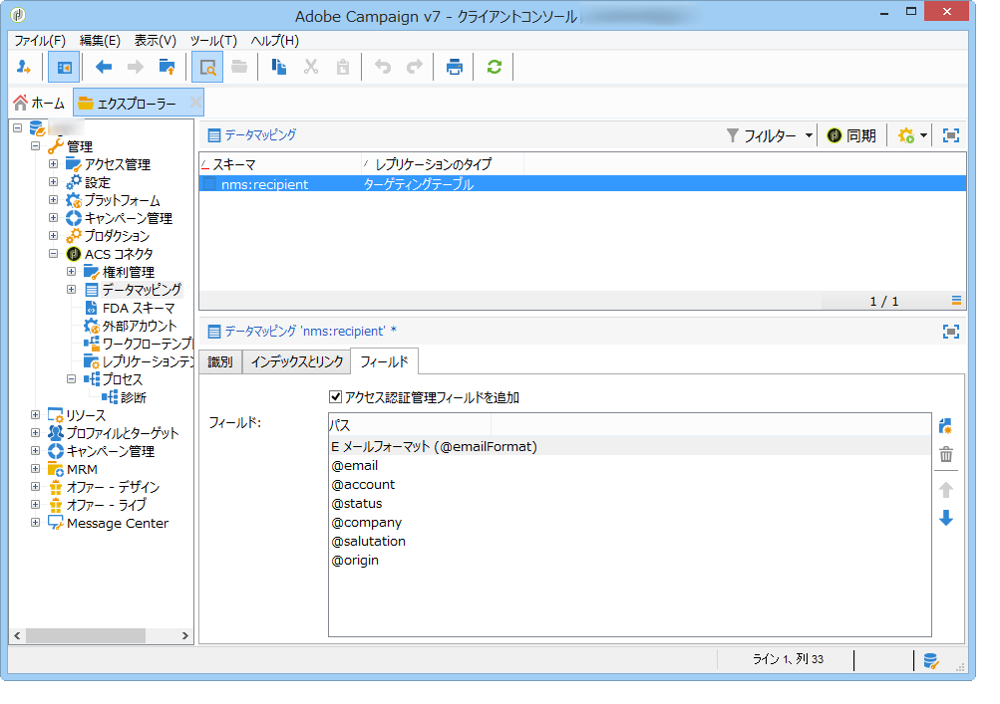

1. 専用のプロファイルレプリケーションワークフロー（テンプレートではなく、ワークフローインスタンス自体）を開きます。「**[!UICONTROL クエリ]**」および「**[!UICONTROL 更新日]**」アクティビティを変更して、これらのフィールドを含めます。[テクニカルワークフローおよびレプリケーションワークフロー](#technical-and-replication-workflows)を参照してください。

   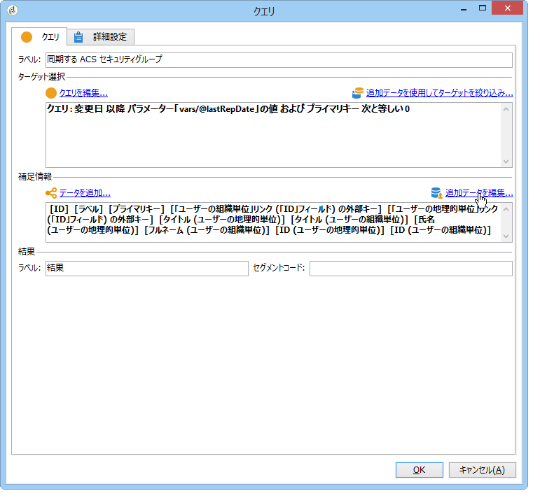

   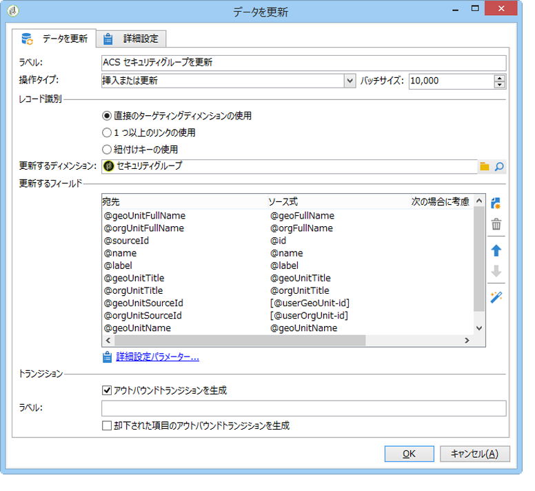

**カスタムプロファイルテーブルのレプリケート**

基本的な実装では、標準の受信者テーブルがレプリケートされます。カスタム受信者テーブルを追加した場合、ここに、それらを識別する方法を示します。

1. **[!UICONTROL 管理／ACS コネクタ／データマッピング]**&#x200B;で、カスタムプロファイルテーブルのターゲティングマッピングを作成します。

   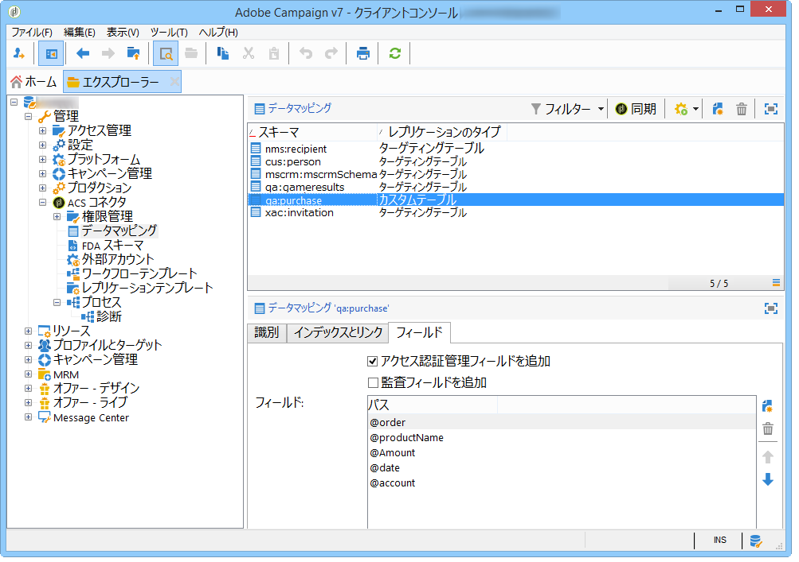

1. レプリケートする識別データ、インデックス、リンクおよびフィールドを定義します。

   

1. 権限管理がフォルダーベースの場合、**[!UICONTROL 管理／ACS コネクタ／権限管理／フォルダーマッピング]**&#x200B;に移動して、カスタムテーブルにリンクされたフォルダーのセキュリティグループを定義します。[権限の変換](#rights-conversion)を参照してください。
1. **[!UICONTROL 新規レプリケーション]**&#x200B;ワークフロー（テンプレートではなく、ワークフローインスタンス自体）を使用して、レプリケートするカスタムテーブルおよびフィールドを含めます。[テクニカルワークフローおよびレプリケーションワークフロー](#technical-and-replication-workflows)を参照してください。

