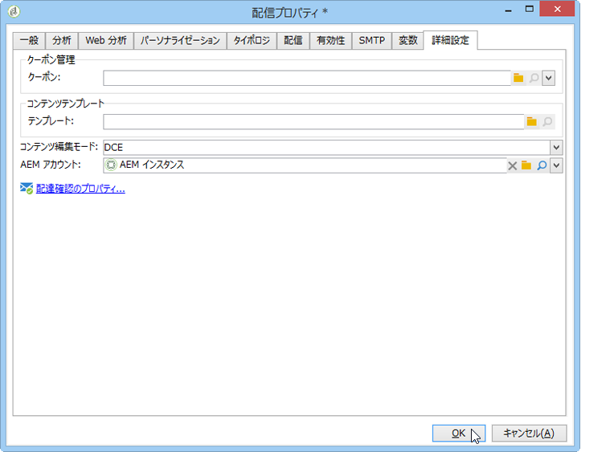

# Assets へのアクセスの設定{#configuring-access-to-assets}

この節では、Assets コアサービスまたは Adobe Experience Manager Assets ライブラリとの統合機能で使用するために必要な Adobe Campaign の設定手順を説明します。

>[!CAUTION]
>
>これらの統合は同時におこないます。次の情報をよく読んでから設定をおこなってください。

* **Experience Cloud Assets** との統合：この統合により、Adobe Experience Cloud ライブラリから画像を挿入できます。設定とライセンスモデルに応じて、このライブラリは Assets コアサービスまたは Assets On Demand になります。This integration must be set up by installing the **[!UICONTROL Integration with the Adobe Experience Cloud]** built-in package in Adobe Campaign.
* **AEM Assets** との統合：この統合により、Adobe Experience Manager Assets ライブラリから画像を挿入できます。This integration must be set up by installing the **[!UICONTROL AEM Integration]** built-in package in Adobe Campaign.

>[!NOTE]
>
>If the two packages (**[!UICONTROL AEM Integration]** and **[!UICONTROL Integration with the Adobe Experience Cloud]** ) are installed, only the assets available in the Adobe Experience Cloud library can be used. AEM Assets ライブラリのアセットにもアクセスするには、AEM Assets と Adobe Experience Cloud を同期する必要があります。AEM Assets 内のアセットも、Adobe Experience Cloud ライブラリで使用可能になります。AEM Assets と Adobe Experience Cloud の同期について詳しくは、[詳細ドキュメント](https://docs.adobe.com/docs/en/aod/overview/collaborating/aem-assets-aod-sync.html)を参照してください。

## Experience Cloud Assets との統合 {#integrating-with-experience-cloud-assets}

Adobe Campaign と Experience Cloud Assets 間の統合を使用するには、次が必要です。

* Adobe Experience Cloud 組織
* Adobe IMS 認証モードが有効であること

Adobe Campaign と Adobe Experience Cloud の間の接続を有効化するには、IMS（Adobe ID 接続サービス）を介して接続を設定します。この設定について詳しくは、[Adobe ID を使用して接続](../../integrations/using/about-adobe-id.md)ドキュメントで説明しています。設定時には以下をおこないます。

* Installing the **[!UICONTROL Integration with the Adobe Experience Cloud]** package.
* Adobe Experience Cloud 外部アカウントの設定

>[!NOTE]
>
>この統合に関連する機能は、IMS から Adobe ID を使用して接続するユーザーだけが使用できます。

## AEM Assets との統合 {#integrating-with-aem-assets}

AEM Assets と Adobe Campaign を統合するには、まず Adobe Experience Manager と Adobe Campaign 間の統合を設定する必要があります。この設定には、主に次のことが必要になります。

* 組み込みパッケ **[!UICONTROL AEM Integration]** ージのインストール
* Adobe Experience Manager に特有の外部アカウントの設定

Adobe Campaign と Adobe Experience Manager を統合する方法については、[詳細ドキュメント](../../integrations/using/about-adobe-experience-manager.md)を参照してください。

この統合を設定した後は、AEM Assets ライブラリを使用する新しい配信テンプレートを Adobe Campaign で設定できます。これをおこなうには、以下の手順に従います。

1. 新しい配信テンプレートを作成するか、既存の配信テンプレートを複製します。配信テンプレートについて詳しくは、[このページ](../../delivery/using/about-templates.md)を参照してください。
1. このテンプレートの&#x200B;**プロパティ**&#x200B;を編集します。
1. タブで、 **[!UICONTROL Advanced]** を **[!UICONTROL Content editing mode]** DCEに設定します ****。
1. Select the external **[!UICONTROL AEM account]** that you need to use to access your AEM Assets library.

   

When you insert images into a delivery&#39;s content based on this template, the **[!UICONTROL Select a shared asset]** option will then allow you to browse images in the AEM Assets library. 詳しくは、[この節](../../integrations/using/inserting-a-shared-asset.md)を参照してください。

>[!NOTE]
>
>If the **[!UICONTROL Integration with the Adobe Experience Cloud]** package is also installed on your Adobe Campaign instance, you will only be able to use the assets available in the Adobe Experience Cloud library. AEM Assets ライブラリのアセットにもアクセスするには、AEM Assets と Adobe Experience Cloud を同期する必要があります。AEM Assets 内のアセットも、Adobe Experience Cloud ライブラリで使用可能になります。その場合、特定の配信テンプレートを作成する必要はありません。AEM Assets と Adobe Experience Cloud 間の同期について詳しくは、[詳細ドキュメント](https://docs.adobe.com/docs/en/aod/overview/collaborating/aem-assets-aod-sync.html)を参照してください。

