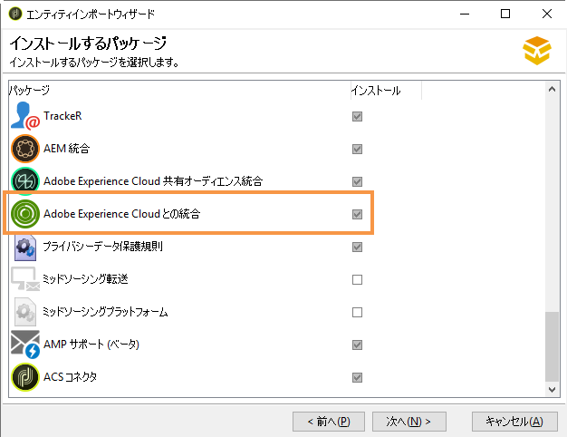
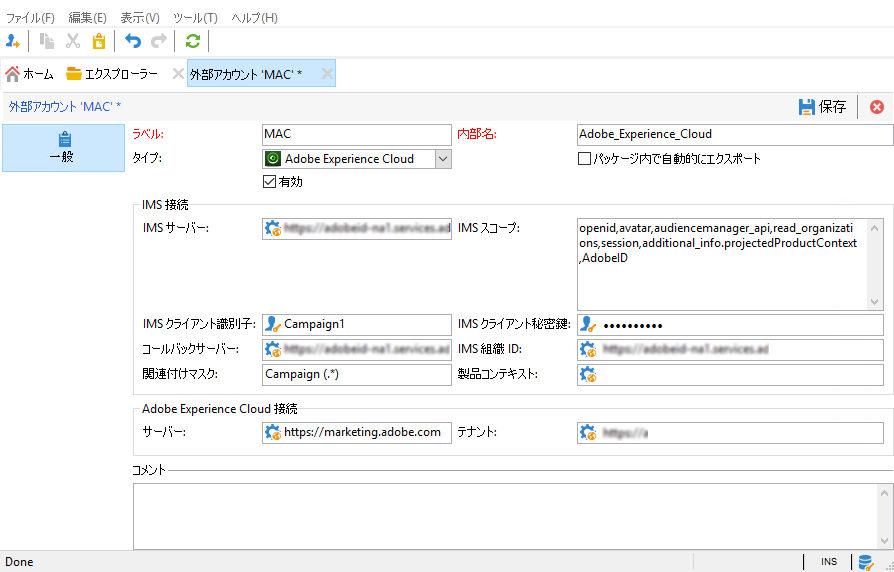

# IMS の設定{#configuring-ims}

## 前提条件 {#prerequisites}

IMS との統合を使用するには：

* Adobe Marketing Cloud 組織と IMS ID（Adobe Marketing Cloud の初回接続時に付与されます）が必要です。
* Marketing Cloud にユーザーを追加する必要があります。詳しくは、次のページを参照してください。https://marketing.adobe.com/resources/help/en_US/mcloud/admin_getting_started.html .

>[!NOTE]
>
>Adobe Campaign と同期される Adobe Marketing Cloud グループにユーザーがリンクされているか確認してください。「外部アカウ [ントの設定」を参照してください](#configuring-the-external-account)。

## コンソールの更新 {#updating-the-console}

この機能を使用するには、コンソールの最新バージョンを必ずインストールする必要があります。

## パッケージのインストール {#installing-the-package}

パッケージをインストールする必要が **[!UICONTROL Integration with the Adobe Experience Cloud]** あります。 統合パッケージのインストール方法は、標準パッケージのインストール方法と同じです。詳しくは、[このページ](../../installation/using/installing-campaign-standard-packages.md)で説明しています。

## 外部アカウントの設定 {#configuring-the-external-account}

で **Adobe Experience cloud外部アカウントを設定します****[!UICONTROL Administration > Platform > External accounts]**。

>[!CAUTION]
>
>この設定は技術管理者がおこなってください。

次の情報を入力します。

* 使用する IMS サーバーの接続情報（ID および Secret）。この情報は、Adobe サポートから提供されます。詳しくは、[Adobe Experience Cloud 管理者向け FAQ](https://marketing.adobe.com/resources/help/en_US/mcloud/faq.html) を参照してください。

   The **[!UICONTROL Callback server]** address must be specified in **https**. このフィールドは、お客様の Adobe Campaign インスタンスのアクセス URL に対応します。

* IMS organization ID: this information is available on the Experience Cloud (in **[!UICONTROL Administration > Experience Cloud Details]** ) and is provided when you first connect to the Adobe Experience Cloud.
* 関連付けマスク：このフィールドでは、Enterprise Dashboard の設定名を Adobe Campaign のグループと同期させる構文を定義することができます。「Campaign - tenant_id - (.*)」という構文を使用すると、Adobe Campaign で作成したセキュリティグループが Enterprise Dashboard の設定名「Campaign - tenant_id - internal_name」にリンクされます。

   >[!CAUTION]
   >
   >関連付けマスクは、Adobe ID を使用した接続が正常に機能するために必要です。

* Adobe Experience Cloud 接続情報、特に Adobe Experience Cloud テナント名。

