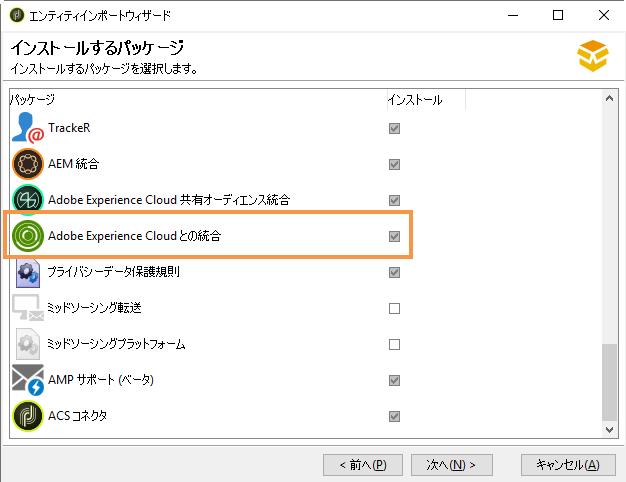
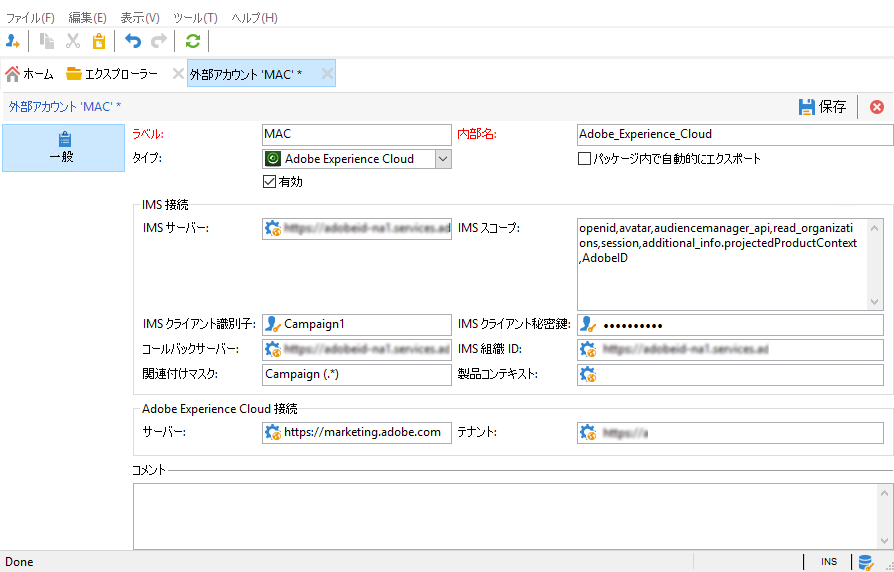

# IMS の設定{#configuring-ims}

>[!IMPORTANT]
>
>Campaign のホストサービスまたは Managed Services ユーザーの場合、Adobe IMS の実装はアドビが所有します。以下の手順は、オンプレミス環境およびハイブリッド環境のお客様にのみ適用されます。
> Adobe IMS の実装は、アドビの技術管理者のみが実行する必要があります。実装プロセスを開始するには、アドビ担当者にお問い合わせください。

## 前提条件 {#prerequisites}

* Adobe Experience Cloud の組織名と組織 ID が必要です。 組織 ID を見つけるには、[このページ](https://experienceleague.adobe.com/docs/core-services/interface/administration/organizations.html?lang=ja){_blank}を参照してください。
* Experience Cloud にユーザーを追加する必要があります。 詳しくは、[このページ](https://experienceleague.adobe.com/docs/core-services/interface/administration/admin-getting-started.html?lang=ja){_blank}を参照してください。

>[!NOTE]
>
>Adobe Campaign と同期される Adobe Experience Cloud グループにユーザーがリンクされているか確認してください。 [詳細情報](#configuring-the-external-account)。

## コンソールの更新 {#updating-the-console}

この機能を使用するには、クライアントコンソールの最新バージョンを必ずインストールする必要があります。

## パッケージのインストール {#installing-the-package}

**[!UICONTROL Adobe Experience Cloud との統合]**&#x200B;のビルトインパッケージをインストールする必要があります。 統合パッケージのインストール方法は、標準パッケージのインストール方法と同じです。詳しくは、[このページ](../../installation/using/installing-campaign-standard-packages.md)を参照してください。

## 外部アカウントの設定 {#configuring-the-external-account}

**Adobe Experience Cloud** 外部アカウントを、**[!UICONTROL 管理／プラットフォーム／外部アカウント]**&#x200B;で設定します。

次の情報を入力します。

* 使用する IMS サーバーの接続情報（ID および Secret）。 この情報は、アドビカスタマーケアチームによって提供されます。 詳しくは、[Adobe Experience Cloud 管理者向け FAQ](https://experienceleague.adobe.com/docs/core-services/interface/manage-users-and-products/faq.html?lang=ja) を参照してください。

  **[!UICONTROL コールバックサーバー]**&#x200B;アドレスは **https** で指定する必要があります。 このフィールドは、お客様の Adobe Campaign インスタンスのアクセス URL に対応します。

* 組織 ID - 組織 ID を見つけるには、[このページ](https://experienceleague.adobe.com/docs/core-services/interface/administration/organizations.html?lang=ja){_blank}を参照してください。

* 関連付けマスク：このフィールドでは、Enterprise Dashboard の設定名を Adobe Campaign のグループと同期させる構文を定義することができます。 「Campaign - tenant_id - (.&#42;)」という構文を使用すると、Adobe Campaign で作成したセキュリティグループが Enterprise Dashboard の設定名「Campaign - tenant_id - internal_name」にリンクされます。

* Adobe Experience Cloud 接続情報。Adobe Experience Cloud テナントの名前です。
