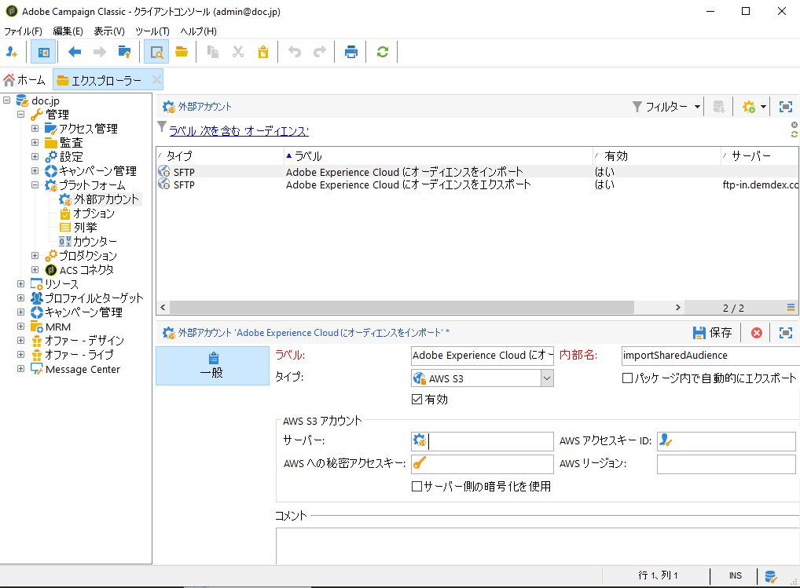
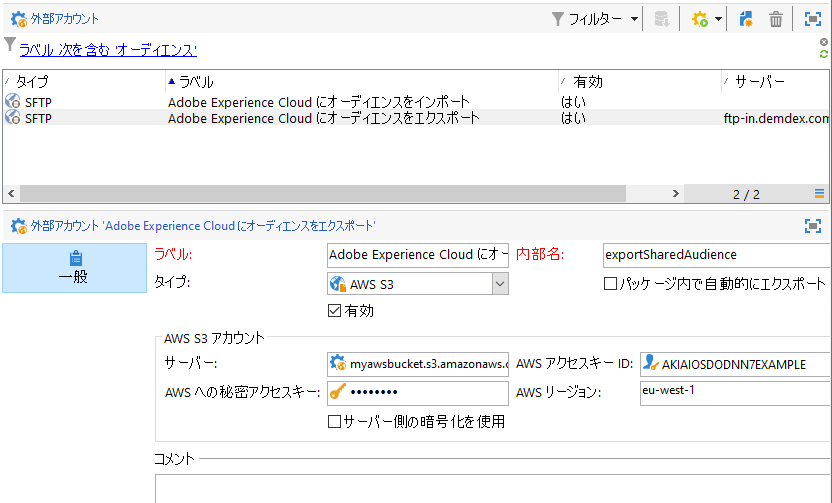
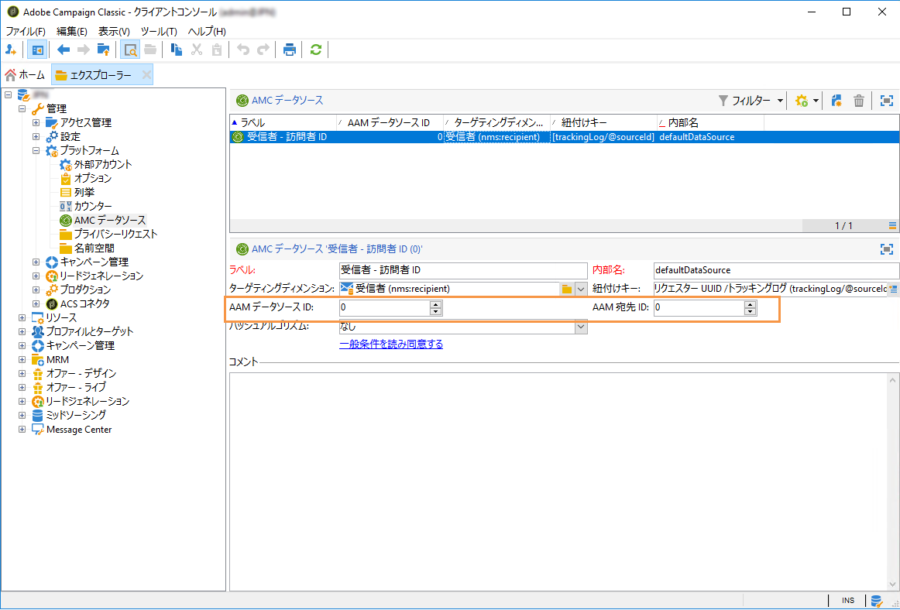

# Adobe Campaign での共有オーディエンスの統合の設定{#configuring-shared-audiences-integration-in-adobe-campaign}

この依頼を送信すると、アドビによって統合のプロビジョニングが進められます。また、お客様には設定を完了させるための詳細情報が届きます。

1. [手順 1：Adobe Campaign での外部アカウントの設定または確認](#step-1--configure-or-check-the-external-accounts-in-adobe-campaign)
1. [手順 2：データソースの設定](#step-2--configure-the-data-source)
1. [手順 3：キャンペーントラッキングサーバーの設定](#step-3--configure-campaign-tracking-server)
1. [手順 4：訪問者 ID サービスの設定](#step-4--configure-the-visitor-id-service)

## 手順 1：Adobe Campaign での外部アカウントの設定または確認 {#step-1--configure-or-check-the-external-accounts-in-adobe-campaign}

まず、次の手順に従って、Adobe Campaign で外部アカウントの設定または確認をおこなう必要があります。

1. 「**[!UICONTROL エクスプローラー]**」アイコンをクリックします。
1. **[!UICONTROL 管理／プラットフォーム／外部アカウント]**&#x200B;に移動します。通常、この SFTP アカウントはアドビによって設定されており、お客様には必要な情報が伝えられています。

   * **[!UICONTROL importSharedAudience]**：オーディエンスのインポート専用の SFTP アカウント。
   * **[!UICONTROL exportSharedAudience]**：オーディエンスのエクスポート専用の SFTP アカウント。
   

1. **[!UICONTROL サーバー]**&#x200B;フィールドに入力：インポート外部アカウントには **ftp-out.demdex.com** ドメインを使用し、エクスポート外部アカウントには **ftp-in.demdex.com** ドメインを使用します。

   Campaign からのエクスポートは Audience Manager または People コアサービスへのインポートであることを覚えておいてください。

   >[!NOTE]
   >
   >S3 を使用している場合は、次の構文に従って **[!UICONTROL AWS S3 アカウントサーバー]**&#x200B;を入力します。\
   `<S3bucket name>.s3.amazonaws.com/<s3object path>`\
   S3 アカウントの設定方法について詳しくは、この[ページ](../../platform/using/external-accounts.md#amazon-simple-storage-service--s3--external-account)を参照してください。

   

1. アドビから提供された&#x200B;**[!UICONTROL アカウント]**&#x200B;と&#x200B;**[!UICONTROL パスワード]**&#x200B;を追加します。

これで外部アカウントが設定されました。

## 手順 2：データソースの設定 {#step-2--configure-the-data-source}

**受信者 - 訪問者 ID** は Audience Manager 内で作成されます。これは、訪問者 ID にデフォルトで設定されている標準のデータソースです。Campaign から作成されたセグメントは、このデータソースの一部になります。

**[!UICONTROL 受信者 - 訪問者 ID]** データソースを設定するには：

1. **[!UICONTROL エクスプローラー]**&#x200B;ノードから、**[!UICONTROL 管理／プラットフォーム／AMC データソース]**&#x200B;を選択します。
1. 「**[!UICONTROL 受信者 - 訪問者 ID]**」を選択します。
1. アドビから提供された&#x200B;**[!UICONTROL データソース ID]** と **[!UICONTROL AAM 宛先 ID]** を入力します。

   

## 手順 3：キャンペーントラッキングサーバーの設定 {#step-3--configure-campaign-tracking-server}

People コアサービスまたは Audience Manager との統合を設定する場合は、Campaign トラッキングサーバーも設定する必要があります。

Campaign トラッキングサーバーがドメインに登録されていることを確認する必要があります（CNAME）。ドメイン名のデリゲーションについて詳しくは、[この記事](https://helpx.adobe.com/jp/campaign/kb/domain-name-delegation.html)を参照してください。

## 手順 4：訪問者 ID サービスの設定 {#step-4--configure-the-visitor-id-service}

訪問者 ID サービスを Web のプロパティや Web サイトで設定したことがない場合は、次の[ドキュメント](https://marketing.adobe.com/resources/help/ja_JP/mcvid/mcvid-setup-aam-analytics.html)を参照してサービスの設定方法を確認するか、次の[ビデオ](https://helpx.adobe.com/marketing-cloud/how-to/email-marketing.html#step-two)をご覧ください。

設定とプロビジョニングが完了し、統合を使用してオーディエンスまたはセグメントをインポートおよびエクスポートできるようになりました。
