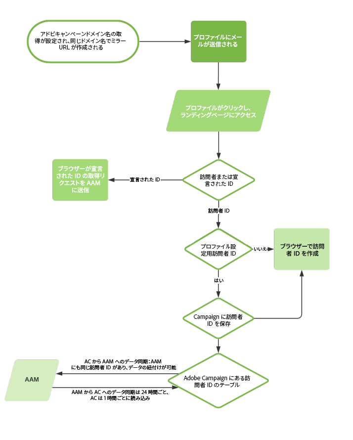

# Adobe Campaign での共有オーディエンス統合の設定{#configuring-shared-audiences-integration-in-adobe-campaign}


このリクエストを送信すると、アドビ側で統合のプロビジョニングが進められます。また、設定を完了するための詳細情報がお客様に届きます。

1. [手順 1：Adobe Campaign での外部アカウントの設定または確認](#step-1--configure-or-check-the-external-accounts-in-adobe-campaign)
1. [手順 2：データソースの設定](#step-2--configure-the-data-source)
1. [手順 3：Campaignトラッキングサーバーの設定](#step-3--configure-campaign-tracking-server)
1. [手順 4：訪問者 ID サービスの設定](#step-4--configure-the-visitor-id-service)

>[!IMPORTANT]
>
>demdex ドメインを使用しており、インポート外部アカウントで **ftp-out.demdex.com**、エクスポート外部アカウントで **ftp-in.demdex.com** の構文に従う場合は、それに従って実装を適応させ、Amazon Simple Storage Service（S3）コネクタに移動してデータのインポートまたはエクスポートをおこなう必要があります。Amazon S3 で外部アカウントを設定する方法の詳細については、[この節](../../integrations/using/configuring-shared-audiences-integration-in-adobe-campaign.md#step-1--configure-or-check-the-external-accounts-in-adobe-campaign)を参照してください。

次の図は、この統合の仕組みについて詳しく説明しています。ここで、AAM は Adobe Audience Manager を表し、AC は Adobe Campaign を表します。

{align="center"}

## 手順 1：Adobe Campaign での外部アカウントの設定または確認 {#step-1--configure-or-check-the-external-accounts-in-adobe-campaign}

まず、次の手順に従って、Adobe Campaign で外部アカウントの設定または確認をおこなう必要があります。

1. 「**[!UICONTROL エクスプローラー]**」アイコンをクリックします。
1. **[!UICONTROL 管理／プラットフォーム／外部アカウント]**&#x200B;に移動します。通常、この SFTP アカウントはアドビによって設定されており、お客様には必要な情報が伝えられています。

   * **[!UICONTROL importSharedAudience]**：オーディエンスのインポート専用のアカウント。
   * **[!UICONTROL exportSharedAudience]**：オーディエンスのエクスポート専用のアカウント。

   

1. 「**[!UICONTROL Adobe Marketing Cloud にオーディエンスをエクスポート]**」外部アカウントを選択します。

1. 「**[!UICONTROL タイプ]**」ドロップダウンから、「**[!UICONTROL AWS S3]**」を選択します。

1. 次の詳細を入力します。

   * **[!UICONTROL AWS S3 アカウントサーバー]**：
サーバーの URL は、次のように入力する必要があります。

     ```
     <S3bucket name>.s3.amazonaws.com/<s3object path>
     ```

   * **[!UICONTROL AWS アクセスキー ID]**：
AWS アクセスキー ID の見つけ方については、[このページ](https://docs.aws.amazon.com/ja_jp/general/latest/gr/aws-sec-cred-types.html#access-keys-and-secret-access-keys)を参照してください。

   * **[!UICONTROL AWS への秘密アクセスキー]**：
AWS への秘密アクセスキーの見つけ方については、[このページ](https://aws.amazon.com/jp/blogs/security/wheres-my-secret-access-key/)を参照してください。

   * **[!UICONTROL AWS リージョン]**：
AWS リージョンについて詳しくは、[このページ](https://aws.amazon.com/about-aws/global-infrastructure/regions_az/)を参照してください。

   

1. 前述した手順の詳細に従って、「**[!UICONTROL 保存]**」をクリックし、「**[!UICONTROL Adobe Marketing Cloud からオーディエンスをインポート]**」外部アカウントを設定します。

これで外部アカウントが設定されました。

## 手順 2：データソースの設定 {#step-2--configure-the-data-source}

**受信者 - 訪問者 ID** は Audience Manager 内で作成されます。これは、訪問者 ID にデフォルトで設定されている標準のデータソースです。Campaign から作成されたセグメントは、このデータソースの一部になります。

**[!UICONTROL 受信者 - 訪問者 ID]** データソースを設定するには：

1. **[!UICONTROL エクスプローラー]**&#x200B;ノードから、**[!UICONTROL 管理／プラットフォーム／AMC データソース]**&#x200B;を選択します。
1. 「**[!UICONTROL 受信者 - 訪問者 ID]**」を選択します。
1. アドビから提供された&#x200B;**[!UICONTROL データソース ID]** と **[!UICONTROL AAM 宛先 ID]** を入力します。

   

## 手順 3：Campaignトラッキングサーバーの設定 {#step-3--configure-campaign-tracking-server}

Audience Manager との統合を設定するには、Campaign トラッキングサーバーも設定する必要があります。

共有オーディエンスが訪問者 ID で機能できるようにするには、トラッキングサーバードメインを、クリックした URL またはメイン web サイトのサブドメインにする必要があります。

>[!IMPORTANT]
>
>Campaign トラッキングサーバーがドメインに登録されていることを確認する必要があります（CNAME）。ドメイン名のデリゲーションについて詳しくは、[この記事](https://experienceleague.adobe.com/docs/control-panel/using/subdomains-and-certificates/setting-up-new-subdomain.html?lang=ja)を参照してください。

## 手順 4：訪問者 ID サービスの設定 {#step-4--configure-the-visitor-id-service}

訪問者 ID サービスを web プロパティや web サイトで設定したことがない場合は、次の[ドキュメント](https://experienceleague.adobe.com/docs/id-service/using/implementation/setup-aam-analytics.html?lang=ja)を参照してサービスの設定方法を確認するか、次の[ビデオ](https://helpx.adobe.com/jp/marketing-cloud/how-to/email-marketing.html#step-two)をご覧ください。

Experience Cloud ID サービスの `setCustomerID` 関数と統合コード `AdobeCampaignID` を使用して、顧客 ID を宣言済み ID と同期します。`AdobeCampaignID` は、[手順 2：データソースの設定](#step-2--configure-the-data-sources)で設定した受信者データソースに設定された調整キーの値と一致させる必要があります。

設定とプロビジョニングが完了し、統合を使用してオーディエンスやセグメントの読み込みおよび書き出しを行えるようになりました。
