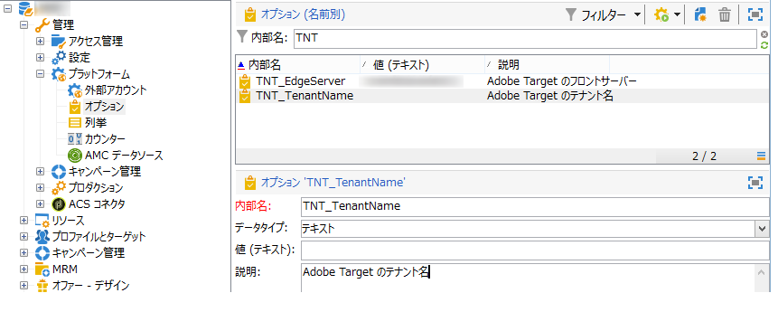

# Adobe Target との統合の設定{#configuring-the-integration-with-adobe-target}

>[!CAUTION]
>
> ホスト環境またはハイブリッド環境のお客様は、この統合を設定する場合は、アドビ担当者にお問い合わせください。以下の手順はオンプレミス環境のお客様にのみ当てはまります。

この統合には以下が必要です。

* Adobe Experience Cloud および Adobe Target 組織
* Adobe Campaign との接続を確立するために指定された Adobe Target ローボックス

Adobe Campaign でこの統合を設定するには、次の手順に従います。

1. **[!UICONTROL Adobe Experience Cloud との統合]**&#x200B;組み込みパッケージをインストールします。[詳細情報](../../platform/using/working-with-data-packages.md#importing-packages)

   このパッケージを使用すると、Digital Asset Manager を介して共有アセットにアクセスできます。

1. Adobe Experience Cloud を介して共有された画像をメールで使用するには、IMS（Adobe ID 接続サービス）を介して接続を有効にします。[詳細情報](../../integrations/using/about-adobe-id.md)
1. **[!UICONTROL 管理／プラットフォーム／オプション]**&#x200B;を参照して、 Adobe Target のサーバーおよび組織（テナント）オプションを設定します。

   

   * **[!UICONTROL TNT_EdgeServer]**：統合に使用される Adobe Target のサーバー。このオプションは、デフォルトで選択されています。この値は Adobe Target の&#x200B;**[!UICONTROL ドメインサーバー]**&#x200B;に対応し、値 **/m2** が続きます。例：**tt.omtrdc.net/m2**。
   * **[!UICONTROL TNT_TenantName]**：Adobe Target の組織名。この値は Adobe Target の&#x200B;**[!UICONTROL クライアント]**&#x200B;名に対応します。

>[!CAUTION]
>
>ハイブリッドアーキテクチャとホストアーキテクチャの場合、これらのオプションは、[ミッドソーシングサーバー](../../installation/using/mid-sourcing-server.md)と[実行インスタンス](../../message-center/using/configuring-instances.md#execution-instance)を含むすべてのサーバーで設定する必要があります。