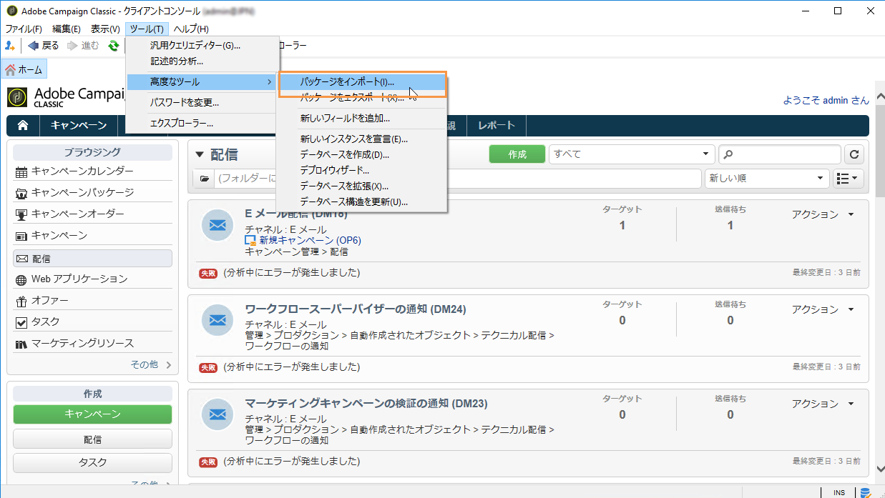
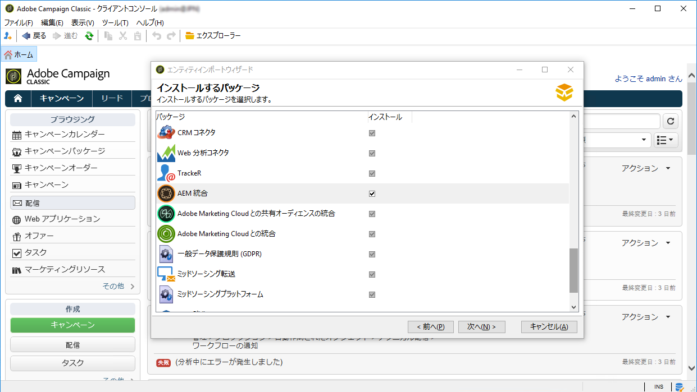
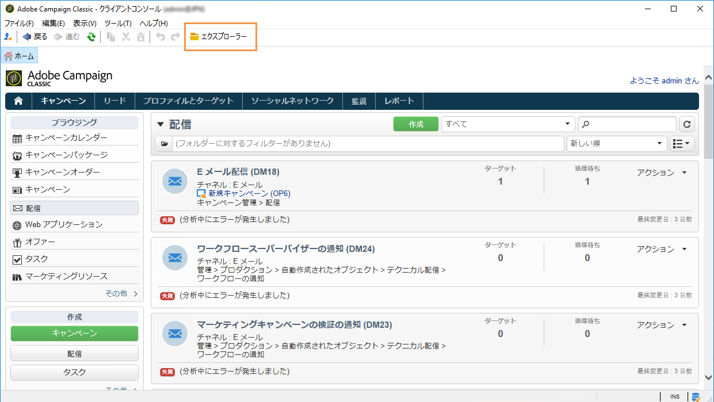
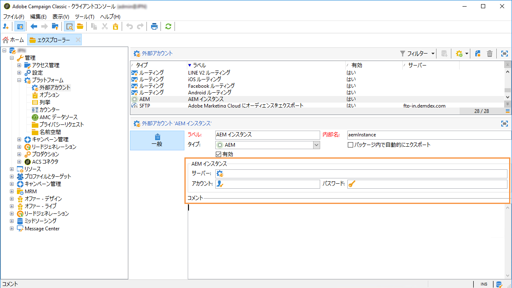
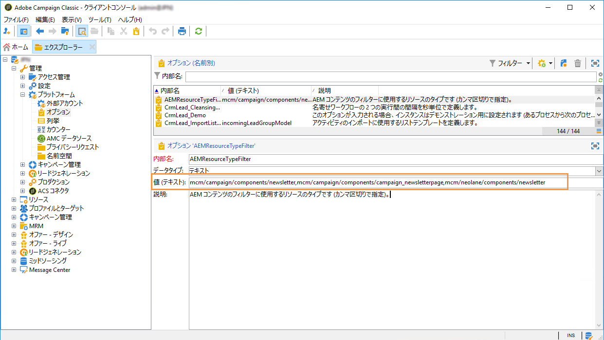

# 統合の設定{#configuring-the-integration}

## Adobe Campaign での設定 {#configuring-in-adobe-campaign}

2 つのソリューションを同時に使用するには、相互接続を設定する必要があります。

次の手順に従って、Adobe Campaign での設定を開始します。

1. [Adobe Campaign での AEM 統合パッケージのインストール](#install-the-aem-integration-package-in-adobe-campaign)
1. [外部アカウントの設定](#configure-the-external-account)
1. [AEM リソースフィルターの設定](#configure-aem-resources-filtering)

パーソナライゼーションフィールドやパーソナライゼーションブロックの管理などの高度な設定については、Adobe Experience Manager の[ドキュメント](https://helpx.adobe.com/experience-manager/6-5/sites/administering/using/campaignonpremise.html)を参照してください。

### Adobe Campaign での AEM 統合パッケージのインストール {#install-the-aem-integration-package-in-adobe-campaign}

You first need to install the **[!UICONTROL AEM integration]** package.

1. From your Adobe Campaign instance, select **[!UICONTROL Tools]** from the upper toolbar.
1. 選択 **[!UICONTROL Tools > Advanced > Import package...]**.

   

1. 選択 **[!UICONTROL Install a standard package]**.
1. チェックボ **[!UICONTROL AEM integration]** タンをオンにしてクリック **[!UICONTROL Next]** します。

   

1. In the next window, click the **[!UICONTROL Start]** button to start the installation of your package. インストールが完了したら、ウィンドウを閉じます。

### AEM オペレーターのセキュリティゾーンの設定 {#configure-the-security-zone-for-aem-operator}

パッケージ **[!UICONTROL AEM integration]** は、Campaignに演算子 **[!UICONTROL aemserver]** を設定します。 このオペレーターは、Adobe Experience Manager サーバーを Adobe Campaign に接続するために使用されます。

Adobe Experience Manager 経由で Adobe Campaign に接続するには、このオペレーターのセキュリティゾーンを設定する必要があります。

>[!CAUTION]
>
>セキュリティ上の問題を回避するために、AEM 専用のセキュリティゾーンを作成することを強くお勧めします。詳しくは、[インストールガイド](../../installation/using/configuring-campaign-server.md#defining-security-zones)を参照してください。

Campaign インスタンスがアドビによってホストされている場合は、アドビのサポートチームにお問い合わせください。Campaign をオンプレミスで使用している場合は、以下の手順に従います。

1. **serverConf.xml** 設定ファイルを開きます。
1. 選択したセキュリティゾーンの **allowUserPassword** 属性を **true** に設定します。

   これにより、Adobe Experience Manager がログイン／パスワード経由で Adobe Campaign に接続できるようになります。

### 外部アカウントの設定 {#configure-the-external-account}

The **[!UICONTROL AEM integration]** package created the external account for Adobe Experience Cloud. 次は、そのアカウントを Adobe Experience Manager インスタンスに接続するように設定する必要があります。

AEM 外部アカウントを設定するには、以下の手順に従います。

1. ボタンをクリッ **[!UICONTROL Explorer]** クします。

   

1. 選択 **[!UICONTROL Administration > Platform > External accounts]**.
1. リストから、 **[!UICONTROL External account]** を選択します **[!UICONTROL AEM instance]**。
1. AEM オーサーインスタンスの次のパラメーターを入力します。

   * **[!UICONTROL Server]**
   * **[!UICONTROL Account]**
   * **[!UICONTROL Password]**
   >[!NOTE]
   >
   >Make sure that your **[!UICONTROL Server]** address does not end with a a trailing slash.

   

1. チェックボックスをオ **[!UICONTROL Enabled]** ンにします。
1. ボタンをクリッ **[!UICONTROL Save]** クします。

### AEM リソースフィルターの設定 {#configure-aem-resources-filtering}

**AEMResourceTypeFilter** オプションは、Adobe Campaign で使用できる Experience Manager リソースのタイプをフィルターするために使用します。これにより、Adobe Campaign は、Adobe Campaign のみで使用するように特別に設計された Experience Manager コンテンツを取得することができます。

**[!UICONTROL AEMResourceTypeFilter]** オプションが設定されているかどうかを確認するには：

1. ボタンをクリッ **[!UICONTROL Explorer]** クします。
1. 選択 **[!UICONTROL Administration > Platform > Options]**.
1. リストから、 **[!UICONTROL Options]** を選択します **[!UICONTROL AEMResourceTypeFilter]**。
1. In the **[!UICONTROL Value (text)]** field, the path should be as follows:

   ```
   mcm/campaign/components/newsletter,mcm/campaign/components/campaign_newsletterpage,mcm/neolane/components/newsletter
   ```

   また、場合によっては次のようになります。

   ```
   mcm/campaign/components/newsletter
   ```

   

## Adobe Experience Manager での設定 {#configuring-in-adobe-experience-manager}

次の手順に従って、Adobe Experience Manager での設定を開始します。

1. AEM オーサリングインスタンスから AEM パブリッシュインスタンスにレプリケートするように&#x200B;**レプリケーション**&#x200B;を設定します。

   レプリケーションの設定方法については、Adobe Experience Manager の[ドキュメント](https://helpx.adobe.com/experience-manager/6-5/sites/deploying/using/replication.html)を参照してください。

1. オーサーインスタンスに統合 **FeaturePack** をインストールし、パブリッシュインスタンスにインストールをレプリケートします（AEM バージョン 5.6.1 および 6.0 のみ）。

   FeaturePack のインストール方法については、Adobe Experience Manager の[ドキュメント](https://helpx.adobe.com/experience-manager/aem-previous-versions.html)を参照してください。

1. 専用の&#x200B;**クラウドサービス**&#x200B;を設定し、Adobe Experience Manager を Adobe Campaign に接続します。

   クラウドサービス経由で両方のソリューションを接続する方法については、Adobe Experience Manager の[ドキュメント](https://helpx.adobe.com/experience-manager/6-5/sites/administering/using/campaignonpremise.html#ConfiguringAdobeExperienceManager)を参照してください。

1. **Externalizer サービス**&#x200B;を設定します。

   設定方法については、Adobe Experience Manager の[ドキュメント](https://helpx.adobe.com/experience-manager/6-5/sites/developing/using/externalizer.html)を参照してください。

